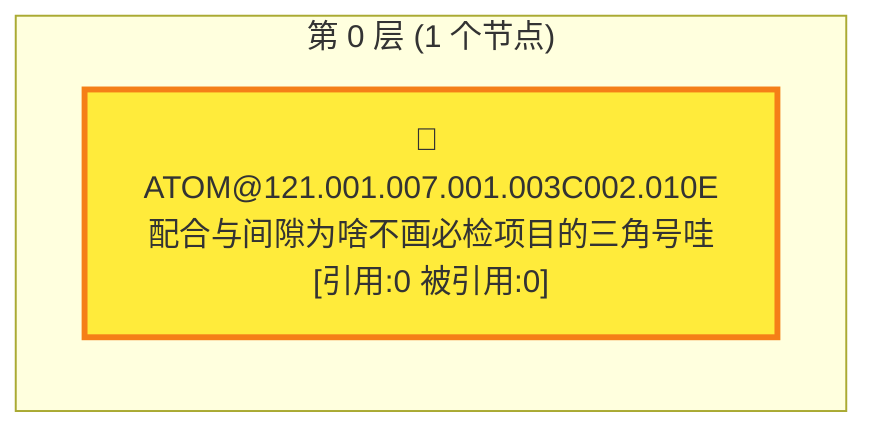

```dataviewjs
(async () => {
    try {
        const JSON_FILENAME = "Workspace_Items.json";
        const TASK_NOTE_BINDINGS_FILENAME = "Workspace_TaskNoteBindings.json";
        const TASK_NOTE_BINDINGS_SCHEMA_VERSION = "1.0";
        const TASK_COMMENTS_FILENAME = "Workspace_TaskComments.json";
        const TASK_COMMENTS_SCHEMA_VERSION = "1.0";
        const ATTACHMENTS_FOLDER = "attachments";
        const WORKSPACE_SCHEMA_VERSION = "2.6";
        const PARADIGM_TRANSFER_LOG_TITLE = "📥 共通范式迁入记录";
        const RELATIONS_PLUGIN_ID = "eva-cross-view-relations";
        const WORKSPACE_RELATION_VIEW_TYPE = "workspace";
        const WORKSPACE_CAPSULE_BRIDGE_VERSION = 1;
        const WORKSPACE_SCRIPT_VERSION = "2.6-capsule-bridge.1";
        const ROOT_KEY = "__root__";
        const DEFAULT_TAB_ID = "tab_default";
        const UNCATEGORIZED_PARADIGM_GROUP_ID = "__uncategorized__";
        const DEFAULT_PARADIGM_TAG_COLOR = "#3498db";
        const PARADIGM_TAG_COLOR_PALETTE = [
            "#3498db",
            "#1abc9c",
            "#f39c12",
            "#9b59b6",
            "#e74c3c",
            "#16a085",
            "#d35400",
            "#2ecc71",
            "#34495e",
            "#7f8c8d"
        ];
        const EVA_NOTES_CANDIDATE_PATHS = [
            "EVA_Notes.json",
            "data/EVA_Notes.json"
        ];

        const currentDvFile = (typeof dv.current === "function" ? dv.current()?.file : null) || null;
        const activeFile = app.workspace?.getActiveFile?.() || null;
        const currentFilePath = currentDvFile?.path || activeFile?.path || "";
        const currentFolder = currentDvFile?.folder || activeFile?.parent?.path || "";
        const resolveLocalPath = (filename) => currentFolder ? `${currentFolder}/${filename}` : filename;
        const DATA_PATH = resolveLocalPath(JSON_FILENAME);
        const TASK_NOTE_BINDINGS_PATH = resolveLocalPath(TASK_NOTE_BINDINGS_FILENAME);
        const TASK_COMMENTS_PATH = resolveLocalPath(TASK_COMMENTS_FILENAME);

        const nowString = () => moment().format("YYYY-MM-DD HH:mm:ss");
        const generateId = () => Date.now().toString(36) + Math.random().toString(36).slice(2, 8);
        const clone = (obj) => JSON.parse(JSON.stringify(obj || {}));
        const parentKey = (parentId) => (parentId === null || parentId === undefined || String(parentId).trim() === "") ? ROOT_KEY : String(parentId).trim();
        const tabParentKey = (tabId, parentId) => `${String(tabId || "").trim()}::${parentKey(parentId)}`;
        const paradigmParentKey = (paradigmId, parentId) => `${String(paradigmId || "").trim()}::${parentKey(parentId)}`;
        const paradigmTreeKey = (parentParadigmId) => parentKey(parentParadigmId);
        const paradigmCategoryTreeKey = (parentCategoryId) => parentKey(parentCategoryId);
        const paradigmCopyTreeKey = (hostParadigmId) => parentKey(hostParadigmId);
        const makeParadigmMountMapKey = (tabId, mountScopeId, paradigmItemId) => `${String(tabId || "").trim()}::${String(mountScopeId || "").trim()}@@${String(paradigmItemId || "").trim()}`;
        const parseParadigmMountMapKey = (scoped) => {
            const parsed = splitScopedKey(scoped);
            const raw = parsed.parent === ROOT_KEY ? "" : String(parsed.parent || "").trim();
            const sep = raw.lastIndexOf("@@");
            if (sep < 0) return { tabId: parsed.ownerId, mountScopeId: "", paradigmItemId: raw };
            return {
                tabId: parsed.ownerId,
                mountScopeId: raw.slice(0, sep).trim(),
                paradigmItemId: raw.slice(sep + 2).trim()
            };
        };
        const splitScopedKey = (scoped, fallbackId = "") => {
            const text = String(scoped || "").trim();
            if (!text) return { ownerId: fallbackId, parent: ROOT_KEY };
            const idx = text.indexOf("::");
            if (idx < 0) return { ownerId: fallbackId, parent: text || ROOT_KEY };
            const ownerId = text.slice(0, idx).trim() || fallbackId;
            const parent = text.slice(idx + 2).trim() || ROOT_KEY;
            return { ownerId, parent };
        };
        const normalizeText = (value) => String(value || "").replace(/\s+/g, " ").trim();
        const normalizeTabEmoji = (value) => String(value || "").trim().slice(0, 8);
        const normalizeShortcutLabel = (value) => normalizeText(value || "");
        const normalizeTabAccentColor = (value) => {
            const raw = String(value || "").trim();
            if (!raw) return "";
            const prefixed = raw.startsWith("#") ? raw : `#${raw}`;
            if (/^#([0-9a-fA-F]{3}|[0-9a-fA-F]{6})$/.test(prefixed)) return prefixed.toLowerCase();
            return "";
        };
        const getReadableTextColor = (hexColor) => {
            const normalized = normalizeTabAccentColor(hexColor);
            if (!normalized) return "var(--text-on-accent)";
            const full = normalized.length === 4
                ? `#${normalized[1]}${normalized[1]}${normalized[2]}${normalized[2]}${normalized[3]}${normalized[3]}`
                : normalized;
            const r = parseInt(full.slice(1, 3), 16);
            const g = parseInt(full.slice(3, 5), 16);
            const b = parseInt(full.slice(5, 7), 16);
            const luminance = (0.299 * r) + (0.587 * g) + (0.114 * b);
            return luminance >= 150 ? "#1f2328" : "#ffffff";
        };
        const getDefaultParadigmTagColor = (seed = "") => {
            const text = String(seed || "").trim() || "paradigm-tag";
            let hash = 0;
            for (let i = 0; i < text.length; i++) {
                hash = ((hash << 5) - hash) + text.charCodeAt(i);
                hash |= 0;
            }
            return PARADIGM_TAG_COLOR_PALETTE[Math.abs(hash) % PARADIGM_TAG_COLOR_PALETTE.length] || DEFAULT_PARADIGM_TAG_COLOR;
        };
        const normalizeParadigmTagIds = (idsLike, tagsById = null) => ensureUniqueIds(
            (Array.isArray(idsLike) ? idsLike : [])
                .map((id) => String(id || "").trim())
                .filter((id) => !tagsById || !!tagsById[id])
        );
        const isExternalImageRef = (value) => /^(https?:\/\/|data:image\/|file:\/\/|app:\/\/)/i.test(String(value || "").trim());
        const sanitizeShortcutTargetInput = (raw) => {
            let text = String(raw || "").trim();
            if (!text) return "";
            const markdownLinkMatch = text.match(/^!?\[[^\]]*]\((.*?)\)$/);
            if (markdownLinkMatch && markdownLinkMatch[1]) text = markdownLinkMatch[1].trim();
            if (/^!?\[\[.*\]\]$/.test(text)) text = text.replace(/^!?\[\[/, "").replace(/\]\]$/, "").trim();
            if (text.startsWith("<") && text.endsWith(">")) text = text.slice(1, -1).trim();
            const cleaned = text.split("|")[0].split("#")[0].trim();
            if (/^(?:[a-zA-Z]:[\\/]|\\\\|\/(?!\/)|https?:\/\/|file:\/\/|obsidian:\/\/)/i.test(cleaned)) return cleaned;
            return cleaned.replace(/^\/+/, "");
        };
        const sanitizeImageInput = (raw) => {
            let text = String(raw || "").trim();
            if (!text) return "";
            const markdownEmbedMatch = text.match(/^!\[[^\]]*]\((.*?)\)$/);
            if (markdownEmbedMatch && markdownEmbedMatch[1]) text = markdownEmbedMatch[1].trim();
            if (/^!?\[\[.*\]\]$/.test(text)) text = text.replace(/^!?\[\[/, "").replace(/\]\]$/, "").trim();
            if (text.startsWith("<") && text.endsWith(">")) text = text.slice(1, -1).trim();
            if (isExternalImageRef(text)) return text;
            return text.split("|")[0].split("#")[0].trim().replace(/^\/+/, "");
        };
        const normalizeBindingValue = (raw) => {
            if (typeof raw === "string") {
                const path = raw.trim();
                return path ? { path, ctime: null } : null;
            }
            if (raw && typeof raw === "object" && !Array.isArray(raw)) {
                const path = typeof raw.path === "string" ? raw.path.trim() : "";
                if (!path) return null;
                const ctime = Number.isFinite(raw.ctime) ? Number(raw.ctime) : null;
                return { path, ctime };
            }
            return null;
        };

        if (window.workspaceTreeCurrentDragId === undefined) window.workspaceTreeCurrentDragId = null;
        if (window.workspaceTreePromptBusy === undefined) window.workspaceTreePromptBusy = false;
        if (window.workspaceShowParadigmPanel === undefined) window.workspaceShowParadigmPanel = false;
        if (window.workspaceShowParadigmTagManager === undefined) window.workspaceShowParadigmTagManager = false;
        if (window.workspaceEditingParadigmId === undefined) window.workspaceEditingParadigmId = null;
        if (window.workspaceShowSnapshotPanel === undefined) window.workspaceShowSnapshotPanel = false;
        if (window.workspaceSelectedSnapshotId === undefined) window.workspaceSelectedSnapshotId = null;
        if (window.workspaceParadigmCurrentDragId === undefined) window.workspaceParadigmCurrentDragId = null;
        if (window.workspaceParadigmDragParadigmId === undefined) window.workspaceParadigmDragParadigmId = null;
        if (window.workspaceParadigmNodeDragId === undefined) window.workspaceParadigmNodeDragId = null;
        if (window.workspaceParadigmCategoryDragId === undefined) window.workspaceParadigmCategoryDragId = null;
        if (window.workspaceParadigmTagCurrentDragId === undefined) window.workspaceParadigmTagCurrentDragId = null;
        if (window.workspaceParadigmTagFilters === undefined) window.workspaceParadigmTagFilters = [];
        if (window.workspaceCollapsedParadigmTreeIds === undefined) window.workspaceCollapsedParadigmTreeIds = {};
        if (window.workspaceTabCurrentDragId === undefined) window.workspaceTabCurrentDragId = null;
        if (window.workspaceCollapsedParadigmMountGroups === undefined) window.workspaceCollapsedParadigmMountGroups = {};
        if (window.workspaceCollapsedParadigmCategoryTreeIds === undefined) window.workspaceCollapsedParadigmCategoryTreeIds = {};
        if (window.workspaceParadigmTocCollapsed === undefined) window.workspaceParadigmTocCollapsed = false;
        if (window.workspaceParadigmTocMode === undefined) window.workspaceParadigmTocMode = "paradigm";
        if (window.workspaceParadigmTocDragState === undefined) window.workspaceParadigmTocDragState = null;
        if (!window.workspaceCollapsedParadigmTocCategoryIds || typeof window.workspaceCollapsedParadigmTocCategoryIds !== "object") window.workspaceCollapsedParadigmTocCategoryIds = {};
        if (!window.workspaceExpandedParadigmReferenceSourceIds || typeof window.workspaceExpandedParadigmReferenceSourceIds !== "object") window.workspaceExpandedParadigmReferenceSourceIds = {};
        if (window.workspacePendingParadigmMountFocus === undefined) window.workspacePendingParadigmMountFocus = null;
        if (window.workspacePendingParadigmCategoryFocus === undefined) window.workspacePendingParadigmCategoryFocus = null;
        if (window.workspacePendingParadigmPanelFocus === undefined) window.workspacePendingParadigmPanelFocus = null;
        if (window.workspaceShouldRestorePinnedScrollAfterRender === undefined) window.workspaceShouldRestorePinnedScrollAfterRender = false;
        if (!window.workspaceRelationBridgeRegistry || typeof window.workspaceRelationBridgeRegistry !== "object") window.workspaceRelationBridgeRegistry = {};
        if (window.workspacePendingRelationFocusNodeKey === undefined) window.workspacePendingRelationFocusNodeKey = "";

        const defaultWorkspaceData = () => ({
            schemaVersion: WORKSPACE_SCHEMA_VERSION,
            lastModified: nowString(),
            activeTabId: DEFAULT_TAB_ID,
            tabsById: {
                [DEFAULT_TAB_ID]: {
                    id: DEFAULT_TAB_ID,
                    name: "默认工作区",
                    emoji: "",
                    accentColor: "",
                    kind: "project",
                    parentTabId: null,
                    boundParadigmIds: [],
                    boundParadigmItemKeys: [],
                    boundParadigmId: null,
                    createdAt: nowString(),
                    updatedAt: nowString()
                }
            },
            tabOrder: [DEFAULT_TAB_ID],
            tabChildrenByParent: { [ROOT_KEY]: [DEFAULT_TAB_ID] },
            itemsById: {},
            childrenByParentByTab: { [tabParentKey(DEFAULT_TAB_ID, null)]: [] },
            paradigmsById: {},
            childParadigmIdsByParent: { [ROOT_KEY]: [] },
            paradigmCopiesById: {},
            childParadigmCopyIdsByParent: { [ROOT_KEY]: [] },
            paradigmCategoriesById: {},
            childParadigmCategoryIdsByParent: { [ROOT_KEY]: [] },
            paradigmTagsById: {},
            paradigmItemsById: {},
            paradigmChildrenByParent: {},
            paradigmToTabItemMapByTab: {},
            collapsedById: {},
            tabTreeCollapsedById: {},
            pinnedScrollByViewKey: {},
            paradigmTreeCollapsedById: {},
            paradigmEditorScopeCollapsedById: {},
            paradigmCategoryCollapsedById: {},
            paradigmMountGroupCollapsedByKey: {},
            paradigmMountCollectionCollapsedByTab: {},
            snapshotsById: {},
            snapshotOrderByTab: {},
            // 兼容旧结构，不作为主写入源
            childrenByParent: { [ROOT_KEY]: [] }
        });

        const ensureUniqueIds = (arr) => {
            const out = [];
            const seen = new Set();
            for (const raw of Array.isArray(arr) ? arr : []) {
                const id = String(raw || "").trim();
                if (!id || seen.has(id)) continue;
                out.push(id);
                seen.add(id);
            }
            return out;
        };
        const normalizeShortcutEntries = (entriesLike) => {
            const out = [];
            const seen = new Set();
            for (const raw of Array.isArray(entriesLike) ? entriesLike : []) {
                const entry = raw && typeof raw === "object" ? raw : {};
                const path = sanitizeShortcutTargetInput(entry.path || entry.targetPath || entry.filePath || entry.file_path || entry.href || "");
                if (!path) continue;
                const pathKey = path.toLowerCase();
                if (seen.has(pathKey)) continue;
                seen.add(pathKey);
                out.push({
                    id: String(entry.id || `shortcut_${generateId()}`).trim() || `shortcut_${generateId()}`,
                    path,
                    label: normalizeShortcutLabel(entry.label || entry.name || ""),
                    ctime: Number.isFinite(entry.ctime) ? Number(entry.ctime) : null,
                    createdAt: entry.createdAt || nowString(),
                    updatedAt: entry.updatedAt || nowString()
                });
            }
            return out;
        };

        const normalizeBoundParadigmIds = (tabLike) => {
            const fromArray = Array.isArray(tabLike?.boundParadigmIds) ? tabLike.boundParadigmIds : [];
            const legacy = (tabLike?.boundParadigmId === null || tabLike?.boundParadigmId === undefined || String(tabLike?.boundParadigmId).trim() === "")
                ? []
                : [String(tabLike.boundParadigmId).trim()];
            return ensureUniqueIds([].concat(fromArray, legacy).map((x) => String(x || "").trim()).filter(Boolean));
        };

        const setTabBoundParadigmIds = (tabObj, idsLike) => {
            const ids = ensureUniqueIds((Array.isArray(idsLike) ? idsLike : [])
                .map((x) => String(x || "").trim())
                .filter(Boolean));
            tabObj.boundParadigmIds = ids;
            // 兼容旧读取方：保留首个绑定
            tabObj.boundParadigmId = ids[0] || null;
            return ids;
        };

        const normalizeBoundParadigmItemKeys = (tabLike) => ensureUniqueIds(
            (Array.isArray(tabLike?.boundParadigmItemKeys) ? tabLike.boundParadigmItemKeys : [])
                .map((x) => String(x || "").trim())
                .filter((key) => {
                    const parsed = splitScopedKey(key);
                    return !!parsed.ownerId && parsed.parent !== ROOT_KEY;
                })
        );

        const setTabBoundParadigmItemKeys = (tabObj, keysLike) => {
            const keys = normalizeBoundParadigmItemKeys({ boundParadigmItemKeys: keysLike });
            tabObj.boundParadigmItemKeys = keys;
            return keys;
        };

        const getParadigmDescendantIdsFromHierarchy = (paradigmsById, childParadigmIdsByParent, paradigmId) => {
            const out = [];
            const seen = new Set();
            const stack = ensureUniqueIds(childParadigmIdsByParent?.[paradigmTreeKey(paradigmId)] || []);
            while (stack.length > 0) {
                const current = String(stack.pop() || "").trim();
                if (!current || seen.has(current) || !paradigmsById?.[current]) continue;
                seen.add(current);
                out.push(current);
                ensureUniqueIds(childParadigmIdsByParent?.[paradigmTreeKey(current)] || [])
                    .slice()
                    .reverse()
                    .forEach((childId) => stack.push(childId));
            }
            return out;
        };

        const materializeTabBoundParadigmIdsFromHierarchy = (tabsById, paradigmsById, childParadigmIdsByParent, tabId = null) => {
            const targetTabIds = tabId
                ? [String(tabId || "").trim()]
                : Object.keys(tabsById || {});
            targetTabIds.forEach((currentTabId) => {
                if (!currentTabId || !tabsById?.[currentTabId]) return;
                const tab = tabsById[currentTabId];
                const baseIds = normalizeBoundParadigmIds(tab).filter((paradigmId) => !!paradigmsById?.[paradigmId]);
                const nextIds = baseIds.slice();
                const seen = new Set(nextIds);
                baseIds.forEach((paradigmId) => {
                    getParadigmDescendantIdsFromHierarchy(paradigmsById, childParadigmIdsByParent, paradigmId).forEach((childId) => {
                        if (seen.has(childId)) return;
                        seen.add(childId);
                        nextIds.push(childId);
                    });
                });
                setTabBoundParadigmIds(tab, nextIds);
            });
        };

        const flattenTabTree = (childrenMap, parentId = null, chain = new Set()) => {
            const key = parentKey(parentId);
            const ids = ensureUniqueIds(childrenMap?.[key] || []);
            const ordered = [];
            ids.forEach((id) => {
                if (!id || chain.has(id)) return;
                ordered.push(id);
                const next = new Set(chain);
                next.add(id);
                ordered.push(...flattenTabTree(childrenMap, id, next));
            });
            return ordered;
        };

        const sanitizeWorkspaceData = (raw) => {
            const base = defaultWorkspaceData();
            const src = (raw && typeof raw === "object" && !Array.isArray(raw)) ? clone(raw) : {};
            const incomingTabs = src.tabsById && typeof src.tabsById === "object" ? src.tabsById : {};
            const incomingTabOrder = Array.isArray(src.tabOrder) ? src.tabOrder : [];
            const incomingItems = src.itemsById && typeof src.itemsById === "object" ? src.itemsById : {};
            const incomingChildrenByTab = src.childrenByParentByTab && typeof src.childrenByParentByTab === "object"
                ? src.childrenByParentByTab
                : {};
            const incomingTabChildren = src.tabChildrenByParent && typeof src.tabChildrenByParent === "object"
                ? src.tabChildrenByParent
                : {};
            const incomingChildrenLegacy = src.childrenByParent && typeof src.childrenByParent === "object"
                ? src.childrenByParent
                : {};
            const incomingCollapsed = src.collapsedById && typeof src.collapsedById === "object" ? src.collapsedById : {};
            const incomingPinnedScroll = src.pinnedScrollByViewKey && typeof src.pinnedScrollByViewKey === "object" ? src.pinnedScrollByViewKey : {};
            const incomingTabTreeCollapsed = src.tabTreeCollapsedById && typeof src.tabTreeCollapsedById === "object"
                ? src.tabTreeCollapsedById
                : {};

            const tabsById = {};
            Object.keys(incomingTabs).forEach((rawId) => {
                const id = String(rawId || "").trim();
                if (!id) return;
                const tab = incomingTabs[rawId] || {};
                const name = normalizeText(tab.name || tab.title || `Tab-${id.slice(-4)}`);
                const boundParadigmIds = normalizeBoundParadigmIds(tab);
                const boundParadigmItemKeys = normalizeBoundParadigmItemKeys(tab);
                tabsById[id] = {
                    id,
                    name: name || `Tab-${id.slice(-4)}`,
                    emoji: normalizeTabEmoji(tab.emoji || tab.icon || ""),
                    accentColor: normalizeTabAccentColor(tab.accentColor || tab.color || ""),
                    kind: ["project", "task", "object"].includes(tab.kind) ? tab.kind : "project",
                    parentTabId: (tab.parentTabId !== undefined && tab.parentTabId !== null && String(tab.parentTabId).trim() !== "")
                        ? String(tab.parentTabId).trim()
                        : null,
                    boundParadigmIds,
                    boundParadigmItemKeys,
                    boundParadigmId: boundParadigmIds[0] || null,
                    createdAt: tab.createdAt || nowString(),
                    updatedAt: tab.updatedAt || nowString()
                };
            });

            const itemsById = {};
            Object.keys(incomingItems).forEach((rawId) => {
                const id = String(rawId || "").trim();
                if (!id) return;
                const item = incomingItems[rawId] || {};
                const title = normalizeText(item.title || item.content || item.name || "");
                if (!title) return;
                let parentId = null;
                if (item.parentId !== undefined && item.parentId !== null && String(item.parentId).trim() !== "") {
                    parentId = String(item.parentId).trim();
                }
                const legacyTabId = src.activeTabId || DEFAULT_TAB_ID;
                const tabId = String(item.tabId || legacyTabId || DEFAULT_TAB_ID).trim() || DEFAULT_TAB_ID;
                const hasItemCollapsed = Object.prototype.hasOwnProperty.call(item, "isCollapsed");
                const collapsedFromMap = Object.prototype.hasOwnProperty.call(incomingCollapsed, id)
                    ? !!incomingCollapsed[id]
                    : false;
                const sourceType = item.sourceType === "paradigm" ? "paradigm" : "tab";
                const sourceParadigmId = sourceType === "paradigm" && item.sourceParadigmId
                    ? String(item.sourceParadigmId).trim()
                    : null;
                const sourceParadigmItemId = sourceType === "paradigm" && item.sourceParadigmItemId
                    ? String(item.sourceParadigmItemId).trim()
                    : null;
                const sourceParadigmBindingRootId = sourceType === "paradigm" && item.sourceParadigmBindingRootId
                    ? String(item.sourceParadigmBindingRootId).trim()
                    : null;
                const sourceParadigmMountScopeId = sourceType === "paradigm" && item.sourceParadigmMountScopeId
                    ? String(item.sourceParadigmMountScopeId).trim()
                    : sourceParadigmId;
                const sourceParadigmCopyRefId = sourceType === "paradigm" && item.sourceParadigmCopyRefId
                    ? String(item.sourceParadigmCopyRefId).trim()
                    : null;
                const sourceParadigmMountMode = sourceType === "paradigm" && item.sourceParadigmMountMode === "inherited"
                    ? "inherited"
                    : "direct";
                itemsById[id] = {
                    id,
                    title,
                    parentId,
                    tabId,
                    sourceType: sourceType === "paradigm" && sourceParadigmId && sourceParadigmItemId ? "paradigm" : "tab",
                    sourceParadigmId: sourceType === "paradigm" ? sourceParadigmId : null,
                    sourceParadigmItemId: sourceType === "paradigm" ? sourceParadigmItemId : null,
                    sourceParadigmBindingRootId: sourceType === "paradigm" ? sourceParadigmBindingRootId : null,
                    sourceParadigmMountScopeId: sourceType === "paradigm" ? sourceParadigmMountScopeId : null,
                    sourceParadigmCopyRefId: sourceType === "paradigm" ? sourceParadigmCopyRefId : null,
                    sourceParadigmMountMode: sourceType === "paradigm" ? sourceParadigmMountMode : "direct",
                    isCollapsed: hasItemCollapsed ? !!item.isCollapsed : collapsedFromMap,
                    imageRef: sanitizeImageInput(item.imageRef || item.image || ""),
                    shortcuts: normalizeShortcutEntries(item.shortcuts || item.shortcutEntries || []),
                    comment: typeof item.comment === "string" ? item.comment : "",
                    noteBinding: normalizeBindingValue(item.noteBinding),
                    orphaned: !!item.orphaned,
                    createdAt: item.createdAt || item.created || nowString(),
                    updatedAt: item.updatedAt || nowString()
                };
                if (!tabsById[tabId]) {
                    tabsById[tabId] = {
                        id: tabId,
                        name: `Tab-${tabId.slice(-4) || "new"}`,
                        kind: "project",
                        parentTabId: null,
                        boundParadigmIds: [],
                        boundParadigmItemKeys: [],
                        boundParadigmId: null,
                        createdAt: nowString(),
                        updatedAt: nowString()
                    };
                }
            });

            if (Object.keys(tabsById).length === 0) {
                tabsById[DEFAULT_TAB_ID] = clone(base.tabsById[DEFAULT_TAB_ID]);
            }
            let tabOrder = ensureUniqueIds(incomingTabOrder).filter((id) => !!tabsById[id]);
            if (tabOrder.length === 0) tabOrder = Object.keys(tabsById);
            Object.keys(tabsById).forEach((id) => {
                if (!tabOrder.includes(id)) tabOrder.push(id);
            });
            const tabChildrenByParent = { [ROOT_KEY]: [] };
            const tabChildAssigned = new Set();
            Object.keys(tabsById).forEach((id) => {
                if (!tabsById[id] || tabsById[id].parentTabId === id) tabsById[id].parentTabId = null;
            });
            Object.keys(incomingTabChildren || {}).forEach((rawParentKey) => {
                const normalizedParent = rawParentKey === ROOT_KEY ? null : String(rawParentKey || "").trim();
                if (normalizedParent && !tabsById[normalizedParent]) return;
                const list = ensureUniqueIds(incomingTabChildren[rawParentKey]).filter((id) => !!tabsById[id]);
                const targetKey = parentKey(normalizedParent);
                if (!tabChildrenByParent[targetKey]) tabChildrenByParent[targetKey] = [];
                list.forEach((id) => {
                    if (id === normalizedParent || tabChildAssigned.has(id)) return;
                    tabsById[id].parentTabId = normalizedParent;
                    tabChildrenByParent[targetKey].push(id);
                    tabChildAssigned.add(id);
                });
            });
            const tabWouldCreateCycle = (tabId, nextParentId) => {
                let cursor = nextParentId;
                const seen = new Set([tabId]);
                while (cursor) {
                    if (seen.has(cursor)) return true;
                    seen.add(cursor);
                    const parent = tabsById[cursor]?.parentTabId || null;
                    cursor = parent;
                }
                return false;
            };
            tabOrder.forEach((id) => {
                const tab = tabsById[id];
                if (!tab) return;
                if (tab.parentTabId && (!tabsById[tab.parentTabId] || tabWouldCreateCycle(id, tab.parentTabId))) {
                    tab.parentTabId = null;
                }
                const targetKey = parentKey(tab.parentTabId);
                if (!tabChildrenByParent[targetKey]) tabChildrenByParent[targetKey] = [];
                if (!tabChildrenByParent[targetKey].includes(id)) tabChildrenByParent[targetKey].push(id);
            });
            tabOrder = flattenTabTree(tabChildrenByParent, null);
            Object.keys(tabsById).forEach((id) => {
                if (!tabOrder.includes(id)) tabOrder.push(id);
            });
            const activeTabId = tabsById[src.activeTabId] ? src.activeTabId : tabOrder[0];

            const childrenByParentByTab = {};
            const assigned = new Set();
            tabOrder.forEach((tabId) => {
                childrenByParentByTab[tabParentKey(tabId, null)] = [];
            });

            const incomingChildrenKeys = Object.keys(incomingChildrenByTab || {});
            if (incomingChildrenKeys.length > 0) {
                incomingChildrenKeys.forEach((rawKey) => {
                    const { ownerId: tabIdRaw, parent } = splitScopedKey(rawKey, activeTabId);
                    const tabId = String(tabIdRaw || "").trim();
                    if (!tabId || !tabsById[tabId]) return;
                    const scopedKey = tabParentKey(tabId, parent === ROOT_KEY ? null : parent);
                    const list = ensureUniqueIds(incomingChildrenByTab[rawKey]).filter((id) => !!itemsById[id] && itemsById[id].tabId === tabId);
                    if (!childrenByParentByTab[scopedKey]) childrenByParentByTab[scopedKey] = [];
                    childrenByParentByTab[scopedKey] = list.slice();
                    list.forEach((id) => {
                        assigned.add(id);
                        itemsById[id].parentId = parent === ROOT_KEY ? null : parent;
                    });
                });
            } else {
                Object.keys(incomingChildrenLegacy || {}).forEach((legacyParent) => {
                    const p = legacyParent === ROOT_KEY ? null : legacyParent;
                    const scopedKey = tabParentKey(activeTabId, p);
                    const list = ensureUniqueIds(incomingChildrenLegacy[legacyParent])
                        .filter((id) => !!itemsById[id] && itemsById[id].tabId === activeTabId);
                    if (!childrenByParentByTab[scopedKey]) childrenByParentByTab[scopedKey] = [];
                    childrenByParentByTab[scopedKey] = list.slice();
                    list.forEach((id) => {
                        assigned.add(id);
                        itemsById[id].parentId = p;
                    });
                });
            }

            Object.values(itemsById).forEach((item) => {
                if (!tabsById[item.tabId]) item.tabId = activeTabId;
                if (item.parentId && (!itemsById[item.parentId] || itemsById[item.parentId].tabId !== item.tabId)) item.parentId = null;
                const key = tabParentKey(item.tabId, item.parentId);
                if (!childrenByParentByTab[key]) childrenByParentByTab[key] = [];
                if (!assigned.has(item.id)) childrenByParentByTab[key].push(item.id);
            });

            Object.keys(childrenByParentByTab).forEach((key) => {
                const { ownerId: tabId, parent } = splitScopedKey(key);
                childrenByParentByTab[key] = ensureUniqueIds(childrenByParentByTab[key])
                    .filter((id) => {
                        const item = itemsById[id];
                        if (!item || item.tabId !== tabId) return false;
                        if (parent === ROOT_KEY) return item.parentId === null;
                        return item.parentId === parent;
                    });
            });
            tabOrder.forEach((tabId) => {
                const rootK = tabParentKey(tabId, null);
                if (!childrenByParentByTab[rootK]) childrenByParentByTab[rootK] = [];
            });

            const paradigmCategoriesById = {};
            const incomingParadigmCategories = src.paradigmCategoriesById && typeof src.paradigmCategoriesById === "object"
                ? src.paradigmCategoriesById
                : {};
            Object.keys(incomingParadigmCategories).forEach((rawId) => {
                const id = String(rawId || "").trim();
                if (!id) return;
                const category = incomingParadigmCategories[rawId] || {};
                const name = normalizeText(category.name || category.title || `分类-${id.slice(-4)}`);
                paradigmCategoriesById[id] = {
                    id,
                    name: name || `分类-${id.slice(-4)}`,
                    parentCategoryId: (category.parentCategoryId !== undefined && category.parentCategoryId !== null && String(category.parentCategoryId).trim() !== "")
                        ? String(category.parentCategoryId).trim()
                        : null,
                    createdAt: category.createdAt || nowString(),
                    updatedAt: category.updatedAt || nowString()
                };
            });

            const childParadigmCategoryIdsByParent = { [ROOT_KEY]: [] };
            const incomingParadigmCategoryTree = src.childParadigmCategoryIdsByParent && typeof src.childParadigmCategoryIdsByParent === "object"
                ? src.childParadigmCategoryIdsByParent
                : {};
            const assignedParadigmCategories = new Set();
            Object.keys(paradigmCategoriesById).forEach((id) => {
                if (!paradigmCategoriesById[id] || paradigmCategoriesById[id].parentCategoryId === id) paradigmCategoriesById[id].parentCategoryId = null;
            });
            Object.keys(incomingParadigmCategoryTree).forEach((rawParentKey) => {
                const normalizedParent = rawParentKey === ROOT_KEY ? null : String(rawParentKey || "").trim();
                if (normalizedParent && !paradigmCategoriesById[normalizedParent]) return;
                const list = ensureUniqueIds(incomingParadigmCategoryTree[rawParentKey]).filter((id) => !!paradigmCategoriesById[id]);
                const scopedKey = paradigmCategoryTreeKey(normalizedParent);
                if (!childParadigmCategoryIdsByParent[scopedKey]) childParadigmCategoryIdsByParent[scopedKey] = [];
                list.forEach((id) => {
                    if (id === normalizedParent || assignedParadigmCategories.has(id)) return;
                    paradigmCategoriesById[id].parentCategoryId = normalizedParent;
                    childParadigmCategoryIdsByParent[scopedKey].push(id);
                    assignedParadigmCategories.add(id);
                });
            });
            const categoryWouldCreateCycle = (categoryId, nextParentId) => {
                let cursor = nextParentId;
                const seen = new Set([categoryId]);
                while (cursor) {
                    if (seen.has(cursor)) return true;
                    seen.add(cursor);
                    cursor = paradigmCategoriesById[cursor]?.parentCategoryId || null;
                }
                return false;
            };
            Object.keys(paradigmCategoriesById).forEach((id) => {
                const category = paradigmCategoriesById[id];
                if (!category) return;
                if (category.parentCategoryId && (!paradigmCategoriesById[category.parentCategoryId] || categoryWouldCreateCycle(id, category.parentCategoryId))) {
                    category.parentCategoryId = null;
                }
                const scopedKey = paradigmCategoryTreeKey(category.parentCategoryId);
                if (!childParadigmCategoryIdsByParent[scopedKey]) childParadigmCategoryIdsByParent[scopedKey] = [];
                if (!childParadigmCategoryIdsByParent[scopedKey].includes(id)) childParadigmCategoryIdsByParent[scopedKey].push(id);
            });

            const paradigmTagsById = {};
            const incomingParadigmTags = src.paradigmTagsById && typeof src.paradigmTagsById === "object"
                ? src.paradigmTagsById
                : {};
            Object.keys(incomingParadigmTags).forEach((rawId) => {
                const id = String(rawId || "").trim();
                if (!id) return;
                const tag = incomingParadigmTags[rawId] || {};
                const label = normalizeText(tag.label || tag.name || tag.title || id);
                const color = typeof tag.color === "string" && String(tag.color || "").trim()
                    ? String(tag.color || "").trim()
                    : getDefaultParadigmTagColor(id);
                paradigmTagsById[id] = {
                    id,
                    label: label || id,
                    color,
                    parentTagId: (tag.parentTagId !== undefined && tag.parentTagId !== null && String(tag.parentTagId).trim() !== "")
                        ? String(tag.parentTagId).trim()
                        : null,
                    order: Number.isFinite(tag.order) ? Number(tag.order) : 0,
                    createdAt: tag.createdAt || nowString(),
                    updatedAt: tag.updatedAt || nowString()
                };
            });

            const paradigmsById = {};
            const incomingParadigms = src.paradigmsById && typeof src.paradigmsById === "object" ? src.paradigmsById : {};
            Object.keys(incomingParadigms).forEach((rawId) => {
                const id = String(rawId || "").trim();
                if (!id) return;
                const pg = incomingParadigms[rawId] || {};
                const name = normalizeText(pg.name || pg.title || `范式-${id.slice(-4)}`);
                const categoryIdRaw = (pg.categoryId !== undefined && pg.categoryId !== null && String(pg.categoryId).trim() !== "")
                    ? String(pg.categoryId).trim()
                    : null;
                paradigmsById[id] = {
                    id,
                    name: name || `范式-${id.slice(-4)}`,
                    sourceParadigmId: (pg.sourceParadigmId !== undefined && pg.sourceParadigmId !== null && String(pg.sourceParadigmId).trim() !== "")
                        ? String(pg.sourceParadigmId).trim()
                        : null,
                    parentParadigmId: (pg.parentParadigmId !== undefined && pg.parentParadigmId !== null && String(pg.parentParadigmId).trim() !== "")
                        ? String(pg.parentParadigmId).trim()
                        : null,
                    categoryId: categoryIdRaw && paradigmCategoriesById[categoryIdRaw] ? categoryIdRaw : null,
                    tagIds: normalizeParadigmTagIds(pg.tagIds, paradigmTagsById),
                    createdAt: pg.createdAt || nowString(),
                    updatedAt: pg.updatedAt || nowString()
                };
            });

            const childParadigmIdsByParent = { [ROOT_KEY]: [] };
            const incomingParadigmTree = src.childParadigmIdsByParent && typeof src.childParadigmIdsByParent === "object"
                ? src.childParadigmIdsByParent
                : {};
            const assignedParadigms = new Set();
            Object.keys(paradigmsById).forEach((id) => {
                if (!paradigmsById[id]) return;
                if (paradigmsById[id].sourceParadigmId === id || !paradigmsById[paradigmsById[id].sourceParadigmId]) paradigmsById[id].sourceParadigmId = null;
                if (paradigmsById[id].parentParadigmId === id) paradigmsById[id].parentParadigmId = null;
            });
            Object.keys(incomingParadigmTree).forEach((rawParentKey) => {
                const normalizedParent = rawParentKey === ROOT_KEY ? null : String(rawParentKey || "").trim();
                if (normalizedParent && !paradigmsById[normalizedParent]) return;
                const list = ensureUniqueIds(incomingParadigmTree[rawParentKey]).filter((id) => !!paradigmsById[id]);
                const scopedKey = paradigmTreeKey(normalizedParent);
                if (!childParadigmIdsByParent[scopedKey]) childParadigmIdsByParent[scopedKey] = [];
                list.forEach((id) => {
                    if (id === normalizedParent || assignedParadigms.has(id)) return;
                    paradigmsById[id].parentParadigmId = normalizedParent;
                    childParadigmIdsByParent[scopedKey].push(id);
                    assignedParadigms.add(id);
                });
            });
            const paradigmWouldCreateCycle = (paradigmId, nextParentId) => {
                let cursor = nextParentId;
                const seen = new Set([paradigmId]);
                while (cursor) {
                    if (seen.has(cursor)) return true;
                    seen.add(cursor);
                    cursor = paradigmsById[cursor]?.parentParadigmId || null;
                }
                return false;
            };
            Object.keys(paradigmsById).forEach((id) => {
                const paradigm = paradigmsById[id];
                if (!paradigm) return;
                if (paradigm.parentParadigmId && (!paradigmsById[paradigm.parentParadigmId] || paradigmWouldCreateCycle(id, paradigm.parentParadigmId))) {
                    paradigm.parentParadigmId = null;
                }
                const scopedKey = paradigmTreeKey(paradigm.parentParadigmId);
                if (!childParadigmIdsByParent[scopedKey]) childParadigmIdsByParent[scopedKey] = [];
                if (!childParadigmIdsByParent[scopedKey].includes(id)) childParadigmIdsByParent[scopedKey].push(id);
            });

            const paradigmCopiesById = {};
            const incomingParadigmCopies = src.paradigmCopiesById && typeof src.paradigmCopiesById === "object"
                ? src.paradigmCopiesById
                : {};
            Object.keys(incomingParadigmCopies).forEach((rawId) => {
                const id = String(rawId || "").trim();
                if (!id) return;
                const copy = incomingParadigmCopies[rawId] || {};
                const sourceParadigmId = String(copy.sourceParadigmId || "").trim();
                const hostParadigmId = (copy.hostParadigmId !== undefined && copy.hostParadigmId !== null && String(copy.hostParadigmId).trim() !== "")
                    ? String(copy.hostParadigmId).trim()
                    : null;
                if (!sourceParadigmId || !hostParadigmId) return;
                if (!paradigmsById[sourceParadigmId] || !paradigmsById[hostParadigmId]) return;
                if (sourceParadigmId === hostParadigmId) return;
                paradigmCopiesById[id] = {
                    id,
                    sourceParadigmId,
                    hostParadigmId,
                    createdAt: copy.createdAt || nowString(),
                    updatedAt: copy.updatedAt || nowString()
                };
            });
            const childParadigmCopyIdsByParent = { [ROOT_KEY]: [] };
            const incomingParadigmCopyTree = src.childParadigmCopyIdsByParent && typeof src.childParadigmCopyIdsByParent === "object"
                ? src.childParadigmCopyIdsByParent
                : {};
            const assignedCopyIds = new Set();
            Object.keys(incomingParadigmCopyTree).forEach((rawParentKey) => {
                const normalizedHost = rawParentKey === ROOT_KEY ? null : String(rawParentKey || "").trim();
                if (normalizedHost && !paradigmsById[normalizedHost]) return;
                const list = ensureUniqueIds(incomingParadigmCopyTree[rawParentKey]).filter((id) => !!paradigmCopiesById[id]);
                const scopedKey = paradigmCopyTreeKey(normalizedHost);
                if (!childParadigmCopyIdsByParent[scopedKey]) childParadigmCopyIdsByParent[scopedKey] = [];
                list.forEach((id) => {
                    const copy = paradigmCopiesById[id];
                    if (!copy || assignedCopyIds.has(id)) return;
                    if ((copy.hostParadigmId || null) !== normalizedHost) copy.hostParadigmId = normalizedHost;
                    childParadigmCopyIdsByParent[scopedKey].push(id);
                    assignedCopyIds.add(id);
                });
            });
            Object.keys(paradigmCopiesById).forEach((id) => {
                const copy = paradigmCopiesById[id];
                if (!copy) return;
                const scopedKey = paradigmCopyTreeKey(copy.hostParadigmId);
                if (!childParadigmCopyIdsByParent[scopedKey]) childParadigmCopyIdsByParent[scopedKey] = [];
                if (!childParadigmCopyIdsByParent[scopedKey].includes(id)) childParadigmCopyIdsByParent[scopedKey].push(id);
            });

            const paradigmItemsById = {};
            const incomingParadigmItems = src.paradigmItemsById && typeof src.paradigmItemsById === "object" ? src.paradigmItemsById : {};
            Object.keys(incomingParadigmItems).forEach((rawId) => {
                const id = String(rawId || "").trim();
                if (!id) return;
                const item = incomingParadigmItems[rawId] || {};
                const paradigmId = String(item.paradigmId || "").trim();
                if (!paradigmId) return;
                if (!paradigmsById[paradigmId]) {
                    paradigmsById[paradigmId] = {
                        id: paradigmId,
                        name: `范式-${paradigmId.slice(-4)}`,
                        sourceParadigmId: null,
                        parentParadigmId: null,
                        categoryId: null,
                        createdAt: nowString(),
                        updatedAt: nowString()
                    };
                }
                const title = normalizeText(item.title || item.content || item.name || "");
                if (!title) return;
                paradigmItemsById[id] = {
                    id,
                    paradigmId,
                    title,
                    parentId: (item.parentId === null || item.parentId === undefined || String(item.parentId).trim() === "")
                        ? null
                        : String(item.parentId).trim(),
                    order: Number.isFinite(item.order) ? Number(item.order) : 0,
                    imageRef: sanitizeImageInput(item.imageRef || item.image || ""),
                    shortcuts: normalizeShortcutEntries(item.shortcuts || item.shortcutEntries || []),
                    comment: typeof item.comment === "string" ? item.comment : "",
                    noteBinding: normalizeBindingValue(item.noteBinding),
                    createdAt: item.createdAt || nowString(),
                    updatedAt: item.updatedAt || nowString()
                };
            });

            const paradigmChildrenByParent = {};
            const incomingParadigmChildren = src.paradigmChildrenByParent && typeof src.paradigmChildrenByParent === "object"
                ? src.paradigmChildrenByParent
                : {};
            const assignedParadigmItems = new Set();
            Object.keys(incomingParadigmChildren).forEach((rawKey) => {
                const { ownerId: paradigmId, parent } = splitScopedKey(rawKey);
                if (!paradigmId || !paradigmsById[paradigmId]) return;
                const scopedKey = paradigmParentKey(paradigmId, parent === ROOT_KEY ? null : parent);
                const list = ensureUniqueIds(incomingParadigmChildren[rawKey]).filter((id) => {
                    const it = paradigmItemsById[id];
                    return !!it && it.paradigmId === paradigmId;
                });
                paradigmChildrenByParent[scopedKey] = list.slice();
                list.forEach((id) => {
                    assignedParadigmItems.add(id);
                    paradigmItemsById[id].parentId = parent === ROOT_KEY ? null : parent;
                });
            });
            Object.values(paradigmItemsById).forEach((item) => {
                if (item.parentId && (!paradigmItemsById[item.parentId] || paradigmItemsById[item.parentId].paradigmId !== item.paradigmId)) item.parentId = null;
                const key = paradigmParentKey(item.paradigmId, item.parentId);
                if (!paradigmChildrenByParent[key]) paradigmChildrenByParent[key] = [];
                if (!assignedParadigmItems.has(item.id)) paradigmChildrenByParent[key].push(item.id);
            });
            Object.keys(paradigmChildrenByParent).forEach((key) => {
                const { ownerId: paradigmId, parent } = splitScopedKey(key);
                paradigmChildrenByParent[key] = ensureUniqueIds(paradigmChildrenByParent[key]).filter((id) => {
                    const item = paradigmItemsById[id];
                    if (!item || item.paradigmId !== paradigmId) return false;
                    if (parent === ROOT_KEY) return item.parentId === null;
                    return item.parentId === parent;
                });
            });

            const paradigmToTabItemMapByTab = {};
            const incomingMap = src.paradigmToTabItemMapByTab && typeof src.paradigmToTabItemMapByTab === "object"
                ? src.paradigmToTabItemMapByTab
                : {};
            Object.keys(incomingMap).forEach((rawKey) => {
                const tabPg = parseParadigmMountMapKey(rawKey);
                const tabId = String(tabPg.tabId || "").trim();
                const paradigmItemId = String(tabPg.paradigmItemId || "").trim();
                const mountScopeId = String(tabPg.mountScopeId || "").trim();
                const itemId = String(incomingMap[rawKey] || "").trim();
                if (!tabId || !paradigmItemId || !itemId) return;
                if (!tabsById[tabId] || !paradigmItemsById[paradigmItemId] || !itemsById[itemId]) return;
                const fallbackScopeId = itemsById[itemId]?.sourceParadigmMountScopeId || paradigmItemsById[paradigmItemId]?.paradigmId || "";
                const scopedKey = makeParadigmMountMapKey(tabId, mountScopeId || fallbackScopeId, paradigmItemId);
                paradigmToTabItemMapByTab[scopedKey] = itemId;
            });
            Object.values(itemsById).forEach((item) => {
                if (item.sourceType !== "paradigm" || !item.sourceParadigmItemId || !tabsById[item.tabId]) return;
                const mapKey = makeParadigmMountMapKey(item.tabId, item.sourceParadigmMountScopeId || item.sourceParadigmId || "", item.sourceParadigmItemId);
                if (!paradigmToTabItemMapByTab[mapKey]) paradigmToTabItemMapByTab[mapKey] = item.id;
            });

            const incomingParadigmTreeCollapsed = src.paradigmTreeCollapsedById && typeof src.paradigmTreeCollapsedById === "object"
                ? src.paradigmTreeCollapsedById
                : {};
            const incomingParadigmEditorScopeCollapsed = src.paradigmEditorScopeCollapsedById && typeof src.paradigmEditorScopeCollapsedById === "object"
                ? src.paradigmEditorScopeCollapsedById
                : {};
            const incomingParadigmCategoryCollapsed = src.paradigmCategoryCollapsedById && typeof src.paradigmCategoryCollapsedById === "object"
                ? src.paradigmCategoryCollapsedById
                : {};
            const incomingParadigmMountGroupCollapsed = src.paradigmMountGroupCollapsedByKey && typeof src.paradigmMountGroupCollapsedByKey === "object"
                ? src.paradigmMountGroupCollapsedByKey
                : {};
            const incomingParadigmMountCollectionCollapsed = src.paradigmMountCollectionCollapsedByTab && typeof src.paradigmMountCollectionCollapsedByTab === "object"
                ? src.paradigmMountCollectionCollapsedByTab
                : {};
            const snapshotsById = src.snapshotsById && typeof src.snapshotsById === "object" ? src.snapshotsById : {};
            const snapshotOrderByTab = src.snapshotOrderByTab && typeof src.snapshotOrderByTab === "object" ? src.snapshotOrderByTab : {};
            tabOrder.forEach((tabId) => {
                if (!Array.isArray(snapshotOrderByTab[tabId])) snapshotOrderByTab[tabId] = [];
            });

            const collapsedById = {};
            Object.keys(itemsById).forEach((id) => {
                collapsedById[id] = !!itemsById[id].isCollapsed;
            });
            const pinnedScrollByViewKey = {};
            Object.keys(incomingPinnedScroll).forEach((rawKey) => {
                const normalizedKey = String(rawKey || "").trim();
                if (!normalizedKey) return;
                const entry = incomingPinnedScroll[rawKey];
                const scrollTop = Number(entry?.scrollTop);
                if (!Number.isFinite(scrollTop) || scrollTop < 0) return;
                pinnedScrollByViewKey[normalizedKey] = {
                    scrollTop,
                    updatedAt: String(entry?.updatedAt || nowString())
                };
            });
            const tabTreeCollapsedById = {};
            Object.keys(incomingTabTreeCollapsed).forEach((id) => {
                const normalizedId = String(id || "").trim();
                if (!normalizedId || !tabsById[normalizedId]) return;
                tabTreeCollapsedById[normalizedId] = !!incomingTabTreeCollapsed[id];
            });
            const paradigmTreeCollapsedById = {};
            Object.keys(incomingParadigmTreeCollapsed).forEach((id) => {
                const normalizedId = String(id || "").trim();
                if (!normalizedId || !paradigmsById[normalizedId]) return;
                paradigmTreeCollapsedById[normalizedId] = !!incomingParadigmTreeCollapsed[id];
            });
            const paradigmEditorScopeCollapsedById = {};
            Object.keys(incomingParadigmEditorScopeCollapsed).forEach((id) => {
                const normalizedId = String(id || "").trim();
                if (!normalizedId || !paradigmsById[normalizedId]) return;
                paradigmEditorScopeCollapsedById[normalizedId] = !!incomingParadigmEditorScopeCollapsed[id];
            });
            const paradigmCategoryCollapsedById = {};
            Object.keys(incomingParadigmCategoryCollapsed).forEach((id) => {
                const normalizedId = String(id || "").trim();
                if (!normalizedId) return;
                if (normalizedId !== UNCATEGORIZED_PARADIGM_GROUP_ID && !paradigmCategoriesById[normalizedId]) return;
                paradigmCategoryCollapsedById[normalizedId] = !!incomingParadigmCategoryCollapsed[id];
            });
            const paradigmMountGroupCollapsedByKey = {};
            Object.keys(incomingParadigmMountGroupCollapsed).forEach((rawKey) => {
                const parsed = splitScopedKey(rawKey);
                const tabId = String(parsed.ownerId || "").trim();
                const paradigmId = parsed.parent === ROOT_KEY ? "" : String(parsed.parent || "").trim();
                if (!tabId || !paradigmId || !tabsById[tabId] || !paradigmsById[paradigmId]) return;
                paradigmMountGroupCollapsedByKey[`${tabId}::${paradigmId}`] = !!incomingParadigmMountGroupCollapsed[rawKey];
            });
            const paradigmMountCollectionCollapsedByTab = {};
            Object.keys(incomingParadigmMountCollectionCollapsed).forEach((rawTabId) => {
                const tabId = String(rawTabId || "").trim();
                if (!tabId || !tabsById[tabId]) return;
                paradigmMountCollectionCollapsedByTab[tabId] = !!incomingParadigmMountCollectionCollapsed[rawTabId];
            });

            const legacyChildrenByParent = { [ROOT_KEY]: (childrenByParentByTab[tabParentKey(activeTabId, null)] || []).slice() };
            Object.keys(childrenByParentByTab).forEach((key) => {
                const parts = splitScopedKey(key);
                if (parts.ownerId !== activeTabId || parts.parent === ROOT_KEY) return;
                legacyChildrenByParent[parts.parent] = (childrenByParentByTab[key] || []).slice();
            });

            Object.keys(tabsById).forEach((tabId) => {
                const validBoundIds = normalizeBoundParadigmIds(tabsById[tabId]).filter((pgId) => !!paradigmsById[pgId]);
                setTabBoundParadigmIds(tabsById[tabId], validBoundIds);
            });
            materializeTabBoundParadigmIdsFromHierarchy(tabsById, paradigmsById, childParadigmIdsByParent);
            Object.keys(tabsById).forEach((tabId) => {
                const validBoundItemKeys = normalizeBoundParadigmItemKeys(tabsById[tabId]).filter((key) => {
                    const parsed = splitScopedKey(key);
                    const paradigmId = String(parsed.ownerId || "").trim();
                    const paradigmItemId = parsed.parent === ROOT_KEY ? "" : String(parsed.parent || "").trim();
                    return !!paradigmId && !!paradigmItemId && !!paradigmItemsById[paradigmItemId] && paradigmItemsById[paradigmItemId].paradigmId === paradigmId;
                });
                setTabBoundParadigmItemKeys(tabsById[tabId], validBoundItemKeys);
            });

            return {
                ...src,
                schemaVersion: WORKSPACE_SCHEMA_VERSION,
                lastModified: nowString(),
                activeTabId,
                tabsById,
                tabOrder,
                tabChildrenByParent,
                itemsById,
                childrenByParentByTab,
                paradigmsById,
                childParadigmIdsByParent,
                paradigmCopiesById,
                childParadigmCopyIdsByParent,
                paradigmCategoriesById,
                childParadigmCategoryIdsByParent,
                paradigmTagsById,
                paradigmItemsById,
                paradigmChildrenByParent,
                paradigmToTabItemMapByTab,
                collapsedById,
                tabTreeCollapsedById,
                pinnedScrollByViewKey,
                paradigmTreeCollapsedById,
                paradigmEditorScopeCollapsedById,
                paradigmCategoryCollapsedById,
                paradigmMountGroupCollapsedByKey,
                paradigmMountCollectionCollapsedByTab,
                snapshotsById,
                snapshotOrderByTab,
                // 兼容旧读取
                childrenByParent: legacyChildrenByParent
            };
        };

        const loadWorkspaceData = async () => {
            try {
                if (await app.vault.adapter.exists(DATA_PATH)) {
                    const content = await app.vault.adapter.read(DATA_PATH);
                    return sanitizeWorkspaceData(JSON.parse(content));
                }
            } catch (e) {
                console.error("加载 Workspace 数据失败:", e);
            }
            return sanitizeWorkspaceData(defaultWorkspaceData());
        };

        const saveWorkspaceData = async (data) => {
            const safe = sanitizeWorkspaceData(data);
            const jsonString = JSON.stringify(safe, null, 2);
            const file = app.vault.getAbstractFileByPath(DATA_PATH);
            if (file) {
                await app.vault.modify(file, jsonString);
            } else {
                await app.vault.create(DATA_PATH, jsonString);
            }
            return safe;
        };

        const loadTaskNoteBindings = async () => {
            try {
                if (await app.vault.adapter.exists(TASK_NOTE_BINDINGS_PATH)) {
                    const content = await app.vault.adapter.read(TASK_NOTE_BINDINGS_PATH);
                    const data = JSON.parse(content);
                    if (data && typeof data.bindings === "object" && !Array.isArray(data.bindings)) return data.bindings;
                }
            } catch (e) {
                console.error("加载任务笔记绑定失败:", e);
            }
            return {};
        };

        const saveTaskNoteBindings = async (bindings) => {
            const data = {
                schemaVersion: TASK_NOTE_BINDINGS_SCHEMA_VERSION,
                lastModified: nowString(),
                bindings: bindings || {}
            };
            const jsonString = JSON.stringify(data, null, 2);
            const file = app.vault.getAbstractFileByPath(TASK_NOTE_BINDINGS_PATH);
            if (file) {
                await app.vault.modify(file, jsonString);
            } else {
                await app.vault.create(TASK_NOTE_BINDINGS_PATH, jsonString);
            }
        };

        const loadTaskComments = async () => {
            try {
                if (await app.vault.adapter.exists(TASK_COMMENTS_PATH)) {
                    const content = await app.vault.adapter.read(TASK_COMMENTS_PATH);
                    const data = JSON.parse(content);
                    if (data && typeof data.comments === "object" && !Array.isArray(data.comments)) return data.comments;
                }
            } catch (e) {
                console.error("加载任务评论失败:", e);
            }
            return {};
        };

        const saveTaskComments = async (comments) => {
            const data = {
                schemaVersion: TASK_COMMENTS_SCHEMA_VERSION,
                lastModified: nowString(),
                comments: comments || {}
            };
            const jsonString = JSON.stringify(data, null, 2);
            const file = app.vault.getAbstractFileByPath(TASK_COMMENTS_PATH);
            if (file) {
                await app.vault.modify(file, jsonString);
            } else {
                await app.vault.create(TASK_COMMENTS_PATH, jsonString);
            }
        };

        let WORKSPACE_DATA = await loadWorkspaceData();
        let TASK_NOTE_BINDINGS = await loadTaskNoteBindings();
        let TASK_COMMENTS = await loadTaskComments();
        let renderViewFn = null;
        const waitForAnimationFrames = async (count = 2) => {
            const total = Math.max(1, Number(count) || 1);
            for (let i = 0; i < total; i++) {
                await new Promise((resolve) => window.requestAnimationFrame(() => resolve()));
            }
        };

        try {
            if (!await app.vault.adapter.exists(DATA_PATH)) WORKSPACE_DATA = await saveWorkspaceData(WORKSPACE_DATA);
            if (!await app.vault.adapter.exists(TASK_NOTE_BINDINGS_PATH)) await saveTaskNoteBindings(TASK_NOTE_BINDINGS);
            if (!await app.vault.adapter.exists(TASK_COMMENTS_PATH)) await saveTaskComments(TASK_COMMENTS);
        } catch (e) {
            console.error("初始化 Workspace 数据文件失败:", e);
            new Notice(`⚠️ 初始化数据文件失败: ${e.message}`);
        }

        class QuickPrompt extends obsidian.Modal {
            constructor(app, title, placeholder, onSubmit, defaultValue = "") {
                super(app);
                this.titleStr = title;
                this.placeholder = placeholder;
                this.defaultValue = defaultValue;
                this.onSubmit = onSubmit;
                this.resolved = false;
            }
            resolve(value) {
                if (this.resolved) return;
                this.resolved = true;
                this.onSubmit(value);
            }
            onOpen() {
                const { contentEl } = this;
                contentEl.createEl("h3", { text: this.titleStr });
                const input = contentEl.createEl("input", { type: "text", value: this.defaultValue });
                input.placeholder = this.placeholder;
                input.style.width = "100%";
                input.focus();
                input.selectionStart = input.value.length;
                input.selectionEnd = input.value.length;
                const actions = contentEl.createEl("div", { attr: { style: "display:flex;justify-content:flex-end;gap:8px;margin-top:15px;" } });
                const cancelBtn = actions.createEl("button", { text: "取消" });
                cancelBtn.onclick = () => {
                    this.resolve(null);
                    this.close();
                };
                const okBtn = actions.createEl("button", { text: "确定", cls: "mod-cta" });
                const submit = () => {
                    const val = normalizeText(input.value);
                    if (!val) return;
                    this.resolve(val);
                    this.close();
                };
                okBtn.onclick = submit;
                input.addEventListener("keydown", (e) => { if (e.key === "Enter") submit(); });
            }
            onClose() {
                if (!this.resolved) this.resolve(null);
                this.contentEl.empty();
            }
        }

        class ConfirmModal extends obsidian.Modal {
            constructor(app, title, message, onResolve) {
                super(app);
                this.titleStr = title;
                this.message = message;
                this.onResolve = onResolve;
                this.resolved = false;
            }
            resolve(result) {
                if (this.resolved) return;
                this.resolved = true;
                this.onResolve(result);
            }
            onOpen() {
                const { contentEl } = this;
                contentEl.createEl("h3", { text: this.titleStr });
                const msg = contentEl.createEl("div");
                msg.innerHTML = this.message;
                msg.style.marginBottom = "18px";
                const actions = contentEl.createEl("div", { attr: { style: "display:flex;justify-content:flex-end;gap:8px;" } });
                const cancelBtn = actions.createEl("button", { text: "取消" });
                cancelBtn.onclick = () => {
                    this.resolve(false);
                    this.close();
                };
                const okBtn = actions.createEl("button", { text: "确认", cls: "mod-cta" });
                okBtn.onclick = () => {
                    this.resolve(true);
                    this.close();
                };
            }
            onClose() {
                if (!this.resolved) this.resolve(false);
                this.contentEl.empty();
            }
        }

        class VaultNotePickerModal extends obsidian.Modal {
            constructor(app, noteIndex, currentNotePath, onChoose) {
                super(app);
                this.noteIndex = noteIndex || [];
                this.currentNotePath = currentNotePath || null;
                this.onChoose = onChoose;
                this.resolved = false;
                this.filtered = [];
                this.activeIndex = 0;
                this.maxRows = 240;
                const normalizePath = (p) => String(p || "").trim().replace(/^\/+/, "").replace(/\.md$/i, "").toLowerCase();
                this.currentNoteItem = this.currentNotePath
                    ? this.noteIndex.find(i => normalizePath(i.path) === normalizePath(this.currentNotePath)) || null
                    : null;
            }
            resolve(result) {
                if (this.resolved) return;
                this.resolved = true;
                this.onChoose(result);
            }
            normalizeQuery(query) {
                return String(query || "").trim().toLowerCase();
            }
            filterIndex(query) {
                const q = this.normalizeQuery(query);
                if (!q) return this.noteIndex.slice(0, this.maxRows);
                const terms = q.split(/\s+/).filter(Boolean);
                const matched = [];
                for (const item of this.noteIndex) {
                    const hay = `${item.search || ""} ${item.basenameLower || ""} ${item.pathLower || ""}`.toLowerCase();
                    let ok = true;
                    for (const term of terms) {
                        if (!hay.includes(term)) { ok = false; break; }
                    }
                    if (ok) matched.push(item);
                    if (matched.length >= this.maxRows * 2) break;
                }
                matched.sort((a, b) => {
                    const aStrong = a.basenameLower.startsWith(terms[0]) || a.pathLower.startsWith(terms[0]);
                    const bStrong = b.basenameLower.startsWith(terms[0]) || b.pathLower.startsWith(terms[0]);
                    if (aStrong !== bStrong) return aStrong ? -1 : 1;
                    return a.basename.localeCompare(b.basename, "zh");
                });
                return matched.slice(0, this.maxRows);
            }
            renderList(listEl, statEl, query) {
                listEl.empty();
                this.filtered = this.filterIndex(query);
                if (this.activeIndex >= this.filtered.length) this.activeIndex = Math.max(0, this.filtered.length - 1);
                statEl.textContent = `共 ${this.filtered.length} 条结果`;
                if (this.filtered.length === 0) {
                    listEl.createEl("div", { text: "无匹配笔记", attr: { style: "padding:12px;color:var(--text-muted);text-align:center;" } });
                    return;
                }
                this.filtered.forEach((item, idx) => {
                    const active = idx === this.activeIndex;
                    const row = listEl.createEl("div", {
                        attr: {
                            style: `display:flex;flex-direction:column;gap:2px;padding:8px 10px;margin-bottom:4px;border-radius:6px;cursor:pointer;border:1px solid ${active ? 'var(--interactive-accent)' : 'var(--background-modifier-border)'};background:${active ? 'var(--background-modifier-hover)' : 'var(--background-secondary)'};`
                        }
                    });
                    row.createEl("div", { text: `📝 ${item.basename}`, attr: { style: "font-weight:600;" } });
                    row.createEl("small", { text: item.path, attr: { style: "color:var(--text-muted);" } });
                    row.onclick = () => {
                        this.resolve(item);
                        this.close();
                    };
                    row.onmouseenter = () => { this.activeIndex = idx; };
                });
            }
            onOpen() {
                this.modalEl.style.maxWidth = "1100px";
                this.modalEl.style.width = "92vw";
                this.modalEl.style.height = "80vh";
                const { contentEl } = this;
                contentEl.empty();
                contentEl.style.display = "flex";
                contentEl.style.flexDirection = "column";
                contentEl.style.height = "100%";
                contentEl.style.gap = "8px";

                contentEl.createEl("h3", { text: "🔗 绑定已有笔记（EVA 索引优先）" });

                if (this.currentNotePath) {
                    const cur = contentEl.createEl("div", { attr: { style: "padding:8px;border:1px solid var(--background-modifier-border);border-radius:8px;background:var(--background-secondary);" } });
                    cur.createEl("div", { text: `当前绑定: ${this.currentNoteItem?.basename || this.currentNotePath}`, attr: { style: "font-weight:600;" } });
                    cur.createEl("small", { text: this.currentNotePath, attr: { style: "color:var(--text-muted);" } });
                    const btns = cur.createEl("div", { attr: { style: "display:flex;justify-content:flex-end;gap:8px;margin-top:8px;" } });
                    const openCurBtn = btns.createEl("button", { text: "打开当前绑定" });
                    openCurBtn.onclick = () => { this.resolve({ kind: "current", path: this.currentNotePath }); this.close(); };
                    const clearBtn = btns.createEl("button", { text: "清除绑定" });
                    clearBtn.onclick = () => { this.resolve({ kind: "clear", path: this.currentNotePath }); this.close(); };
                }

                const input = contentEl.createEl("input", {
                    type: "text",
                    attr: {
                        placeholder: "输入关键词筛选，或直接输入文件名（不带 .md）后手动绑定",
                        style: "width:100%;padding:8px 10px;border:1px solid var(--background-modifier-border);border-radius:8px;"
                    }
                });
                if (this.currentNoteItem) input.value = this.currentNoteItem.basename;
                const manualHint = contentEl.createEl("div", {
                    text: "可手动绑定：输入完整文件名（可含路径，不带 .md）后，点“绑定输入内容”或按 Enter（无选中项时）。",
                    attr: { style: "color:var(--text-muted);font-size:12px;" }
                });
                const stat = contentEl.createEl("div", { text: "", attr: { style: "color:var(--text-muted);font-size:12px;" } });
                const listEl = contentEl.createEl("div", { attr: { style: "flex:1;overflow:auto;border:1px solid var(--background-modifier-border);border-radius:8px;padding:8px;background:var(--background-primary);" } });
                const render = () => this.renderList(listEl, stat, input.value || "");
                input.addEventListener("input", () => { this.activeIndex = 0; render(); });
                const submitManual = () => {
                    const raw = String(input.value || "").trim();
                    if (!raw) return;
                    this.resolve({ kind: "manual", raw });
                    this.close();
                };
                input.addEventListener("keydown", (e) => {
                    if (e.key === "ArrowDown") {
                        e.preventDefault();
                        if (this.activeIndex < this.filtered.length - 1) this.activeIndex++;
                        render();
                    } else if (e.key === "ArrowUp") {
                        e.preventDefault();
                        if (this.activeIndex > 0) this.activeIndex--;
                        render();
                    } else if (e.key === "Enter") {
                        e.preventDefault();
                        const selected = this.filtered[this.activeIndex];
                        if (selected) {
                            this.resolve(selected);
                            this.close();
                        } else {
                            submitManual();
                        }
                    }
                });
                const actions = contentEl.createEl("div", { attr: { style: "display:flex;justify-content:flex-end;gap:8px;" } });
                const manualBtn = actions.createEl("button", { text: "绑定输入内容" });
                manualBtn.onclick = () => submitManual();
                const cancelBtn = actions.createEl("button", { text: "取消" });
                cancelBtn.onclick = () => { this.resolve(null); this.close(); };
                render();
                input.focus();
                input.selectionStart = input.value.length;
                input.selectionEnd = input.value.length;
            }
            onClose() {
                if (!this.resolved) this.resolve(null);
                this.modalEl.style.maxWidth = "";
                this.modalEl.style.width = "";
                this.modalEl.style.height = "";
                this.contentEl.style.display = "";
                this.contentEl.style.flexDirection = "";
                this.contentEl.style.height = "";
                this.contentEl.style.gap = "";
                this.contentEl.empty();
            }
        }

        class ParadigmPickerModal extends obsidian.Modal {
            constructor(app, items, title, placeholder, onChoose) {
                super(app);
                this.items = Array.isArray(items) ? items : [];
                this.titleStr = title || "选择范式";
                this.placeholder = placeholder || "输入名称或ID筛选";
                this.onChoose = onChoose;
                this.resolved = false;
                this.filtered = [];
                this.activeIndex = 0;
                this.maxRows = 200;
            }
            resolve(result) {
                if (this.resolved) return;
                this.resolved = true;
                this.onChoose(result);
            }
            normalizeQuery(query) {
                return String(query || "").trim().toLowerCase();
            }
            filterItems(query) {
                const q = this.normalizeQuery(query);
                if (!q) return this.items.slice(0, this.maxRows);
                const terms = q.split(/\s+/).filter(Boolean);
                const matched = [];
                for (const item of this.items) {
                    const hay = `${item.search || ""} ${item.name || ""} ${item.id || ""}`.toLowerCase();
                    let ok = true;
                    for (const term of terms) {
                        if (!hay.includes(term)) { ok = false; break; }
                    }
                    if (ok) matched.push(item);
                    if (matched.length >= this.maxRows * 2) break;
                }
                matched.sort((a, b) => (a.name || "").localeCompare(b.name || "", "zh"));
                return matched.slice(0, this.maxRows);
            }
            renderList(listEl, statEl, query) {
                listEl.empty();
                this.filtered = this.filterItems(query);
                if (this.activeIndex >= this.filtered.length) this.activeIndex = Math.max(0, this.filtered.length - 1);
                statEl.textContent = `共 ${this.filtered.length} 条结果`;
                if (this.filtered.length === 0) {
                    listEl.createEl("div", { text: "无匹配范式", attr: { style: "padding:12px;color:var(--text-muted);text-align:center;" } });
                    return;
                }
                this.filtered.forEach((item, idx) => {
                    const active = idx === this.activeIndex;
                    const row = listEl.createEl("div", {
                        attr: {
                            style: `display:flex;flex-direction:column;gap:2px;padding:8px 10px;margin-bottom:4px;border-radius:6px;cursor:pointer;border:1px solid ${active ? 'var(--interactive-accent)' : 'var(--background-modifier-border)'};background:${active ? 'var(--background-modifier-hover)' : 'var(--background-secondary)'};`
                        }
                    });
                    row.createEl("div", { text: item.name || item.id, attr: { style: "font-weight:600;" } });
                    row.createEl("small", { text: item.meta || item.id, attr: { style: "color:var(--text-muted);" } });
                    row.onclick = () => {
                        this.resolve(item);
                        this.close();
                    };
                    row.onmouseenter = () => { this.activeIndex = idx; };
                });
            }
            onOpen() {
                this.modalEl.style.maxWidth = "980px";
                this.modalEl.style.width = "88vw";
                this.modalEl.style.height = "76vh";
                const { contentEl } = this;
                contentEl.empty();
                contentEl.style.display = "flex";
                contentEl.style.flexDirection = "column";
                contentEl.style.height = "100%";
                contentEl.style.gap = "8px";

                contentEl.createEl("h3", { text: this.titleStr });
                const input = contentEl.createEl("input", {
                    type: "text",
                    attr: {
                        placeholder: this.placeholder,
                        style: "width:100%;padding:8px 10px;border:1px solid var(--background-modifier-border);border-radius:8px;"
                    }
                });
                const stat = contentEl.createEl("div", { text: "", attr: { style: "color:var(--text-muted);font-size:12px;" } });
                const listEl = contentEl.createEl("div", { attr: { style: "flex:1;overflow:auto;border:1px solid var(--background-modifier-border);border-radius:8px;padding:8px;background:var(--background-primary);" } });
                const render = () => this.renderList(listEl, stat, input.value || "");
                input.addEventListener("input", () => { this.activeIndex = 0; render(); });
                input.addEventListener("keydown", (e) => {
                    if (e.key === "ArrowDown") {
                        e.preventDefault();
                        if (this.activeIndex < this.filtered.length - 1) this.activeIndex++;
                        render();
                    } else if (e.key === "ArrowUp") {
                        e.preventDefault();
                        if (this.activeIndex > 0) this.activeIndex--;
                        render();
                    } else if (e.key === "Enter") {
                        e.preventDefault();
                        const selected = this.filtered[this.activeIndex];
                        if (selected) {
                            this.resolve(selected);
                            this.close();
                        }
                    }
                });
                const actions = contentEl.createEl("div", { attr: { style: "display:flex;justify-content:flex-end;gap:8px;" } });
                const cancelBtn = actions.createEl("button", { text: "取消" });
                cancelBtn.onclick = () => { this.resolve(null); this.close(); };
                render();
                input.focus();
            }
            onClose() {
                if (!this.resolved) this.resolve(null);
                this.modalEl.style.maxWidth = "";
                this.modalEl.style.width = "";
                this.modalEl.style.height = "";
                this.contentEl.style.display = "";
                this.contentEl.style.flexDirection = "";
                this.contentEl.style.height = "";
                this.contentEl.style.gap = "";
                this.contentEl.empty();
            }
        }

        class ParadigmTagDefinitionModal extends obsidian.Modal {
            constructor(app, options, onResolve) {
                super(app);
                this.options = options || {};
                this.onResolve = onResolve;
                this.resolved = false;
            }
            resolve(result) {
                if (this.resolved) return;
                this.resolved = true;
                this.onResolve(result);
            }
            getAvailableParents() {
                const currentTagId = String(this.options.tagId || "").trim();
                const excluded = new Set();
                if (currentTagId) {
                    excluded.add(currentTagId);
                    getParadigmTagDescendantIds(currentTagId).forEach((id) => excluded.add(id));
                }
                return Object.values(WORKSPACE_DATA.paradigmTagsById || {})
                    .filter((tag) => !!tag && !excluded.has(tag.id))
                    .sort((a, b) => getParadigmTagPathLabel(a.id).localeCompare(getParadigmTagPathLabel(b.id), "zh"));
            }
            onOpen() {
                const currentTagId = String(this.options.tagId || "").trim();
                const tag = currentTagId ? getParadigmTagById(currentTagId) : null;
                const defaultLabel = tag?.label || normalizeText(this.options.defaultLabel || "");
                const defaultColor = tag?.color || getDefaultParadigmTagColor(defaultLabel || currentTagId || "paradigm-tag");
                const defaultParentId = tag?.parentTagId || this.options.presetParentTagId || null;
                const availableParents = this.getAvailableParents();

                this.modalEl.style.maxWidth = "640px";
                this.modalEl.style.width = "88vw";
                const { contentEl } = this;
                contentEl.empty();
                contentEl.style.display = "flex";
                contentEl.style.flexDirection = "column";
                contentEl.style.gap = "10px";

                contentEl.createEl("h3", { text: currentTagId ? "编辑范式标签" : "新建范式标签" });
                contentEl.createEl("div", {
                    text: currentTagId ? `标签 ID: ${currentTagId}` : "标签会自动生成 ID；这里主要配置名称、颜色和父级。",
                    attr: { style: "font-size:12px;color:var(--text-muted);" }
                });

                const form = contentEl.createEl("div", {
                    attr: {
                        style: "display:flex;flex-direction:column;gap:10px;padding:12px;border:1px solid var(--background-modifier-border);border-radius:10px;background:var(--background-primary);"
                    }
                });
                const labelRow = form.createEl("label", {
                    attr: { style: "display:flex;flex-direction:column;gap:6px;" }
                });
                labelRow.createEl("span", { text: "名称", attr: { style: "font-size:12px;color:var(--text-muted);" } });
                const labelInput = labelRow.createEl("input", {
                    type: "text",
                    value: defaultLabel,
                    attr: {
                        placeholder: "例如：学习方法、复盘框架、问题拆解",
                        style: "width:100%;padding:8px 10px;border:1px solid var(--background-modifier-border);border-radius:8px;background:var(--background-secondary);color:var(--text-normal);"
                    }
                });
                const colorRow = form.createEl("label", {
                    attr: { style: "display:flex;flex-direction:column;gap:6px;" }
                });
                colorRow.createEl("span", { text: "颜色", attr: { style: "font-size:12px;color:var(--text-muted);" } });
                const colorWrap = colorRow.createEl("div", {
                    attr: { style: "display:flex;align-items:center;gap:10px;flex-wrap:wrap;" }
                });
                const colorInput = colorWrap.createEl("input", {
                    type: "color",
                    value: defaultColor,
                    attr: { style: "width:52px;height:34px;padding:2px;border:none;background:transparent;" }
                });
                const preview = colorWrap.createEl("div", { cls: "workspace-paradigm-tag-chip" });
                const previewDot = preview.createEl("span", {
                    cls: "workspace-paradigm-tag-chip-dot",
                    attr: { style: `background:${defaultColor};` }
                });
                const previewText = preview.createEl("span", { text: defaultLabel || "标签预览" });
                const updatePreview = () => {
                    previewDot.style.background = colorInput.value || defaultColor;
                    previewText.textContent = normalizeText(labelInput.value) || "标签预览";
                };
                labelInput.addEventListener("input", updatePreview);
                colorInput.addEventListener("input", updatePreview);

                const parentRow = form.createEl("label", {
                    attr: { style: "display:flex;flex-direction:column;gap:6px;" }
                });
                parentRow.createEl("span", { text: "父标签", attr: { style: "font-size:12px;color:var(--text-muted);" } });
                const parentSelect = parentRow.createEl("select", {
                    attr: {
                        style: "width:100%;padding:8px 10px;border:1px solid var(--background-modifier-border);border-radius:8px;background:var(--background-secondary);color:var(--text-normal);"
                    }
                });
                const topOption = parentSelect.createEl("option", { text: "顶层标签", value: "" });
                if (!defaultParentId) topOption.selected = true;
                availableParents.forEach((entry) => {
                    const option = parentSelect.createEl("option", {
                        text: getParadigmTagPathLabel(entry.id),
                        value: entry.id
                    });
                    if (entry.id === defaultParentId) option.selected = true;
                });

                const actions = contentEl.createEl("div", {
                    attr: { style: "display:flex;justify-content:flex-end;gap:8px;flex-wrap:wrap;" }
                });
                const cancelBtn = actions.createEl("button", { text: "取消" });
                cancelBtn.onclick = () => {
                    this.resolve(null);
                    this.close();
                };
                const saveBtn = actions.createEl("button", { text: currentTagId ? "保存" : "创建", cls: "mod-cta" });
                const submit = () => {
                    const label = normalizeText(labelInput.value);
                    if (!label) {
                        new Notice("⚠️ 请输入标签名称");
                        return;
                    }
                    this.resolve({
                        label,
                        color: String(colorInput.value || "").trim() || getDefaultParadigmTagColor(label),
                        parentTagId: String(parentSelect.value || "").trim() || null
                    });
                    this.close();
                };
                saveBtn.onclick = submit;
                labelInput.addEventListener("keydown", (e) => {
                    if (e.key === "Enter") submit();
                });
                labelInput.focus();
                labelInput.selectionStart = labelInput.value.length;
                labelInput.selectionEnd = labelInput.value.length;
            }
            onClose() {
                if (!this.resolved) this.resolve(null);
                this.modalEl.style.maxWidth = "";
                this.modalEl.style.width = "";
                this.contentEl.style.display = "";
                this.contentEl.style.flexDirection = "";
                this.contentEl.style.gap = "";
                this.contentEl.empty();
            }
        }

        class ParadigmTagPickerModal extends obsidian.Modal {
            constructor(app, title, selectedIds, onResolve) {
                super(app);
                this.titleStr = title || "设置范式标签";
                this.selected = new Set(normalizeParadigmTagIds(selectedIds, WORKSPACE_DATA.paradigmTagsById || {}));
                this.onResolve = onResolve;
                this.resolved = false;
                this.query = "";
            }
            resolve(result) {
                if (this.resolved) return;
                this.resolved = true;
                this.onResolve(result);
            }
            tagMatchesQuery(tagId) {
                const tag = getParadigmTagById(tagId);
                if (!tag) return false;
                const q = String(this.query || "").trim().toLowerCase();
                if (!q) return true;
                const hay = [tag.id, tag.label, getParadigmTagPathLabel(tag.id)].filter(Boolean).join(" ").toLowerCase();
                return hay.includes(q);
            }
            branchMatchesQuery(tagId) {
                if (this.tagMatchesQuery(tagId)) return true;
                return getSortedParadigmTagChildrenIds(tagId).some((childId) => this.branchMatchesQuery(childId));
            }
            toggleTag(tagId) {
                if (!tagId || !getParadigmTagById(tagId)) return;
                if (this.selected.has(tagId)) this.selected.delete(tagId);
                else this.selected.add(tagId);
                this.render();
            }
            renderSelectedPreview() {
                this.previewEl.empty();
                const selectedIds = Array.from(this.selected).filter((id) => !!getParadigmTagById(id));
                if (selectedIds.length === 0) {
                    this.previewEl.createEl("div", {
                        text: "当前未选择标签",
                        attr: { style: "font-size:12px;color:var(--text-muted);" }
                    });
                    return;
                }
                const wrap = this.previewEl.createEl("div", {
                    attr: { style: "display:flex;flex-wrap:wrap;gap:6px;" }
                });
                selectedIds
                    .sort((a, b) => getParadigmTagPathLabel(a).localeCompare(getParadigmTagPathLabel(b), "zh"))
                    .forEach((tagId) => {
                        const tag = getParadigmTagById(tagId);
                        if (!tag) return;
                        const chip = wrap.createEl("button", {
                            cls: "workspace-paradigm-tag-chip is-filter",
                            attr: { type: "button", title: "点击移除这个标签" }
                        });
                        chip.createEl("span", {
                            cls: "workspace-paradigm-tag-chip-dot",
                            attr: { style: `background:${tag.color || DEFAULT_PARADIGM_TAG_COLOR};` }
                        });
                        chip.createEl("span", { text: tag.label || tag.id });
                        chip.onclick = () => this.toggleTag(tagId);
                    });
                this.previewEl.createEl("div", {
                    text: `已选 ${selectedIds.length} 个标签`,
                    attr: { style: "font-size:12px;color:var(--text-muted);margin-top:8px;" }
                });
            }
            renderTreeBranch(container, parentTagId = null, level = 0) {
                const childIds = getSortedParadigmTagChildrenIds(parentTagId).filter((tagId) => this.branchMatchesQuery(tagId));
                childIds.forEach((tagId) => {
                    const tag = getParadigmTagById(tagId);
                    if (!tag) return;
                    const childTagIds = getSortedParadigmTagChildrenIds(tag.id).filter((childId) => this.branchMatchesQuery(childId));
                    const row = container.createEl("label", {
                        attr: {
                            style: `display:flex;align-items:flex-start;gap:10px;padding:8px 10px;margin-left:${level * 18}px;margin-bottom:8px;border:1px solid var(--background-modifier-border);border-radius:10px;background:var(--background-primary);cursor:pointer;`
                        }
                    });
                    const checkbox = row.createEl("input", { type: "checkbox" });
                    checkbox.checked = this.selected.has(tag.id);
                    checkbox.onchange = (e) => {
                        e.stopPropagation();
                        this.toggleTag(tag.id);
                    };
                    const meta = row.createEl("div", {
                        attr: { style: "display:flex;flex-direction:column;gap:4px;min-width:0;flex:1 1 auto;" }
                    });
                    const title = meta.createEl("div", {
                        attr: { style: "display:flex;align-items:center;gap:8px;min-width:0;flex-wrap:wrap;" }
                    });
                    title.createEl("span", {
                        cls: "workspace-paradigm-tag-chip-dot",
                        attr: { style: `background:${tag.color || DEFAULT_PARADIGM_TAG_COLOR};width:10px;height:10px;flex:0 0 10px;` }
                    });
                    title.createEl("span", { text: tag.label || tag.id, attr: { style: "font-weight:600;" } });
                    meta.createEl("small", {
                        text: `${tag.id}${childTagIds.length > 0 ? ` · 子标签 ${childTagIds.length}` : ""}`,
                        attr: { style: "color:var(--text-muted);" }
                    });
                    row.addEventListener("click", (e) => {
                        if (e.target === checkbox) return;
                        e.preventDefault();
                        this.toggleTag(tag.id);
                    });
                    if (childTagIds.length > 0) this.renderTreeBranch(container, tag.id, level + 1);
                });
            }
            render() {
                this.renderSelectedPreview();
                this.listEl.empty();
                const allTags = WORKSPACE_DATA.paradigmTagsById || {};
                if (Object.keys(allTags).length === 0) {
                    this.listEl.createEl("div", {
                        text: "还没有范式标签，请先在范式面板里新建标签。",
                        attr: { style: "padding:18px;color:var(--text-muted);text-align:center;" }
                    });
                    this.statEl.textContent = "共 0 个标签";
                    return;
                }
                const visibleTopLevelIds = getSortedParadigmTagChildrenIds(null).filter((tagId) => this.branchMatchesQuery(tagId));
                this.statEl.textContent = `显示 ${visibleTopLevelIds.length} 个顶层标签`;
                if (visibleTopLevelIds.length === 0) {
                    this.listEl.createEl("div", {
                        text: "没有匹配标签",
                        attr: { style: "padding:18px;color:var(--text-muted);text-align:center;" }
                    });
                    return;
                }
                this.renderTreeBranch(this.listEl, null, 0);
            }
            onOpen() {
                this.modalEl.style.maxWidth = "820px";
                this.modalEl.style.width = "88vw";
                this.modalEl.style.height = "78vh";
                const { contentEl } = this;
                contentEl.empty();
                contentEl.style.display = "flex";
                contentEl.style.flexDirection = "column";
                contentEl.style.height = "100%";
                contentEl.style.gap = "10px";

                contentEl.createEl("h3", { text: this.titleStr });
                contentEl.createEl("div", {
                    text: "这里只设置范式自身的标签，不会改 Tab 里的条目显示。",
                    attr: { style: "font-size:12px;color:var(--text-muted);" }
                });
                const searchInput = contentEl.createEl("input", {
                    type: "text",
                    attr: {
                        placeholder: "输入标签名称或 ID 筛选",
                        style: "width:100%;padding:8px 10px;border:1px solid var(--background-modifier-border);border-radius:8px;"
                    }
                });
                searchInput.addEventListener("input", () => {
                    this.query = searchInput.value || "";
                    this.render();
                });
                this.previewEl = contentEl.createEl("div", {
                    attr: { style: "padding:10px;border:1px solid var(--background-modifier-border);border-radius:10px;background:var(--background-secondary);" }
                });
                this.statEl = contentEl.createEl("div", {
                    text: "",
                    attr: { style: "font-size:12px;color:var(--text-muted);" }
                });
                this.listEl = contentEl.createEl("div", {
                    attr: { style: "flex:1;overflow:auto;border:1px solid var(--background-modifier-border);border-radius:10px;padding:10px;background:var(--background-secondary);" }
                });
                const actions = contentEl.createEl("div", {
                    attr: { style: "display:flex;justify-content:flex-end;gap:8px;flex-wrap:wrap;" }
                });
                const clearBtn = actions.createEl("button", { text: "清空选择" });
                clearBtn.onclick = () => {
                    this.selected.clear();
                    this.render();
                };
                const cancelBtn = actions.createEl("button", { text: "取消" });
                cancelBtn.onclick = () => {
                    this.resolve(null);
                    this.close();
                };
                const saveBtn = actions.createEl("button", { text: "保存标签", cls: "mod-cta" });
                saveBtn.onclick = () => {
                    this.resolve(Array.from(this.selected));
                    this.close();
                };
                this.render();
                searchInput.focus();
            }
            onClose() {
                if (!this.resolved) this.resolve(null);
                this.modalEl.style.maxWidth = "";
                this.modalEl.style.width = "";
                this.modalEl.style.height = "";
                this.contentEl.style.display = "";
                this.contentEl.style.flexDirection = "";
                this.contentEl.style.height = "";
                this.contentEl.style.gap = "";
                this.contentEl.empty();
            }
        }

        class TaskCommentModal extends obsidian.Modal {
            constructor(app, title, defaultValue, onResolve) {
                super(app);
                this.titleStr = title;
                this.defaultValue = defaultValue || "";
                this.onResolve = onResolve;
                this.resolved = false;
            }
            resolve(result) {
                if (this.resolved) return;
                this.resolved = true;
                this.onResolve(result);
            }
            onOpen() {
                this.modalEl.style.maxWidth = "1100px";
                this.modalEl.style.width = "92vw";
                this.modalEl.style.height = "78vh";
                this.contentEl.style.display = "flex";
                this.contentEl.style.flexDirection = "column";
                this.contentEl.style.height = "100%";
                this.contentEl.style.gap = "10px";

                this.contentEl.createEl("h3", { text: this.titleStr });
                this.contentEl.createEl("div", { text: "可写长评论，列表中展示前 100 字摘要。", attr: { style: "color:var(--text-muted);font-size:12px;" } });
                const textarea = this.contentEl.createEl("textarea", {
                    text: this.defaultValue,
                    attr: { style: "width:100%;flex:1;min-height:420px;resize:none;padding:12px;line-height:1.6;border-radius:8px;border:1px solid var(--background-modifier-border);background:var(--background-primary);color:var(--text-normal);" }
                });
                textarea.placeholder = "记录思路、补充信息、执行细节...";
                textarea.focus();
                textarea.selectionStart = textarea.value.length;
                textarea.selectionEnd = textarea.value.length;

                const counter = this.contentEl.createEl("div", { attr: { style: "text-align:right;color:var(--text-muted);font-size:12px;" } });
                const updateCounter = () => { counter.textContent = `${textarea.value.length} 字`; };
                textarea.addEventListener("input", updateCounter);
                updateCounter();

                const actions = this.contentEl.createEl("div", { attr: { style: "display:flex;justify-content:flex-end;gap:8px;flex-wrap:wrap;" } });
                const clearBtn = actions.createEl("button", { text: "清空评论" });
                clearBtn.onclick = () => { this.resolve({ action: "clear" }); this.close(); };
                const cancelBtn = actions.createEl("button", { text: "取消" });
                cancelBtn.onclick = () => { this.resolve(null); this.close(); };
                const saveBtn = actions.createEl("button", { text: "保存评论", cls: "mod-cta" });
                saveBtn.onclick = () => { this.resolve({ action: "save", value: textarea.value }); this.close(); };
            }
            onClose() {
                if (!this.resolved) this.resolve(null);
                this.modalEl.style.maxWidth = "";
                this.modalEl.style.width = "";
                this.modalEl.style.height = "";
                this.contentEl.style.display = "";
                this.contentEl.style.flexDirection = "";
                this.contentEl.style.height = "";
                this.contentEl.style.gap = "";
                this.contentEl.empty();
            }
        }

        class ImageManagerModal extends obsidian.Modal {
            constructor(app, title, defaultValue, shortcutEntries, onResolve) {
                super(app);
                this.titleStr = title;
                this.defaultValue = defaultValue || "";
                this.shortcutEntries = normalizeShortcutEntries(shortcutEntries || []);
                this.onResolve = onResolve;
                this.resolved = false;
            }
            resolve(result) {
                if (this.resolved) return;
                this.resolved = true;
                this.onResolve(result);
            }
            getExtByMime(type) {
                const mime = String(type || "").toLowerCase();
                if (mime.includes("png")) return "png";
                if (mime.includes("jpeg") || mime.includes("jpg")) return "jpg";
                if (mime.includes("webp")) return "webp";
                if (mime.includes("gif")) return "gif";
                if (mime.includes("bmp")) return "bmp";
                if (mime.includes("svg")) return "svg";
                if (mime.includes("tiff")) return "tiff";
                if (mime.includes("avif")) return "avif";
                return "png";
            }
            async savePastedImage(file) {
                const ext = this.getExtByMime(file?.type);
                const stamp = moment().format("YYYYMMDDHHmmss");
                const baseName = `Pasted image ${stamp}`;
                if (!await app.vault.adapter.exists(ATTACHMENTS_FOLDER)) {
                    await app.vault.createFolder(ATTACHMENTS_FOLDER);
                }
                let finalName = `${baseName}.${ext}`;
                let finalPath = `${ATTACHMENTS_FOLDER}/${finalName}`;
                let idx = 1;
                while (await app.vault.adapter.exists(finalPath)) {
                    finalName = `${baseName}-${idx}.${ext}`;
                    finalPath = `${ATTACHMENTS_FOLDER}/${finalName}`;
                    idx += 1;
                }
                const buffer = await file.arrayBuffer();
                await app.vault.createBinary(finalPath, buffer);
                const embedLink = `![[${finalName}]]`;
                return { fileName: finalName, filePath: finalPath, embedLink };
            }
            openImagePreview(imageRef) {
                const src = resolveImageSrc(imageRef);
                if (!src) {
                    new Notice("⚠️ 当前图片引用无法解析为可预览图片");
                    return;
                }
                const previewModal = new obsidian.Modal(this.app);
                previewModal.modalEl.style.maxWidth = "92vw";
                previewModal.modalEl.style.width = "92vw";
                previewModal.modalEl.style.height = "88vh";
                previewModal.contentEl.style.height = "100%";
                previewModal.contentEl.style.display = "flex";
                previewModal.contentEl.style.flexDirection = "column";
                previewModal.contentEl.style.gap = "10px";
                previewModal.contentEl.createEl("h3", { text: "查看图片" });
                previewModal.contentEl.createEl("div", {
                    text: String(imageRef || "").trim(),
                    attr: { style: "font-size:12px;color:var(--text-muted);word-break:break-all;" }
                });
                const zoomRow = previewModal.contentEl.createEl("div", {
                    attr: { style: "display:flex;justify-content:space-between;align-items:center;gap:10px;font-size:12px;color:var(--text-muted);" }
                });
                const zoomHint = zoomRow.createEl("div", { text: "滚轮缩放，按住左键可拖拽移动图片" });
                const zoomStat = zoomRow.createEl("div", { text: "100%" });
                const wrap = previewModal.contentEl.createEl("div", {
                    attr: {
                        style: "flex:1;min-height:0;background:var(--background-secondary);border:1px solid var(--background-modifier-border);border-radius:10px;overflow:auto;cursor:grab;"
                    }
                });
                const stage = wrap.createEl("div", {
                    attr: {
                        style: "min-width:100%;min-height:100%;display:flex;align-items:center;justify-content:center;padding:12px;box-sizing:border-box;"
                    }
                });
                const img = stage.createEl("img");
                img.src = src;
                img.alt = "preview";
                img.style.display = "block";
                img.style.userSelect = "none";
                img.draggable = false;
                let naturalWidth = 0;
                let naturalHeight = 0;
                let zoomScale = 1;
                let stageWidth = 0;
                let stageHeight = 0;
                let dragState = null;
                const clampScroll = () => {
                    const maxLeft = Math.max(0, wrap.scrollWidth - wrap.clientWidth);
                    const maxTop = Math.max(0, wrap.scrollHeight - wrap.clientHeight);
                    wrap.scrollLeft = Math.max(0, Math.min(maxLeft, wrap.scrollLeft));
                    wrap.scrollTop = Math.max(0, Math.min(maxTop, wrap.scrollTop));
                };
                const applyZoom = () => {
                    if (!naturalWidth || !naturalHeight) return;
                    const viewportWidth = Math.max(120, wrap.clientWidth - 24);
                    const viewportHeight = Math.max(120, wrap.clientHeight - 24);
                    const fitScale = Math.min(viewportWidth / naturalWidth, viewportHeight / naturalHeight, 1);
                    const displayWidth = Math.max(24, naturalWidth * fitScale * zoomScale);
                    const displayHeight = Math.max(24, naturalHeight * fitScale * zoomScale);
                    stageWidth = Math.max(displayWidth, viewportWidth);
                    stageHeight = Math.max(displayHeight, viewportHeight);
                    stage.style.width = `${stageWidth}px`;
                    stage.style.height = `${stageHeight}px`;
                    img.style.width = `${displayWidth}px`;
                    img.style.height = `${displayHeight}px`;
                    zoomStat.textContent = `${Math.round(zoomScale * 100)}%`;
                    wrap.style.cursor = (stageWidth > wrap.clientWidth + 2 || stageHeight > wrap.clientHeight + 2) ? "grab" : "default";
                    clampScroll();
                };
                const updateZoomAtPoint = (nextZoom, clientX = null, clientY = null) => {
                    const prevStageWidth = stageWidth || wrap.clientWidth || 1;
                    const prevStageHeight = stageHeight || wrap.clientHeight || 1;
                    const rect = wrap.getBoundingClientRect();
                    const anchorX = clientX === null ? (wrap.clientWidth / 2) : Math.max(0, Math.min(rect.width, clientX - rect.left));
                    const anchorY = clientY === null ? (wrap.clientHeight / 2) : Math.max(0, Math.min(rect.height, clientY - rect.top));
                    const relativeX = (wrap.scrollLeft + anchorX) / prevStageWidth;
                    const relativeY = (wrap.scrollTop + anchorY) / prevStageHeight;
                    zoomScale = Math.max(0.2, Math.min(6, Number(nextZoom.toFixed(2))));
                    applyZoom();
                    wrap.scrollLeft = relativeX * stageWidth - anchorX;
                    wrap.scrollTop = relativeY * stageHeight - anchorY;
                    clampScroll();
                };
                wrap.addEventListener("wheel", (e) => {
                    e.preventDefault();
                    const delta = e.deltaY < 0 ? 0.12 : -0.12;
                    updateZoomAtPoint(zoomScale + delta, e.clientX, e.clientY);
                }, { passive: false });
                wrap.addEventListener("pointerdown", (e) => {
                    if (e.button !== 0) return;
                    if (!(stageWidth > wrap.clientWidth + 2 || stageHeight > wrap.clientHeight + 2)) return;
                    dragState = {
                        startX: e.clientX,
                        startY: e.clientY,
                        scrollLeft: wrap.scrollLeft,
                        scrollTop: wrap.scrollTop
                    };
                    wrap.style.cursor = "grabbing";
                    if (typeof wrap.setPointerCapture === "function") wrap.setPointerCapture(e.pointerId);
                    e.preventDefault();
                });
                wrap.addEventListener("pointermove", (e) => {
                    if (!dragState) return;
                    wrap.scrollLeft = dragState.scrollLeft - (e.clientX - dragState.startX);
                    wrap.scrollTop = dragState.scrollTop - (e.clientY - dragState.startY);
                    clampScroll();
                });
                const endDrag = (e) => {
                    if (dragState && typeof wrap.releasePointerCapture === "function") {
                        try { wrap.releasePointerCapture(e.pointerId); } catch (_) {}
                    }
                    dragState = null;
                    wrap.style.cursor = (stageWidth > wrap.clientWidth + 2 || stageHeight > wrap.clientHeight + 2) ? "grab" : "default";
                };
                wrap.addEventListener("pointerup", endDrag);
                wrap.addEventListener("pointercancel", endDrag);
                const actions = previewModal.contentEl.createEl("div", { attr: { style: "display:flex;justify-content:flex-end;gap:8px;" } });
                const resetBtn = actions.createEl("button", { text: "重置缩放" });
                resetBtn.onclick = () => {
                    updateZoomAtPoint(1);
                };
                const closeBtn = actions.createEl("button", { text: "关闭", cls: "mod-cta" });
                closeBtn.onclick = () => previewModal.close();
                previewModal.open();
                const onLoaded = () => {
                    naturalWidth = img.naturalWidth || 0;
                    naturalHeight = img.naturalHeight || 0;
                    applyZoom();
                };
                if (img.complete) onLoaded();
                else img.onload = onLoaded;
            }
            onOpen() {
                this.modalEl.style.maxWidth = "760px";
                this.modalEl.style.width = "86vw";
                const { contentEl } = this;
                contentEl.empty();
                contentEl.createEl("h3", { text: this.titleStr });
                contentEl.createEl("div", {
                    text: "你可以手动填图片引用，或直接在下方区域 Ctrl/Cmd+V 粘贴剪贴板图片。",
                    attr: { style: "color:var(--text-muted);font-size:12px;margin-bottom:8px;" }
                });

                const input = contentEl.createEl("input", {
                    type: "text",
                    value: this.defaultValue,
                    attr: {
                        placeholder: "支持 ![[附件]] / [[附件]] / 图片URL",
                        style: "width:100%;padding:8px 10px;border:1px solid var(--background-modifier-border);border-radius:8px;margin-bottom:8px;"
                    }
                });
                const previewBox = contentEl.createEl("div", {
                    attr: {
                        style: "margin-bottom:8px;padding:10px;border:1px solid var(--background-modifier-border);border-radius:10px;background:var(--background-primary);"
                    }
                });
                const previewTitle = previewBox.createEl("div", {
                    text: "当前图片预览",
                    attr: { style: "font-size:12px;color:var(--text-muted);margin-bottom:8px;" }
                });
                const previewStage = previewBox.createEl("div", {
                    attr: {
                        style: "min-height:120px;display:flex;align-items:center;justify-content:center;border:1px dashed var(--background-modifier-border);border-radius:8px;background:var(--background-secondary);padding:10px;"
                    }
                });
                const previewActions = previewBox.createEl("div", {
                    attr: { style: "display:flex;justify-content:flex-end;gap:8px;margin-top:8px;" }
                });
                const previewBtn = previewActions.createEl("button", { text: "查看大图" });
                const renderPreview = () => {
                    previewStage.empty();
                    const imageRef = sanitizeImageInput(input.value || "");
                    const src = resolveImageSrc(imageRef);
                    previewBtn.disabled = !src;
                    previewBtn.onclick = () => this.openImagePreview(imageRef);
                    if (!imageRef) {
                        previewTitle.textContent = "当前图片预览";
                        previewStage.createEl("div", {
                            text: "暂无图片引用",
                            attr: { style: "color:var(--text-muted);font-size:12px;" }
                        });
                        return;
                    }
                    previewTitle.textContent = src ? "当前图片预览" : "当前图片预览（未解析）";
                    if (!src) {
                        previewStage.createEl("div", {
                            text: "当前引用已保存，但还不能解析成可预览图片",
                            attr: { style: "color:var(--text-muted);font-size:12px;text-align:center;" }
                        });
                        return;
                    }
                    const img = previewStage.createEl("img");
                    img.src = src;
                    img.alt = "preview";
                    img.style.maxWidth = "100%";
                    img.style.maxHeight = "220px";
                    img.style.objectFit = "contain";
                    img.style.borderRadius = "6px";
                    img.style.cursor = "zoom-in";
                    img.onclick = () => this.openImagePreview(imageRef);
                };
                input.addEventListener("input", renderPreview);
                renderPreview();
                contentEl.createEl("div", {
                    text: "粘贴区（自动保存到 /attachments 并生成 ![[Pasted image ...]]）",
                    attr: { style: "color:var(--text-muted);font-size:12px;margin-bottom:8px;" }
                });
                const status = contentEl.createEl("div", {
                    text: "等待粘贴，或直接修改上面的图片引用后点保存。",
                    attr: { style: "font-size:12px;color:var(--text-muted);margin-bottom:8px;" }
                });
                const pasteZone = contentEl.createEl("div", {
                    attr: {
                        style: "min-height:180px;border:1px dashed var(--background-modifier-border);border-radius:10px;padding:14px;background:var(--background-secondary);outline:none;display:flex;align-items:center;justify-content:center;color:var(--text-muted);"
                    }
                });
                pasteZone.setAttr("contenteditable", "true");
                pasteZone.textContent = "在这里粘贴图片";

                pasteZone.addEventListener("paste", async (e) => {
                    e.preventDefault();
                    const items = Array.from(e.clipboardData?.items || []);
                    const imageItem = items.find((it) => typeof it?.type === "string" && it.type.startsWith("image/"));
                    if (!imageItem) {
                        status.textContent = "未检测到图片，请复制图片后再粘贴。";
                        return;
                    }
                    const file = imageItem.getAsFile();
                    if (!file) {
                        status.textContent = "读取剪贴板图片失败，请重试。";
                        return;
                    }
                    status.textContent = "正在保存图片...";
                    try {
                        const saved = await this.savePastedImage(file);
                        input.value = saved.embedLink;
                        status.textContent = `已生成并填入: ${saved.embedLink}`;
                        renderPreview();
                    } catch (err) {
                        console.error("粘贴图片保存失败:", err);
                        status.textContent = `保存失败: ${err.message}`;
                    }
                });

                const shortcutWrap = contentEl.createEl("div", {
                    attr: {
                        style: "margin-top:12px;padding:10px;border:1px solid var(--background-modifier-border);border-radius:10px;background:var(--background-primary);"
                    }
                });
                shortcutWrap.createEl("div", {
                    text: "快捷方式",
                    attr: { style: "font-size:12px;font-weight:700;margin-bottom:4px;" }
                });
                shortcutWrap.createEl("div", {
                    text: "把笔记链接、网页链接或文件/快捷方式拖到下面区域，就会作为这个条目的快捷方式一起保存。",
                    attr: { style: "font-size:12px;color:var(--text-muted);margin-bottom:8px;" }
                });
                const shortcutStatus = shortcutWrap.createEl("div", {
                    text: this.shortcutEntries.length > 0 ? `当前已挂 ${this.shortcutEntries.length} 个快捷方式` : "当前还没有快捷方式",
                    attr: { style: "font-size:12px;color:var(--text-muted);margin-bottom:8px;" }
                });
                const shortcutDropZone = shortcutWrap.createEl("div", {
                    text: "拖拽快捷方式到这里",
                    attr: {
                        style: "min-height:72px;border:1px dashed var(--background-modifier-border);border-radius:10px;padding:12px;background:var(--background-secondary);display:flex;align-items:center;justify-content:center;text-align:center;color:var(--text-muted);transition:all .15s;margin-bottom:8px;"
                    }
                });
                const shortcutPasteRow = shortcutWrap.createEl("div", {
                    attr: { style: "display:flex;gap:8px;align-items:center;margin-bottom:8px;" }
                });
                const shortcutPasteInput = shortcutPasteRow.createEl("input", {
                    type: "text",
                    placeholder: "也可粘贴 URL / 文件路径 / Obsidian 链接后点添加",
                    attr: {
                        style: "flex:1 1 auto;padding:8px 10px;border:1px solid var(--background-modifier-border);border-radius:8px;background:var(--background-primary);"
                    }
                });
                const shortcutPasteBtn = shortcutPasteRow.createEl("button", { text: "添加" });
                const shortcutList = shortcutWrap.createEl("div", {
                    attr: { style: "display:flex;flex-direction:column;gap:6px;" }
                });
                const appendShortcutEntry = (entry, successPrefix = "已添加快捷方式") => {
                    if (!entry) return false;
                    const next = normalizeShortcutEntries(this.shortcutEntries.concat([entry]));
                    if (next.length === this.shortcutEntries.length) {
                        shortcutStatus.textContent = `已存在同一路径快捷方式：${getShortcutDisplayLabel(entry)}`;
                        return false;
                    }
                    this.shortcutEntries = next;
                    shortcutStatus.textContent = `${successPrefix}：${getShortcutDisplayLabel(entry)}`;
                    renderShortcutList();
                    return true;
                };
                const resolveShortcutEntryFromRawInput = (rawValue) => {
                    const text = String(rawValue || "").trim();
                    if (!text) return null;
                    const noteFile = resolveShortcutNoteFile(text);
                    if (noteFile) return buildShortcutEntryFromFile(noteFile);
                    const vaultFile = resolveExistingVaultFile(text);
                    if (vaultFile) return buildShortcutEntryFromFile(vaultFile);
                    if (isLikelyExternalUrl(text) || isLikelyAbsoluteFsPath(text)) {
                        return buildShortcutEntryFromExternalPath(text);
                    }
                    return null;
                };
                const addShortcutFromPaste = () => {
                    const entry = resolveShortcutEntryFromRawInput(shortcutPasteInput.value);
                    if (!entry) {
                        shortcutStatus.textContent = "没有识别到可用的 URL 或快捷方式";
                        return;
                    }
                    const added = appendShortcutEntry(entry, "已粘贴添加快捷方式");
                    if (added) {
                        shortcutPasteInput.value = "";
                        shortcutPasteInput.focus();
                    }
                };
                const renderShortcutList = () => {
                    shortcutList.empty();
                    shortcutStatus.textContent = this.shortcutEntries.length > 0
                        ? `当前已挂 ${this.shortcutEntries.length} 个快捷方式`
                        : "当前还没有快捷方式";
                    if (this.shortcutEntries.length === 0) {
                        shortcutList.createEl("div", {
                            text: "暂无快捷方式",
                            attr: { style: "font-size:12px;color:var(--text-muted);padding:6px 2px;" }
                        });
                        return;
                    }
                    this.shortcutEntries.forEach((entry) => {
                        const row = shortcutList.createEl("div", {
                            attr: {
                                style: "display:flex;justify-content:space-between;align-items:center;gap:8px;padding:8px 10px;border:1px solid var(--background-modifier-border);border-radius:8px;background:var(--background-secondary);"
                            }
                        });
                        const meta = row.createEl("div", { attr: { style: "min-width:0;flex:1 1 auto;" } });
                        const titleEl = meta.createEl("div", {
                            text: `↗ ${getShortcutDisplayLabel(entry)}`,
                            attr: { style: "font-weight:600;word-break:break-word;" }
                        });
                        const subtitleEl = meta.createEl("div", {
                            text: "正在识别预览信息…",
                            attr: { style: "font-size:12px;color:var(--text-muted);word-break:break-word;" }
                        });
                        const pathEl = meta.createEl("div", {
                            text: entry.path,
                            attr: { style: "font-size:12px;color:var(--text-muted);word-break:break-all;" }
                        });
                        void getShortcutPreviewMeta(entry).then((metaInfo) => {
                            if (!row.isConnected) return;
                            titleEl.textContent = `↗ ${metaInfo.title || getShortcutDisplayLabel(entry)}`;
                            subtitleEl.textContent = metaInfo.subtitle || "";
                            pathEl.textContent = metaInfo.detail || entry.path;
                        }).catch(() => {
                            if (!row.isConnected) return;
                            subtitleEl.textContent = "";
                        });
                        const actions = row.createEl("div", {
                            attr: { style: "display:flex;gap:6px;align-items:center;flex:0 0 auto;" }
                        });
                        const previewBtn = actions.createEl("button", { text: "预览" });
                        previewBtn.onclick = async () => { await openShortcutPreviewModal(entry); };
                        const removeBtn = actions.createEl("button", { text: "移除" });
                        removeBtn.onclick = () => {
                            this.shortcutEntries = this.shortcutEntries.filter((it) => it.id !== entry.id);
                            renderShortcutList();
                        };
                    });
                };
                shortcutDropZone.addEventListener("dragover", (e) => {
                    e.preventDefault();
                    shortcutDropZone.style.borderColor = "#2ecc71";
                    shortcutDropZone.style.background = "rgba(46,204,113,.12)";
                    shortcutDropZone.style.color = "var(--text-normal)";
                });
                shortcutDropZone.addEventListener("dragleave", () => {
                    shortcutDropZone.style.borderColor = "var(--background-modifier-border)";
                    shortcutDropZone.style.background = "var(--background-secondary)";
                    shortcutDropZone.style.color = "var(--text-muted)";
                });
                shortcutDropZone.addEventListener("drop", (e) => {
                    e.preventDefault();
                    shortcutDropZone.style.borderColor = "var(--background-modifier-border)";
                    shortcutDropZone.style.background = "var(--background-secondary)";
                    shortcutDropZone.style.color = "var(--text-muted)";
                    const entry = resolveShortcutEntryFromDrop(e.dataTransfer);
                    if (!entry) {
                        const typeText = Array.from(e.dataTransfer?.types || []).join(", ") || "unknown";
                        console.warn("[Workspace Shortcut] unresolved drop payload types:", typeText);
                        shortcutStatus.textContent = `没有识别到可用的快捷方式。拖拽类型: ${typeText}`;
                        return;
                    }
                    appendShortcutEntry(entry);
                });
                shortcutPasteBtn.onclick = addShortcutFromPaste;
                shortcutPasteInput.addEventListener("keydown", (e) => {
                    if (e.key !== "Enter") return;
                    e.preventDefault();
                    e.stopPropagation();
                    addShortcutFromPaste();
                });
                renderShortcutList();

                const actions = contentEl.createEl("div", { attr: { style: "display:flex;justify-content:flex-end;gap:8px;margin-top:10px;" } });
                const clearBtn = actions.createEl("button", { text: "清除图片" });
                clearBtn.onclick = () => { this.resolve({ action: "clear", shortcuts: this.shortcutEntries.slice() }); this.close(); };
                const cancelBtn = actions.createEl("button", { text: "取消" });
                cancelBtn.onclick = () => { this.resolve(null); this.close(); };
                const saveBtn = actions.createEl("button", { text: "保存", cls: "mod-cta" });
                const submitSave = () => { this.resolve({ action: "save", value: input.value, shortcuts: this.shortcutEntries.slice() }); this.close(); };
                saveBtn.onclick = submitSave;
                input.addEventListener("keydown", (e) => { if (e.key === "Enter") submitSave(); });
                input.focus();
                input.selectionStart = input.value.length;
                input.selectionEnd = input.value.length;
            }
            onClose() {
                if (!this.resolved) this.resolve(null);
                this.modalEl.style.maxWidth = "";
                this.modalEl.style.width = "";
                this.contentEl.empty();
            }
        }

        class ShortcutLauncherModal extends obsidian.Modal {
            constructor(app, title, shortcutEntries, onResolve) {
                super(app);
                this.titleStr = title;
                this.shortcutEntries = normalizeShortcutEntries(shortcutEntries || []);
                this.onResolve = onResolve;
                this.resolved = false;
            }
            resolve(result) {
                if (this.resolved) return;
                this.resolved = true;
                this.onResolve(result);
            }
            onOpen() {
                this.modalEl.style.maxWidth = "640px";
                this.modalEl.style.width = "84vw";
                const { contentEl } = this;
                contentEl.empty();
                contentEl.createEl("h3", { text: this.titleStr });
                if (this.shortcutEntries.length === 0) {
                    contentEl.createEl("div", {
                        text: "当前还没有快捷方式。请先打开图片弹窗，把快捷方式拖进去保存。",
                        attr: { style: "font-size:12px;color:var(--text-muted);margin-bottom:10px;" }
                    });
                } else {
                    contentEl.createEl("div", {
                        text: `选择要激活的快捷方式（共 ${this.shortcutEntries.length} 个）`,
                        attr: { style: "font-size:12px;color:var(--text-muted);margin-bottom:10px;" }
                    });
                    const list = contentEl.createEl("div", {
                        attr: { style: "display:flex;flex-direction:column;gap:8px;" }
                    });
                    this.shortcutEntries.forEach((entry) => {
                        const row = list.createEl("div", {
                            attr: {
                                style: "display:flex;justify-content:space-between;align-items:center;gap:8px;padding:10px 12px;border-radius:10px;border:1px solid var(--background-modifier-border);background:var(--background-secondary);"
                            }
                        });
                        const metaWrap = row.createEl("div", { attr: { style: "min-width:0;flex:1 1 auto;" } });
                        const titleEl = metaWrap.createEl("div", { text: `↗ ${getShortcutDisplayLabel(entry)}`, attr: { style: "font-weight:700;word-break:break-word;" } });
                        const subtitleEl = metaWrap.createEl("div", {
                            text: "正在识别预览信息…",
                            attr: { style: "font-size:12px;opacity:.85;word-break:break-word;" }
                        });
                        const pathEl = metaWrap.createEl("div", {
                            text: entry.path,
                            attr: { style: "font-size:12px;opacity:.85;word-break:break-all;" }
                        });
                        void getShortcutPreviewMeta(entry).then((metaInfo) => {
                            if (!row.isConnected) return;
                            titleEl.textContent = `↗ ${metaInfo.title || getShortcutDisplayLabel(entry)}`;
                            subtitleEl.textContent = metaInfo.subtitle || "";
                            pathEl.textContent = metaInfo.detail || entry.path;
                        }).catch(() => {
                            if (!row.isConnected) return;
                            subtitleEl.textContent = "";
                        });
                        const actionsWrap = row.createEl("div", {
                            attr: { style: "display:flex;gap:6px;align-items:center;flex:0 0 auto;" }
                        });
                        const previewBtn = actionsWrap.createEl("button", { text: "预览" });
                        previewBtn.onclick = async (e) => {
                            e.preventDefault();
                            e.stopPropagation();
                            await openShortcutPreviewModal(entry);
                        };
                        const openBtn = actionsWrap.createEl("button", { text: "打开", cls: "mod-cta" });
                        openBtn.onclick = () => {
                            this.resolve(entry);
                            this.close();
                        };
                    });
                }
                const actions = contentEl.createEl("div", {
                    attr: { style: "display:flex;justify-content:flex-end;gap:8px;margin-top:12px;" }
                });
                const closeBtn = actions.createEl("button", { text: "关闭" });
                closeBtn.onclick = () => {
                    this.resolve(null);
                    this.close();
                };
            }
            onClose() {
                if (!this.resolved) this.resolve(null);
                this.modalEl.style.maxWidth = "";
                this.modalEl.style.width = "";
                this.contentEl.empty();
            }
        }

        class TabAppearanceModal extends obsidian.Modal {
            constructor(app, tab, onResolve) {
                super(app);
                this.tab = tab || {};
                this.onResolve = onResolve;
                this.resolved = false;
            }
            resolve(result) {
                if (this.resolved) return;
                this.resolved = true;
                this.onResolve(result);
            }
            onOpen() {
                this.modalEl.style.maxWidth = "560px";
                this.modalEl.style.width = "86vw";
                const { contentEl } = this;
                contentEl.empty();
                contentEl.createEl("h3", { text: `Tab 特征化 · ${this.tab.name || "未命名 Tab"}` });
                contentEl.createEl("div", {
                    text: "设置这个 Tab 的 emoji 和选中态颜色。未选中时保持白色胶囊，选中时使用你指定的颜色。",
                    attr: { style: "color:var(--text-muted);font-size:12px;margin-bottom:10px;" }
                });

                const form = contentEl.createEl("div", {
                    attr: { style: "display:flex;flex-direction:column;gap:10px;" }
                });

                const emojiWrap = form.createEl("div");
                emojiWrap.createEl("div", {
                    text: "Emoji",
                    attr: { style: "font-size:12px;font-weight:700;margin-bottom:4px;" }
                });
                const emojiInput = emojiWrap.createEl("input", {
                    type: "text",
                    value: normalizeTabEmoji(this.tab.emoji || ""),
                    attr: {
                        placeholder: "例如 📚 / 🚀 / 🧠",
                        style: "width:100%;padding:8px 10px;border:1px solid var(--background-modifier-border);border-radius:8px;"
                    }
                });

                const colorWrap = form.createEl("div");
                colorWrap.createEl("div", {
                    text: "选中态颜色",
                    attr: { style: "font-size:12px;font-weight:700;margin-bottom:4px;" }
                });
                const colorRow = colorWrap.createEl("div", {
                    attr: { style: "display:flex;align-items:center;gap:8px;flex-wrap:wrap;" }
                });
                const normalizedColor = normalizeTabAccentColor(this.tab.accentColor || "") || "#2ecc71";
                const colorPicker = colorRow.createEl("input", { type: "color", value: normalizedColor });
                colorPicker.style.width = "54px";
                colorPicker.style.height = "38px";
                colorPicker.style.padding = "0";
                colorPicker.style.border = "none";
                colorPicker.style.background = "transparent";
                const colorText = colorRow.createEl("input", {
                    type: "text",
                    value: normalizeTabAccentColor(this.tab.accentColor || ""),
                    attr: {
                        placeholder: "#2ecc71",
                        style: "flex:1 1 160px;padding:8px 10px;border:1px solid var(--background-modifier-border);border-radius:8px;"
                    }
                });

                const previewWrap = form.createEl("div");
                previewWrap.createEl("div", {
                    text: "预览",
                    attr: { style: "font-size:12px;font-weight:700;margin-bottom:4px;" }
                });
                const preview = previewWrap.createEl("div", {
                    attr: {
                        style: "display:inline-flex;align-items:center;gap:8px;padding:8px 14px;border-radius:999px;border:1px solid var(--background-modifier-border);background:var(--background-secondary);font-weight:700;"
                    }
                });

                const renderPreview = () => {
                    const emoji = normalizeTabEmoji(emojiInput.value || "");
                    const accentColor = normalizeTabAccentColor(colorText.value || colorPicker.value || "");
                    const effectiveColor = accentColor || "#2ecc71";
                    preview.textContent = `${emoji ? `${emoji} ` : ""}${this.tab.name || "Tab 预览"}`;
                    preview.style.background = effectiveColor;
                    preview.style.borderColor = effectiveColor;
                    preview.style.color = getReadableTextColor(effectiveColor);
                };
                colorPicker.addEventListener("input", () => {
                    colorText.value = normalizeTabAccentColor(colorPicker.value || "");
                    renderPreview();
                });
                colorText.addEventListener("input", () => {
                    const normalized = normalizeTabAccentColor(colorText.value || "");
                    if (normalized) colorPicker.value = normalized;
                    renderPreview();
                });
                emojiInput.addEventListener("input", renderPreview);
                renderPreview();

                const actions = contentEl.createEl("div", {
                    attr: { style: "display:flex;justify-content:flex-end;gap:8px;margin-top:12px;flex-wrap:wrap;" }
                });
                const resetBtn = actions.createEl("button", { text: "清除特征" });
                resetBtn.onclick = () => {
                    this.resolve({ action: "clear" });
                    this.close();
                };
                const cancelBtn = actions.createEl("button", { text: "取消" });
                cancelBtn.onclick = () => {
                    this.resolve(null);
                    this.close();
                };
                const saveBtn = actions.createEl("button", { text: "保存特征", cls: "mod-cta" });
                saveBtn.onclick = () => {
                    this.resolve({
                        action: "save",
                        emoji: normalizeTabEmoji(emojiInput.value || ""),
                        accentColor: normalizeTabAccentColor(colorText.value || "")
                    });
                    this.close();
                };

                emojiInput.focus();
                emojiInput.selectionStart = emojiInput.value.length;
                emojiInput.selectionEnd = emojiInput.value.length;
            }
            onClose() {
                if (!this.resolved) this.resolve(null);
                this.modalEl.style.maxWidth = "";
                this.modalEl.style.width = "";
                this.contentEl.empty();
            }
        }

        const prompt = (title, placeholder = "", defaultValue = "") => new Promise(r => new QuickPrompt(app, title, placeholder, r, defaultValue).open());
        const confirm = (title, message) => new Promise((resolve) => new ConfirmModal(app, title, message, resolve).open());
        const noteSelector = (noteIndex, currentNotePath = null) => new Promise(r => new VaultNotePickerModal(app, noteIndex, currentNotePath, r).open());
        const paradigmSelector = (items, title = "选择范式", placeholder = "输入名称或ID筛选") => new Promise(r => new ParadigmPickerModal(app, items, title, placeholder, r).open());
        const paradigmCategorySelector = (items, title = "选择分类", placeholder = "输入分类名称或ID筛选") => new Promise(r => new ParadigmPickerModal(app, items, title, placeholder, r).open());
        const tabSelector = (items, title = "选择Tab", placeholder = "输入Tab名称或ID筛选") => new Promise(r => new ParadigmPickerModal(app, items, title, placeholder, r).open());
        const paradigmTagDefinitionEditor = (options = {}) => new Promise(r => new ParadigmTagDefinitionModal(app, options, r).open());
        const paradigmTagPicker = (title = "设置范式标签", selectedIds = []) => new Promise(r => new ParadigmTagPickerModal(app, title, selectedIds, r).open());
        const taskCommentEditor = (title, defaultValue = "") => new Promise(r => new TaskCommentModal(app, title, defaultValue, r).open());
        const imageManagerEditor = (title, defaultValue = "", shortcutEntries = []) => new Promise(r => new ImageManagerModal(app, title, defaultValue, shortcutEntries, r).open());
        const shortcutLauncher = (title, shortcutEntries = []) => new Promise(r => new ShortcutLauncherModal(app, title, shortcutEntries, r).open());
        const tabAppearanceEditor = (tab) => new Promise(r => new TabAppearanceModal(app, tab, r).open());
        const runWithPromptLock = async (workFn) => {
            if (window.workspaceTreePromptBusy) return null;
            window.workspaceTreePromptBusy = true;
            try {
                return await workFn();
            } finally {
                window.workspaceTreePromptBusy = false;
            }
        };

        const buildVaultIndexFromFiles = (files) => {
            return files.map((f) => ({
                path: f.path,
                basename: f.basename,
                basenameLower: f.basename.toLowerCase(),
                pathLower: f.path.toLowerCase(),
                search: `${f.basename.toLowerCase()} ${f.path.toLowerCase()}`
            })).sort((a, b) => a.basename.localeCompare(b.basename, "zh"));
        };

        const buildVaultIndexFromEvaNotes = (evaNotes) => {
            const items = [];
            Object.values(evaNotes || {}).forEach((note) => {
                const path = typeof note?.file_path === "string" ? note.file_path : null;
                if (!path) return;
                const fileName = typeof note?.file_name === "string" ? note.file_name : path.split("/").pop();
                const basename = (fileName || path).replace(/\.md$/i, "");
                const title = typeof note?.title === "string" ? note.title : "";
                const pathLower = path.toLowerCase();
                const basenameLower = basename.toLowerCase();
                items.push({
                    path,
                    basename,
                    basenameLower,
                    pathLower,
                    search: `${basenameLower} ${pathLower} ${title.toLowerCase()}`.trim()
                });
            });
            return items.sort((a, b) => a.basename.localeCompare(b.basename, "zh"));
        };

        const loadEvaNoteIndex = async () => {
            const candidates = [resolveLocalPath("EVA_Notes.json")].concat(EVA_NOTES_CANDIDATE_PATHS);
            const seen = new Set();
            for (const path of candidates) {
                const normalized = String(path || "").trim();
                if (!normalized || seen.has(normalized)) continue;
                seen.add(normalized);
                try {
                    if (!await app.vault.adapter.exists(normalized)) continue;
                    const content = await app.vault.adapter.read(normalized);
                    const parsed = JSON.parse(content);
                    if (parsed && parsed.notes && typeof parsed.notes === "object") {
                        const items = buildVaultIndexFromEvaNotes(parsed.notes);
                        if (items.length > 0) {
                            const aliasMap = new Map();
                            for (const item of items) {
                                const full = String(item.path || "").trim().replace(/^\/+/, "");
                                const noExt = full.replace(/\.md$/i, "");
                                const base = noExt.split("/").pop() || noExt;
                                if (!full) continue;
                                aliasMap.set(full.toLowerCase(), full);
                                aliasMap.set(noExt.toLowerCase(), full);
                                aliasMap.set(base.toLowerCase(), full);
                            }
                            window.workspaceEvaNoteAliasCache = {
                                builtAt: Date.now(),
                                sourcePath: normalized,
                                aliasMap
                            };
                            return { path: normalized, items };
                        }
                    }
                } catch (e) {
                    console.error("读取 EVA_Notes.json 失败:", normalized, e);
                }
            }
            return null;
        };

        const getVaultNoteIndex = async () => {
            if (!window.workspaceVaultNoteIndexCache) {
                window.workspaceVaultNoteIndexCache = { items: [], builtAt: 0, source: "none", sourcePath: null };
            }
            const cache = window.workspaceVaultNoteIndexCache;
            const now = Date.now();
            if (cache.items.length > 0 && (now - cache.builtAt) <= 30000) return cache.items;

            const eva = await loadEvaNoteIndex();
            if (eva && eva.items.length > 0) {
                cache.items = eva.items;
                cache.builtAt = now;
                cache.source = "eva";
                cache.sourcePath = eva.path;
                return cache.items;
            }

            const markdownFiles = app.vault.getMarkdownFiles();
            cache.items = buildVaultIndexFromFiles(markdownFiles);
            cache.builtAt = now;
            cache.source = "vault";
            cache.sourcePath = null;
            return cache.items;
        };

        const sanitizeNoteInput = (raw) => {
            const text = String(raw || "").trim();
            if (!text) return "";
            return text
                .replace(/^\[\[/, "")
                .replace(/\]\]$/, "")
                .split("|")[0]
                .split("#")[0]
                .trim();
        };

        const resolveExistingNoteFile = (rawPath) => {
            const clean = sanitizeNoteInput(rawPath);
            if (!clean) return null;
            const sourcePath = currentFilePath;
            const normalizedClean = clean.replace(/^\/+/, "");
            const noExt = normalizedClean.replace(/\.md$/i, "");
            const withExt = normalizedClean.endsWith(".md") ? normalizedClean : `${normalizedClean}.md`;
            const lowerClean = normalizedClean.toLowerCase();
            const lowerNoExt = noExt.toLowerCase();
            const lowerWithExt = withExt.toLowerCase();

            if (!window.workspaceResolvedNoteFileCache || (Date.now() - window.workspaceResolvedNoteFileCache.builtAt) > 30000) {
                window.workspaceResolvedNoteFileCache = { builtAt: Date.now(), map: new Map() };
            }
            const resolvedCache = window.workspaceResolvedNoteFileCache.map;
            const cacheKey = lowerWithExt || lowerClean;
            if (resolvedCache.has(cacheKey)) return resolvedCache.get(cacheKey);

            const aliasMap = window.workspaceEvaNoteAliasCache?.aliasMap || new Map();
            const aliasedPath = aliasMap.get(lowerClean)
                || aliasMap.get(lowerWithExt)
                || aliasMap.get(lowerNoExt)
                || aliasMap.get(lowerNoExt.split("/").pop())
                || normalizedClean;
            const aliasedNoExt = aliasedPath.replace(/\.md$/i, "");

            const hit = app.vault.getAbstractFileByPath(normalizedClean)
                || app.vault.getAbstractFileByPath(withExt)
                || app.vault.getAbstractFileByPath(aliasedPath)
                || app.metadataCache.getFirstLinkpathDest(normalizedClean, sourcePath)
                || app.metadataCache.getFirstLinkpathDest(noExt, sourcePath)
                || app.metadataCache.getFirstLinkpathDest(noExt.split("/").pop() || noExt, sourcePath)
                || app.metadataCache.getFirstLinkpathDest(aliasedNoExt, sourcePath)
                || null;
            resolvedCache.set(cacheKey, hit || null);
            return hit;
        };

        const resolveExistingNotePath = (rawPath) => {
            const file = resolveExistingNoteFile(rawPath);
            return file ? file.path : null;
        };
        const getVaultBasePath = () => String(app.vault?.adapter?.basePath || "").trim();
        const getPathModule = () => {
            try {
                return window.require?.("path") || null;
            } catch (_) {
                return null;
            }
        };
        const getElectronShell = () => {
            try {
                return window.require?.("electron")?.shell || null;
            } catch (_) {
                return null;
            }
        };
        const isVaultFileLike = (file) => !!file && typeof file.path === "string" && typeof file.name === "string" && typeof file.extension === "string";
        const isLikelyAbsoluteFsPath = (value) => /^(?:[a-zA-Z]:[\\/]|\\\\|\/(?!\/))/.test(String(value || "").trim());
        const isLikelyExternalUrl = (value) => /^(?:https?:\/\/|file:\/\/)/i.test(String(value || "").trim());
        const decodeFileUriToFsPath = (rawValue) => {
            const text = String(rawValue || "").trim();
            if (!/^file:\/\//i.test(text)) return text;
            try {
                return decodeURIComponent(text.replace(/^file:\/\/\/?/i, ""));
            } catch (_) {
                return text.replace(/^file:\/\/\/?/i, "");
            }
        };
        const getVaultFileLookup = () => {
            const now = Date.now();
            if (window.workspaceVaultFileLookupCache && (now - window.workspaceVaultFileLookupCache.builtAt) <= 30000) {
                return window.workspaceVaultFileLookupCache;
            }
            const exactMap = new Map();
            const basenameGroups = new Map();
            app.vault.getFiles().forEach((file) => {
                if (!isVaultFileLike(file)) return;
                const normalizedPath = String(file.path || "").trim().replace(/^\/+/, "");
                if (!normalizedPath) return;
                exactMap.set(normalizedPath.toLowerCase(), file);
                const baseName = String(file.name || normalizedPath.split("/").pop() || "").trim().toLowerCase();
                if (!baseName) return;
                if (!basenameGroups.has(baseName)) basenameGroups.set(baseName, []);
                basenameGroups.get(baseName).push(file);
            });
            window.workspaceVaultFileLookupCache = {
                builtAt: now,
                exactMap,
                basenameGroups
            };
            return window.workspaceVaultFileLookupCache;
        };
        const resolveExistingVaultFile = (rawPath) => {
            const clean = sanitizeShortcutTargetInput(decodeFileUriToFsPath(rawPath));
            if (!clean) return null;
            const normalizedClean = clean.replace(/^\/+/, "");
            const currentFolderPath = currentFolder ? `${currentFolder}/${normalizedClean}`.replace(/^\/+/, "") : "";
            const sourcePath = currentFilePath;
            const lookup = getVaultFileLookup();
            const basename = String(normalizedClean.split(/[\\/]/).pop() || "").trim().toLowerCase();
            const basenameHits = basename ? (lookup.basenameGroups.get(basename) || []) : [];
            const resolved = app.vault.getAbstractFileByPath(normalizedClean)
                || (currentFolderPath ? app.vault.getAbstractFileByPath(currentFolderPath) : null)
                || lookup.exactMap.get(normalizedClean.toLowerCase())
                || (currentFolderPath ? lookup.exactMap.get(currentFolderPath.toLowerCase()) : null)
                || app.metadataCache.getFirstLinkpathDest(normalizedClean, sourcePath)
                || (basenameHits.length === 1 ? basenameHits[0] : null)
                || null;
            return isVaultFileLike(resolved) ? resolved : null;
        };
        const resolveVaultAbsolutePath = (vaultPath) => {
            const basePath = getVaultBasePath();
            const clean = String(vaultPath || "").trim().replace(/^[/\\]+/, "");
            if (!basePath || !clean) return "";
            const pathModule = getPathModule();
            if (pathModule?.join) return pathModule.join(basePath, ...clean.split(/[\\/]+/).filter(Boolean));
            return `${basePath.replace(/[\\/]+$/, "")}/${clean.replace(/\\/g, "/")}`;
        };
        const getShortcutPathTail = (rawPath) => {
            const clean = String(decodeFileUriToFsPath(rawPath) || "").trim();
            if (!clean) return "";
            if (isLikelyExternalUrl(clean) && !/^file:\/\//i.test(clean)) {
                try {
                    const parsed = new URL(clean);
                    return decodeURIComponent((parsed.pathname || "").split("/").filter(Boolean).pop() || "") || parsed.hostname || clean;
                } catch (_) {
                    return clean;
                }
            }
            return clean.split(/[\\/]/).pop() || clean;
        };
        const suggestShortcutLabelFromPath = (rawPath) => {
            const tail = getShortcutPathTail(rawPath);
            return normalizeShortcutLabel(tail.replace(/\.(md|lnk|url)$/i, ""));
        };
        const getShortcutDisplayLabel = (entryLike) => {
            const entry = entryLike && typeof entryLike === "object" ? entryLike : {};
            const explicit = normalizeShortcutLabel(entry.label || "");
            if (explicit) return explicit;
            const cleanPath = sanitizeShortcutTargetInput(entry.path || "");
            if (!cleanPath) return "未命名快捷方式";
            const last = cleanPath.split(/[\\/]/).pop() || cleanPath;
            return last.replace(/\.(md|lnk|url)$/i, "") || cleanPath;
        };
        const buildShortcutEntryFromFile = (file, previous = null) => {
            if (!file?.path) return null;
            return {
                id: String(previous?.id || `shortcut_${generateId()}`).trim() || `shortcut_${generateId()}`,
                path: file.path,
                label: normalizeShortcutLabel(previous?.label || file.basename || ""),
                ctime: Number.isFinite(file?.stat?.ctime) ? Number(file.stat.ctime) : null,
                createdAt: previous?.createdAt || nowString(),
                updatedAt: nowString()
            };
        };
        const buildShortcutEntryFromExternalPath = (rawPath, previous = null) => {
            const clean = String(decodeFileUriToFsPath(rawPath) || "").trim();
            if (!clean) return null;
            const fallbackLabel = suggestShortcutLabelFromPath(clean);
            return {
                id: String(previous?.id || `shortcut_${generateId()}`).trim() || `shortcut_${generateId()}`,
                path: clean,
                label: normalizeShortcutLabel(previous?.label || fallbackLabel),
                ctime: null,
                createdAt: previous?.createdAt || nowString(),
                updatedAt: nowString()
            };
        };
        const resolveShortcutNoteFile = (rawValue) => {
            let text = String(rawValue || "").trim();
            if (!text) return null;
            if (/^obsidian:\/\/open\?/i.test(text)) {
                try {
                    const url = new URL(text);
                    const fileParam = url.searchParams.get("file") || url.searchParams.get("path") || "";
                    if (fileParam) text = decodeURIComponent(fileParam);
                } catch (_) {}
            }
            if (/^file:\/\//i.test(text)) {
                try {
                    text = decodeURIComponent(text.replace(/^file:\/\/\/?/i, ""));
                } catch (_) {
                    text = text.replace(/^file:\/\/\/?/i, "");
                }
            }
            return resolveExistingNoteFile(sanitizeShortcutTargetInput(text));
        };
        const extractShortcutCandidatesFromHtml = (html) => {
            const out = [];
            const text = String(html || "").trim();
            if (!text) return out;
            try {
                const parser = new DOMParser();
                const doc = parser.parseFromString(text, "text/html");
                doc.querySelectorAll("[href],[data-href],[src],[data-path]").forEach((node) => {
                    ["data-href", "href", "data-path", "src"].forEach((attr) => {
                        const value = String(node.getAttribute?.(attr) || "").trim();
                        if (value) out.push(value);
                    });
                    const nodeText = String(node.textContent || "").trim();
                    if (nodeText) out.push(nodeText);
                });
                const plain = String(doc.body?.textContent || "").trim();
                if (plain) out.push(plain);
            } catch (_) {
                const hrefMatches = Array.from(text.matchAll(/(?:data-href|href|src|data-path)\s*=\s*["']([^"']+)["']/gi)).map((m) => m[1]);
                out.push(...hrefMatches);
            }
            return ensureUniqueIds(out);
        };
        const collectShortcutDropCandidates = (dataTransfer) => {
            if (!dataTransfer) return [];
            const out = [];
            const seen = new Set();
            const pushCandidate = (value, label = "") => {
                const text = String(value || "").trim();
                if (!text) return;
                const key = text.toLowerCase();
                if (seen.has(key)) return;
                seen.add(key);
                out.push({
                    value: text,
                    label: normalizeShortcutLabel(label || "")
                });
            };
            const splitPlainLines = (value) => String(value || "").trim().split(/\r?\n/).map((part) => String(part || "").trim()).filter((part) => !!part && !part.startsWith("#"));
            const plainText = (() => {
                try { return String(dataTransfer.getData("text/plain") || "").trim(); } catch (_) { return ""; }
            })();
            const uriText = (() => {
                try { return String(dataTransfer.getData("text/uri-list") || "").trim(); } catch (_) { return ""; }
            })();
            const htmlText = (() => {
                try { return String(dataTransfer.getData("text/html") || "").trim(); } catch (_) { return ""; }
            })();
            const plainLabel = plainText && !isLikelyExternalUrl(plainText) && !/<[a-z][\s\S]*>/i.test(plainText) ? plainText : "";

            if (htmlText) {
                try {
                    const parser = new DOMParser();
                    const doc = parser.parseFromString(htmlText, "text/html");
                    doc.querySelectorAll("a[href], [data-href], [src], [data-path]").forEach((node) => {
                        const href = String(node.getAttribute?.("href") || node.getAttribute?.("data-href") || node.getAttribute?.("src") || node.getAttribute?.("data-path") || "").trim();
                        const label = String(node.textContent || node.getAttribute?.("title") || "").trim();
                        if (href) pushCandidate(href, label);
                    });
                } catch (_) {
                    extractShortcutCandidatesFromHtml(htmlText).forEach((hit) => pushCandidate(hit));
                }
            }
            if (uriText) {
                splitPlainLines(uriText).forEach((part) => pushCandidate(part, plainLabel));
            }

            const baseTypes = ["text/plain", "text/x-obsidian-link"];
            const dynamicTypes = Array.from(dataTransfer.types || []).map((type) => String(type || "").trim()).filter(Boolean);
            ensureUniqueIds(baseTypes.concat(dynamicTypes)).forEach((type) => {
                if (type === "text/uri-list" || type === "text/html") return;
                let value = "";
                try { value = String(dataTransfer.getData(type) || "").trim(); } catch (_) {}
                if (!value) return;
                splitPlainLines(value).forEach((part) => {
                    if (/<[a-z][\s\S]*>/i.test(part)) {
                        extractShortcutCandidatesFromHtml(part).forEach((hit) => pushCandidate(hit));
                        return;
                    }
                    pushCandidate(part);
                });
            });

            Array.from(dataTransfer.files || []).forEach((file) => {
                const path = String(file?.path || file?.name || "").trim();
                const label = String(file?.name || "").trim();
                if (path) pushCandidate(path, label);
            });
            Array.from(dataTransfer.items || []).forEach((item) => {
                try {
                    const file = item?.getAsFile?.();
                    const path = String(file?.path || file?.name || "").trim();
                    const label = String(file?.name || "").trim();
                    if (path) pushCandidate(path, label);
                } catch (_) {}
            });
            return out;
        };
        const resolveShortcutEntryFromDrop = (dataTransfer) => {
            const candidates = collectShortcutDropCandidates(dataTransfer);
            for (const candidate of candidates) {
                const noteFile = resolveShortcutNoteFile(candidate.value);
                if (noteFile) return buildShortcutEntryFromFile(noteFile, candidate);
                const vaultFile = resolveExistingVaultFile(candidate.value);
                if (vaultFile) return buildShortcutEntryFromFile(vaultFile, candidate);
                if (isLikelyExternalUrl(candidate.value) || isLikelyAbsoluteFsPath(candidate.value)) {
                    const externalEntry = buildShortcutEntryFromExternalPath(candidate.value, candidate);
                    if (externalEntry) return externalEntry;
                }
            }
            return null;
        };
        const SHORTCUT_PREVIEW_CACHE_VERSION = "2";
        const getShortcutPreviewCache = () => {
            if (!window.workspaceShortcutPreviewCacheState
                || typeof window.workspaceShortcutPreviewCacheState !== "object"
                || window.workspaceShortcutPreviewCacheState.version !== SHORTCUT_PREVIEW_CACHE_VERSION) {
                window.workspaceShortcutPreviewCacheState = {
                    version: SHORTCUT_PREVIEW_CACHE_VERSION,
                    entries: {}
                };
            }
            return window.workspaceShortcutPreviewCacheState.entries;
        };
        const decodeHtmlEntities = (text) => {
            const raw = String(text || "");
            if (!raw) return "";
            const textarea = document.createElement("textarea");
            textarea.innerHTML = raw;
            return textarea.value;
        };
        const decodeJsStringLiteral = (raw) => {
            const text = String(raw || "");
            if (!text) return "";
            try {
                return JSON.parse(`"${text
                    .replace(/\\/g, "\\\\")
                    .replace(/"/g, '\\"')
                    .replace(/\r/g, "\\r")
                    .replace(/\n/g, "\\n")
                    .replace(/\t/g, "\\t")
                    .replace(/\\'/g, "'")}"`);
            } catch (_) {
                return text
                    .replace(/\\x([0-9a-fA-F]{2})/g, (_, hex) => String.fromCharCode(parseInt(hex, 16)))
                    .replace(/\\u([0-9a-fA-F]{4})/g, (_, hex) => String.fromCharCode(parseInt(hex, 16)))
                    .replace(/\\n/g, "\n")
                    .replace(/\\r/g, "\r")
                    .replace(/\\t/g, "\t")
                    .replace(/\\'/g, "'")
                    .replace(/\\"/g, '"')
                    .replace(/\\\\/g, "\\");
            }
        };
        const extractWechatScriptMeta = (htmlText) => {
            const html = String(htmlText || "");
            if (!html) return { title: "", nickname: "" };
            const titleMatch = html.match(/var\s+msg_title\s*=\s*'((?:\\.|[^'])*)'\.html\(false\);/i)
                || html.match(/var\s+msg_title\s*=\s*"((?:\\.|[^"])*)"\.html\(false\);/i)
                || html.match(/msg_title\s*:\s*'((?:\\.|[^'])*)'/i)
                || html.match(/msg_title\s*:\s*"((?:\\.|[^"])*)"/i);
            const nicknameMatch = html.match(/var\s+nickname\s*=\s*htmlDecode\("((?:\\.|[^"])*)"\);/i)
                || html.match(/var\s+nickname\s*=\s*'((?:\\.|[^'])*)'/i)
                || html.match(/data-nickname=\\"((?:\\.|[^"])*)\\"/i);
            return {
                title: decodeHtmlEntities(decodeJsStringLiteral(titleMatch?.[1] || "").replace(/\s+/g, " ").trim()),
                nickname: decodeHtmlEntities(decodeJsStringLiteral(nicknameMatch?.[1] || "").replace(/\s+/g, " ").trim())
            };
        };
        const extractHtmlTitle = (htmlText) => {
            const html = String(htmlText || "");
            if (!html) return "";
            const wechatMeta = extractWechatScriptMeta(html);
            if (wechatMeta.title) return wechatMeta.title;
            try {
                const doc = new DOMParser().parseFromString(html, "text/html");
                const titleCandidates = [
                    doc.querySelector('meta[property="og:title"]')?.getAttribute("content"),
                    doc.querySelector('meta[name="og:title"]')?.getAttribute("content"),
                    doc.querySelector('meta[name="twitter:title"]')?.getAttribute("content"),
                    doc.querySelector('meta[property="twitter:title"]')?.getAttribute("content"),
                    doc.querySelector('meta[name="title"]')?.getAttribute("content"),
                    doc.querySelector("title")?.textContent,
                    doc.querySelector("h1")?.textContent
                ];
                for (const candidate of titleCandidates) {
                    const title = decodeHtmlEntities(String(candidate || "").replace(/\s+/g, " ").trim());
                    if (title) return title;
                }
            } catch (_) {}
            const metaMatches = [
                html.match(/<meta[^>]+(?:property|name)=["']og:title["'][^>]+content=["']([\s\S]*?)["']/i),
                html.match(/<meta[^>]+content=["']([\s\S]*?)["'][^>]+(?:property|name)=["']og:title["']/i),
                html.match(/<meta[^>]+(?:property|name)=["']twitter:title["'][^>]+content=["']([\s\S]*?)["']/i),
                html.match(/<meta[^>]+content=["']([\s\S]*?)["'][^>]+(?:property|name)=["']twitter:title["']/i)
            ];
            for (const matched of metaMatches) {
                const title = decodeHtmlEntities(String(matched?.[1] || "").replace(/\s+/g, " ").trim());
                if (title) return title;
            }
            const matched = html.match(/<title[^>]*>([\s\S]*?)<\/title>/i);
            return matched ? decodeHtmlEntities(String(matched[1] || "").replace(/\s+/g, " ").trim()) : "";
        };
        const normalizeWebShortcutTitle = (title, rawUrl = "") => {
            let text = normalizeShortcutLabel(title || "");
            if (!text) return "";
            let hostname = "";
            try { hostname = new URL(rawUrl).hostname || ""; } catch (_) {}
            if (/^mp\.weixin\.qq\.com$/i.test(hostname)) {
                text = text
                    .replace(/\s*[-|｜]\s*微信公众平台\s*$/i, "")
                    .replace(/\s*[-|｜]\s*WeChat\s*Official\s*Accounts\s*Platform\s*$/i, "")
                    .trim();
            }
            return text;
        };
        const buildWebPreviewRequestOptions = (rawUrl) => {
            let hostname = "";
            try { hostname = new URL(rawUrl).hostname || ""; } catch (_) {}
            const headers = {
                "Accept": "text/html,application/xhtml+xml,application/xml;q=0.9,*/*;q=0.8",
                "Accept-Language": "zh-CN,zh;q=0.9,en;q=0.8",
                "User-Agent": "Mozilla/5.0 (Windows NT 10.0; Win64; x64) AppleWebKit/537.36 (KHTML, like Gecko) Chrome/132.0.0.0 Safari/537.36"
            };
            if (/^mp\.weixin\.qq\.com$/i.test(hostname)) {
                headers["Referer"] = "https://mp.weixin.qq.com/";
            }
            return { headers, hostname };
        };
        const shouldAutoFillShortcutLabel = (entryLike) => {
            const entry = entryLike && typeof entryLike === "object" ? entryLike : {};
            const explicit = normalizeShortcutLabel(entry.label || "");
            if (!explicit) return true;
            return explicit === suggestShortcutLabelFromPath(entry.path || "");
        };
        const updateShortcutEntryLabelIfNeeded = (entryLike, nextLabel) => {
            const entry = entryLike && typeof entryLike === "object" ? entryLike : null;
            const label = normalizeShortcutLabel(nextLabel || "");
            if (!entry || !label || !shouldAutoFillShortcutLabel(entry)) return;
            entry.label = label;
            entry.updatedAt = nowString();
        };
        const getShortcutPreviewMeta = async (entryLike) => {
            const entry = entryLike && typeof entryLike === "object" ? entryLike : {};
            const rawPath = String(entry.path || "").trim();
            if (!rawPath) {
                return { kind: "unknown", title: "未识别快捷方式", subtitle: "", detail: "" };
            }
            const cacheKey = rawPath;
            const cache = getShortcutPreviewCache();
            const cached = cache[cacheKey];
            if (cached?.status === "resolved") return cached.value;
            if (cached?.status === "pending" && cached.promise) return cached.promise;

            const noteFile = resolveShortcutNoteFile(rawPath);
            if (noteFile) {
                const value = {
                    kind: "note",
                    title: noteFile.basename || getShortcutDisplayLabel(entry),
                    subtitle: `笔记文件：${noteFile.name || `${noteFile.basename}.md`}`,
                    detail: noteFile.path || rawPath
                };
                updateShortcutEntryLabelIfNeeded(entry, value.title);
                cache[cacheKey] = { status: "resolved", value };
                return value;
            }

            const vaultFile = resolveExistingVaultFile(rawPath);
            if (vaultFile) {
                const value = {
                    kind: "file",
                    title: getShortcutDisplayLabel(entry),
                    subtitle: `文件名：${vaultFile.name || getShortcutPathTail(vaultFile.path)}`,
                    detail: vaultFile.path || rawPath
                };
                updateShortcutEntryLabelIfNeeded(entry, vaultFile.basename || value.title);
                cache[cacheKey] = { status: "resolved", value };
                return value;
            }

            if (isLikelyExternalUrl(rawPath) && !/^file:\/\//i.test(rawPath)) {
                const promise = (async () => {
                    const requestOptions = buildWebPreviewRequestOptions(rawPath);
                    const hostname = requestOptions.hostname || "";
                    try {
                        const requester = typeof obsidian?.requestUrl === "function" ? obsidian.requestUrl : null;
                        let html = "";
                        if (requester) {
                            const resp = await requester({
                                url: rawPath,
                                method: "GET",
                                throw: false,
                                headers: requestOptions.headers
                            });
                            if (resp?.status && resp.status >= 200 && resp.status < 400) html = String(resp.text || "");
                            else throw new Error(`HTTP ${resp?.status || 0}`);
                        } else {
                            const resp = await fetch(rawPath, {
                                method: "GET",
                                headers: requestOptions.headers
                            });
                            if (!resp.ok) throw new Error(`HTTP ${resp.status}`);
                            html = await resp.text();
                        }
                        const wechatMeta = /^mp\.weixin\.qq\.com$/i.test(hostname) ? extractWechatScriptMeta(html) : null;
                        const title = normalizeWebShortcutTitle(extractHtmlTitle(html), rawPath) || getShortcutDisplayLabel(entry);
                        const value = {
                            kind: "web",
                            title,
                            subtitle: wechatMeta?.nickname
                                ? `网页标题 · ${wechatMeta.nickname}`
                                : (hostname ? `网页标题 · ${hostname}` : "网页标题"),
                            detail: rawPath
                        };
                        updateShortcutEntryLabelIfNeeded(entry, title);
                        cache[cacheKey] = { status: "resolved", value };
                        return value;
                    } catch (error) {
                        const value = {
                            kind: "web",
                            title: getShortcutDisplayLabel(entry),
                            subtitle: hostname ? `网页链接 · ${hostname}` : "网页链接",
                            detail: rawPath,
                            error: String(error?.message || error || "")
                        };
                        cache[cacheKey] = { status: "resolved", value };
                        return value;
                    }
                })();
                cache[cacheKey] = { status: "pending", promise };
                return promise;
            }

            const fileName = getShortcutPathTail(rawPath);
            const value = {
                kind: "file",
                title: getShortcutDisplayLabel(entry),
                subtitle: fileName ? `文件名：${fileName}` : "文件快捷方式",
                detail: rawPath
            };
            updateShortcutEntryLabelIfNeeded(entry, fileName.replace(/\.(lnk|url)$/i, ""));
            cache[cacheKey] = { status: "resolved", value };
            return value;
        };
        const openShortcutPreviewModal = async (entryLike) => {
            const entry = entryLike && typeof entryLike === "object" ? entryLike : {};
            const previewModal = new obsidian.Modal(app);
            previewModal.modalEl.style.maxWidth = "680px";
            previewModal.modalEl.style.width = "84vw";
            previewModal.contentEl.empty();
            previewModal.contentEl.createEl("h3", { text: `快捷方式预览：${getShortcutDisplayLabel(entry)}` });
            const summary = previewModal.contentEl.createEl("div", {
                attr: { style: "display:flex;flex-direction:column;gap:8px;padding:10px;border:1px solid var(--background-modifier-border);border-radius:10px;background:var(--background-primary);" }
            });
            const titleEl = summary.createEl("div", { text: "正在识别预览信息…", attr: { style: "font-weight:700;" } });
            const subtitleEl = summary.createEl("div", { attr: { style: "font-size:12px;color:var(--text-muted);" } });
            const detailEl = summary.createEl("div", { attr: { style: "font-size:12px;color:var(--text-muted);word-break:break-all;" } });
            const actions = previewModal.contentEl.createEl("div", {
                attr: { style: "display:flex;justify-content:flex-end;gap:8px;margin-top:12px;" }
            });
            const openBtn = actions.createEl("button", { text: "打开", cls: "mod-cta" });
            openBtn.onclick = async () => { await activateShortcutEntry(entry); };
            const closeBtn = actions.createEl("button", { text: "关闭" });
            closeBtn.onclick = () => previewModal.close();
            previewModal.open();
            const meta = await getShortcutPreviewMeta(entry);
            if (!previewModal.contentEl.isConnected) return;
            titleEl.textContent = meta.title || getShortcutDisplayLabel(entry);
            subtitleEl.textContent = meta.subtitle || "";
            detailEl.textContent = meta.detail || entry.path || "";
        };
        const openExternalShortcutTarget = async (entryLike) => {
            const entry = entryLike && typeof entryLike === "object" ? entryLike : {};
            const rawPath = String(entry.path || "").trim();
            if (!rawPath) return false;
            const shell = getElectronShell();
            const decoded = decodeFileUriToFsPath(rawPath);
            if (isLikelyExternalUrl(rawPath) && !/^file:\/\//i.test(rawPath)) {
                if (shell?.openExternal) {
                    await shell.openExternal(rawPath);
                    return true;
                }
                window.open?.(rawPath, "_blank", "noopener");
                return true;
            }
            const vaultFile = resolveExistingVaultFile(decoded);
            const openPathTarget = vaultFile ? resolveVaultAbsolutePath(vaultFile.path) : decoded;
            if (shell?.openPath && openPathTarget) {
                const result = await shell.openPath(openPathTarget);
                if (!result) return true;
                console.warn("[Workspace Shortcut] shell.openPath failed:", openPathTarget, result);
            }
            if (vaultFile && typeof app.openWithDefaultApp === "function") {
                try {
                    await app.openWithDefaultApp(vaultFile);
                    return true;
                } catch (_) {}
            }
            return false;
        };
        const activateShortcutEntry = async (entryLike) => {
            const entry = entryLike && typeof entryLike === "object" ? entryLike : null;
            if (!entry?.path) {
                new Notice("⚠️ 快捷方式缺少目标路径");
                return false;
            }
            const noteFile = resolveShortcutNoteFile(entry.path);
            if (noteFile) {
                await app.workspace.getLeaf(true).openFile(noteFile);
                return true;
            }
            if (await openExternalShortcutTarget(entry)) return true;
            new Notice(`⚠️ 快捷方式已失效或当前环境无法打开：${entry.path}`);
            return false;
        };
        const getItemShortcutEntriesById = (id) => normalizeShortcutEntries(getItemById(id)?.shortcuts || []);
        const getParadigmItemShortcutEntriesById = (id) => normalizeShortcutEntries(getParadigmItemById(id)?.shortcuts || []);
        const resolveImageSrc = (rawRef) => {
            const clean = sanitizeImageInput(rawRef);
            if (!clean) return null;
            if (isExternalImageRef(clean)) return clean;
            const noExt = clean.replace(/\.[^./\\]+$/, "");
            const file = app.vault.getAbstractFileByPath(clean)
                || app.metadataCache.getFirstLinkpathDest(clean, currentFilePath)
                || app.metadataCache.getFirstLinkpathDest(noExt, currentFilePath)
                || null;
            if (!file || !file.path || /\.md$/i.test(file.path)) return null;
            return app.vault.getResourcePath(file);
        };

        const getActiveTabId = () => {
            const id = String(WORKSPACE_DATA?.activeTabId || "").trim();
            if (id && WORKSPACE_DATA?.tabsById?.[id]) return id;
            const first = Array.isArray(WORKSPACE_DATA?.tabOrder) ? WORKSPACE_DATA.tabOrder.find((x) => WORKSPACE_DATA?.tabsById?.[x]) : null;
            return first || DEFAULT_TAB_ID;
        };
        const getActiveTab = () => WORKSPACE_DATA.tabsById?.[getActiveTabId()] || null;
        const getTabById = (id) => WORKSPACE_DATA.tabsById?.[String(id || "").trim()] || null;
        const getTabChildrenIds = (parentTabId = null) => (WORKSPACE_DATA.tabChildrenByParent?.[parentKey(parentTabId)] || []).slice();
        const isTabTreeCollapsed = (tabId) => !!WORKSPACE_DATA?.tabTreeCollapsedById?.[String(tabId || "").trim()];
        const toggleTabTreeCollapsed = async (tabId) => {
            const id = String(tabId || "").trim();
            if (!id) return;
            await updateWorkspaceData((data) => {
                if (!data.tabTreeCollapsedById || typeof data.tabTreeCollapsedById !== "object") data.tabTreeCollapsedById = {};
                data.tabTreeCollapsedById[id] = !data.tabTreeCollapsedById[id];
            });
        };
        const getTabDepth = (tabId) => {
            let depth = 0;
            let cursor = getTabById(tabId)?.parentTabId || null;
            const seen = new Set([String(tabId || "").trim()]);
            while (cursor && !seen.has(cursor)) {
                seen.add(cursor);
                depth += 1;
                cursor = getTabById(cursor)?.parentTabId || null;
            }
            return depth;
        };
        const getTabDescendantIds = (tabId) => {
            const out = [];
            const seen = new Set();
            const visit = (parentTabId) => {
                getTabChildrenIds(parentTabId).forEach((childId) => {
                    const current = String(childId || "").trim();
                    if (!current || seen.has(current) || !getTabById(current)) return;
                    seen.add(current);
                    out.push(current);
                    visit(current);
                });
            };
            visit(tabId);
            return out;
        };
        const getVisibleTabIds = (tabId = getActiveTabId()) => {
            const activeId = String(tabId || "").trim();
            if (!activeId || !getTabById(activeId)) return [];
            return [activeId].concat(getTabDescendantIds(activeId));
        };
        const getItemById = (id) => WORKSPACE_DATA.itemsById[String(id || "").trim()] || null;
        const getChildrenIds = (parentId, tabId = getActiveTabId()) => {
            const key = tabParentKey(tabId, parentId);
            return (WORKSPACE_DATA.childrenByParentByTab?.[key] || []).slice();
        };
        const hasChildren = (id, tabId = getActiveTabId()) => getChildrenIds(id, tabId).length > 0;
        const getParadigmById = (id) => WORKSPACE_DATA.paradigmsById?.[String(id || "").trim()] || null;
        const isParadigmCopy = (paradigmOrId) => {
            const paradigm = typeof paradigmOrId === "string" ? getParadigmById(paradigmOrId) : paradigmOrId;
            return !!paradigm && !!String(paradigm.sourceParadigmId || "").trim();
        };
        const getParadigmSourceId = (paradigmOrId) => {
            const paradigm = typeof paradigmOrId === "string" ? getParadigmById(paradigmOrId) : paradigmOrId;
            if (!paradigm) return "";
            const sourceId = String(paradigm.sourceParadigmId || "").trim();
            return sourceId || String(paradigm.id || "").trim();
        };
        const getParadigmSourceParadigm = (paradigmOrId) => getParadigmById(getParadigmSourceId(paradigmOrId));
        const getParadigmNodeLabel = (paradigmOrId) => {
            const paradigm = typeof paradigmOrId === "string" ? getParadigmById(paradigmOrId) : paradigmOrId;
            if (!paradigm) return String(paradigmOrId || "").trim();
            const sourceParadigm = getParadigmSourceParadigm(paradigm) || paradigm;
            return isParadigmCopy(paradigm) ? `${sourceParadigm.name} [副本]` : sourceParadigm.name;
        };
        const getParadigmSourcePathLabel = (paradigmOrId) => {
            const sourceParadigm = getParadigmSourceParadigm(paradigmOrId);
            if (!sourceParadigm) return String(paradigmOrId || "").trim();
            const parts = [];
            const categoryPath = sourceParadigm.categoryId ? getParadigmCategoryPathLabel(sourceParadigm.categoryId) : "未分类";
            if (categoryPath) parts.push(categoryPath);
            const paradigmParts = [];
            const seen = new Set();
            let cursor = sourceParadigm;
            while (cursor && !seen.has(cursor.id)) {
                seen.add(cursor.id);
                paradigmParts.unshift(cursor.id === sourceParadigm.id ? sourceParadigm.name : getParadigmNodeLabel(cursor));
                cursor = cursor.parentParadigmId ? getParadigmById(cursor.parentParadigmId) : null;
            }
            return parts.concat(paradigmParts).filter(Boolean).join(" - ");
        };
        const getParadigmMountPathLabel = (paradigmOrId) => {
            const paradigm = typeof paradigmOrId === "string" ? getParadigmById(paradigmOrId) : paradigmOrId;
            if (!paradigm) return String(paradigmOrId || "").trim();
            const parts = [];
            const seen = new Set();
            let cursor = paradigm;
            while (cursor && !seen.has(cursor.id)) {
                seen.add(cursor.id);
                parts.unshift(getParadigmNodeLabel(cursor));
                cursor = cursor.parentParadigmId ? getParadigmById(cursor.parentParadigmId) : null;
            }
            return parts.filter(Boolean).join(" / ");
        };
        const getParadigmCopyReferenceEntries = (sourceParadigmId) => {
            const sourceId = String(sourceParadigmId || "").trim();
            if (!sourceId) return [];
            return Object.values(WORKSPACE_DATA.paradigmsById || {})
                .filter((pg) => !!pg && String(pg.sourceParadigmId || "").trim() === sourceId)
                .map((copyParadigm) => {
                    const hostParadigm = copyParadigm.parentParadigmId ? getParadigmById(copyParadigm.parentParadigmId) : null;
                    return {
                        copyParadigm,
                        hostParadigm,
                        hostLabel: hostParadigm ? `${getParadigmNodeLabel(hostParadigm)} (${hostParadigm.id})` : "根层"
                    };
                })
                .sort((a, b) => a.hostLabel.localeCompare(b.hostLabel, "zh"));
        };
        const summarizeParadigmCopyReferences = (sourceParadigmId, maxCount = 4) => {
            const entries = getParadigmCopyReferenceEntries(sourceParadigmId);
            if (entries.length === 0) return "";
            const preview = entries
                .slice(0, maxCount)
                .map((entry) => `${entry.hostLabel} / ${entry.copyParadigm.id}`)
                .join("、");
            return `被引用于 ${entries.length} 处：${preview}${entries.length > maxCount ? ` 等 ${entries.length} 处` : ""}`;
        };
        const getParadigmNodeSubtreeIds = (paradigmNodeId) => {
            const rootId = String(paradigmNodeId || "").trim();
            if (!rootId || !getParadigmById(rootId)) return [];
            const out = [];
            const seen = new Set();
            const stack = [rootId];
            while (stack.length > 0) {
                const current = String(stack.pop() || "").trim();
                if (!current || seen.has(current) || !getParadigmById(current)) continue;
                seen.add(current);
                out.push(current);
                getEffectiveChildParadigmIds(current).slice().reverse().forEach((childId) => stack.push(childId));
            }
            return out;
        };
        const getChildParadigmIds = (parentParadigmId = null) => (WORKSPACE_DATA.childParadigmIdsByParent?.[paradigmTreeKey(parentParadigmId)] || []).slice();
        const getEffectiveChildParadigmIds = (paradigmId) => {
            const paradigm = getParadigmById(paradigmId);
            if (!paradigm) return [];
            return getChildParadigmIds(paradigm.id);
        };
        const getParadigmCategoryById = (id) => WORKSPACE_DATA.paradigmCategoriesById?.[String(id || "").trim()] || null;
        const getChildParadigmCategoryIds = (parentCategoryId = null) => (WORKSPACE_DATA.childParadigmCategoryIdsByParent?.[paradigmCategoryTreeKey(parentCategoryId)] || []).slice();
        const getParadigmCategoryPathLabel = (categoryOrId) => {
            const category = typeof categoryOrId === "string" ? getParadigmCategoryById(categoryOrId) : categoryOrId;
            if (!category) return String(categoryOrId || "").trim();
            const parts = [];
            const seen = new Set();
            let cursor = category;
            while (cursor && !seen.has(cursor.id)) {
                seen.add(cursor.id);
                parts.unshift(cursor.name);
                cursor = cursor.parentCategoryId ? getParadigmCategoryById(cursor.parentCategoryId) : null;
            }
            return parts.join(" / ");
        };
        const getParadigmDescendantIds = (paradigmId) => {
            const out = [];
            const seen = new Set();
            const stack = getEffectiveChildParadigmIds(paradigmId);
            while (stack.length > 0) {
                const current = String(stack.pop() || "").trim();
                if (!current || seen.has(current) || !getParadigmById(current)) continue;
                seen.add(current);
                out.push(current);
                getEffectiveChildParadigmIds(current).slice().reverse().forEach((childId) => stack.push(childId));
            }
            return out;
        };
        const getParadigmAncestorIds = (paradigmId) => {
            const id = String(paradigmId || "").trim();
            if (!id || !getParadigmById(id)) return [];
            const out = [];
            const seen = new Set([id]);
            let cursor = getParadigmById(id)?.parentParadigmId || null;
            while (cursor && !seen.has(cursor)) {
                seen.add(cursor);
                if (!getParadigmById(cursor)) break;
                out.unshift(cursor);
                cursor = getParadigmById(cursor)?.parentParadigmId || null;
            }
            return out;
        };
        const getParadigmScopeIds = (paradigmId) => {
            const id = String(paradigmId || "").trim();
            if (!id || !getParadigmById(id)) return [];
            return [id].concat(getParadigmDescendantIds(id));
        };
        const getParadigmCategoryDescendantIds = (categoryId) => {
            const out = [];
            const seen = new Set();
            const stack = getChildParadigmCategoryIds(categoryId);
            while (stack.length > 0) {
                const current = String(stack.pop() || "").trim();
                if (!current || seen.has(current) || !getParadigmCategoryById(current)) continue;
                seen.add(current);
                out.push(current);
                getChildParadigmCategoryIds(current).slice().reverse().forEach((childId) => stack.push(childId));
            }
            return out;
        };
        const getParadigmCategoryScopeIds = (categoryId) => {
            const id = String(categoryId || "").trim();
            if (!id || !getParadigmCategoryById(id)) return [];
            return [id].concat(getParadigmCategoryDescendantIds(id));
        };
        const getParadigmCategoryAncestorIds = (categoryId) => {
            const id = String(categoryId || "").trim();
            if (!id || !getParadigmCategoryById(id)) return [];
            const out = [];
            const seen = new Set([id]);
            let cursor = getParadigmCategoryById(id)?.parentCategoryId || null;
            while (cursor && !seen.has(cursor)) {
                seen.add(cursor);
                if (!getParadigmCategoryById(cursor)) break;
                out.unshift(cursor);
                cursor = getParadigmCategoryById(cursor)?.parentCategoryId || null;
            }
            return out;
        };
        const getParadigmTagById = (id) => WORKSPACE_DATA.paradigmTagsById?.[String(id || "").trim()] || null;
        const getParadigmTagChildrenIds = (parentTagId = null) => Object.values(WORKSPACE_DATA.paradigmTagsById || {})
            .filter((tag) => !!tag && (tag.parentTagId || null) === (parentTagId || null))
            .map((tag) => tag.id);
        const getSortedParadigmTagChildrenIds = (parentTagId = null) => getParadigmTagChildrenIds(parentTagId)
            .sort((a, b) => {
                const tagA = getParadigmTagById(a);
                const tagB = getParadigmTagById(b);
                const orderA = Number.isFinite(tagA?.order) ? tagA.order : Number.MAX_SAFE_INTEGER;
                const orderB = Number.isFinite(tagB?.order) ? tagB.order : Number.MAX_SAFE_INTEGER;
                if (orderA !== orderB) return orderA - orderB;
                return (tagA?.label || a).localeCompare(tagB?.label || b, "zh");
            });
        const getParadigmTagDescendantIds = (tagId) => {
            const out = [];
            const seen = new Set();
            const stack = getSortedParadigmTagChildrenIds(tagId);
            while (stack.length > 0) {
                const current = String(stack.pop() || "").trim();
                if (!current || seen.has(current) || !getParadigmTagById(current)) continue;
                seen.add(current);
                out.push(current);
                getSortedParadigmTagChildrenIds(current).slice().reverse().forEach((childId) => stack.push(childId));
            }
            return out;
        };
        const getParadigmTagPathLabel = (tagOrId) => {
            const tag = typeof tagOrId === "string" ? getParadigmTagById(tagOrId) : tagOrId;
            if (!tag) return String(tagOrId || "").trim();
            const parts = [];
            const seen = new Set();
            let cursor = tag;
            while (cursor && !seen.has(cursor.id)) {
                seen.add(cursor.id);
                parts.unshift(cursor.label || cursor.id);
                cursor = cursor.parentTagId ? getParadigmTagById(cursor.parentTagId) : null;
            }
            return parts.join(" / ");
        };
        const getParadigmOwnTagIds = (paradigmOrId) => {
            const paradigm = typeof paradigmOrId === "string" ? getParadigmById(paradigmOrId) : paradigmOrId;
            if (!paradigm) return [];
            return normalizeParadigmTagIds(paradigm.tagIds, WORKSPACE_DATA.paradigmTagsById || {});
        };
        const getParadigmTagIds = (paradigmOrId) => {
            const paradigm = typeof paradigmOrId === "string" ? getParadigmById(paradigmOrId) : paradigmOrId;
            if (!paradigm) return [];
            const sourceParadigm = getParadigmSourceParadigm(paradigm) || paradigm;
            return normalizeParadigmTagIds(sourceParadigm.tagIds, WORKSPACE_DATA.paradigmTagsById || {});
        };
        const getDirectParadigmTagUsageCount = (tagId) => Object.values(WORKSPACE_DATA.paradigmsById || {})
            .filter((paradigm) => !!paradigm && !isParadigmCopy(paradigm))
            .filter((paradigm) => getParadigmOwnTagIds(paradigm).includes(tagId))
            .length;
        const normalizeParadigmTagFilters = (filtersLike) => normalizeParadigmTagIds(filtersLike, WORKSPACE_DATA.paradigmTagsById || {});
        const getParadigmTagFilters = () => {
            const normalized = normalizeParadigmTagFilters(window.workspaceParadigmTagFilters);
            if (normalized.length !== (Array.isArray(window.workspaceParadigmTagFilters) ? window.workspaceParadigmTagFilters.length : 0)) {
                window.workspaceParadigmTagFilters = normalized.slice();
            }
            return normalized;
        };
        const getWorkspaceTabPickerItems = (options = {}) => {
            const excludedIds = new Set(ensureUniqueIds(options.excludeIds || []));
            const activeId = String(options.activeTabId || getActiveTabId()).trim();
            return (Array.isArray(WORKSPACE_DATA?.tabOrder) ? WORKSPACE_DATA.tabOrder : Object.keys(WORKSPACE_DATA?.tabsById || {}))
                .map((tabId) => getTabById(tabId))
                .filter((tab) => !!tab && !excludedIds.has(tab.id))
                .map((tab) => {
                    const boundCount = normalizeBoundParadigmIds(tab).length;
                    const childCount = getTabChildrenIds(tab.id).length;
                    return {
                        id: tab.id,
                        name: `${tab.id === activeId ? "● " : ""}${normalizeTabEmoji(tab.emoji || "") ? `${normalizeTabEmoji(tab.emoji || "")} ` : ""}${tab.name}`,
                        meta: `${tab.id} · 已绑定范式 ${boundCount} · 子Tab ${childCount}${tab.id === activeId ? " · 当前Tab" : ""}`,
                        search: [
                            tab.id,
                            tab.name,
                            tab.emoji || "",
                            tab.kind || "",
                            tab.id === activeId ? "当前 tab active current" : ""
                        ].join(" ")
                    };
                });
        };
        const setParadigmTagFilters = (filtersLike) => {
            window.workspaceParadigmTagFilters = normalizeParadigmTagFilters(filtersLike);
            return window.workspaceParadigmTagFilters.slice();
        };
        const paradigmMatchesTagFilters = (paradigmOrId, filterIds = getParadigmTagFilters()) => {
            const normalizedFilters = normalizeParadigmTagFilters(filterIds);
            if (normalizedFilters.length === 0) return true;
            const tagSet = new Set(getParadigmTagIds(paradigmOrId));
            if (tagSet.size === 0) return false;
            return normalizedFilters.some((filterId) => {
                if (tagSet.has(filterId)) return true;
                return getParadigmTagDescendantIds(filterId).some((descId) => tagSet.has(descId));
            });
        };
        const getBoundParadigmRootMap = (tabLike = getActiveTab()) => {
            const explicitBoundIds = normalizeBoundParadigmIds(tabLike || {}).filter((id) => !!getParadigmById(id));
            const explicitSet = new Set(explicitBoundIds);
            const includedIds = new Set();
            explicitBoundIds.forEach((paradigmId) => {
                includedIds.add(paradigmId);
                getParadigmDescendantIds(paradigmId).forEach((childId) => includedIds.add(childId));
            });
            const rootMap = new Map();
            includedIds.forEach((paradigmId) => {
                let cursor = paradigmId;
                while (cursor) {
                    if (explicitSet.has(cursor)) {
                        rootMap.set(paradigmId, cursor);
                        break;
                    }
                    cursor = getParadigmById(cursor)?.parentParadigmId || null;
                }
            });
            return { explicitBoundIds, rootMap };
        };
        const summarizeParadigmBoundTabs = (paradigmId, maxCount = 5) => {
            const targetId = String(paradigmId || "").trim();
            if (!targetId || !getParadigmById(targetId)) {
                return { directText: "", includedText: "" };
            }
            const directEntries = [];
            const includedEntries = [];
            Object.values(WORKSPACE_DATA.tabsById || {}).forEach((tab) => {
                if (!tab) return;
                const tabId = String(tab.id || "").trim();
                if (!tabId) return;
                const tabName = normalizeText(tab.name || `Tab-${tabId.slice(-4)}`) || `Tab-${tabId.slice(-4)}`;
                const { explicitBoundIds, rootMap } = getBoundParadigmRootMap(tab);
                if (explicitBoundIds.includes(targetId)) {
                    directEntries.push({ id: tabId, name: tabName });
                    return;
                }
                const bindingRootId = rootMap.get(targetId) || null;
                if (!bindingRootId || bindingRootId === targetId) return;
                const bindingRoot = getParadigmById(bindingRootId);
                includedEntries.push({
                    id: tabId,
                    name: tabName,
                    viaName: bindingRoot?.name || bindingRootId
                });
            });
            const directPreview = directEntries.slice(0, maxCount).map((entry) => `${entry.name} (${entry.id})`).join("、");
            const includedPreview = includedEntries.slice(0, maxCount).map((entry) => `${entry.name}（经 ${entry.viaName}）`).join("、");
            return {
                directText: directEntries.length > 0
                    ? `绑定 Tab ${directEntries.length} 个：${directPreview}${directEntries.length > maxCount ? ` 等 ${directEntries.length} 个` : ""}`
                    : "",
                includedText: includedEntries.length > 0
                    ? `纳入 Tab ${includedEntries.length} 个：${includedPreview}${includedEntries.length > maxCount ? ` 等 ${includedEntries.length} 个` : ""}`
                    : ""
            };
        };
        const isParadigmTreeCollapsed = (paradigmId) => !!WORKSPACE_DATA?.paradigmTreeCollapsedById?.[String(paradigmId || "").trim()];
        const toggleParadigmTreeCollapsed = async (paradigmId) => {
            const id = String(paradigmId || "").trim();
            if (!id) return;
            await updateWorkspaceData((data) => {
                if (!data.paradigmTreeCollapsedById || typeof data.paradigmTreeCollapsedById !== "object") data.paradigmTreeCollapsedById = {};
                data.paradigmTreeCollapsedById[id] = !data.paradigmTreeCollapsedById[id];
            });
        };
        const isParadigmEditorScopeCollapsed = (paradigmId) => !!WORKSPACE_DATA?.paradigmEditorScopeCollapsedById?.[String(paradigmId || "").trim()];
        const toggleParadigmEditorScopeCollapsed = async (paradigmId) => {
            const id = String(paradigmId || "").trim();
            if (!id) return;
            await updateWorkspaceData((data) => {
                if (!data.paradigmEditorScopeCollapsedById || typeof data.paradigmEditorScopeCollapsedById !== "object") data.paradigmEditorScopeCollapsedById = {};
                data.paradigmEditorScopeCollapsedById[id] = !data.paradigmEditorScopeCollapsedById[id];
            });
        };
        const isParadigmCategoryTreeCollapsed = (categoryId) => !!WORKSPACE_DATA?.paradigmCategoryCollapsedById?.[String(categoryId || "").trim()];
        const toggleParadigmCategoryTreeCollapsed = async (categoryId) => {
            const id = String(categoryId || "").trim();
            if (!id) return;
            await updateWorkspaceData((data) => {
                if (!data.paradigmCategoryCollapsedById || typeof data.paradigmCategoryCollapsedById !== "object") data.paradigmCategoryCollapsedById = {};
                data.paradigmCategoryCollapsedById[id] = !data.paradigmCategoryCollapsedById[id];
            });
        };
        const getParadigmMountGroupKey = (tabId, paradigmId) => `${String(tabId || "").trim()}::${String(paradigmId || "").trim()}`;
        const isParadigmMountGroupCollapsed = (tabId, paradigmId) => !!WORKSPACE_DATA?.paradigmMountGroupCollapsedByKey?.[getParadigmMountGroupKey(tabId, paradigmId)];
        const toggleParadigmMountGroupCollapsed = async (tabId, paradigmId) => {
            const key = getParadigmMountGroupKey(tabId, paradigmId);
            if (!key || key === "::") return;
            await updateWorkspaceData((data) => {
                if (!data.paradigmMountGroupCollapsedByKey || typeof data.paradigmMountGroupCollapsedByKey !== "object") {
                    data.paradigmMountGroupCollapsedByKey = {};
                }
                data.paradigmMountGroupCollapsedByKey[key] = !data.paradigmMountGroupCollapsedByKey[key];
            });
        };
        const isParadigmMountCollectionCollapsed = (tabId) => !!WORKSPACE_DATA?.paradigmMountCollectionCollapsedByTab?.[String(tabId || "").trim()];
        const toggleParadigmMountCollectionCollapsed = async (tabId) => {
            const id = String(tabId || "").trim();
            if (!id) return;
            await updateWorkspaceData((data) => {
                if (!data.paradigmMountCollectionCollapsedByTab || typeof data.paradigmMountCollectionCollapsedByTab !== "object") {
                    data.paradigmMountCollectionCollapsedByTab = {};
                }
                data.paradigmMountCollectionCollapsedByTab[id] = !data.paradigmMountCollectionCollapsedByTab[id];
            });
        };
        const getParadigmItemById = (id) => WORKSPACE_DATA.paradigmItemsById?.[String(id || "").trim()] || null;
        const getParadigmChildrenIds = (paradigmId, parentId = null) => {
            const key = paradigmParentKey(paradigmId, parentId);
            return (WORKSPACE_DATA.paradigmChildrenByParent?.[key] || []).slice();
        };
        const isParadigmMountedItem = (item) => !!item && item.sourceType === "paradigm" && !!item.sourceParadigmId && !!item.sourceParadigmItemId;
        const getMountedParadigmSourceItem = (itemOrId) => {
            const mounted = typeof itemOrId === "string" ? getItemById(itemOrId) : itemOrId;
            if (!isParadigmMountedItem(mounted)) return null;
            return getParadigmItemById(mounted.sourceParadigmItemId) || null;
        };
        const getMountedParadigmOwnerInfo = (itemOrId) => {
            const mounted = typeof itemOrId === "string" ? getItemById(itemOrId) : itemOrId;
            if (!isParadigmMountedItem(mounted)) return { sourceItem: null, paradigm: null, paradigmId: "", paradigmPath: "" };
            const sourceItem = getMountedParadigmSourceItem(mounted);
            const paradigmId = String(sourceItem?.paradigmId || mounted.sourceParadigmId || "").trim();
            const paradigm = paradigmId ? getParadigmById(paradigmId) : null;
            return {
                sourceItem,
                paradigm,
                paradigmId,
                paradigmPath: paradigm ? getParadigmMountPathLabel(paradigm.id) : ""
            };
        };
        const normalizeTaskBinding = (raw) => normalizeBindingValue(raw);
        const getTaskBindingById = (id) => {
            const key = String(id || "").trim();
            const fromBindings = normalizeTaskBinding(TASK_NOTE_BINDINGS?.[key]);
            if (fromBindings) return fromBindings;
            return normalizeTaskBinding(getItemById(id)?.noteBinding);
        };
        const getBoundNotePathById = (id) => {
            const binding = getTaskBindingById(id);
            return binding?.path || null;
        };
        const getTaskCommentById = (id) => {
            const key = String(id || "").trim();
            const text = TASK_COMMENTS?.[key];
            if (typeof text === "string") return normalizeTransferredCommentLayout(text);
            const local = getItemById(id)?.comment;
            return typeof local === "string" ? normalizeTransferredCommentLayout(local) : "";
        };
        const summarizeComment = (text, maxLen = 100) => {
            const clean = String(text || "").replace(/\s+/g, " ").trim();
            if (!clean) return "";
            return clean.length <= maxLen ? clean : `${clean.slice(0, maxLen)}...`;
        };
        const getItemImageRefById = (id) => {
            const ref = getItemById(id)?.imageRef;
            return typeof ref === "string" ? ref : "";
        };
        const getScrollPinViewKey = (tabId = getActiveTabId()) => {
            const normalizedTabId = String(tabId || "").trim() || DEFAULT_TAB_ID;
            const normalizedPath = String(currentFilePath || "").trim() || "__current__";
            return `${normalizedPath}::${normalizedTabId}`;
        };
        const getPinnedScrollEntry = (tabId = getActiveTabId()) => WORKSPACE_DATA?.pinnedScrollByViewKey?.[getScrollPinViewKey(tabId)] || null;
        const getWorkspaceScrollContainer = () => {
            let node = dv.container;
            while (node) {
                const style = window.getComputedStyle(node);
                const overflowY = String(style?.overflowY || "").toLowerCase();
                if (["auto", "scroll", "overlay"].includes(overflowY) && node.scrollHeight > node.clientHeight + 8) return node;
                node = node.parentElement;
            }
            return document.scrollingElement || document.documentElement || document.body || null;
        };
        const scrollWorkspaceElementToGoldenPoint = (targetEl, options = {}) => {
            if (!targetEl) return false;
            const scroller = getWorkspaceScrollContainer();
            if (!scroller) return false;
            const viewportRatio = Number.isFinite(options.viewportRatio) ? options.viewportRatio : 0.382;
            const scrollerIsDocument = scroller === document.scrollingElement
                || scroller === document.documentElement
                || scroller === document.body;
            const scrollerRect = scrollerIsDocument
                ? { top: 0, height: window.innerHeight || document.documentElement.clientHeight || 0 }
                : scroller.getBoundingClientRect();
            const currentScrollTop = Number(scroller.scrollTop) || 0;
            const targetRect = targetEl.getBoundingClientRect();
            const targetTop = currentScrollTop + (targetRect.top - scrollerRect.top);
            const desiredScrollTop = Math.max(0, targetTop - (scrollerRect.height * viewportRatio));
            scroller.scrollTo({
                top: Math.round(desiredScrollTop),
                behavior: options.behavior || "smooth"
            });
            return true;
        };
        const restorePinnedScrollPosition = (tabId = getActiveTabId()) => {
            const entry = getPinnedScrollEntry(tabId);
            if (!entry) return;
            const scroller = getWorkspaceScrollContainer();
            if (!scroller) return;
            const maxScrollTop = Math.max(0, (scroller.scrollHeight || 0) - (scroller.clientHeight || 0));
            const nextTop = Math.min(Math.max(0, Number(entry.scrollTop) || 0), maxScrollTop);
            if (Math.abs((scroller.scrollTop || 0) - nextTop) < 2) return;
            scroller.scrollTo({ top: nextTop, behavior: "auto" });
        };
        const schedulePinnedScrollRestore = (tabId = getActiveTabId()) => {
            [0, 120, 360, 900, 1800, 3200].forEach((delay) => {
                const timerId = window.setTimeout(() => {
                    if (window.workspacePendingRelationFocusNodeKey) return;
                    window.requestAnimationFrame(() => {
                        restorePinnedScrollPosition(tabId);
                    });
                }, delay);
            });
        };
        const pinCurrentScrollPosition = async (tabId = getActiveTabId()) => {
            const scroller = getWorkspaceScrollContainer();
            if (!scroller) {
                new Notice("⚠️ 未找到可记录的位置容器");
                return;
            }
            const key = getScrollPinViewKey(tabId);
            const scrollTop = Math.max(0, Math.round(Number(scroller.scrollTop) || 0));
            await updateWorkspaceData((data) => {
                if (!data.pinnedScrollByViewKey || typeof data.pinnedScrollByViewKey !== "object") data.pinnedScrollByViewKey = {};
                data.pinnedScrollByViewKey[key] = {
                    scrollTop,
                    updatedAt: nowString()
                };
            });
            new Notice(`📌 已固定当前位置：${scrollTop}px`);
        };
        const mountFloatingPinButton = (tabId = getActiveTabId()) => {
            if (window.workspaceFloatingPinCleanup) {
                try { window.workspaceFloatingPinCleanup(); } catch (e) { console.warn("清理旧 Pin 按钮失败:", e); }
                window.workspaceFloatingPinCleanup = null;
            }
            document.querySelectorAll(".workspace-pin-btn").forEach((el) => {
                try { el.remove(); } catch (e) {}
            });
            const paneEl = dv.container.closest(".view-content") || dv.container.closest(".markdown-reading-view") || dv.container.parentElement || dv.container;
            if (!paneEl || !document.body) return;
            const currentPinnedEntry = getPinnedScrollEntry(tabId);
            const btn = document.body.createEl("button", {
                text: currentPinnedEntry ? "📌 已固定" : "📌 Pin",
                cls: `workspace-pin-btn ${currentPinnedEntry ? "is-active" : ""}`,
                attr: {
                    type: "button",
                    title: currentPinnedEntry
                        ? `已固定当前页面位置：${currentPinnedEntry.scrollTop}px\n点击可更新为当前位置`
                        : "把当前页面滚动位置固定到这里；之后重渲染会自动回到这里"
                }
            });
            btn.style.position = "fixed";
            btn.style.zIndex = "120";
            const updatePosition = () => {
                if (!btn.isConnected) return;
                const rect = paneEl.getBoundingClientRect();
                const visibleWidth = Math.min(rect.right, window.innerWidth) - Math.max(rect.left, 0);
                const visibleHeight = Math.min(rect.bottom, window.innerHeight) - Math.max(rect.top, 0);
                if (visibleWidth < 120 || visibleHeight < 120) {
                    btn.style.display = "none";
                    return;
                }
                btn.style.display = "";
                const margin = 18;
                const left = Math.max(rect.left + margin, Math.min(window.innerWidth - btn.offsetWidth - margin, rect.right - btn.offsetWidth - margin));
                const top = Math.max(rect.top + margin, Math.min(window.innerHeight - btn.offsetHeight - margin, rect.bottom - btn.offsetHeight - margin));
                btn.style.left = `${Math.round(left)}px`;
                btn.style.top = `${Math.round(top)}px`;
            };
            const onClick = async (e) => {
                e.preventDefault();
                e.stopPropagation();
                await pinCurrentScrollPosition(tabId);
            };
            btn.addEventListener("click", onClick);
            const onWindowChange = () => updatePosition();
            window.addEventListener("resize", onWindowChange, { passive: true });
            window.addEventListener("scroll", onWindowChange, { passive: true, capture: true });
            updatePosition();
            window.workspaceFloatingPinCleanup = () => {
                window.removeEventListener("resize", onWindowChange, { passive: true });
                window.removeEventListener("scroll", onWindowChange, { capture: true });
                btn.removeEventListener("click", onClick);
                if (btn.isConnected) btn.remove();
            };
        };

        const updateWorkspaceData = async (operationFn) => {
            const next = sanitizeWorkspaceData(clone(WORKSPACE_DATA));
            operationFn(next);
            const saved = await saveWorkspaceData(next);
            WORKSPACE_DATA = saved;
            if (renderViewFn) renderViewFn();
        };
        const getWorkspaceVisibleUiState = () => ({
            showParadigmPanel: !!window.workspaceShowParadigmPanel,
            showSnapshotPanel: !!window.workspaceShowSnapshotPanel,
            paradigmTocCollapsed: !!window.workspaceParadigmTocCollapsed,
            paradigmTocMode: window.workspaceParadigmTocMode === "tab" ? "tab" : "paradigm"
        });
        const normalizeWorkspaceVisibleUiState = (state = {}) => ({
            showParadigmPanel: state?.showParadigmPanel === true,
            showSnapshotPanel: state?.showSnapshotPanel === true,
            paradigmTocCollapsed: state?.paradigmTocCollapsed === true,
            paradigmTocMode: state?.paradigmTocMode === "tab" ? "tab" : "paradigm"
        });
        const getWorkspaceBridgeState = () => ({
            schemaVersion: 1,
            notePath: currentFilePath,
            dataPath: DATA_PATH,
            capturedAt: nowString(),
            activeTabId: getActiveTabId(),
            tabOrder: ensureUniqueIds(WORKSPACE_DATA?.tabOrder || []).filter((id) => !!WORKSPACE_DATA?.tabsById?.[id]),
            tabTreeCollapsedById: clone(WORKSPACE_DATA?.tabTreeCollapsedById || {}),
            collapsedById: clone(WORKSPACE_DATA?.collapsedById || {}),
            pinnedScrollByViewKey: clone(WORKSPACE_DATA?.pinnedScrollByViewKey || {}),
            visibleUiState: normalizeWorkspaceVisibleUiState(getWorkspaceVisibleUiState()),
            tabState: {
                tabsById: clone(WORKSPACE_DATA?.tabsById || {}),
                childrenByParentByTab: clone(WORKSPACE_DATA?.childrenByParentByTab || {})
            },
            snapshotMeta: {
                snapshotOrderByTab: clone(WORKSPACE_DATA?.snapshotOrderByTab || {}),
                snapshotIds: Object.keys(WORKSPACE_DATA?.snapshotsById || {})
            },
            meta: {
                bridgeVersion: WORKSPACE_CAPSULE_BRIDGE_VERSION,
                scriptVersion: WORKSPACE_SCRIPT_VERSION
            }
        });
        const normalizeIncomingWorkspaceBridgeState = (state = {}) => ({
            activeTabId: String(state?.activeTabId || "").trim() || null,
            tabOrder: ensureUniqueIds(state?.tabOrder || []).filter(Boolean),
            tabTreeCollapsedById: state?.tabTreeCollapsedById && typeof state.tabTreeCollapsedById === "object" ? clone(state.tabTreeCollapsedById) : null,
            collapsedById: state?.collapsedById && typeof state.collapsedById === "object" ? clone(state.collapsedById) : null,
            pinnedScrollByViewKey: state?.pinnedScrollByViewKey && typeof state.pinnedScrollByViewKey === "object" ? clone(state.pinnedScrollByViewKey) : null,
            visibleUiState: state?.visibleUiState && typeof state.visibleUiState === "object" ? normalizeWorkspaceVisibleUiState(state.visibleUiState) : null
        });
        const applyWorkspaceBridgeState = async (rawState = {}, options = {}) => {
            const normalized = normalizeIncomingWorkspaceBridgeState(rawState || {});
            const applied = [];
            const skipped = [];
            const warnings = [];
            await updateWorkspaceData((data) => {
                if (normalized.activeTabId && data.tabsById?.[normalized.activeTabId]) {
                    data.activeTabId = normalized.activeTabId;
                    applied.push("activeTabId");
                } else if (normalized.activeTabId) {
                    warnings.push(`未找到目标 Tab: ${normalized.activeTabId}`);
                } else {
                    skipped.push("activeTabId");
                }
                if (normalized.tabOrder.length > 0) {
                    applyTabOrderToHierarchy(data, normalized.tabOrder);
                    applied.push("tabOrder");
                } else {
                    skipped.push("tabOrder");
                }
                if (normalized.tabTreeCollapsedById) {
                    data.tabTreeCollapsedById = clone(normalized.tabTreeCollapsedById);
                    applied.push("tabTreeCollapsedById");
                } else {
                    skipped.push("tabTreeCollapsedById");
                }
                if (normalized.collapsedById) {
                    data.collapsedById = clone(normalized.collapsedById);
                    applied.push("collapsedById");
                } else {
                    skipped.push("collapsedById");
                }
                if (normalized.pinnedScrollByViewKey) {
                    data.pinnedScrollByViewKey = clone(normalized.pinnedScrollByViewKey);
                    applied.push("pinnedScrollByViewKey");
                } else {
                    skipped.push("pinnedScrollByViewKey");
                }
            });
            if (normalized.visibleUiState) {
                window.workspaceShowParadigmPanel = normalized.visibleUiState.showParadigmPanel;
                window.workspaceShowSnapshotPanel = normalized.visibleUiState.showSnapshotPanel;
                window.workspaceParadigmTocCollapsed = normalized.visibleUiState.paradigmTocCollapsed;
                window.workspaceParadigmTocMode = normalized.visibleUiState.paradigmTocMode;
                applied.push("visibleUiState");
            } else {
                skipped.push("visibleUiState");
            }
            if (options?.rerender !== false) {
                window.workspaceShouldRestorePinnedScrollAfterRender = options?.restorePinnedScroll !== false;
                renderViewFn?.();
                await waitForAnimationFrames(options?.frames || 3);
                applied.push("rerender");
            } else {
                skipped.push("rerender");
            }
            return { ok: true, applied, skipped, warnings };
        };
        const setWorkspaceActiveTabFromBridge = async (tabId, options = {}) => {
            const nextTabId = String(tabId || "").trim();
            if (!nextTabId || !WORKSPACE_DATA?.tabsById?.[nextTabId]) return;
            await updateWorkspaceData((data) => {
                if (data.tabsById?.[nextTabId]) data.activeTabId = nextTabId;
            });
            if (options?.rerender !== false) {
                window.workspaceShouldRestorePinnedScrollAfterRender = true;
                renderViewFn?.();
                await waitForAnimationFrames(options?.frames || 2);
            }
        };
        const rerenderWorkspaceFromBridge = async (options = {}) => {
            window.workspaceShouldRestorePinnedScrollAfterRender = options?.restorePinnedScroll !== false;
            renderViewFn?.();
            await waitForAnimationFrames(options?.frames || 3);
        };

        const updateTaskNoteBindings = async (operationFn) => {
            const next = { ...(TASK_NOTE_BINDINGS || {}) };
            operationFn(next);
            try {
                await saveTaskNoteBindings(next);
                TASK_NOTE_BINDINGS = next;
                if (renderViewFn) renderViewFn();
            } catch (e) {
                console.error("保存任务笔记绑定失败:", e);
                new Notice(`❌ 保存绑定失败: ${e.message}`);
            }
        };

        const updateTaskComments = async (operationFn) => {
            const next = { ...(TASK_COMMENTS || {}) };
            operationFn(next);
            try {
                await saveTaskComments(next);
                TASK_COMMENTS = next;
                if (renderViewFn) renderViewFn();
            } catch (e) {
                console.error("保存任务评论失败:", e);
                new Notice(`❌ 保存评论失败: ${e.message}`);
            }
        };

        const escapeSelectorValue = (value) => String(value || "").replace(/\\/g, "\\\\").replace(/"/g, '\\"');
        const pulseParadigmMountTarget = (el) => {
            if (!el) return;
            el.classList.add("workspace-paradigm-mount-focus-hit");
            window.setTimeout(() => el.classList.remove("workspace-paradigm-mount-focus-hit"), 1800);
        };
        const pulseWorkspaceTabSectionTarget = (el) => {
            if (!el) return;
            el.classList.add("workspace-tab-section-focus-hit");
            window.setTimeout(() => el.classList.remove("workspace-tab-section-focus-hit"), 1800);
        };
        const pulseParadigmCategoryTarget = (el) => {
            if (!el) return;
            el.classList.add("workspace-paradigm-category-focus-hit");
            window.setTimeout(() => el.classList.remove("workspace-paradigm-category-focus-hit"), 1800);
        };
        const pulseParadigmPanelTarget = (el) => {
            if (!el) return;
            el.classList.add("workspace-paradigm-focus-hit");
            window.setTimeout(() => el.classList.remove("workspace-paradigm-focus-hit"), 1800);
        };
        const focusPendingParadigmMountTarget = (options = {}) => {
            if (window.workspacePendingRelationFocusNodeKey) return false;
            const pending = window.workspacePendingParadigmMountFocus;
            if (!pending || typeof pending !== "object") return false;
            const tabId = String(pending.tabId || "").trim();
            const paradigmId = String(pending.paradigmId || "").trim();
            if (!tabId || !paradigmId) {
                window.workspacePendingParadigmMountFocus = null;
                return false;
            }
            const selector = `.workspace-paradigm-mount-group-head[data-workspace-paradigm-mount-tab-id="${escapeSelectorValue(tabId)}"][data-workspace-paradigm-mount-id="${escapeSelectorValue(paradigmId)}"]`;
            const targetEl = dv.container.querySelector(selector);
            if (!targetEl) return false;
            scrollWorkspaceElementToGoldenPoint(targetEl, { behavior: options.behavior || "smooth" });
            pulseParadigmMountTarget(targetEl);
            window.workspacePendingParadigmMountFocus = null;
            return true;
        };
        const focusPendingParadigmCategoryTarget = (options = {}) => {
            if (window.workspacePendingRelationFocusNodeKey) return false;
            const pending = window.workspacePendingParadigmCategoryFocus;
            if (!pending || typeof pending !== "object") return false;
            const categoryId = String(pending.categoryId || "").trim();
            if (!categoryId) {
                window.workspacePendingParadigmCategoryFocus = null;
                return false;
            }
            const selector = `.workspace-paradigm-category-row[data-workspace-paradigm-category-id="${escapeSelectorValue(categoryId)}"]`;
            const targetEl = dv.container.querySelector(selector);
            if (!targetEl) return false;
            scrollWorkspaceElementToGoldenPoint(targetEl, { behavior: options.behavior || "smooth" });
            pulseParadigmCategoryTarget(targetEl);
            window.workspacePendingParadigmCategoryFocus = null;
            return true;
        };
        const focusPendingParadigmPanelTarget = (options = {}) => {
            if (window.workspacePendingRelationFocusNodeKey) return false;
            const pending = window.workspacePendingParadigmPanelFocus;
            if (!pending || typeof pending !== "object") return false;
            const paradigmId = String(pending.paradigmId || "").trim();
            if (!paradigmId) {
                window.workspacePendingParadigmPanelFocus = null;
                return false;
            }
            const selector = `.workspace-panel-row[data-workspace-paradigm-id="${escapeSelectorValue(paradigmId)}"]`;
            const targetEl = dv.container.querySelector(selector);
            if (!targetEl) return false;
            scrollWorkspaceElementToGoldenPoint(targetEl, { behavior: options.behavior || "smooth" });
            pulseParadigmPanelTarget(targetEl);
            window.workspacePendingParadigmPanelFocus = null;
            return true;
        };
        const revealWorkspaceTabSection = async (tabId = getActiveTabId()) => {
            const normalizedTabId = String(tabId || "").trim();
            if (!normalizedTabId || !getTabById(normalizedTabId)) return false;
            const selector = `.workspace-tab-section[data-workspace-tab-section-id="${escapeSelectorValue(normalizedTabId)}"]`;
            const targetSectionEl = dv.container.querySelector(selector);
            if (!targetSectionEl) return false;
            const targetEl = targetSectionEl.querySelector(".workspace-tab-section-head") || targetSectionEl;
            if (!targetEl) return false;
            scrollWorkspaceElementToGoldenPoint(targetEl, { behavior: "smooth" });
            pulseWorkspaceTabSectionTarget(targetSectionEl);
            return true;
        };
        const revealParadigmMountTarget = async (tabId = getActiveTabId(), paradigmId) => {
            const normalizedTabId = String(tabId || "").trim();
            const normalizedParadigmId = String(paradigmId || "").trim();
            if (!normalizedTabId || !normalizedParadigmId || !getTabById(normalizedTabId) || !getParadigmById(normalizedParadigmId)) return false;
            const rootMapInfo = collectBoundParadigmRootMapForTab(WORKSPACE_DATA, normalizedTabId);
            if (!rootMapInfo.rootMap.has(normalizedParadigmId)) return false;

            const ancestorIds = getParadigmMountAncestorIdsForTab(normalizedTabId, normalizedParadigmId);
            const needsExpand = isParadigmMountCollectionCollapsed(normalizedTabId)
                || ancestorIds.some((ancestorId) => isParadigmMountGroupCollapsed(normalizedTabId, ancestorId));

            window.workspacePendingParadigmMountFocus = {
                tabId: normalizedTabId,
                paradigmId: normalizedParadigmId
            };

            if (needsExpand) {
                await updateWorkspaceData((data) => {
                    if (!data.paradigmMountCollectionCollapsedByTab || typeof data.paradigmMountCollectionCollapsedByTab !== "object") {
                        data.paradigmMountCollectionCollapsedByTab = {};
                    }
                    data.paradigmMountCollectionCollapsedByTab[normalizedTabId] = false;
                    if (!data.paradigmMountGroupCollapsedByKey || typeof data.paradigmMountGroupCollapsedByKey !== "object") {
                        data.paradigmMountGroupCollapsedByKey = {};
                    }
                    ancestorIds.forEach((ancestorId) => {
                        data.paradigmMountGroupCollapsedByKey[getParadigmMountGroupKey(normalizedTabId, ancestorId)] = false;
                    });
                });
                return true;
            }

            focusPendingParadigmMountTarget();
            window.setTimeout(() => focusPendingParadigmMountTarget(), 120);
            return true;
        };
        const revealParadigmCategoryTarget = async (categoryId = null) => {
            const normalizedCategoryId = String(categoryId || "").trim() || UNCATEGORIZED_PARADIGM_GROUP_ID;
            if (normalizedCategoryId !== UNCATEGORIZED_PARADIGM_GROUP_ID && !getParadigmCategoryById(normalizedCategoryId)) return false;
            const ancestorIds = normalizedCategoryId === UNCATEGORIZED_PARADIGM_GROUP_ID
                ? []
                : getParadigmCategoryAncestorIds(normalizedCategoryId);
            const needsExpand = ancestorIds.some((ancestorId) => isParadigmCategoryTreeCollapsed(ancestorId));
            window.workspacePendingParadigmCategoryFocus = {
                categoryId: normalizedCategoryId
            };
            if (needsExpand) {
                await updateWorkspaceData((data) => {
                    if (!data.paradigmCategoryCollapsedById || typeof data.paradigmCategoryCollapsedById !== "object") {
                        data.paradigmCategoryCollapsedById = {};
                    }
                    ancestorIds.forEach((ancestorId) => {
                        data.paradigmCategoryCollapsedById[ancestorId] = false;
                    });
                });
                return true;
            }
            focusPendingParadigmCategoryTarget();
            window.setTimeout(() => focusPendingParadigmCategoryTarget(), 120);
            return true;
        };
        const revealParadigmPanelTarget = async (paradigmId) => {
            const normalizedParadigmId = String(paradigmId || "").trim();
            const paradigm = getParadigmById(normalizedParadigmId);
            if (!normalizedParadigmId || !paradigm) return false;
            const categoryId = paradigm.categoryId || null;
            const categoryExpandIds = categoryId
                ? getParadigmCategoryAncestorIds(categoryId).concat(categoryId)
                : [UNCATEGORIZED_PARADIGM_GROUP_ID];
            const paradigmExpandIds = getParadigmAncestorIds(normalizedParadigmId);
            const needsExpand = categoryExpandIds.some((id) => isParadigmCategoryTreeCollapsed(id))
                || paradigmExpandIds.some((id) => isParadigmTreeCollapsed(id));
            window.workspacePendingParadigmPanelFocus = {
                paradigmId: normalizedParadigmId
            };
            if (needsExpand) {
                await updateWorkspaceData((data) => {
                    if (!data.paradigmCategoryCollapsedById || typeof data.paradigmCategoryCollapsedById !== "object") {
                        data.paradigmCategoryCollapsedById = {};
                    }
                    categoryExpandIds.forEach((id) => {
                        data.paradigmCategoryCollapsedById[id] = false;
                    });
                    if (!data.paradigmTreeCollapsedById || typeof data.paradigmTreeCollapsedById !== "object") {
                        data.paradigmTreeCollapsedById = {};
                    }
                    paradigmExpandIds.forEach((id) => {
                        data.paradigmTreeCollapsedById[id] = false;
                    });
                });
                return true;
            }
            focusPendingParadigmPanelTarget();
            window.setTimeout(() => focusPendingParadigmPanelTarget(), 120);
            return true;
        };
        const getParadigmTocDropPosition = (element, event) => {
            const rect = element.getBoundingClientRect();
            return (event.clientY - rect.top) < rect.height / 2 ? "before" : "after";
        };
        const getParadigmCategoryTocDropPosition = (element, event) => {
            const rect = element.getBoundingClientRect();
            const ratioX = (event.clientX - rect.left) / Math.max(rect.width, 1);
            if (ratioX > 0.72) return "child";
            return (event.clientY - rect.top) < rect.height / 2 ? "before" : "after";
        };
        const moveTopLevelParadigmMountOrder = async (tabId, draggedParadigmId, targetParadigmId, position = "after") => {
            const normalizedTabId = String(tabId || "").trim();
            const draggedId = String(draggedParadigmId || "").trim();
            const targetId = String(targetParadigmId || "").trim();
            if (!normalizedTabId || !draggedId || !targetId || draggedId === targetId) return;
            const currentOrderInfo = getOrderedParadigmMountRootIdsForTabData(WORKSPACE_DATA, normalizedTabId);
            if (!currentOrderInfo.rootParadigmIds.includes(draggedId) || !currentOrderInfo.rootParadigmIds.includes(targetId)) return;
            await updateWorkspaceData((data) => {
                const tab = data.tabsById?.[normalizedTabId];
                if (!tab) return;
                const nextOrderInfo = getOrderedParadigmMountRootIdsForTabData(data, normalizedTabId);
                const currentRootOrder = nextOrderInfo.rootParadigmIds.slice();
                if (!currentRootOrder.includes(draggedId) || !currentRootOrder.includes(targetId)) return;
                const reorderedRootIds = currentRootOrder.filter((id) => id !== draggedId);
                const targetIndex = reorderedRootIds.indexOf(targetId);
                if (targetIndex < 0) return;
                reorderedRootIds.splice(position === "before" ? targetIndex : targetIndex + 1, 0, draggedId);
                const rootSet = new Set(currentRootOrder);
                const remainder = normalizeBoundParadigmIds(tab).filter((id) => !rootSet.has(id));
                setTabBoundParadigmIds(tab, reorderedRootIds.concat(remainder));
                tab.updatedAt = nowString();
            });
        };
        const getRelationsPluginApi = () => app.plugins?.plugins?.[RELATIONS_PLUGIN_ID]?.api || window.evaCrossViewRelations || null;
        const getWorkspaceNodeKey = (itemId) => `workspace:tab_item:${String(itemId || "").trim()}`;
        const parseWorkspaceNodeKey = (nodeKey) => {
            const text = String(nodeKey || "").trim();
            const prefix = "workspace:tab_item:";
            return text.startsWith(prefix) ? text.slice(prefix.length).trim() : "";
        };
        const buildWorkspaceItemPathLabel = (itemId) => {
            const item = getItemById(itemId);
            if (!item) return String(itemId || "").trim();
            const tabName = getTabById(item.tabId)?.name || item.tabId || "Tab";
            const itemPathParts = [];
            let cursor = item.parentId;
            while (cursor) {
                const parent = getItemById(cursor);
                if (!parent) break;
                itemPathParts.unshift(parent.title);
                cursor = parent.parentId;
            }
            itemPathParts.push(item.title);
            const parts = [`Tab：${tabName}`];
            if (isParadigmMountedItem(item)) {
                const paradigmPath = getParadigmMountPathLabel(item.sourceParadigmMountScopeId || item.sourceParadigmId || "");
                if (paradigmPath) parts.push(`范式：${paradigmPath}`);
            }
            parts.push(`条目：${itemPathParts.join(" / ")}`);
            return parts.join(" ｜ ");
        };
        const getParadigmItemPathLabel = (paradigmItemId) => {
            const item = getParadigmItemById(paradigmItemId);
            if (!item) return String(paradigmItemId || "").trim();
            const parts = [];
            const seen = new Set();
            let cursor = item;
            while (cursor && !seen.has(cursor.id)) {
                seen.add(cursor.id);
                parts.unshift(cursor.title || cursor.id);
                cursor = cursor.parentId ? getParadigmItemById(cursor.parentId) : null;
            }
            return parts.join(" / ");
        };
        const buildWorkspaceRelationMetaFields = (itemId) => {
            const item = getItemById(itemId);
            if (!item) return [];
            const tabName = getTabById(item.tabId)?.name || item.tabId || "";
            const mountedOwnerInfo = getMountedParadigmOwnerInfo(item);
            const paradigmName = mountedOwnerInfo.paradigmPath || "";
            const paradigmItemPath = mountedOwnerInfo.sourceItem
                ? getParadigmItemPathLabel(mountedOwnerInfo.sourceItem.id)
                : "";
            return [
                { label: "所属Tab", value: tabName || "未知" },
                { label: "范式名", value: paradigmName || "未识别所属范式" },
                { label: "范式条目", value: paradigmItemPath || "当前Tab自有条目" }
            ];
        };
        const getWorkspaceRelationSnapshot = (itemId) => {
            const api = getRelationsPluginApi();
            if (!api?.getNodeRelationSnapshot) return { outgoing: [], incoming: [] };
            return api.getNodeRelationSnapshot(getWorkspaceNodeKey(itemId)) || { outgoing: [], incoming: [] };
        };
        const pulseWorkspaceRelationTarget = (el) => {
            if (!el) return;
            el.classList.add("workspace-rel-focus-hit");
            window.setTimeout(() => el.classList.remove("workspace-rel-focus-hit"), 1800);
        };
        const revealWorkspaceNodeKey = (nodeKey, options = {}) => {
            const itemId = parseWorkspaceNodeKey(nodeKey);
            if (!itemId) return false;
            const item = getItemById(itemId);
            if (!item) return false;
            let needsRender = false;
            if (WORKSPACE_DATA.activeTabId !== item.tabId) {
                WORKSPACE_DATA.activeTabId = item.tabId;
                needsRender = true;
            }
            if (isParadigmMountedItem(item)) {
                const mountParadigmId = String(item.sourceParadigmMountScopeId || item.sourceParadigmId || "").trim();
                const ancestorIds = getParadigmMountAncestorIdsForTab(item.tabId, mountParadigmId);
                if (isParadigmMountCollectionCollapsed(item.tabId)) {
                    if (!WORKSPACE_DATA.paradigmMountCollectionCollapsedByTab || typeof WORKSPACE_DATA.paradigmMountCollectionCollapsedByTab !== "object") {
                        WORKSPACE_DATA.paradigmMountCollectionCollapsedByTab = {};
                    }
                    WORKSPACE_DATA.paradigmMountCollectionCollapsedByTab[item.tabId] = false;
                    needsRender = true;
                }
                ancestorIds.concat(mountParadigmId ? [mountParadigmId] : []).forEach((paradigmId) => {
                    if (!paradigmId || !isParadigmMountGroupCollapsed(item.tabId, paradigmId)) return;
                    if (!WORKSPACE_DATA.paradigmMountGroupCollapsedByKey || typeof WORKSPACE_DATA.paradigmMountGroupCollapsedByKey !== "object") {
                        WORKSPACE_DATA.paradigmMountGroupCollapsedByKey = {};
                    }
                    WORKSPACE_DATA.paradigmMountGroupCollapsedByKey[getParadigmMountGroupKey(item.tabId, paradigmId)] = false;
                    needsRender = true;
                });
            }
            let cursor = item.parentId;
            while (cursor) {
                const parent = getItemById(cursor);
                if (!parent) break;
                if (parent.isCollapsed) {
                    parent.isCollapsed = false;
                    needsRender = true;
                }
                cursor = parent.parentId;
            }
            if (needsRender) {
                window.workspacePendingRelationFocusNodeKey = nodeKey;
                renderViewFn?.();
                return "rerender";
            }
            const selector = `[data-workspace-node-key="${escapeSelectorValue(nodeKey)}"]`;
            const targetEl = dv.container.querySelector(`.workspace-item-line${selector}`) || dv.container.querySelector(`.workspace-item-branch${selector}`);
            if (!targetEl) return false;
            targetEl.scrollIntoView({
                behavior: options.behavior || "smooth",
                block: "center",
                inline: "nearest"
            });
            pulseWorkspaceRelationTarget(targetEl);
            getRelationsPluginApi()?.markLastFocusedNode?.(nodeKey);
            window.workspacePendingRelationFocusNodeKey = "";
            return true;
        };
        const scheduleWorkspaceRelationFocusRestore = (nodeKey) => {
            const key = String(nodeKey || "").trim();
            if (!key) return;
            window.workspacePendingParadigmMountFocus = null;
            window.workspacePendingRelationFocusNodeKey = key;
            [0, 100, 260, 620, 1200].forEach((delay) => {
                window.setTimeout(() => {
                    if (window.workspacePendingRelationFocusNodeKey !== key) return;
                    revealWorkspaceNodeKey(key, { behavior: delay === 0 ? "auto" : "smooth" });
                }, delay);
            });
        };
        const restorePendingWorkspaceRelationFocus = () => {
            const api = getRelationsPluginApi();
            const consumed = api?.consumePendingFocus?.(WORKSPACE_RELATION_VIEW_TYPE, currentFilePath);
            const pendingKey = String(consumed?.nodeKey || window.workspacePendingRelationFocusNodeKey || "").trim();
            if (!pendingKey) return;
            scheduleWorkspaceRelationFocusRestore(pendingKey);
        };
        const openWorkspaceRelationEditor = async (itemId) => {
            const api = getRelationsPluginApi();
            if (!api?.openRelationEditor) {
                new Notice("⚠️ 请先启用 EVA Cross View Relations 插件");
                return;
            }
            api.markLastFocusedNode?.(getWorkspaceNodeKey(itemId));
            await api.openRelationEditor(getWorkspaceNodeKey(itemId));
        };
        const registerWorkspaceRelationAdapter = async () => {
            const api = getRelationsPluginApi();
            if (!api?.registerAdapter || !currentFilePath) return;
            await api.registerAdapter({
                adapterId: `workspace::${currentFilePath}`,
                viewType: WORKSPACE_RELATION_VIEW_TYPE,
                notePath: currentFilePath,
                viewLabel: currentDvFile?.name || "Workspace",
                listItems: () => Object.values(WORKSPACE_DATA.itemsById || {}).map((item) => {
                    const mountedOwnerInfo = getMountedParadigmOwnerInfo(item);
                    const mountedParadigmPath = mountedOwnerInfo.paradigmPath || "";
                    return {
                        nodeKey: getWorkspaceNodeKey(item.id),
                        label: item.title,
                        pathLabel: buildWorkspaceItemPathLabel(item.id),
                        metaFields: buildWorkspaceRelationMetaFields(item.id),
                        searchText: [
                            item.title,
                            getTabById(item.tabId)?.name || "",
                            mountedParadigmPath,
                            mountedOwnerInfo.paradigm?.name || "",
                            mountedOwnerInfo.sourceItem ? getParadigmItemPathLabel(mountedOwnerInfo.sourceItem.id) : "",
                            item.sourceType || ""
                        ].filter(Boolean).join(" ")
                    };
                }),
                openNode: async (nodeKey, context = {}) => {
                    const activePath = app.workspace?.getActiveFile?.()?.path || "";
                    if (activePath !== currentFilePath && context?.fromPlugin !== false) return false;
                    const result = revealWorkspaceNodeKey(nodeKey, { behavior: "smooth" });
                    return result === true || result === "rerender";
                }
            });
        };
        const bindWorkspaceRelationChangeListener = () => {
            const registryKey = `workspace::${currentFilePath}`;
            const existing = window.workspaceRelationBridgeRegistry?.[registryKey];
            if (typeof existing === "function") {
                try { existing(); } catch (e) {}
            }
            const onChanged = () => renderViewFn?.();
            window.addEventListener("eva-cross-view-relations:changed", onChanged);
            window.workspaceRelationBridgeRegistry[registryKey] = () => {
                window.removeEventListener("eva-cross-view-relations:changed", onChanged);
            };
        };

        const removeIdFromChildrenMap = (childrenByParentByTab, id, onlyTabId = null) => {
            Object.keys(childrenByParentByTab || {}).forEach((scopedKey) => {
                if (onlyTabId) {
                    const parsed = splitScopedKey(scopedKey);
                    if (parsed.ownerId !== onlyTabId) return;
                }
                const list = Array.isArray(childrenByParentByTab[scopedKey]) ? childrenByParentByTab[scopedKey] : [];
                childrenByParentByTab[scopedKey] = list.filter((x) => x !== id);
            });
        };

        const removeIdFromSimpleChildrenMap = (childrenMap, id) => {
            Object.keys(childrenMap || {}).forEach((key) => {
                const list = Array.isArray(childrenMap[key]) ? childrenMap[key] : [];
                childrenMap[key] = list.filter((x) => x !== id);
            });
        };

        const rebuildTabOrderFromData = (data) => {
            const nextOrder = flattenTabTree(data.tabChildrenByParent || {}, null);
            Object.keys(data.tabsById || {}).forEach((id) => {
                if (!nextOrder.includes(id)) nextOrder.push(id);
            });
            data.tabOrder = nextOrder;
        };

        const ensureTabHierarchyState = (data) => {
            if (!data.tabChildrenByParent || typeof data.tabChildrenByParent !== "object") data.tabChildrenByParent = {};
            if (!Array.isArray(data.tabChildrenByParent[ROOT_KEY])) data.tabChildrenByParent[ROOT_KEY] = [];
            Object.keys(data.tabsById || {}).forEach((tabId) => {
                const tab = data.tabsById[tabId];
                if (!tab) return;
                if (tab.parentTabId && !data.tabsById[tab.parentTabId]) tab.parentTabId = null;
                const key = parentKey(tab.parentTabId);
                if (!Array.isArray(data.tabChildrenByParent[key])) data.tabChildrenByParent[key] = [];
                if (!data.tabChildrenByParent[key].includes(tabId)) data.tabChildrenByParent[key].push(tabId);
            });
            rebuildTabOrderFromData(data);
        };
        const applyTabOrderToHierarchy = (data, desiredOrderLike) => {
            ensureTabHierarchyState(data);
            const desiredOrder = ensureUniqueIds(desiredOrderLike).filter((id) => !!data.tabsById?.[id]);
            if (desiredOrder.length === 0) return;
            const rank = new Map(desiredOrder.map((id, index) => [id, index]));
            Object.keys(data.tabChildrenByParent || {}).forEach((key) => {
                const list = ensureUniqueIds(data.tabChildrenByParent[key]).filter((id) => !!data.tabsById?.[id]);
                list.sort((a, b) => {
                    const ra = rank.has(a) ? rank.get(a) : Number.MAX_SAFE_INTEGER;
                    const rb = rank.has(b) ? rank.get(b) : Number.MAX_SAFE_INTEGER;
                    if (ra !== rb) return ra - rb;
                    return String(a).localeCompare(String(b));
                });
                data.tabChildrenByParent[key] = list;
            });
            rebuildTabOrderFromData(data);
        };

        const wouldCreateTabCycleInData = (data, draggedId, nextParentId) => {
            let cursor = nextParentId;
            const seen = new Set([draggedId]);
            while (cursor) {
                if (seen.has(cursor)) return true;
                seen.add(cursor);
                const parent = data.tabsById?.[cursor]?.parentTabId || null;
                cursor = parent;
            }
            return false;
        };

        const collectSubtreeIds = (data, startId, tabId) => {
            const ids = [];
            const seen = new Set();
            const stack = [String(startId || "").trim()];
            while (stack.length > 0) {
                const id = stack.pop();
                if (!id || seen.has(id) || !data.itemsById[id]) continue;
                if (data.itemsById[id].tabId !== tabId) continue;
                seen.add(id);
                ids.push(id);
                const children = data.childrenByParentByTab?.[tabParentKey(tabId, id)] || [];
                children.forEach((childId) => stack.push(childId));
            }
            return ids;
        };
        const getDirectChildIdsFromData = (data, parentId, tabId) => ensureUniqueIds(data.childrenByParentByTab?.[tabParentKey(tabId, parentId)] || [])
            .filter((id) => !!data.itemsById?.[id] && data.itemsById[id].tabId === tabId);
        const buildTransferMarkerLine = (meta) => {
            const sourceTabId = String(meta?.sourceTabId || "").trim();
            const sourceItemId = String(meta?.sourceItemId || "").trim();
            const sourceParadigmId = String(meta?.sourceParadigmId || "").trim();
            return `[workspace-transfer] sourceTabId=${sourceTabId};sourceItemId=${sourceItemId};sourceParadigmId=${sourceParadigmId};`;
        };
        const parseTransferMarkerLine = (text) => {
            const raw = String(text || "");
            const match = raw.match(/\[workspace-transfer\]\s*sourceTabId=([^;\n]+);sourceItemId=([^;\n]+);sourceParadigmId=([^;\n]+);/);
            if (!match) return null;
            return {
                sourceTabId: String(match[1] || "").trim(),
                sourceItemId: String(match[2] || "").trim(),
                sourceParadigmId: String(match[3] || "").trim()
            };
        };
        const normalizeTransferredCommentLayout = (text) => {
            const raw = String(text || "").trim();
            if (!raw || !parseTransferMarkerLine(raw)) return raw;
            const lines = raw.split(/\r?\n/);
            const markerIndex = lines.findIndex((line) => /\[workspace-transfer\]/.test(line));
            if (markerIndex < 0) return raw;
            const transferStart = Math.max(0, markerIndex - 3);
            const transferBlock = lines.slice(transferStart, markerIndex + 1).join("\n").trim();
            const remaining = lines.slice(0, transferStart).concat(lines.slice(markerIndex + 1)).join("\n").trim();
            return remaining ? `${remaining}\n\n${transferBlock}` : transferBlock;
        };
        const composeTransferredItemComment = (meta, originalComment = "") => {
            const sourceTabName = String(meta?.sourceTabName || meta?.sourceTabId || "").trim();
            const sourceParadigmName = String(meta?.sourceParadigmName || meta?.sourceParadigmId || "").trim();
            const sourceItemTitle = String(meta?.sourceItemTitle || meta?.sourceItemId || "").trim();
            const sourceItemId = String(meta?.sourceItemId || "").trim();
            const transferBlock = [
                `转自 Tab：${sourceTabName}${meta?.sourceTabId ? ` (${meta.sourceTabId})` : ""}`,
                `来源范式：${sourceParadigmName}`,
                `来源条目：${sourceItemTitle}${sourceItemId ? ` (${sourceItemId})` : ""}`,
                buildTransferMarkerLine(meta)
            ].join("\n");
            const cleanOriginal = normalizeTransferredCommentLayout(originalComment);
            return cleanOriginal ? `${cleanOriginal}\n\n${transferBlock}` : transferBlock;
        };
        const getTransferredItemMeta = (itemOrId) => {
            const item = typeof itemOrId === "string" ? getItemById(itemOrId) : itemOrId;
            if (!item) return null;
            const marker = parseTransferMarkerLine(item.comment || "");
            if (!marker?.sourceTabId || !marker?.sourceItemId) return null;
            const sourceTab = getTabById(marker.sourceTabId);
            return {
                ...marker,
                sourceTabName: sourceTab?.name || marker.sourceTabId
            };
        };
        const confirmMountedParadigmWriteback = async (mountedItemOrId, actionLabel, options = {}) => {
            const mountedItem = typeof mountedItemOrId === "string" ? getItemById(mountedItemOrId) : mountedItemOrId;
            if (!mountedItem || !isParadigmMountedItem(mountedItem)) return false;
            const sourceItem = getMountedParadigmSourceItem(mountedItem);
            if (!sourceItem) {
                new Notice("⚠️ 未找到引用挂载对应的定义源");
                return false;
            }
            const ownerInfo = getMountedParadigmOwnerInfo(mountedItem);
            const paradigmName = ownerInfo.paradigm ? getParadigmNodeLabel(ownerInfo.paradigm) : (ownerInfo.paradigmId || "未知范式");
            const message = [
                `当前操作会把“<b>${mountedItem.title}</b>”的${actionLabel}写回范式管理。`,
                `范式：<b>${paradigmName}</b>`,
                `定义源条目：<b>${sourceItem.title}</b> (${sourceItem.id})`,
                options.extraMessage ? options.extraMessage : "写回后，其他引用这个范式条目的地方也会一起变化。"
            ].join("<br>");
            const ok = await confirm(`确认${actionLabel}`, message);
            return ok ? sourceItem : null;
        };
        const ensureLocalItemInserted = (data, tabId, parentId, itemId) => {
            const scoped = tabParentKey(tabId, parentId);
            if (!data.childrenByParentByTab || typeof data.childrenByParentByTab !== "object") data.childrenByParentByTab = {};
            if (!Array.isArray(data.childrenByParentByTab[scoped])) data.childrenByParentByTab[scoped] = [];
            const siblings = data.childrenByParentByTab[scoped];
            if (siblings.includes(itemId)) return;
            const insertAt = siblings.findIndex((siblingId) => data.itemsById?.[siblingId]?.sourceType === "paradigm");
            if (insertAt < 0) siblings.push(itemId);
            else siblings.splice(insertAt, 0, itemId);
        };
        const ensureParadigmTransferLogRootInData = (data, tabId) => {
            const existing = getDirectChildIdsFromData(data, null, tabId)
                .map((id) => data.itemsById?.[id])
                .find((item) => !!item && item.sourceType === "tab" && item.title === PARADIGM_TRANSFER_LOG_TITLE);
            if (existing) return existing.id;
            const id = generateId();
            data.itemsById[id] = {
                id,
                title: PARADIGM_TRANSFER_LOG_TITLE,
                parentId: null,
                tabId,
                sourceType: "tab",
                sourceParadigmId: null,
                sourceParadigmItemId: null,
                sourceParadigmBindingRootId: null,
                sourceParadigmMountScopeId: null,
                sourceParadigmCopyRefId: null,
                sourceParadigmMountMode: "direct",
                isCollapsed: true,
                imageRef: "",
                shortcuts: [],
                comment: "自动记录每次“共通范式迁入”的执行结果。",
                noteBinding: null,
                orphaned: false,
                createdAt: nowString(),
                updatedAt: nowString()
            };
            ensureLocalItemInserted(data, tabId, null, id);
            return id;
        };

        const wouldCreateCycle = (data, draggedId, nextParentId, tabId) => {
            let cursor = nextParentId;
            while (cursor) {
                if (cursor === draggedId) return true;
                const node = data.itemsById[cursor];
                if (!node || node.tabId !== tabId) break;
                const parent = node.parentId || null;
                cursor = parent;
            }
            return false;
        };

        const ensureTabExists = (data, tabId, name = null) => {
            if (data.tabsById?.[tabId]) return;
            if (!data.tabsById || typeof data.tabsById !== "object") data.tabsById = {};
            if (!Array.isArray(data.tabOrder)) data.tabOrder = [];
            if (!data.tabChildrenByParent || typeof data.tabChildrenByParent !== "object") data.tabChildrenByParent = {};
            if (!Array.isArray(data.tabChildrenByParent[ROOT_KEY])) data.tabChildrenByParent[ROOT_KEY] = [];
            data.tabsById[tabId] = {
                id: tabId,
                name: name || `Tab-${tabId.slice(-4)}`,
                emoji: "",
                accentColor: "",
                kind: "project",
                parentTabId: null,
                boundParadigmIds: [],
                boundParadigmItemKeys: [],
                boundParadigmId: null,
                createdAt: nowString(),
                updatedAt: nowString()
            };
            if (!data.tabOrder.includes(tabId)) data.tabOrder.push(tabId);
            if (!data.tabChildrenByParent[ROOT_KEY].includes(tabId)) data.tabChildrenByParent[ROOT_KEY].push(tabId);
            const rootK = tabParentKey(tabId, null);
            if (!data.childrenByParentByTab || typeof data.childrenByParentByTab !== "object") data.childrenByParentByTab = {};
            if (!data.childrenByParentByTab[rootK]) data.childrenByParentByTab[rootK] = [];
            if (!data.snapshotOrderByTab || typeof data.snapshotOrderByTab !== "object") data.snapshotOrderByTab = {};
            if (!Array.isArray(data.snapshotOrderByTab[tabId])) data.snapshotOrderByTab[tabId] = [];
        };
        const getTabDescendantIdsFromData = (data, tabId) => {
            const out = [];
            const seen = new Set();
            const visit = (parentTabId) => {
                const childIds = ensureUniqueIds(data.tabChildrenByParent?.[parentKey(parentTabId)] || []);
                childIds.forEach((childId) => {
                    const current = String(childId || "").trim();
                    if (!current || seen.has(current) || !data.tabsById?.[current]) return;
                    seen.add(current);
                    out.push(current);
                    visit(current);
                });
            };
            visit(tabId);
            return out;
        };

        const getChildParadigmIdsFromData = (data, parentParadigmId = null) => {
            const key = paradigmTreeKey(parentParadigmId);
            return ensureUniqueIds(data.childParadigmIdsByParent?.[key] || []).filter((id) => !!data.paradigmsById?.[id]);
        };
        const isParadigmCopyInData = (data, paradigmId) => !!String(data.paradigmsById?.[paradigmId]?.sourceParadigmId || "").trim();
        const getParadigmSourceIdInData = (data, paradigmId) => {
            const paradigm = data.paradigmsById?.[paradigmId];
            if (!paradigm) return "";
            const sourceId = String(paradigm.sourceParadigmId || "").trim();
            return sourceId || String(paradigm.id || "").trim();
        };
        const getEffectiveChildParadigmIdsFromData = (data, paradigmId) => {
            const paradigm = data.paradigmsById?.[paradigmId];
            if (!paradigm) return [];
            return getChildParadigmIdsFromData(data, paradigm.id);
        };

        const getChildParadigmCategoryIdsFromData = (data, parentCategoryId = null) => {
            const key = paradigmCategoryTreeKey(parentCategoryId);
            return ensureUniqueIds(data.childParadigmCategoryIdsByParent?.[key] || []).filter((id) => !!data.paradigmCategoriesById?.[id]);
        };
        const getChildParadigmTagIdsFromData = (data, parentTagId = null) => Object.values(data.paradigmTagsById || {})
            .filter((tag) => !!tag && (tag.parentTagId || null) === (parentTagId || null))
            .map((tag) => tag.id)
            .sort((a, b) => {
                const tagA = data.paradigmTagsById?.[a];
                const tagB = data.paradigmTagsById?.[b];
                const orderA = Number.isFinite(tagA?.order) ? tagA.order : Number.MAX_SAFE_INTEGER;
                const orderB = Number.isFinite(tagB?.order) ? tagB.order : Number.MAX_SAFE_INTEGER;
                if (orderA !== orderB) return orderA - orderB;
                return (tagA?.label || a).localeCompare(tagB?.label || b, "zh");
            });
        const getParadigmTagDescendantIdsInData = (data, tagId) => {
            const out = [];
            const seen = new Set();
            const stack = getChildParadigmTagIdsFromData(data, tagId);
            while (stack.length > 0) {
                const current = String(stack.pop() || "").trim();
                if (!current || seen.has(current) || !data.paradigmTagsById?.[current]) continue;
                seen.add(current);
                out.push(current);
                getChildParadigmTagIdsFromData(data, current).slice().reverse().forEach((childId) => stack.push(childId));
            }
            return out;
        };
        const normalizeParadigmTagOrdersInData = (data) => {
            const groups = new Map();
            Object.keys(data.paradigmTagsById || {}).forEach((tagId) => {
                const parentId = data.paradigmTagsById?.[tagId]?.parentTagId || ROOT_KEY;
                if (!groups.has(parentId)) groups.set(parentId, []);
                groups.get(parentId).push(tagId);
            });
            groups.forEach((tagIds) => {
                tagIds.sort((a, b) => {
                    const tagA = data.paradigmTagsById?.[a];
                    const tagB = data.paradigmTagsById?.[b];
                    const orderA = Number.isFinite(tagA?.order) ? tagA.order : Number.MAX_SAFE_INTEGER;
                    const orderB = Number.isFinite(tagB?.order) ? tagB.order : Number.MAX_SAFE_INTEGER;
                    if (orderA !== orderB) return orderA - orderB;
                    return (tagA?.label || a).localeCompare(tagB?.label || b, "zh");
                });
                tagIds.forEach((tagId, index) => {
                    if (data.paradigmTagsById?.[tagId]) data.paradigmTagsById[tagId].order = index;
                });
            });
        };
        const ensureParadigmTagState = (data) => {
            if (!data.paradigmTagsById || typeof data.paradigmTagsById !== "object") data.paradigmTagsById = {};
            Object.keys(data.paradigmTagsById).forEach((tagId) => {
                const tag = data.paradigmTagsById[tagId] || {};
                const label = normalizeText(tag.label || tag.name || tag.title || tagId);
                const parentTagIdRaw = (tag.parentTagId !== undefined && tag.parentTagId !== null && String(tag.parentTagId).trim() !== "")
                    ? String(tag.parentTagId).trim()
                    : null;
                data.paradigmTagsById[tagId] = {
                    id: tagId,
                    label: label || tagId,
                    color: typeof tag.color === "string" && String(tag.color || "").trim()
                        ? String(tag.color || "").trim()
                        : getDefaultParadigmTagColor(tagId),
                    parentTagId: parentTagIdRaw && data.paradigmTagsById?.[parentTagIdRaw] ? parentTagIdRaw : null,
                    order: Number.isFinite(tag.order) ? Number(tag.order) : 0,
                    createdAt: tag.createdAt || nowString(),
                    updatedAt: tag.updatedAt || nowString()
                };
            });
            normalizeParadigmTagOrdersInData(data);
            Object.values(data.paradigmsById || {}).forEach((paradigm) => {
                if (!paradigm) return;
                paradigm.tagIds = normalizeParadigmTagIds(paradigm.tagIds, data.paradigmTagsById || {});
            });
        };
        const wouldCreateParadigmTagCycleInData = (data, draggedTagId, nextParentTagId) => {
            let cursor = nextParentTagId;
            const seen = new Set([draggedTagId]);
            while (cursor) {
                if (seen.has(cursor)) return true;
                seen.add(cursor);
                cursor = data.paradigmTagsById?.[cursor]?.parentTagId || null;
            }
            return false;
        };

        const getParadigmDescendantIdsInData = (data, paradigmId) => {
            const out = [];
            const seen = new Set();
            const stack = getEffectiveChildParadigmIdsFromData(data, paradigmId);
            while (stack.length > 0) {
                const current = String(stack.pop() || "").trim();
                if (!current || seen.has(current) || !data.paradigmsById?.[current]) continue;
                seen.add(current);
                out.push(current);
                getEffectiveChildParadigmIdsFromData(data, current).slice().reverse().forEach((childId) => stack.push(childId));
            }
            return out;
        };

        const materializeInheritedParadigmBindingsInData = (data, tabId = null) => {
            ensureParadigmHierarchyState(data);
            const targetTabIds = tabId
                ? [String(tabId || "").trim()]
                : Object.keys(data.tabsById || {});
            targetTabIds.forEach((currentTabId) => {
                if (!currentTabId || !data.tabsById?.[currentTabId]) return;
                const tab = data.tabsById[currentTabId];
                const beforeIds = normalizeBoundParadigmIds(tab).filter((paradigmId) => !!data.paradigmsById?.[paradigmId]);
                const nextIds = beforeIds.slice();
                const seen = new Set(nextIds);
                beforeIds.forEach((paradigmId) => {
                    getParadigmDescendantIdsInData(data, paradigmId).forEach((childId) => {
                        if (seen.has(childId)) return;
                        seen.add(childId);
                        nextIds.push(childId);
                    });
                });
                if (nextIds.length !== beforeIds.length) tab.updatedAt = nowString();
                setTabBoundParadigmIds(tab, nextIds);
            });
        };

        const getParadigmCategoryDescendantIdsInData = (data, categoryId) => {
            const out = [];
            const seen = new Set();
            const stack = getChildParadigmCategoryIdsFromData(data, categoryId);
            while (stack.length > 0) {
                const current = String(stack.pop() || "").trim();
                if (!current || seen.has(current) || !data.paradigmCategoriesById?.[current]) continue;
                seen.add(current);
                out.push(current);
                getChildParadigmCategoryIdsFromData(data, current).slice().reverse().forEach((childId) => stack.push(childId));
            }
            return out;
        };

        const ensureParadigmHierarchyState = (data) => {
            if (!data.childParadigmIdsByParent || typeof data.childParadigmIdsByParent !== "object") data.childParadigmIdsByParent = {};
            if (!Array.isArray(data.childParadigmIdsByParent[ROOT_KEY])) data.childParadigmIdsByParent[ROOT_KEY] = [];
            Object.keys(data.paradigmsById || {}).forEach((paradigmId) => {
                const paradigm = data.paradigmsById[paradigmId];
                if (!paradigm) return;
                if (paradigm.parentParadigmId && !data.paradigmsById[paradigm.parentParadigmId]) paradigm.parentParadigmId = null;
                const key = paradigmTreeKey(paradigm.parentParadigmId);
                if (!Array.isArray(data.childParadigmIdsByParent[key])) data.childParadigmIdsByParent[key] = [];
                if (!data.childParadigmIdsByParent[key].includes(paradigmId)) data.childParadigmIdsByParent[key].push(paradigmId);
            });
        };

        const ensureParadigmCategoryHierarchyState = (data) => {
            if (!data.paradigmCategoriesById || typeof data.paradigmCategoriesById !== "object") data.paradigmCategoriesById = {};
            if (!data.childParadigmCategoryIdsByParent || typeof data.childParadigmCategoryIdsByParent !== "object") data.childParadigmCategoryIdsByParent = {};
            if (!Array.isArray(data.childParadigmCategoryIdsByParent[ROOT_KEY])) data.childParadigmCategoryIdsByParent[ROOT_KEY] = [];
            Object.keys(data.paradigmCategoriesById || {}).forEach((categoryId) => {
                const category = data.paradigmCategoriesById[categoryId];
                if (!category) return;
                if (category.parentCategoryId && !data.paradigmCategoriesById[category.parentCategoryId]) category.parentCategoryId = null;
                const key = paradigmCategoryTreeKey(category.parentCategoryId);
                if (!Array.isArray(data.childParadigmCategoryIdsByParent[key])) data.childParadigmCategoryIdsByParent[key] = [];
                if (!data.childParadigmCategoryIdsByParent[key].includes(categoryId)) data.childParadigmCategoryIdsByParent[key].push(categoryId);
            });
            Object.values(data.paradigmsById || {}).forEach((paradigm) => {
                if (!paradigm) return;
                const categoryId = paradigm.categoryId ? String(paradigm.categoryId).trim() : null;
                paradigm.categoryId = categoryId && data.paradigmCategoriesById?.[categoryId] ? categoryId : null;
            });
            ensureParadigmTagState(data);
        };

        const wouldCreateParadigmTreeCycleInData = (data, draggedParadigmId, nextParentParadigmId) => {
            let cursor = nextParentParadigmId;
            const seen = new Set([draggedParadigmId]);
            while (cursor) {
                if (seen.has(cursor)) return true;
                seen.add(cursor);
                cursor = data.paradigmsById?.[cursor]?.parentParadigmId || null;
            }
            return false;
        };

        const wouldCreateParadigmCategoryCycleInData = (data, draggedCategoryId, nextParentCategoryId) => {
            let cursor = nextParentCategoryId;
            const seen = new Set([draggedCategoryId]);
            while (cursor) {
                if (seen.has(cursor)) return true;
                seen.add(cursor);
                cursor = data.paradigmCategoriesById?.[cursor]?.parentCategoryId || null;
            }
            return false;
        };

        const assignParadigmCategoryInData = (data, paradigmId, nextCategoryId = null, options = {}) => {
            const normalizedCategoryId = nextCategoryId && data.paradigmCategoriesById?.[nextCategoryId] ? nextCategoryId : null;
            const paradigm = data.paradigmsById?.[paradigmId];
            if (!paradigm) return;
            ensureParadigmHierarchyState(data);
            ensureParadigmCategoryHierarchyState(data);
            const subtreeIds = [paradigmId].concat(getParadigmDescendantIdsInData(data, paradigmId));
            const now = nowString();
            if (options.detachFromParent || (paradigm.parentParadigmId && (data.paradigmsById?.[paradigm.parentParadigmId]?.categoryId || null) !== normalizedCategoryId)) {
                removeIdFromSimpleChildrenMap(data.childParadigmIdsByParent, paradigmId);
                paradigm.parentParadigmId = null;
                if (!Array.isArray(data.childParadigmIdsByParent[ROOT_KEY])) data.childParadigmIdsByParent[ROOT_KEY] = [];
                if (!data.childParadigmIdsByParent[ROOT_KEY].includes(paradigmId)) data.childParadigmIdsByParent[ROOT_KEY].push(paradigmId);
            }
            subtreeIds.forEach((id) => {
                const node = data.paradigmsById?.[id];
                if (!node) return;
                node.categoryId = normalizedCategoryId;
                node.updatedAt = now;
            });
        };

        const convertBoundParadigmItemsToLocal = (data, tabId, paradigmId = null) => {
            Object.values(data.itemsById || {}).forEach((item) => {
                if (!item || item.tabId !== tabId) return;
                if (item.sourceType === "paradigm" && (!paradigmId || item.sourceParadigmMountScopeId === paradigmId)) {
                    item.sourceType = "tab";
                    item.sourceParadigmId = null;
                    item.sourceParadigmItemId = null;
                    item.sourceParadigmBindingRootId = null;
                    item.sourceParadigmMountScopeId = null;
                    item.sourceParadigmCopyRefId = null;
                    item.sourceParadigmMountMode = "direct";
                    // 解绑后保留显式标注，避免与普通条目混淆
                    item.orphaned = true;
                    item.updatedAt = nowString();
                }
            });
            Object.keys(data.paradigmToTabItemMapByTab || {}).forEach((scoped) => {
                const parsed = parseParadigmMountMapKey(scoped);
                if (parsed.tabId !== tabId) return;
                if (paradigmId && parsed.mountScopeId !== paradigmId) return;
                delete data.paradigmToTabItemMapByTab[scoped];
            });
        };

        const collectBoundParadigmRootMapForTab = (data, tabId) => {
            const tab = data.tabsById?.[tabId];
            if (!tab) return { explicitBoundIds: [], rootMap: new Map() };
            ensureParadigmHierarchyState(data);
            const explicitBoundIds = normalizeBoundParadigmIds(tab).filter((paradigmId) => !!data.paradigmsById?.[paradigmId]);
            const explicitSet = new Set(explicitBoundIds);
            const includedIds = new Set();
            explicitBoundIds.forEach((paradigmId) => {
                includedIds.add(paradigmId);
                getParadigmDescendantIdsInData(data, paradigmId).forEach((childId) => includedIds.add(childId));
            });
            const rootMap = new Map();
            includedIds.forEach((paradigmId) => {
                let cursor = paradigmId;
                while (cursor) {
                    if (explicitSet.has(cursor)) {
                        rootMap.set(paradigmId, cursor);
                        break;
                    }
                    cursor = data.paradigmsById?.[cursor]?.parentParadigmId || null;
                }
            });
            return { explicitBoundIds, rootMap };
        };
        const getOrderedParadigmMountRootIdsForTabData = (data, tabId) => {
            const rootMapInfo = collectBoundParadigmRootMapForTab(data, tabId);
            const includedParadigmIds = Array.from(rootMapInfo.rootMap.keys());
            const includedParadigmIdSet = new Set(includedParadigmIds);
            const rootParadigmIds = rootMapInfo.explicitBoundIds.filter((paradigmId) => {
                const parentId = data.paradigmsById?.[paradigmId]?.parentParadigmId || null;
                return !parentId || !includedParadigmIdSet.has(parentId);
            });
            includedParadigmIds.forEach((paradigmId) => {
                const parentId = data.paradigmsById?.[paradigmId]?.parentParadigmId || null;
                const isRoot = !parentId || !includedParadigmIdSet.has(parentId);
                if (isRoot && !rootParadigmIds.includes(paradigmId)) rootParadigmIds.push(paradigmId);
            });
            return {
                rootMapInfo,
                includedParadigmIds,
                includedParadigmIdSet,
                rootParadigmIds
            };
        };

        const syncParadigmToTabInData = (data, tabId, _paradigmId = null) => {
            if (!data.tabsById?.[tabId]) return;
            if (!data.paradigmToTabItemMapByTab || typeof data.paradigmToTabItemMapByTab !== "object") data.paradigmToTabItemMapByTab = {};
            if (!data.childrenByParentByTab || typeof data.childrenByParentByTab !== "object") data.childrenByParentByTab = {};
            materializeInheritedParadigmBindingsInData(data, tabId);
            const map = data.paradigmToTabItemMapByTab;
            const now = nowString();
            const { explicitBoundIds, rootMap } = collectBoundParadigmRootMapForTab(data, tabId);
            const mountedEntries = [];
            Array.from(rootMap.keys()).forEach((mountNodeId) => {
                const sourceParadigmId = getParadigmSourceIdInData(data, mountNodeId);
                if (!sourceParadigmId) return;
                Object.values(data.paradigmItemsById || {}).forEach((pgItem) => {
                    if (!pgItem || pgItem.paradigmId !== sourceParadigmId) return;
                    mountedEntries.push({
                        mountNodeId,
                        sourceParadigmId,
                        pgItem,
                        bindingRootParadigmId: rootMap.get(mountNodeId) || mountNodeId,
                        mountMode: (rootMap.get(mountNodeId) || mountNodeId) === mountNodeId ? "direct" : "inherited",
                        isCopyScope: isParadigmCopyInData(data, mountNodeId)
                    });
                });
            });
            const validMountKeys = new Set(mountedEntries.map((entry) => makeParadigmMountMapKey(tabId, entry.mountNodeId, entry.pgItem.id)));

            Object.values(data.itemsById || {}).forEach((item) => {
                if (!item || item.tabId !== tabId) return;
                if (item.sourceType !== "paradigm") return;
                const itemMapKey = item.sourceParadigmItemId
                    ? makeParadigmMountMapKey(tabId, item.sourceParadigmMountScopeId || item.sourceParadigmId || "", item.sourceParadigmItemId)
                    : "";
                if (!item.sourceParadigmItemId || !validMountKeys.has(itemMapKey)) {
                    item.sourceType = "tab";
                    item.sourceParadigmId = null;
                    item.sourceParadigmItemId = null;
                    item.sourceParadigmBindingRootId = null;
                    item.sourceParadigmMountScopeId = null;
                    item.sourceParadigmCopyRefId = null;
                    item.sourceParadigmMountMode = "direct";
                    item.orphaned = true;
                    item.updatedAt = now;
                }
            });

            Object.keys(map).forEach((scoped) => {
                const parsed = parseParadigmMountMapKey(scoped);
                if (parsed.tabId !== tabId) return;
                if (!validMountKeys.has(makeParadigmMountMapKey(parsed.tabId, parsed.mountScopeId || "", parsed.paradigmItemId || ""))) delete map[scoped];
            });

            mountedEntries.forEach((entry) => {
                const scoped = makeParadigmMountMapKey(tabId, entry.mountNodeId, entry.pgItem.id);
                let itemId = map[scoped];
                let mounted = itemId ? data.itemsById[itemId] : null;
                const bindingRootParadigmId = entry.bindingRootParadigmId;
                if (!mounted || mounted.tabId !== tabId) {
                    itemId = generateId();
                    while (data.itemsById[itemId]) itemId = generateId();
                    mounted = {
                        id: itemId,
                        title: entry.pgItem.title,
                        parentId: null,
                        tabId,
                        sourceType: "paradigm",
                        sourceParadigmId: entry.sourceParadigmId,
                        sourceParadigmItemId: entry.pgItem.id,
                        sourceParadigmBindingRootId: bindingRootParadigmId,
                        sourceParadigmMountScopeId: entry.mountNodeId,
                        sourceParadigmCopyRefId: entry.isCopyScope ? entry.mountNodeId : null,
                        sourceParadigmMountMode: entry.mountMode,
                        isCollapsed: false,
                        imageRef: sanitizeImageInput(entry.pgItem.imageRef || ""),
                        shortcuts: normalizeShortcutEntries(entry.pgItem.shortcuts || []),
                        comment: typeof entry.pgItem.comment === "string" ? entry.pgItem.comment : "",
                        noteBinding: normalizeBindingValue(entry.pgItem.noteBinding),
                        orphaned: false,
                        createdAt: now,
                        updatedAt: now
                    };
                    data.itemsById[itemId] = mounted;
                    map[scoped] = itemId;
                }
                mounted.title = entry.pgItem.title;
                mounted.tabId = tabId;
                mounted.sourceType = "paradigm";
                mounted.sourceParadigmId = entry.sourceParadigmId;
                mounted.sourceParadigmItemId = entry.pgItem.id;
                mounted.sourceParadigmBindingRootId = bindingRootParadigmId;
                mounted.sourceParadigmMountScopeId = entry.mountNodeId;
                mounted.sourceParadigmCopyRefId = entry.isCopyScope ? entry.mountNodeId : null;
                mounted.sourceParadigmMountMode = entry.mountMode;
                mounted.imageRef = sanitizeImageInput(entry.pgItem.imageRef || "");
                mounted.shortcuts = normalizeShortcutEntries(entry.pgItem.shortcuts || []);
                mounted.comment = typeof entry.pgItem.comment === "string" ? entry.pgItem.comment : "";
                mounted.noteBinding = normalizeBindingValue(entry.pgItem.noteBinding);
                mounted.orphaned = false;
                mounted.updatedAt = now;
            });

            const validInstanceIds = new Set();
            mountedEntries.forEach((entry) => {
                const itemId = map[makeParadigmMountMapKey(tabId, entry.mountNodeId, entry.pgItem.id)];
                if (itemId && data.itemsById[itemId]) validInstanceIds.add(itemId);
            });

            validInstanceIds.forEach((id) => removeIdFromChildrenMap(data.childrenByParentByTab, id, tabId));

            const desiredByParent = new Map();
            const pushDesired = (parentTabItemId, childTabItemId) => {
                const key = parentTabItemId || null;
                if (!desiredByParent.has(key)) desiredByParent.set(key, []);
                desiredByParent.get(key).push(childTabItemId);
            };
            const placeParadigmItemBranch = (mountNodeId, sourceParadigmId, pgItemId, parentTabItemId = null) => {
                const tabItemId = map[makeParadigmMountMapKey(tabId, mountNodeId, pgItemId)];
                if (!tabItemId || !data.itemsById[tabItemId]) return;
                data.itemsById[tabItemId].parentId = parentTabItemId;
                pushDesired(parentTabItemId, tabItemId);
                const childPgItems = (data.paradigmChildrenByParent?.[paradigmParentKey(sourceParadigmId, pgItemId)] || []).slice();
                childPgItems.forEach((childPgItemId) => placeParadigmItemBranch(mountNodeId, sourceParadigmId, childPgItemId, tabItemId));
            };
            const placedParadigms = new Set();
            const placeParadigmScope = (mountNodeId) => {
                if (!rootMap.has(mountNodeId) || placedParadigms.has(mountNodeId)) return;
                placedParadigms.add(mountNodeId);
                const sourceParadigmId = getParadigmSourceIdInData(data, mountNodeId);
                const rootPgItems = (data.paradigmChildrenByParent?.[paradigmParentKey(sourceParadigmId, null)] || []).slice();
                rootPgItems.forEach((pgItemId) => placeParadigmItemBranch(mountNodeId, sourceParadigmId, pgItemId, null));
                getEffectiveChildParadigmIdsFromData(data, mountNodeId).forEach((childParadigmId) => {
                    if (rootMap.has(childParadigmId)) placeParadigmScope(childParadigmId);
                });
            };
            explicitBoundIds.forEach((paradigmId) => placeParadigmScope(paradigmId));

            desiredByParent.forEach((desiredIds, parentTabItemId) => {
                const scoped = tabParentKey(tabId, parentTabItemId);
                const existing = Array.isArray(data.childrenByParentByTab[scoped]) ? data.childrenByParentByTab[scoped] : [];
                const withoutParadigm = existing.filter((id) => !validInstanceIds.has(id));
                const parentTabItem = parentTabItemId ? data.itemsById?.[parentTabItemId] : null;
                const mergedOrder = parentTabItem && parentTabItem.sourceType === "paradigm"
                    ? [].concat(withoutParadigm, desiredIds)
                    : [].concat(desiredIds, withoutParadigm);
                data.childrenByParentByTab[scoped] = ensureUniqueIds(mergedOrder);
            });

            const rootKey = tabParentKey(tabId, null);
            if (!data.childrenByParentByTab[rootKey]) data.childrenByParentByTab[rootKey] = [];
            if (!Array.isArray(data.snapshotOrderByTab?.[tabId])) {
                if (!data.snapshotOrderByTab || typeof data.snapshotOrderByTab !== "object") data.snapshotOrderByTab = {};
                data.snapshotOrderByTab[tabId] = [];
            }
        };

        const syncParadigmAcrossTabsInData = (data, _paradigmId = null) => {
            Object.values(data.tabsById || {}).forEach((tab) => {
                syncParadigmToTabInData(data, tab.id);
            });
        };
        const transferCommonParadigmItemsBetweenTabs = async (sourceTabIdRaw, targetTabIdRaw) => {
            const sourceTabId = String(sourceTabIdRaw || "").trim();
            const targetTabId = String(targetTabIdRaw || "").trim();
            if (!sourceTabId || !targetTabId || sourceTabId === targetTabId) {
                new Notice("⚠️ 请选择不同的源 Tab 和目标 Tab");
                return;
            }
            const sourceTab = getTabById(sourceTabId);
            const targetTab = getTabById(targetTabId);
            if (!sourceTab || !targetTab) {
                new Notice("⚠️ 未找到源 Tab 或目标 Tab");
                return;
            }
            const ok = await confirm(
                "共通范式迁入",
                `确定将 <b>${sourceTab.name}</b> 及其子 Tab 里共通范式下的本地条目，递归增量迁入 <b>${targetTab.name}</b> 吗？<br><br>系统会自动匹配源 Tab 树与目标 Tab 的共通范式；目标 Tab 已有内容不会被覆盖，只会新增缺失条目，并给新增条目标明具体转自哪个 Tab。`
            );
            if (!ok) return;

            let resultSummary = null;
            await updateWorkspaceData((data) => {
                ensureTabExists(data, sourceTabId, sourceTab.name);
                ensureTabExists(data, targetTabId, targetTab.name);
                const sourceTabIds = [sourceTabId].concat(getTabDescendantIdsFromData(data, sourceTabId));
                sourceTabIds.forEach((id) => {
                    const sourceTabData = data.tabsById?.[id];
                    if (!sourceTabData) return;
                    ensureTabExists(data, id, sourceTabData.name || id);
                    syncParadigmToTabInData(data, id);
                });
                syncParadigmToTabInData(data, targetTabId);

                const targetRootMapInfo = collectBoundParadigmRootMapForTab(data, targetTabId);
                const targetMountBySourceParadigmId = new Map();
                Array.from(targetRootMapInfo.rootMap.keys()).forEach((mountNodeId) => {
                    const sourceParadigmId = getParadigmSourceIdInData(data, mountNodeId);
                    if (sourceParadigmId && !targetMountBySourceParadigmId.has(sourceParadigmId)) {
                        targetMountBySourceParadigmId.set(sourceParadigmId, mountNodeId);
                    }
                });

                const stats = {
                    sourceTabCount: sourceTabIds.length,
                    commonParadigmCount: 0,
                    touchedParadigmItemCount: 0,
                    createdItemCount: 0,
                    reusedItemCount: 0,
                    sourceTabNames: sourceTabIds.map((id) => data.tabsById?.[id]?.name || id),
                    commonParadigmNames: [],
                    touchedParadigmItemLabels: []
                };
                const commonParadigmSet = new Set();
                const touchedParadigmItemSet = new Set();

                const cloneLocalSubtreeIntoTarget = (sourceItemId, targetParentId, sourceContext, transferMetaBase) => {
                    const sourceItem = data.itemsById?.[sourceItemId];
                    if (!sourceItem || sourceItem.tabId !== sourceContext.id || sourceItem.sourceType !== "tab") return null;
                    const sourceComment = typeof TASK_COMMENTS?.[sourceItemId] === "string" && String(TASK_COMMENTS[sourceItemId] || "").trim()
                        ? String(TASK_COMMENTS[sourceItemId] || "")
                        : String(sourceItem.comment || "");
                    const transferMeta = {
                        ...transferMetaBase,
                        sourceItemId: sourceItem.id,
                        sourceItemTitle: sourceItem.title
                    };
                    const markerLine = buildTransferMarkerLine(transferMeta);
                    const existingChild = getDirectChildIdsFromData(data, targetParentId, targetTabId)
                        .map((id) => data.itemsById?.[id])
                        .find((item) => {
                            if (!item || item.tabId !== targetTabId || item.sourceType !== "tab") return false;
                            const marker = parseTransferMarkerLine(item.comment || "");
                            return !!marker && marker.sourceTabId === sourceContext.id && marker.sourceItemId === sourceItem.id;
                        });
                    let targetItemId = existingChild?.id || "";
                    if (targetItemId) {
                        stats.reusedItemCount += 1;
                    } else {
                        targetItemId = generateId();
                        while (data.itemsById[targetItemId]) targetItemId = generateId();
                        data.itemsById[targetItemId] = {
                            id: targetItemId,
                            title: sourceItem.title,
                            parentId: targetParentId,
                            tabId: targetTabId,
                            sourceType: "tab",
                            sourceParadigmId: null,
                            sourceParadigmItemId: null,
                            sourceParadigmBindingRootId: null,
                            sourceParadigmMountScopeId: null,
                            sourceParadigmCopyRefId: null,
                            sourceParadigmMountMode: "direct",
                            isCollapsed: !!sourceItem.isCollapsed,
                            imageRef: sanitizeImageInput(sourceItem.imageRef || ""),
                            shortcuts: normalizeShortcutEntries(sourceItem.shortcuts || []),
                            comment: composeTransferredItemComment(transferMeta, sourceComment),
                            noteBinding: normalizeBindingValue(sourceItem.noteBinding),
                            orphaned: false,
                            createdAt: nowString(),
                            updatedAt: nowString()
                        };
                        ensureLocalItemInserted(data, targetTabId, targetParentId, targetItemId);
                        stats.createdItemCount += 1;
                    }
                    const targetItem = data.itemsById?.[targetItemId];
                    if (targetItem) {
                        targetItem.parentId = targetParentId;
                        if (!String(targetItem.comment || "").includes(markerLine)) {
                            targetItem.comment = composeTransferredItemComment(transferMeta, targetItem.comment || sourceComment);
                        } else {
                            targetItem.comment = normalizeTransferredCommentLayout(targetItem.comment || "");
                        }
                        targetItem.updatedAt = nowString();
                    }
                    getDirectChildIdsFromData(data, sourceItem.id, sourceContext.id).forEach((childId) => {
                        const childItem = data.itemsById?.[childId];
                        if (!childItem || childItem.sourceType !== "tab") return;
                        cloneLocalSubtreeIntoTarget(childId, targetItemId, sourceContext, transferMetaBase);
                    });
                    return targetItemId;
                };

                sourceTabIds.forEach((currentSourceTabId) => {
                    const currentSourceTab = data.tabsById?.[currentSourceTabId];
                    if (!currentSourceTab) return;
                    const sourceRootMapInfo = collectBoundParadigmRootMapForTab(data, currentSourceTabId);
                    const sourceMountBySourceParadigmId = new Map();
                    Array.from(sourceRootMapInfo.rootMap.keys()).forEach((mountNodeId) => {
                        const sourceParadigmId = getParadigmSourceIdInData(data, mountNodeId);
                        if (sourceParadigmId && !sourceMountBySourceParadigmId.has(sourceParadigmId)) {
                            sourceMountBySourceParadigmId.set(sourceParadigmId, mountNodeId);
                        }
                    });
                    const commonParadigmSourceIds = Array.from(sourceMountBySourceParadigmId.keys())
                        .filter((sourceParadigmId) => targetMountBySourceParadigmId.has(sourceParadigmId));
                    commonParadigmSourceIds.forEach((sourceParadigmId) => {
                        const sourceMountNodeId = sourceMountBySourceParadigmId.get(sourceParadigmId);
                        const targetMountNodeId = targetMountBySourceParadigmId.get(sourceParadigmId);
                        if (!sourceMountNodeId || !targetMountNodeId) return;
                        const sourceParadigm = data.paradigmsById?.[sourceParadigmId];
                        const paradigmName = sourceParadigm?.name || sourceParadigmId;
                        if (!commonParadigmSet.has(sourceParadigmId)) {
                            commonParadigmSet.add(sourceParadigmId);
                            stats.commonParadigmNames.push(paradigmName);
                        }
                        const paradigmItemIds = Object.values(data.paradigmItemsById || {})
                            .filter((pgItem) => !!pgItem && pgItem.paradigmId === sourceParadigmId)
                            .map((pgItem) => pgItem.id);
                        paradigmItemIds.forEach((paradigmItemId) => {
                            const sourceMountedTabItemId = data.paradigmToTabItemMapByTab?.[makeParadigmMountMapKey(currentSourceTabId, sourceMountNodeId, paradigmItemId)];
                            const targetMountedTabItemId = data.paradigmToTabItemMapByTab?.[makeParadigmMountMapKey(targetTabId, targetMountNodeId, paradigmItemId)];
                            if (!sourceMountedTabItemId || !targetMountedTabItemId) return;
                            const directLocalChildIds = getDirectChildIdsFromData(data, sourceMountedTabItemId, currentSourceTabId)
                                .filter((childId) => data.itemsById?.[childId]?.sourceType === "tab");
                            if (directLocalChildIds.length === 0) return;
                            const touchedKey = `${currentSourceTabId}::${sourceParadigmId}::${paradigmItemId}`;
                            if (!touchedParadigmItemSet.has(touchedKey)) {
                                touchedParadigmItemSet.add(touchedKey);
                                stats.touchedParadigmItemCount += 1;
                                const paradigmItem = data.paradigmItemsById?.[paradigmItemId];
                                stats.touchedParadigmItemLabels.push(`${currentSourceTab.name || currentSourceTabId} / ${paradigmName} / ${paradigmItem?.title || paradigmItemId}`);
                            }
                            directLocalChildIds.forEach((sourceLocalChildId) => {
                                cloneLocalSubtreeIntoTarget(sourceLocalChildId, targetMountedTabItemId, {
                                    id: currentSourceTabId,
                                    name: currentSourceTab.name || currentSourceTabId
                                }, {
                                    sourceTabId: currentSourceTabId,
                                    sourceTabName: currentSourceTab.name || currentSourceTabId,
                                    sourceParadigmId,
                                    sourceParadigmName: paradigmName
                                });
                            });
                        });
                    });
                });
                stats.commonParadigmCount = commonParadigmSet.size;

                const logRootId = ensureParadigmTransferLogRootInData(data, targetTabId);
                const logItemId = generateId();
                const previewSourceTabs = stats.sourceTabNames.slice(0, 8).join("、");
                const previewParadigms = stats.commonParadigmNames.slice(0, 8).join("、");
                const previewTouched = stats.touchedParadigmItemLabels.slice(0, 12).join("\n");
                data.itemsById[logItemId] = {
                    id: logItemId,
                    title: `${nowString()} 从 ${sourceTab.name}（含子Tab）增量迁入 ${stats.createdItemCount} 条`,
                    parentId: logRootId,
                    tabId: targetTabId,
                    sourceType: "tab",
                    sourceParadigmId: null,
                    sourceParadigmItemId: null,
                    sourceParadigmBindingRootId: null,
                    sourceParadigmMountScopeId: null,
                    sourceParadigmCopyRefId: null,
                    sourceParadigmMountMode: "direct",
                    isCollapsed: false,
                    imageRef: "",
                    shortcuts: [],
                    comment: [
                        `源 Tab 根节点：${sourceTab.name} (${sourceTabId})`,
                        `源 Tab 范围：${stats.sourceTabCount} 个`,
                        `目标 Tab：${targetTab.name} (${targetTabId})`,
                        `共同范式：${stats.commonParadigmCount} 个`,
                        `命中范式条目：${stats.touchedParadigmItemCount} 个`,
                        `新增条目：${stats.createdItemCount} 个`,
                        `复用既有迁移条目：${stats.reusedItemCount} 个`,
                        previewSourceTabs ? `参与源Tab：${previewSourceTabs}` : "参与源Tab：无",
                        previewParadigms ? `共同范式列表：${previewParadigms}` : "共同范式列表：无",
                        previewTouched ? `命中范式条目：\n${previewTouched}` : "命中范式条目：无"
                    ].join("\n"),
                    noteBinding: null,
                    orphaned: false,
                    createdAt: nowString(),
                    updatedAt: nowString()
                };
                ensureLocalItemInserted(data, targetTabId, logRootId, logItemId);
                const logRoot = data.itemsById?.[logRootId];
                if (logRoot) logRoot.updatedAt = nowString();
                const targetTabData = data.tabsById?.[targetTabId];
                if (targetTabData) targetTabData.updatedAt = nowString();

                resultSummary = {
                    ...stats,
                    sourceTabName: sourceTab.name,
                    targetTabName: targetTab.name
                };
            });

            if (!resultSummary) return;
            new Notice(
                resultSummary.createdItemCount > 0
                    ? `📥 已从 ${resultSummary.sourceTabName}（含子Tab ${resultSummary.sourceTabCount} 个）向 ${resultSummary.targetTabName} 增量迁入 ${resultSummary.createdItemCount} 条，共同范式 ${resultSummary.commonParadigmCount} 个`
                    : `ℹ️ 已检查 ${resultSummary.sourceTabName}（含子Tab ${resultSummary.sourceTabCount} 个） -> ${resultSummary.targetTabName}，共同范式 ${resultSummary.commonParadigmCount} 个，没有新增条目`
            );
        };
        const promptTransferCommonParadigmItemsBetweenTabs = async () => {
            const tabs = Object.values(WORKSPACE_DATA.tabsById || {}).filter(Boolean);
            if (tabs.length < 2) {
                new Notice("⚠️ 至少需要两个 Tab 才能执行共通范式迁入");
                return;
            }
            const activeId = getActiveTabId();
            const source = await runWithPromptLock(() => tabSelector(
                getWorkspaceTabPickerItems({ activeTabId: activeId }),
                "选择源 Tab",
                "输入源 Tab 名称或 ID 筛选"
            ));
            if (!source?.id) return;
            const target = await runWithPromptLock(() => tabSelector(
                getWorkspaceTabPickerItems({ excludeIds: [source.id], activeTabId: activeId }),
                "选择目标 Tab",
                "输入目标 Tab 名称或 ID 筛选"
            ));
            if (!target?.id) return;
            await transferCommonParadigmItemsBetweenTabs(source.id, target.id);
        };

        const cloneTabParadigmBindingsIncrementally = async (sourceTabIdRaw, targetTabIdRaw) => {
            const sourceTabId = String(sourceTabIdRaw || "").trim();
            const targetTabId = String(targetTabIdRaw || "").trim();
            if (!sourceTabId || !targetTabId || sourceTabId === targetTabId) {
                new Notice("⚠️ 请选择不同的源 Tab 和目标 Tab");
                return;
            }
            const sourceTab = getTabById(sourceTabId);
            const targetTab = getTabById(targetTabId);
            if (!sourceTab || !targetTab) {
                new Notice("⚠️ 未找到源 Tab 或目标 Tab");
                return;
            }
            const ok = await confirm(
                "Tab 范式同构迁入",
                `确定将 <b>${sourceTab.name}</b> 当前已绑定/纳入的范式集合，增量同步到 <b>${targetTab.name}</b> 吗？<br><br>只会补齐目标 Tab 缺失的范式绑定，不会复制本地条目，也不会覆盖目标 Tab 已有条目或范式。`
            );
            if (!ok) return;

            let summary = null;
            await updateWorkspaceData((data) => {
                ensureTabExists(data, sourceTabId, sourceTab.name);
                ensureTabExists(data, targetTabId, targetTab.name);
                materializeInheritedParadigmBindingsInData(data, sourceTabId);
                materializeInheritedParadigmBindingsInData(data, targetTabId);

                const sourceTabData = data.tabsById?.[sourceTabId];
                const targetTabData = data.tabsById?.[targetTabId];
                if (!sourceTabData || !targetTabData) return;

                const sourceBoundIds = normalizeBoundParadigmIds(sourceTabData).filter((paradigmId) => !!data.paradigmsById?.[paradigmId]);
                const targetBoundIds = normalizeBoundParadigmIds(targetTabData).filter((paradigmId) => !!data.paradigmsById?.[paradigmId]);
                const nextBoundIds = targetBoundIds.slice();
                const targetSeen = new Set(targetBoundIds);
                const addedParadigmIds = [];
                const skippedParadigmIds = [];

                sourceBoundIds.forEach((paradigmId) => {
                    if (targetSeen.has(paradigmId)) {
                        skippedParadigmIds.push(paradigmId);
                        return;
                    }
                    targetSeen.add(paradigmId);
                    nextBoundIds.push(paradigmId);
                    addedParadigmIds.push(paradigmId);
                });

                setTabBoundParadigmIds(targetTabData, nextBoundIds);
                if (addedParadigmIds.length > 0) targetTabData.updatedAt = nowString();
                syncParadigmToTabInData(data, targetTabId);

                summary = {
                    sourceTabName: sourceTabData.name || sourceTabId,
                    targetTabName: targetTabData.name || targetTabId,
                    sourceBoundCount: sourceBoundIds.length,
                    targetBeforeCount: targetBoundIds.length,
                    targetAfterCount: nextBoundIds.length,
                    addedCount: addedParadigmIds.length,
                    skippedCount: skippedParadigmIds.length
                };
            });

            if (!summary) return;
            new Notice(
                summary.addedCount > 0
                    ? `🧬 已将 ${summary.sourceTabName} 的 ${summary.addedCount} 个缺失范式增量同步到 ${summary.targetTabName}`
                    : `ℹ️ ${summary.targetTabName} 已覆盖 ${summary.sourceTabName} 的范式集合，没有新增绑定`
            );
        };

        const promptCloneTabParadigmBindingsIncrementally = async () => {
            const tabs = Object.values(WORKSPACE_DATA.tabsById || {}).filter(Boolean);
            if (tabs.length < 2) {
                new Notice("⚠️ 至少需要两个 Tab 才能执行范式同构迁入");
                return;
            }
            const activeId = getActiveTabId();
            const source = await runWithPromptLock(() => tabSelector(
                getWorkspaceTabPickerItems({ activeTabId: activeId }),
                "选择源 Tab",
                "输入源 Tab 名称或 ID 筛选"
            ));
            if (!source?.id) return;
            const target = await runWithPromptLock(() => tabSelector(
                getWorkspaceTabPickerItems({ excludeIds: [source.id], activeTabId: activeId }),
                "选择目标 Tab",
                "输入目标 Tab 名称或 ID 筛选"
            ));
            if (!target?.id) return;
            await cloneTabParadigmBindingsIncrementally(source.id, target.id);
        };

        const createTab = async () => {
            const name = await runWithPromptLock(() => prompt("新建 Tab", "输入 Tab 名称（项目/任务/对象）"));
            if (!name) return;
            const tabId = `tab_${generateId()}`;
            await updateWorkspaceData((data) => {
                ensureTabExists(data, tabId, name);
                data.tabsById[tabId].name = name;
                data.activeTabId = tabId;
            });
        };

        const renameCurrentTab = async () => {
            const tab = getActiveTab();
            if (!tab) return;
            const name = await runWithPromptLock(() => prompt("重命名 Tab", "输入 Tab 新名称", tab.name || ""));
            if (!name) return;
            await updateWorkspaceData((data) => {
                const target = data.tabsById?.[tab.id];
                if (!target) return;
                target.name = name;
                target.updatedAt = nowString();
            });
            new Notice("✅ Tab 已重命名");
        };
        const editCurrentTabAppearance = async () => {
            const tab = getActiveTab();
            if (!tab) return;
            const result = await runWithPromptLock(() => tabAppearanceEditor(tab));
            if (!result) return;
            await updateWorkspaceData((data) => {
                const target = data.tabsById?.[tab.id];
                if (!target) return;
                if (result.action === "clear") {
                    target.emoji = "";
                    target.accentColor = "";
                } else {
                    target.emoji = normalizeTabEmoji(result.emoji || "");
                    target.accentColor = normalizeTabAccentColor(result.accentColor || "");
                }
                target.updatedAt = nowString();
            });
            new Notice(result.action === "clear" ? "🧼 已清除 Tab 特征" : "🎨 已更新 Tab 特征");
        };

        const switchTab = async (tabId) => {
            const id = String(tabId || "").trim();
            if (!id || !getTabById(id)) return;
            await updateWorkspaceData((data) => {
                if (!data.tabsById?.[id]) return;
                data.activeTabId = id;
            });
        };

        const moveTabOrder = async (draggedIdRaw, targetIdRaw, position = "after") => {
            const draggedId = String(draggedIdRaw || "").trim();
            const targetId = String(targetIdRaw || "").trim();
            if (!draggedId || !targetId || draggedId === targetId) return;
            if (!getTabById(draggedId) || !getTabById(targetId)) return;
            const targetTab = getTabById(targetId);
            const nextParentId = position === "child" ? targetId : (targetTab?.parentTabId || null);
            if (wouldCreateTabCycleInData(WORKSPACE_DATA, draggedId, nextParentId)) {
                new Notice("⚠️ 不能把 Tab 拖到自己的子级下面");
                return;
            }
            await updateWorkspaceData((data) => {
                ensureTabHierarchyState(data);
                const dragged = data.tabsById?.[draggedId];
                const target = data.tabsById?.[targetId];
                if (!dragged || !target) return;
                const parentId = position === "child" ? target.id : (target.parentTabId || null);
                if (wouldCreateTabCycleInData(data, dragged.id, parentId)) return;

                removeIdFromSimpleChildrenMap(data.tabChildrenByParent, dragged.id);
                dragged.parentTabId = parentId;
                dragged.updatedAt = nowString();

                const key = parentKey(parentId);
                if (!Array.isArray(data.tabChildrenByParent[key])) data.tabChildrenByParent[key] = [];
                const siblings = data.tabChildrenByParent[key];
                if (position === "child") {
                    siblings.unshift(dragged.id);
                } else {
                    const targetIndex = siblings.indexOf(target.id);
                    if (targetIndex < 0) siblings.push(dragged.id);
                    else siblings.splice(position === "before" ? targetIndex : targetIndex + 1, 0, dragged.id);
                }
                rebuildTabOrderFromData(data);
            });
        };

        const closeCurrentTab = async () => {
            const tab = getActiveTab();
            if (!tab) return;
            const tabs = WORKSPACE_DATA.tabOrder || [];
            if (tabs.length <= 1) {
                new Notice("⚠️ 至少保留一个 Tab");
                return;
            }
            const ok = await confirm("关闭 Tab", `确定关闭 <b>${tab.name}</b> 吗？该 Tab 条目与其快照会被移除。`);
            if (!ok) return;
            const idsToDelete = Object.values(WORKSPACE_DATA.itemsById || {})
                .filter((item) => item.tabId === tab.id)
                .map((item) => item.id);
            await updateWorkspaceData((data) => {
                const tabId = tab.id;
                ensureTabHierarchyState(data);
                const closingTab = data.tabsById?.[tabId];
                const parentTabId = closingTab?.parentTabId || null;
                const childTabIds = Array.isArray(data.tabChildrenByParent?.[parentKey(tabId)])
                    ? data.tabChildrenByParent[parentKey(tabId)].slice()
                    : [];
                idsToDelete.forEach((id) => {
                    removeIdFromChildrenMap(data.childrenByParentByTab, id, tabId);
                    delete data.itemsById[id];
                });
                Object.keys(data.childrenByParentByTab || {}).forEach((scoped) => {
                    const parsed = splitScopedKey(scoped);
                    if (parsed.ownerId === tabId) delete data.childrenByParentByTab[scoped];
                });
                Object.keys(data.paradigmToTabItemMapByTab || {}).forEach((scoped) => {
                    const parsed = parseParadigmMountMapKey(scoped);
                    if (parsed.tabId === tabId) delete data.paradigmToTabItemMapByTab[scoped];
                });
                removeIdFromSimpleChildrenMap(data.tabChildrenByParent, tabId);
                const nextParentKey = parentKey(parentTabId);
                if (!Array.isArray(data.tabChildrenByParent[nextParentKey])) data.tabChildrenByParent[nextParentKey] = [];
                childTabIds.forEach((childId) => {
                    if (!data.tabsById?.[childId]) return;
                    data.tabsById[childId].parentTabId = parentTabId;
                    if (!data.tabChildrenByParent[nextParentKey].includes(childId)) data.tabChildrenByParent[nextParentKey].push(childId);
                });
                delete data.tabChildrenByParent[parentKey(tabId)];
                delete data.tabsById[tabId];
                rebuildTabOrderFromData(data);
                const removedSnapIds = (data.snapshotOrderByTab?.[tabId] || []).slice();
                removedSnapIds.forEach((sid) => { delete data.snapshotsById?.[sid]; });
                if (data.snapshotOrderByTab && typeof data.snapshotOrderByTab === "object") delete data.snapshotOrderByTab[tabId];
                if (data.activeTabId === tabId) data.activeTabId = data.tabOrder[0] || DEFAULT_TAB_ID;
            });
            await updateTaskNoteBindings((bindings) => {
                idsToDelete.forEach((id) => delete bindings[id]);
            });
            await updateTaskComments((comments) => {
                idsToDelete.forEach((id) => delete comments[id]);
            });
            new Notice("🗑️ Tab 已关闭");
        };

        const createParadigmCategory = async (parentCategoryId = null) => {
            const title = parentCategoryId ? "新建子分类" : "新建分类";
            const name = await runWithPromptLock(() => prompt(title, "输入分类名称"));
            if (!name) return;
            const categoryId = `pgCat_${generateId()}`;
            await updateWorkspaceData((data) => {
                ensureParadigmCategoryHierarchyState(data);
                if (!data.paradigmCategoriesById || typeof data.paradigmCategoriesById !== "object") data.paradigmCategoriesById = {};
                if (!data.childParadigmCategoryIdsByParent || typeof data.childParadigmCategoryIdsByParent !== "object") data.childParadigmCategoryIdsByParent = {};
                const normalizedParentId = parentCategoryId && data.paradigmCategoriesById?.[parentCategoryId] ? parentCategoryId : null;
                const parentKeyId = paradigmCategoryTreeKey(normalizedParentId);
                if (!Array.isArray(data.childParadigmCategoryIdsByParent[parentKeyId])) data.childParadigmCategoryIdsByParent[parentKeyId] = [];
                data.paradigmCategoriesById[categoryId] = {
                    id: categoryId,
                    name,
                    parentCategoryId: normalizedParentId,
                    createdAt: nowString(),
                    updatedAt: nowString()
                };
                data.childParadigmCategoryIdsByParent[parentKeyId].push(categoryId);
            });
            new Notice("✅ 范式分类已创建");
        };

        const renameParadigmCategory = async (categoryId) => {
            const category = getParadigmCategoryById(categoryId);
            if (!category) return;
            const name = await runWithPromptLock(() => prompt("重命名分类", "输入新名称", category.name || ""));
            if (!name) return;
            await updateWorkspaceData((data) => {
                const target = data.paradigmCategoriesById?.[categoryId];
                if (!target) return;
                target.name = name;
                target.updatedAt = nowString();
            });
        };

        const moveParadigmCategoryOrder = async (draggedIdRaw, targetIdRaw, position = "after") => {
            const draggedId = String(draggedIdRaw || "").trim();
            const targetId = String(targetIdRaw || "").trim();
            if (!draggedId || !targetId || draggedId === targetId) return;
            if (!getParadigmCategoryById(draggedId) || !getParadigmCategoryById(targetId)) return;
            const targetCategory = getParadigmCategoryById(targetId);
            const nextParentId = position === "child" ? targetId : (targetCategory?.parentCategoryId || null);
            if (wouldCreateParadigmCategoryCycleInData(WORKSPACE_DATA, draggedId, nextParentId)) {
                new Notice("⚠️ 不能把分类拖到自己的子级下面");
                return;
            }
            await updateWorkspaceData((data) => {
                ensureParadigmCategoryHierarchyState(data);
                const dragged = data.paradigmCategoriesById?.[draggedId];
                const target = data.paradigmCategoriesById?.[targetId];
                if (!dragged || !target) return;
                const parentId = position === "child" ? target.id : (target.parentCategoryId || null);
                if (wouldCreateParadigmCategoryCycleInData(data, dragged.id, parentId)) return;
                removeIdFromSimpleChildrenMap(data.childParadigmCategoryIdsByParent, dragged.id);
                dragged.parentCategoryId = parentId;
                dragged.updatedAt = nowString();
                const key = paradigmCategoryTreeKey(parentId);
                if (!Array.isArray(data.childParadigmCategoryIdsByParent[key])) data.childParadigmCategoryIdsByParent[key] = [];
                const siblings = data.childParadigmCategoryIdsByParent[key];
                if (position === "child") {
                    siblings.unshift(dragged.id);
                    if (!data.paradigmCategoryCollapsedById || typeof data.paradigmCategoryCollapsedById !== "object") {
                        data.paradigmCategoryCollapsedById = {};
                    }
                    data.paradigmCategoryCollapsedById[target.id] = false;
                } else {
                    const targetIndex = siblings.indexOf(target.id);
                    if (targetIndex < 0) siblings.push(dragged.id);
                    else siblings.splice(position === "before" ? targetIndex : targetIndex + 1, 0, dragged.id);
                }
            });
        };

        const deleteParadigmCategory = async (categoryId) => {
            const category = getParadigmCategoryById(categoryId);
            if (!category) return;
            const ok = await confirm("删除分类", `确定删除分类 <b>${category.name}</b> 吗？其子分类会上移，范式会并入上级分类。`);
            if (!ok) return;
            await updateWorkspaceData((data) => {
                ensureParadigmCategoryHierarchyState(data);
                const target = data.paradigmCategoriesById?.[categoryId];
                if (!target) return;
                const parentCategoryId = target.parentCategoryId || null;
                const childCategoryIds = Array.isArray(data.childParadigmCategoryIdsByParent?.[paradigmCategoryTreeKey(categoryId)])
                    ? data.childParadigmCategoryIdsByParent[paradigmCategoryTreeKey(categoryId)].slice()
                    : [];
                Object.values(data.paradigmsById || {}).forEach((paradigm) => {
                    if (!paradigm || paradigm.categoryId !== categoryId) return;
                    paradigm.categoryId = parentCategoryId;
                    paradigm.updatedAt = nowString();
                });
                removeIdFromSimpleChildrenMap(data.childParadigmCategoryIdsByParent, categoryId);
                const nextParentKey = paradigmCategoryTreeKey(parentCategoryId);
                if (!Array.isArray(data.childParadigmCategoryIdsByParent[nextParentKey])) data.childParadigmCategoryIdsByParent[nextParentKey] = [];
                childCategoryIds.forEach((childId) => {
                    if (!data.paradigmCategoriesById?.[childId]) return;
                    data.paradigmCategoriesById[childId].parentCategoryId = parentCategoryId;
                    if (!data.childParadigmCategoryIdsByParent[nextParentKey].includes(childId)) data.childParadigmCategoryIdsByParent[nextParentKey].push(childId);
                });
                delete data.childParadigmCategoryIdsByParent[paradigmCategoryTreeKey(categoryId)];
                delete data.paradigmCategoriesById[categoryId];
            });
        };

        const assignParadigmCategory = async (paradigmId, categoryId = null, options = {}) => {
            const paradigm = getParadigmById(paradigmId);
            if (!paradigm) return;
            const normalizedCategoryId = categoryId && getParadigmCategoryById(categoryId) ? categoryId : null;
            await updateWorkspaceData((data) => {
                assignParadigmCategoryInData(data, paradigmId, normalizedCategoryId, options);
                syncParadigmAcrossTabsInData(data);
            });
            new Notice(normalizedCategoryId ? "🏷️ 已调整范式分类" : "🏷️ 已移出分类");
        };

        const promptParadigmCategoryAssignment = async (paradigmId) => {
            const paradigm = getParadigmById(paradigmId);
            if (!paradigm) return;
            const currentCategory = paradigm.categoryId ? getParadigmCategoryById(paradigm.categoryId) : null;
            const categoryItems = [
                {
                    id: "",
                    name: "未分类",
                    meta: "移出当前分类",
                    search: "未分类 uncategorized 清除 移出 分类"
                }
            ].concat(
                Object.values(WORKSPACE_DATA.paradigmCategoriesById || {})
                    .filter((item) => !!item)
                    .map((item) => ({
                        id: item.id,
                        name: getParadigmCategoryPathLabel(item),
                        meta: `${item.id}${item.parentCategoryId ? ` · 上级 ${getParadigmCategoryById(item.parentCategoryId)?.name || item.parentCategoryId}` : " · 顶层分类"}`,
                        search: [
                            item.id,
                            item.name,
                            getParadigmCategoryPathLabel(item),
                            item.parentCategoryId,
                            getParadigmCategoryById(item.parentCategoryId)?.name || ""
                        ].filter(Boolean).join(" ")
                    }))
                    .sort((a, b) => (a.name || "").localeCompare(b.name || "", "zh"))
            );
            const selected = await runWithPromptLock(() => paradigmCategorySelector(
                categoryItems,
                "设置范式分类",
                `输入分类名称或 ID 筛选（当前：${currentCategory ? getParadigmCategoryPathLabel(currentCategory) : "未分类"}）`
            ));
            if (!selected) return;
            await assignParadigmCategory(paradigmId, selected.id || null, { detachFromParent: !selected.id });
        };

        const createParadigm = async (categoryId = null) => {
            const name = await runWithPromptLock(() => prompt("新建范式", "输入范式名称"));
            if (!name) return;
            const paradigmId = `pg_${generateId()}`;
            await updateWorkspaceData((data) => {
                if (!data.paradigmsById || typeof data.paradigmsById !== "object") data.paradigmsById = {};
                if (!data.childParadigmIdsByParent || typeof data.childParadigmIdsByParent !== "object") data.childParadigmIdsByParent = {};
                if (!Array.isArray(data.childParadigmIdsByParent[ROOT_KEY])) data.childParadigmIdsByParent[ROOT_KEY] = [];
                ensureParadigmCategoryHierarchyState(data);
                data.paradigmsById[paradigmId] = {
                    id: paradigmId,
                    name,
                    sourceParadigmId: null,
                    parentParadigmId: null,
                    categoryId: categoryId && data.paradigmCategoriesById?.[categoryId] ? categoryId : null,
                    createdAt: nowString(),
                    updatedAt: nowString()
                };
                data.childParadigmIdsByParent[ROOT_KEY].push(paradigmId);
                if (!data.paradigmChildrenByParent || typeof data.paradigmChildrenByParent !== "object") data.paradigmChildrenByParent = {};
                if (!data.paradigmChildrenByParent[paradigmParentKey(paradigmId, null)]) data.paradigmChildrenByParent[paradigmParentKey(paradigmId, null)] = [];
            });
            new Notice("✅ 范式已创建");
        };

        const createParadigmChild = async (parentParadigmId) => {
            const parentParadigm = getParadigmById(parentParadigmId);
            if (!parentParadigm) return;
            const name = await runWithPromptLock(() => prompt("新建子范式", "输入子范式名称"));
            if (!name) return;
            const paradigmId = `pg_${generateId()}`;
            await updateWorkspaceData((data) => {
                ensureParadigmHierarchyState(data);
                ensureParadigmCategoryHierarchyState(data);
                const parent = data.paradigmsById?.[parentParadigmId];
                if (!parent) return;
                if (!data.paradigmsById || typeof data.paradigmsById !== "object") data.paradigmsById = {};
                if (!data.childParadigmIdsByParent || typeof data.childParadigmIdsByParent !== "object") data.childParadigmIdsByParent = {};
                const key = paradigmTreeKey(parent.id);
                if (!Array.isArray(data.childParadigmIdsByParent[key])) data.childParadigmIdsByParent[key] = [];
                data.paradigmsById[paradigmId] = {
                    id: paradigmId,
                    name,
                    sourceParadigmId: null,
                    parentParadigmId: parent.id,
                    categoryId: parent.categoryId || null,
                    createdAt: nowString(),
                    updatedAt: nowString()
                };
                data.childParadigmIdsByParent[key].unshift(paradigmId);
                if (!data.paradigmChildrenByParent || typeof data.paradigmChildrenByParent !== "object") data.paradigmChildrenByParent = {};
                if (!data.paradigmChildrenByParent[paradigmParentKey(paradigmId, null)]) data.paradigmChildrenByParent[paradigmParentKey(paradigmId, null)] = [];
            });
            new Notice(`✅ 已在 ${getParadigmNodeLabel(parentParadigm)} 下创建子范式`);
        };

        const createParadigmCopy = async (hostParadigmId, sourceParadigmIdRaw) => {
            const hostParadigm = getParadigmById(hostParadigmId);
            if (!hostParadigm) return;
            const sourceInput = normalizeText(sourceParadigmIdRaw || "");
            let sourceParadigm = sourceInput ? getParadigmById(sourceInput) : null;
            if (!sourceParadigm) {
                const selectableParadigms = Object.values(WORKSPACE_DATA.paradigmsById || {})
                    .filter((pg) => !!pg && pg.id !== hostParadigm.id)
                    .map((pg) => {
                        const source = getParadigmSourceParadigm(pg);
                        const sourceId = getParadigmSourceId(pg);
                        const sourceName = source?.name || sourceId || "";
                        const isCopy = isParadigmCopy(pg);
                        const tag = isCopy ? `引用副本 -> ${sourceName}` : "定义源";
                        return {
                            id: pg.id,
                            name: getParadigmNodeLabel(pg),
                            meta: `${pg.id} · ${tag}`,
                            search: [
                                pg.id,
                                pg.name,
                                getParadigmNodeLabel(pg),
                                sourceName,
                                sourceId,
                                tag
                            ].filter(Boolean).join(" ")
                        };
                    })
                    .sort((a, b) => (a.name || "").localeCompare(b.name || "", "zh"));
                const selected = await runWithPromptLock(() => paradigmSelector(
                    selectableParadigms,
                    "添加引用副本",
                    `输入范式名称、定义源或 ID 筛选（宿主：${hostParadigm.name}）\n只引用该范式自身条目，不自动带入它原有的子范式树`
                ));
                if (!selected) return;
                sourceParadigm = getParadigmById(selected.id);
            }
            if (!sourceParadigm) {
                new Notice("⚠️ 未找到要引用的范式");
                return;
            }
            const sourceRootParadigmId = getParadigmSourceId(sourceParadigm);
            if (!sourceRootParadigmId || sourceRootParadigmId === hostParadigm.id) {
                new Notice("⚠️ 不能把当前范式引用为自己的副本");
                return;
            }
            if (getParadigmScopeIds(sourceRootParadigmId).includes(hostParadigm.id)) {
                new Notice("⚠️ 该引用会形成循环层级");
                return;
            }
            const copyId = `pg_${generateId()}`;
            await updateWorkspaceData((data) => {
                ensureParadigmHierarchyState(data);
                const host = data.paradigmsById?.[hostParadigmId];
                const source = data.paradigmsById?.[sourceRootParadigmId];
                if (!host || !source) return;
                if (!data.paradigmsById || typeof data.paradigmsById !== "object") data.paradigmsById = {};
                if (!data.childParadigmIdsByParent || typeof data.childParadigmIdsByParent !== "object") data.childParadigmIdsByParent = {};
                const key = paradigmTreeKey(host.id);
                if (!Array.isArray(data.childParadigmIdsByParent[key])) data.childParadigmIdsByParent[key] = [];
                data.paradigmsById[copyId] = {
                    id: copyId,
                    name: source.name,
                    sourceParadigmId: sourceRootParadigmId,
                    parentParadigmId: host.id,
                    categoryId: host.categoryId || null,
                    createdAt: nowString(),
                    updatedAt: nowString()
                };
                data.childParadigmIdsByParent[key].unshift(copyId);
                syncParadigmAcrossTabsInData(data);
            });
            new Notice(`📎 已在 ${hostParadigm.name} 下添加 ${getParadigmSourceParadigm(sourceParadigm)?.name || sourceParadigm.name} 的引用副本；仅引用该范式自身条目，不自动带入其子范式`);
        };

        const renameParadigm = async (paradigmId) => {
            const paradigm = getParadigmById(paradigmId);
            if (!paradigm) return;
            const targetParadigmId = isParadigmCopy(paradigm) ? getParadigmSourceId(paradigm) : paradigm.id;
            const targetParadigm = getParadigmById(targetParadigmId);
            if (!targetParadigm) return;
            const name = await runWithPromptLock(() => prompt("重命名范式", "输入新名称", targetParadigm.name || ""));
            if (!name) return;
            await updateWorkspaceData((data) => {
                const pg = data.paradigmsById?.[targetParadigmId];
                if (!pg) return;
                pg.name = name;
                pg.updatedAt = nowString();
                syncParadigmAcrossTabsInData(data);
            });
        };

        const moveParadigmOrder = async (draggedIdRaw, targetIdRaw, position = "after") => {
            const draggedId = String(draggedIdRaw || "").trim();
            const targetId = String(targetIdRaw || "").trim();
            if (!draggedId || !targetId || draggedId === targetId) return;
            if (!getParadigmById(draggedId) || !getParadigmById(targetId)) return;
            const targetParadigm = getParadigmById(targetId);
            const nextParentId = position === "child" ? targetId : (targetParadigm?.parentParadigmId || null);
            if (wouldCreateParadigmTreeCycleInData(WORKSPACE_DATA, draggedId, nextParentId)) {
                new Notice("⚠️ 不能把范式拖到自己的子级下面");
                return;
            }
            await updateWorkspaceData((data) => {
                ensureParadigmHierarchyState(data);
                ensureParadigmCategoryHierarchyState(data);
                const dragged = data.paradigmsById?.[draggedId];
                const target = data.paradigmsById?.[targetId];
                if (!dragged || !target) return;
                const parentId = position === "child" ? target.id : (target.parentParadigmId || null);
                if (wouldCreateParadigmTreeCycleInData(data, dragged.id, parentId)) return;

                removeIdFromSimpleChildrenMap(data.childParadigmIdsByParent, dragged.id);
                dragged.parentParadigmId = parentId;
                dragged.updatedAt = nowString();

                const key = paradigmTreeKey(parentId);
                if (!Array.isArray(data.childParadigmIdsByParent[key])) data.childParadigmIdsByParent[key] = [];
                const siblings = data.childParadigmIdsByParent[key];
                if (position === "child") {
                    siblings.unshift(dragged.id);
                } else {
                    const targetIndex = siblings.indexOf(target.id);
                    if (targetIndex < 0) siblings.push(dragged.id);
                    else siblings.splice(position === "before" ? targetIndex : targetIndex + 1, 0, dragged.id);
                }
                assignParadigmCategoryInData(data, dragged.id, target.categoryId || null);
                syncParadigmAcrossTabsInData(data);
            });
        };

        const deleteParadigm = async (paradigmId) => {
            const paradigm = getParadigmById(paradigmId);
            if (!paradigm) return;
            const copyIds = Object.values(WORKSPACE_DATA.paradigmsById || {})
                .filter((pg) => !!pg && String(pg.sourceParadigmId || "").trim() === paradigmId)
                .map((pg) => pg.id);
            if (!isParadigmCopy(paradigm) && copyIds.length > 0) {
                new Notice(`⚠️ 请先删除引用这个范式的 ${copyIds.length} 个引用副本`);
                return;
            }
            const isCopyParadigm = isParadigmCopy(paradigm);
            const ok = await confirm(
                isCopyParadigm ? "删除引用副本" : "删除范式",
                isCopyParadigm
                    ? `确定删除引用副本 <b>${paradigm.name}</b> 吗？定义源与其他引用不会受影响。`
                    : `确定删除范式 <b>${paradigm.name}</b> 吗？已挂载实例会转为普通条目。`
            );
            if (!ok) return;
            await updateWorkspaceData((data) => {
                ensureParadigmHierarchyState(data);
                const targetParadigm = data.paradigmsById?.[paradigmId];
                const parentParadigmId = targetParadigm?.parentParadigmId || null;
                const childParadigmIds = Array.isArray(data.childParadigmIdsByParent?.[paradigmTreeKey(paradigmId)])
                    ? data.childParadigmIdsByParent[paradigmTreeKey(paradigmId)].slice()
                    : [];
                Object.values(data.tabsById || {}).forEach((tab) => {
                    const boundIds = normalizeBoundParadigmIds(tab);
                    setTabBoundParadigmIds(tab, boundIds.filter((id) => id !== paradigmId));
                    tab.updatedAt = nowString();
                    convertBoundParadigmItemsToLocal(data, tab.id, paradigmId);
                });
                if (!isCopyParadigm) {
                    Object.keys(data.paradigmItemsById || {}).forEach((id) => {
                        if (data.paradigmItemsById[id]?.paradigmId === paradigmId) delete data.paradigmItemsById[id];
                    });
                    Object.keys(data.paradigmChildrenByParent || {}).forEach((scoped) => {
                        const parsed = splitScopedKey(scoped);
                        if (parsed.ownerId === paradigmId) delete data.paradigmChildrenByParent[scoped];
                    });
                }
                removeIdFromSimpleChildrenMap(data.childParadigmIdsByParent, paradigmId);
                const nextParentKey = paradigmTreeKey(parentParadigmId);
                if (!Array.isArray(data.childParadigmIdsByParent[nextParentKey])) data.childParadigmIdsByParent[nextParentKey] = [];
                childParadigmIds.forEach((childId) => {
                    if (!data.paradigmsById?.[childId]) return;
                    data.paradigmsById[childId].parentParadigmId = parentParadigmId;
                    if (!data.childParadigmIdsByParent[nextParentKey].includes(childId)) data.childParadigmIdsByParent[nextParentKey].push(childId);
                });
                delete data.childParadigmIdsByParent[paradigmTreeKey(paradigmId)];
                delete data.paradigmsById[paradigmId];
                syncParadigmAcrossTabsInData(data);
            });
        };

        const setParadigmTagIdsInData = (data, paradigmId, nextTagIds = []) => {
            ensureParadigmTagState(data);
            const sourceParadigmId = getParadigmSourceIdInData(data, paradigmId);
            const target = data.paradigmsById?.[sourceParadigmId];
            if (!target) return;
            target.tagIds = normalizeParadigmTagIds(nextTagIds, data.paradigmTagsById || {});
            target.updatedAt = nowString();
        };

        const editParadigmTagDefinition = async (options = {}) => {
            const result = await runWithPromptLock(() => paradigmTagDefinitionEditor(options));
            if (result === null) return;
            const editingTagId = String(options.tagId || "").trim();
            let cycleDetected = false;
            await updateWorkspaceData((data) => {
                ensureParadigmTagState(data);
                const now = nowString();
                const nextParentTagId = result.parentTagId && data.paradigmTagsById?.[result.parentTagId] ? result.parentTagId : null;
                const tagId = editingTagId || `pgTag_${generateId()}`;
                const existing = data.paradigmTagsById?.[tagId] || null;
                if (nextParentTagId && wouldCreateParadigmTagCycleInData(data, tagId, nextParentTagId)) {
                    cycleDetected = true;
                    return;
                }
                if (!data.paradigmTagsById || typeof data.paradigmTagsById !== "object") data.paradigmTagsById = {};
                const siblingCount = getChildParadigmTagIdsFromData(data, nextParentTagId).filter((id) => id !== tagId).length;
                data.paradigmTagsById[tagId] = {
                    id: tagId,
                    label: result.label,
                    color: result.color || getDefaultParadigmTagColor(result.label || tagId),
                    parentTagId: nextParentTagId,
                    order: existing && existing.parentTagId === nextParentTagId && Number.isFinite(existing.order) ? existing.order : siblingCount,
                    createdAt: existing?.createdAt || now,
                    updatedAt: now
                };
                normalizeParadigmTagOrdersInData(data);
            });
            if (cycleDetected) {
                new Notice("⚠️ 不能把标签移动到自己的子标签下面");
                return;
            }
            new Notice(editingTagId ? "✅ 范式标签已更新" : "✅ 范式标签已创建");
        };

        const moveParadigmTagOrder = async (draggedIdRaw, targetIdRaw = null, position = "after") => {
            const draggedId = String(draggedIdRaw || "").trim();
            const targetId = String(targetIdRaw || "").trim();
            if (!draggedId || !getParadigmTagById(draggedId)) return;
            if (targetId && (!getParadigmTagById(targetId) || targetId === draggedId)) return;
            const nextParentTagId = !targetId
                ? null
                : (position === "child" ? targetId : (getParadigmTagById(targetId)?.parentTagId || null));
            if (nextParentTagId && wouldCreateParadigmTagCycleInData(WORKSPACE_DATA, draggedId, nextParentTagId)) {
                new Notice("⚠️ 不能把标签拖到自己的子标签下面");
                return;
            }
            await updateWorkspaceData((data) => {
                ensureParadigmTagState(data);
                const dragged = data.paradigmTagsById?.[draggedId];
                if (!dragged) return;
                if (nextParentTagId && wouldCreateParadigmTagCycleInData(data, draggedId, nextParentTagId)) return;
                const siblingIds = getChildParadigmTagIdsFromData(data, nextParentTagId).filter((id) => id !== draggedId);
                dragged.parentTagId = nextParentTagId;
                dragged.updatedAt = nowString();
                if (!targetId) siblingIds.push(draggedId);
                else if (position === "child") siblingIds.unshift(draggedId);
                else {
                    const targetIndex = siblingIds.indexOf(targetId);
                    if (targetIndex < 0) siblingIds.push(draggedId);
                    else siblingIds.splice(position === "before" ? targetIndex : targetIndex + 1, 0, draggedId);
                }
                siblingIds.forEach((id, idx) => {
                    if (data.paradigmTagsById?.[id]) data.paradigmTagsById[id].order = idx;
                });
                normalizeParadigmTagOrdersInData(data);
            });
        };

        const deleteParadigmTag = async (tagId) => {
            const tag = getParadigmTagById(tagId);
            if (!tag) return;
            const childCount = getSortedParadigmTagChildrenIds(tag.id).length;
            const usageCount = getDirectParadigmTagUsageCount(tag.id);
            if (childCount > 0) {
                new Notice("⚠️ 请先移动或删除它的子标签");
                return;
            }
            if (usageCount > 0) {
                new Notice(`⚠️ 该标签仍被 ${usageCount} 个范式使用，请先移除`);
                return;
            }
            const ok = await confirm("删除范式标签", `确定删除标签 <b>${tag.label}</b> 吗？`);
            if (!ok) return;
            await updateWorkspaceData((data) => {
                ensureParadigmTagState(data);
                delete data.paradigmTagsById?.[tagId];
                Object.values(data.paradigmsById || {}).forEach((paradigm) => {
                    if (!paradigm) return;
                    paradigm.tagIds = normalizeParadigmTagIds((paradigm.tagIds || []).filter((id) => id !== tagId), data.paradigmTagsById || {});
                });
                normalizeParadigmTagOrdersInData(data);
            });
            setParadigmTagFilters(getParadigmTagFilters().filter((id) => id !== tagId));
            new Notice("🗑️ 范式标签已删除");
        };

        const setParadigmTagsForParadigm = async (paradigmId, nextTagIds = []) => {
            const paradigm = getParadigmById(paradigmId);
            if (!paradigm) return;
            await updateWorkspaceData((data) => {
                setParadigmTagIdsInData(data, paradigmId, nextTagIds);
            });
            new Notice("✅ 范式标签已更新");
        };

        const promptParadigmTagAssignment = async (paradigmId) => {
            const paradigm = getParadigmById(paradigmId);
            if (!paradigm) return;
            const selected = await runWithPromptLock(() => paradigmTagPicker(
                `设置范式标签：${getParadigmNodeLabel(paradigm)}`,
                getParadigmTagIds(paradigm)
            ));
            if (selected === null) return;
            await setParadigmTagsForParadigm(paradigm.id, selected);
        };

        const bindParadigmToCurrentTab = async (paradigmId) => {
            const tab = getActiveTab();
            const paradigm = getParadigmById(paradigmId);
            if (!tab || !paradigm) return;
            const beforeIds = normalizeBoundParadigmIds(tab);
            const alreadyBound = beforeIds.includes(paradigmId);
            await updateWorkspaceData((data) => {
                const t = data.tabsById?.[tab.id];
                if (!t) return;
                const nextIds = normalizeBoundParadigmIds(t);
                if (!nextIds.includes(paradigmId)) nextIds.push(paradigmId);
                setTabBoundParadigmIds(t, nextIds);
                t.updatedAt = nowString();
                syncParadigmToTabInData(data, tab.id);
            });
            const scopeCount = getParadigmScopeIds(paradigmId).length;
            new Notice(alreadyBound ? `ℹ️ 已绑定范式：${paradigm.name}` : `📐 已绑定范式：${paradigm.name}（含 ${scopeCount} 个范式层级）`);
        };

        const unbindParadigmFromCurrentTab = async (paradigmId = null) => {
            const tab = getActiveTab();
            if (!tab) return;
            const currentIds = normalizeBoundParadigmIds(tab);
            if (currentIds.length === 0) return;
            const targetId = paradigmId ? String(paradigmId).trim() : null;
            const idsToRemove = targetId ? currentIds.filter((id) => id === targetId) : currentIds.slice();
            if (idsToRemove.length === 0) return;
            await updateWorkspaceData((data) => {
                const t = data.tabsById?.[tab.id];
                if (!t) return;
                const boundIds = normalizeBoundParadigmIds(t);
                setTabBoundParadigmIds(t, boundIds.filter((id) => !idsToRemove.includes(id)));
                t.updatedAt = nowString();
                syncParadigmToTabInData(data, tab.id);
            });
            new Notice(targetId
                ? "🔓 已解绑该范式，相关实例已转为普通条目"
                : "🔓 已解绑当前 Tab 全部范式，相关实例已转为普通条目");
        };

        const addParadigmItem = async (paradigmId, parentParadigmItemId = null) => {
            const paradigm = getParadigmById(paradigmId);
            if (!paradigm) return;
            const title = await runWithPromptLock(() => prompt(parentParadigmItemId ? "添加范式子条目" : "添加范式根条目", "输入条目名称"));
            if (!title) return;
            const itemId = `pgItem_${generateId()}`;
            await updateWorkspaceData((data) => {
                const pg = data.paradigmsById?.[paradigmId];
                if (!pg) return;
                if (!data.paradigmItemsById || typeof data.paradigmItemsById !== "object") data.paradigmItemsById = {};
                if (!data.paradigmChildrenByParent || typeof data.paradigmChildrenByParent !== "object") data.paradigmChildrenByParent = {};
                data.paradigmItemsById[itemId] = {
                    id: itemId,
                    paradigmId,
                    title,
                    parentId: parentParadigmItemId,
                    order: Date.now(),
                    imageRef: "",
                    shortcuts: [],
                    comment: "",
                    noteBinding: null,
                    createdAt: nowString(),
                    updatedAt: nowString()
                };
                const scoped = paradigmParentKey(paradigmId, parentParadigmItemId);
                if (!data.paradigmChildrenByParent[scoped]) data.paradigmChildrenByParent[scoped] = [];
                data.paradigmChildrenByParent[scoped].unshift(itemId);
                pg.updatedAt = nowString();
                syncParadigmAcrossTabsInData(data, paradigmId);
            });
        };

        const renameParadigmItem = async (paradigmItemId) => {
            const item = getParadigmItemById(paradigmItemId);
            if (!item) return;
            const title = await runWithPromptLock(() => prompt("重命名范式条目", "输入新名称", item.title || ""));
            if (!title) return;
            await updateWorkspaceData((data) => {
                const target = data.paradigmItemsById?.[paradigmItemId];
                if (!target) return;
                target.title = title;
                target.updatedAt = nowString();
                const pg = data.paradigmsById?.[target.paradigmId];
                if (pg) pg.updatedAt = nowString();
                syncParadigmAcrossTabsInData(data, target.paradigmId);
            });
        };

        const openParadigmBoundNote = async (paradigmItemId) => {
            const paradigmItem = getParadigmItemById(paradigmItemId);
            if (!paradigmItem) return;
            const binding = normalizeTaskBinding(paradigmItem.noteBinding);
            if (!binding?.path) {
                new Notice("ℹ️ 该范式条目尚未绑定笔记");
                return;
            }
            const file = resolveExistingNoteFile(binding.path);
            if (!file) {
                new Notice("⚠️ 绑定的笔记不存在，请重新绑定");
                return;
            }
            await app.workspace.getLeaf(true).openFile(file);
        };

        const bindParadigmItemNote = async (paradigmItemId) => {
            const paradigmItem = getParadigmItemById(paradigmItemId);
            if (!paradigmItem) return;
            const currentNotePath = normalizeTaskBinding(paradigmItem.noteBinding)?.path || null;
            const noteIndex = await getVaultNoteIndex();
            let selected = null;
            try {
                selected = await noteSelector(noteIndex, currentNotePath);
            } catch (e) {
                console.error("打开范式绑定面板失败:", e);
                new Notice(`❌ 打开绑定面板失败: ${e.message}`);
                return;
            }
            if (!selected) {
                new Notice("ℹ️ 已取消绑定");
                return;
            }
            if (selected && typeof selected === "object" && selected.item) selected = selected.item;

            if (selected.kind === "current") {
                const currentFile = resolveExistingNoteFile(selected.path);
                if (currentFile) await app.workspace.getLeaf(true).openFile(currentFile);
                else new Notice("⚠️ 当前绑定文件不存在，请重新绑定");
                return;
            }

            if (selected.kind === "clear") {
                await updateWorkspaceData((data) => {
                    const target = data.paradigmItemsById?.[paradigmItemId];
                    if (!target) return;
                    target.noteBinding = null;
                    target.updatedAt = nowString();
                    syncParadigmAcrossTabsInData(data, target.paradigmId);
                });
                new Notice("🗑️ 已清除范式笔记绑定");
                return;
            }

            let targetPath = selected.path || selected.file_path || selected.filePath || selected.notePath || null;
            if (!targetPath && selected.kind === "manual") targetPath = selected.raw || null;
            if (!targetPath && typeof selected === "string") targetPath = selected;
            targetPath = resolveExistingNotePath(targetPath);
            if (!targetPath) {
                new Notice("⚠️ 未匹配到现有笔记。请检查文件名/路径是否正确（不带 .md）");
                return;
            }
            const file = app.vault.getAbstractFileByPath(targetPath);
            await updateWorkspaceData((data) => {
                const target = data.paradigmItemsById?.[paradigmItemId];
                if (!target) return;
                target.noteBinding = { path: targetPath, ctime: Number(file?.stat?.ctime) || null };
                target.updatedAt = nowString();
                syncParadigmAcrossTabsInData(data, target.paradigmId);
            });
            new Notice(`🔗 范式条目已绑定: ${file ? file.basename : targetPath}`);
        };

        const editParadigmItemComment = async (paradigmItemId) => {
            const paradigmItem = getParadigmItemById(paradigmItemId);
            if (!paradigmItem) return;
            const currentComment = typeof paradigmItem.comment === "string" ? paradigmItem.comment : "";
            const result = await taskCommentEditor(`🗒️ 范式评论：${paradigmItem.title}`, currentComment);
            if (!result) return;
            await updateWorkspaceData((data) => {
                const target = data.paradigmItemsById?.[paradigmItemId];
                if (!target) return;
                if (result.action === "clear") target.comment = "";
                if (result.action === "save") target.comment = String(result.value || "");
                target.updatedAt = nowString();
                syncParadigmAcrossTabsInData(data, target.paradigmId);
            });
            new Notice("💾 范式评论已更新");
        };

        const editParadigmItemImage = async (paradigmItemId) => {
            const paradigmItem = getParadigmItemById(paradigmItemId);
            if (!paradigmItem) return;
            const currentImageRef = sanitizeImageInput(paradigmItem.imageRef || "");
            const currentShortcuts = getParadigmItemShortcutEntriesById(paradigmItemId);
            const result = await runWithPromptLock(() => imageManagerEditor(`🖼️ 范式图片：${paradigmItem.title}`, currentImageRef, currentShortcuts));
            if (!result) return;
            const nextShortcuts = normalizeShortcutEntries(result.shortcuts || []);
            await updateWorkspaceData((data) => {
                const target = data.paradigmItemsById?.[paradigmItemId];
                if (!target) return;
                if (result.action === "clear") target.imageRef = "";
                if (result.action === "save") target.imageRef = sanitizeImageInput(result.value || "");
                target.shortcuts = nextShortcuts;
                target.updatedAt = nowString();
                syncParadigmAcrossTabsInData(data, target.paradigmId);
            });
            new Notice(`🖼️ 范式图片/快捷方式已更新（${nextShortcuts.length} 个快捷方式）`);
        };

        const collectParadigmSubtreeIds = (data, paradigmId, startId) => {
            const out = [];
            const seen = new Set();
            const stack = [String(startId || "").trim()];
            while (stack.length > 0) {
                const id = stack.pop();
                if (!id || seen.has(id)) continue;
                const item = data.paradigmItemsById?.[id];
                if (!item || item.paradigmId !== paradigmId) continue;
                seen.add(id);
                out.push(id);
                const kids = data.paradigmChildrenByParent?.[paradigmParentKey(paradigmId, id)] || [];
                kids.forEach((childId) => stack.push(childId));
            }
            return out;
        };

        const wouldCreateParadigmCycle = (data, paradigmId, movedItemId, nextParentId) => {
            let cursor = nextParentId;
            while (cursor) {
                if (cursor === movedItemId) return true;
                const item = data.paradigmItemsById?.[cursor];
                if (!item || item.paradigmId !== paradigmId) break;
                cursor = item.parentId || null;
            }
            return false;
        };

        const moveParadigmItem = async (draggedIdRaw, targetIdRaw, position) => {
            const draggedId = String(draggedIdRaw || "").trim();
            const targetId = String(targetIdRaw || "").trim();
            if (!draggedId || !targetId || draggedId === targetId) return;
            const dragged = getParadigmItemById(draggedId);
            const target = getParadigmItemById(targetId);
            if (!dragged || !target) return;
            if (dragged.paradigmId !== target.paradigmId) {
                new Notice("⚠️ 只能在同一范式内拖拽");
                return;
            }
            const paradigmId = dragged.paradigmId;
            let nextParentId = null;
            if (position === "child") nextParentId = target.id;
            else nextParentId = target.parentId || null;

            if (wouldCreateParadigmCycle(WORKSPACE_DATA, paradigmId, dragged.id, nextParentId)) {
                new Notice("⚠️ 无效操作：不能移到自己的子级下");
                return;
            }

            await updateWorkspaceData((data) => {
                const draggedItem = data.paradigmItemsById?.[dragged.id];
                const targetItem = data.paradigmItemsById?.[target.id];
                if (!draggedItem || !targetItem) return;
                removeIdFromChildrenMap(data.paradigmChildrenByParent, dragged.id, paradigmId);
                draggedItem.parentId = nextParentId;
                draggedItem.updatedAt = nowString();

                const scoped = paradigmParentKey(paradigmId, nextParentId);
                if (!data.paradigmChildrenByParent[scoped]) data.paradigmChildrenByParent[scoped] = [];
                const siblings = data.paradigmChildrenByParent[scoped];

                if (position === "child") {
                    siblings.unshift(dragged.id);
                } else {
                    const targetIdx = siblings.indexOf(target.id);
                    if (targetIdx < 0) siblings.push(dragged.id);
                    else siblings.splice(position === "before" ? targetIdx : targetIdx + 1, 0, dragged.id);
                }
                syncParadigmAcrossTabsInData(data, paradigmId);
            });
            new Notice("✅ 范式条目已调整层级");
        };

        const moveParadigmItemToRoot = async (draggedIdRaw, paradigmIdRaw = null) => {
            const draggedId = String(draggedIdRaw || "").trim();
            if (!draggedId) return;
            const dragged = getParadigmItemById(draggedId);
            if (!dragged) return;
            const paradigmId = String(paradigmIdRaw || dragged.paradigmId || "").trim();
            if (!paradigmId || dragged.paradigmId !== paradigmId) return;
            if (dragged.parentId === null) return;
            await updateWorkspaceData((data) => {
                const target = data.paradigmItemsById?.[draggedId];
                if (!target) return;
                removeIdFromChildrenMap(data.paradigmChildrenByParent, draggedId, paradigmId);
                target.parentId = null;
                target.updatedAt = nowString();
                const rootKey = paradigmParentKey(paradigmId, null);
                if (!data.paradigmChildrenByParent[rootKey]) data.paradigmChildrenByParent[rootKey] = [];
                data.paradigmChildrenByParent[rootKey].push(draggedId);
                syncParadigmAcrossTabsInData(data, paradigmId);
            });
            new Notice("✅ 范式条目已移动到根层");
        };

        const deleteParadigmItem = async (paradigmItemId) => {
            const item = getParadigmItemById(paradigmItemId);
            if (!item) return;
            const ids = collectParadigmSubtreeIds(WORKSPACE_DATA, item.paradigmId, paradigmItemId);
            if (ids.length === 0) return;
            const ok = await confirm("删除范式条目", `确定删除 <b>${item.title}</b> 及其 <b>${ids.length - 1}</b> 个子条目吗？`);
            if (!ok) return;
            await updateWorkspaceData((data) => {
                ids.forEach((id) => {
                    removeIdFromChildrenMap(data.paradigmChildrenByParent, id, item.paradigmId);
                    delete data.paradigmItemsById[id];
                });
                Object.keys(data.paradigmToTabItemMapByTab || {}).forEach((scoped) => {
                    const parsed = parseParadigmMountMapKey(scoped);
                    if (ids.includes(parsed.paradigmItemId)) delete data.paradigmToTabItemMapByTab[scoped];
                });
                syncParadigmAcrossTabsInData(data, item.paradigmId);
            });
        };

        const createSnapshot = async () => {
            const tab = getActiveTab();
            if (!tab) return;
            const name = await runWithPromptLock(() => prompt("保存快照", "输入快照名称"));
            if (!name) return;
            await updateWorkspaceData((data) => {
                const tabId = tab.id;
                const snapshotId = `snap_${generateId()}`;
                const itemIds = Object.values(data.itemsById || {}).filter((it) => it.tabId === tabId).map((it) => it.id);
                const itemSet = new Set(itemIds);
                const snapItems = {};
                itemIds.forEach((id) => {
                    snapItems[id] = clone(data.itemsById[id]);
                });
                const snapChildrenByTab = {};
                Object.keys(data.childrenByParentByTab || {}).forEach((scoped) => {
                    const parsed = splitScopedKey(scoped);
                    if (parsed.ownerId !== tabId) return;
                    const clean = ensureUniqueIds(data.childrenByParentByTab[scoped]).filter((id) => itemSet.has(id));
                    snapChildrenByTab[scoped] = clean;
                });
                const snapCollapsed = {};
                itemIds.forEach((id) => { snapCollapsed[id] = !!data.collapsedById?.[id]; });
                if (!data.snapshotsById || typeof data.snapshotsById !== "object") data.snapshotsById = {};
                if (!data.snapshotOrderByTab || typeof data.snapshotOrderByTab !== "object") data.snapshotOrderByTab = {};
                if (!Array.isArray(data.snapshotOrderByTab[tabId])) data.snapshotOrderByTab[tabId] = [];
                const tabBoundParadigmIds = normalizeBoundParadigmIds(tab);
                data.snapshotsById[snapshotId] = {
                    id: snapshotId,
                    tabId,
                    name,
                    createdAt: nowString(),
                    boundParadigmIds: tabBoundParadigmIds,
                    // 兼容旧读取方
                    boundParadigmId: tabBoundParadigmIds[0] || null,
                    itemsById: snapItems,
                    childrenByParentByTab: snapChildrenByTab,
                    collapsedById: snapCollapsed
                };
                data.snapshotOrderByTab[tabId].unshift(snapshotId);
            });
            new Notice("💾 快照已保存");
        };

        const restoreSnapshotAsNewTab = async (snapshotId) => {
            const snap = WORKSPACE_DATA.snapshotsById?.[snapshotId];
            if (!snap) return;
            const ok = await confirm("恢复快照", `将快照 <b>${snap.name}</b> 恢复为新 Tab，是否继续？`);
            if (!ok) return;
            await updateWorkspaceData((data) => {
                const sourceTabId = String(snap.tabId || "").trim();
                const newTabId = `tab_${generateId()}`;
                ensureTabExists(data, newTabId, `${snap.name}（恢复）`);
                data.activeTabId = newTabId;
                const idMap = {};
                const snapItems = snap.itemsById && typeof snap.itemsById === "object" ? snap.itemsById : {};
                Object.keys(snapItems).forEach((oldId) => {
                    let newId = generateId();
                    while (data.itemsById[newId]) newId = generateId();
                    idMap[oldId] = newId;
                });
                Object.keys(snapItems).forEach((oldId) => {
                    const oldItem = snapItems[oldId] || {};
                    const newId = idMap[oldId];
                    data.itemsById[newId] = {
                        ...clone(oldItem),
                        id: newId,
                        tabId: newTabId,
                        parentId: null,
                        sourceType: "tab",
                        sourceParadigmId: null,
                        sourceParadigmItemId: null,
                        sourceParadigmMountScopeId: null,
                        sourceParadigmCopyRefId: null,
                        orphaned: false,
                        createdAt: nowString(),
                        updatedAt: nowString()
                    };
                });

                const sourceChildren = snap.childrenByParentByTab && typeof snap.childrenByParentByTab === "object"
                    ? snap.childrenByParentByTab
                    : {};
                Object.keys(sourceChildren).forEach((scoped) => {
                    const parsed = splitScopedKey(scoped, sourceTabId);
                    if (parsed.ownerId !== sourceTabId) return;
                    const oldParent = parsed.parent === ROOT_KEY ? null : parsed.parent;
                    const newParent = oldParent ? idMap[oldParent] || null : null;
                    const newScoped = tabParentKey(newTabId, newParent);
                    const mappedChildren = ensureUniqueIds(sourceChildren[scoped] || [])
                        .map((id) => idMap[id] || null)
                        .filter(Boolean);
                    const existing = Array.isArray(data.childrenByParentByTab[newScoped]) ? data.childrenByParentByTab[newScoped] : [];
                    data.childrenByParentByTab[newScoped] = ensureUniqueIds(existing.concat(mappedChildren));
                    mappedChildren.forEach((id) => {
                        if (!data.itemsById[id]) return;
                        data.itemsById[id].parentId = newParent;
                    });
                });
                const rootK = tabParentKey(newTabId, null);
                if (!data.childrenByParentByTab[rootK]) data.childrenByParentByTab[rootK] = [];
            });
            new Notice("✅ 快照已恢复为新 Tab");
        };

        const deleteSnapshot = async (snapshotId) => {
            const snap = WORKSPACE_DATA.snapshotsById?.[snapshotId];
            if (!snap) return;
            const ok = await confirm("删除快照", `确定删除快照 <b>${snap.name}</b> 吗？`);
            if (!ok) return;
            await updateWorkspaceData((data) => {
                delete data.snapshotsById[snapshotId];
                Object.keys(data.snapshotOrderByTab || {}).forEach((tabId) => {
                    data.snapshotOrderByTab[tabId] = (data.snapshotOrderByTab[tabId] || []).filter((id) => id !== snapshotId);
                });
            });
        };

        const addItem = async (parentId = null, tabId = null) => {
            const targetTabId = String(tabId || getActiveTabId()).trim() || getActiveTabId();
            const title = await runWithPromptLock(() => prompt(parentId ? "添加子条目" : "添加根条目", "输入条目名称"));
            if (!title) return;
            const id = generateId();
            await updateWorkspaceData((data) => {
                ensureTabExists(data, targetTabId);
                data.itemsById[id] = {
                    id,
                    title,
                    parentId,
                    tabId: targetTabId,
                    sourceType: "tab",
                    sourceParadigmId: null,
                    sourceParadigmItemId: null,
                    sourceParadigmMountScopeId: null,
                    sourceParadigmCopyRefId: null,
                    isCollapsed: false,
                    imageRef: "",
                    shortcuts: [],
                    comment: "",
                    noteBinding: null,
                    orphaned: false,
                    createdAt: nowString(),
                    updatedAt: nowString()
                };
                const pKey = tabParentKey(targetTabId, parentId);
                if (!data.childrenByParentByTab[pKey]) data.childrenByParentByTab[pKey] = [];
                data.childrenByParentByTab[pKey].unshift(id);
            });
        };

        const addMountedParadigmChild = async (mountedItemId) => {
            const mountedItem = getItemById(mountedItemId);
            if (!mountedItem || !isParadigmMountedItem(mountedItem)) return;
            const sourceItem = await confirmMountedParadigmWriteback(mountedItem, "新增子条目");
            if (!sourceItem) return;
            await addParadigmItem(sourceItem.paradigmId, sourceItem.id);
        };

        const renameItem = async (id) => {
            const item = getItemById(id);
            if (!item) return;
            if (isParadigmMountedItem(item)) {
                const sourceItem = await confirmMountedParadigmWriteback(item, "重命名");
                if (!sourceItem) return;
                await renameParadigmItem(sourceItem.id);
                return;
            }
            const newTitle = await runWithPromptLock(() => prompt("重命名条目", "输入新名称", item.title || ""));
            if (!newTitle) return;
            await updateWorkspaceData((data) => {
                const target = data.itemsById[id];
                if (!target) return;
                target.title = newTitle;
                target.updatedAt = nowString();
            });
            new Notice("✅ 已重命名");
        };

        const deleteItem = async (id) => {
            const item = getItemById(id);
            if (!item) return;
            if (isParadigmMountedItem(item)) {
                const sourceItem = await confirmMountedParadigmWriteback(item, "删除", {
                    extraMessage: "删除后会从范式定义源移除，这个范式在其他 Tab 的对应挂载位置也会一起消失。"
                });
                if (!sourceItem) return;
                await deleteParadigmItem(sourceItem.id);
                return;
            }
            const directChildIds = getChildrenIds(item.id, item.tabId);
            if (directChildIds.length > 0) {
                new Notice(`⚠️ 不能直接删除父条目：${item.title}。请先处理完它下面的 ${directChildIds.length} 个子条目。`);
                return;
            }
            const idsToDelete = [item.id];
            const msg = `确定删除 <b>${item.title}</b> 吗？`;
            const ok = await confirm("确认删除", msg);
            if (!ok) return;
            await updateWorkspaceData((data) => {
                idsToDelete.forEach((targetId) => {
                    removeIdFromChildrenMap(data.childrenByParentByTab, targetId, item.tabId);
                    delete data.childrenByParentByTab[tabParentKey(item.tabId, targetId)];
                    delete data.itemsById[targetId];
                    Object.keys(data.paradigmToTabItemMapByTab || {}).forEach((scoped) => {
                        if (data.paradigmToTabItemMapByTab[scoped] === targetId) delete data.paradigmToTabItemMapByTab[scoped];
                    });
                });
            });
            await updateTaskNoteBindings((bindings) => {
                idsToDelete.forEach((targetId) => delete bindings[targetId]);
            });
            await updateTaskComments((comments) => {
                idsToDelete.forEach((targetId) => delete comments[targetId]);
            });
            new Notice(`🗑️ 已删除 ${idsToDelete.length} 个条目`);
        };

        const toggleCollapse = async (id) => {
            await updateWorkspaceData((data) => {
                const target = data.itemsById[id];
                if (!target) return;
                target.isCollapsed = !target.isCollapsed;
                if (!data.collapsedById || typeof data.collapsedById !== "object") data.collapsedById = {};
                data.collapsedById[id] = !!target.isCollapsed;
                target.updatedAt = nowString();
            });
        };

        const openBoundNote = async (id) => {
            const item = getItemById(id);
            if (!item) return;
            const binding = getTaskBindingById(id);
            if (!binding?.path) {
                new Notice("ℹ️ 该条目尚未绑定笔记，请先点击 📝/🔗");
                return;
            }
            let file = resolveExistingNoteFile(binding.path);
            if (!file && Number.isFinite(binding.ctime)) {
                const matches = app.vault.getMarkdownFiles().filter((f) => Number(f?.stat?.ctime) === Number(binding.ctime));
                if (matches.length === 1) {
                    file = matches[0];
                    await updateTaskNoteBindings((bindings) => {
                        bindings[id] = { path: file.path, ctime: Number(file?.stat?.ctime) || binding.ctime };
                    });
                    new Notice("🔁 已自动修复绑定路径");
                }
            }
            if (!file) {
                new Notice("⚠️ 绑定的笔记不存在，请重新绑定");
                return;
            }
            await app.workspace.getLeaf(true).openFile(file);
        };

        const bindItemNote = async (id) => {
            const item = getItemById(id);
            if (!item) return;
            if (isParadigmMountedItem(item)) {
                const sourceItem = await confirmMountedParadigmWriteback(item, "修改笔记绑定");
                if (!sourceItem) return;
                await bindParadigmItemNote(sourceItem.id);
                return;
            }
            const currentNotePath = getBoundNotePathById(id);
            const noteIndex = await getVaultNoteIndex();
            let selected = null;
            try {
                selected = await noteSelector(noteIndex, currentNotePath);
            } catch (e) {
                console.error("打开绑定面板失败:", e);
                new Notice(`❌ 打开绑定面板失败: ${e.message}`);
                return;
            }

            if (!selected) {
                new Notice("ℹ️ 已取消绑定");
                return;
            }
            if (selected && typeof selected === "object" && selected.item) selected = selected.item;

            if (selected.kind === "current") {
                const currentFile = resolveExistingNoteFile(selected.path);
                if (currentFile) await app.workspace.getLeaf(true).openFile(currentFile);
                else new Notice("⚠️ 当前绑定文件不存在，请重新绑定");
                return;
            }

            if (selected.kind === "clear") {
                await updateTaskNoteBindings((bindings) => { delete bindings[id]; });
                await updateWorkspaceData((data) => {
                    const target = data.itemsById?.[id];
                    if (!target) return;
                    target.noteBinding = null;
                    target.updatedAt = nowString();
                });
                new Notice("🗑️ 已清除笔记绑定");
                return;
            }

            let targetPath = selected.path || selected.file_path || selected.filePath || selected.notePath || null;
            if (!targetPath && selected.kind === "manual") targetPath = selected.raw || null;
            if (!targetPath && typeof selected === "string") targetPath = selected;
            targetPath = resolveExistingNotePath(targetPath);
            if (!targetPath) {
                new Notice("⚠️ 未匹配到现有笔记。请检查文件名/路径是否正确（不带 .md）");
                return;
            }
            const file = app.vault.getAbstractFileByPath(targetPath);
            await updateTaskNoteBindings((bindings) => {
                bindings[id] = { path: targetPath, ctime: Number(file?.stat?.ctime) || null };
            });
            await updateWorkspaceData((data) => {
                const target = data.itemsById?.[id];
                if (!target) return;
                target.noteBinding = { path: targetPath, ctime: Number(file?.stat?.ctime) || null };
                target.updatedAt = nowString();
            });
            new Notice(`🔗 已绑定笔记: ${file ? file.basename : targetPath}`);
        };

        const editTaskComment = async (id) => {
            const item = getItemById(id);
            if (!item) return;
            if (isParadigmMountedItem(item)) {
                const sourceItem = await confirmMountedParadigmWriteback(item, "修改评论");
                if (!sourceItem) return;
                await editParadigmItemComment(sourceItem.id);
                return;
            }
            const currentComment = getTaskCommentById(id);
            const result = await taskCommentEditor(`🗒️ 评论：${item.title}`, currentComment);
            if (!result) return;
            if (result.action === "clear") {
                await updateTaskComments((comments) => { delete comments[id]; });
                await updateWorkspaceData((data) => {
                    const target = data.itemsById?.[id];
                    if (!target) return;
                    target.comment = "";
                    target.updatedAt = nowString();
                });
                new Notice("🧹 已清空评论");
                return;
            }
            if (result.action === "save") {
                const finalText = String(result.value || "");
                if (!finalText.trim()) {
                    await updateTaskComments((comments) => { delete comments[id]; });
                    await updateWorkspaceData((data) => {
                        const target = data.itemsById?.[id];
                        if (!target) return;
                        target.comment = "";
                        target.updatedAt = nowString();
                    });
                    new Notice("🧹 评论为空，已清空");
                } else {
                    await updateTaskComments((comments) => { comments[id] = finalText; });
                    await updateWorkspaceData((data) => {
                        const target = data.itemsById?.[id];
                        if (!target) return;
                        target.comment = finalText;
                        target.updatedAt = nowString();
                    });
                    new Notice("💾 评论已保存");
                }
            }
        };
        const editItemImage = async (id) => {
            const item = getItemById(id);
            if (!item) return;
            if (isParadigmMountedItem(item)) {
                const sourceItem = await confirmMountedParadigmWriteback(item, "修改图片或快捷方式");
                if (!sourceItem) return;
                await editParadigmItemImage(sourceItem.id);
                return;
            }
            const currentImageRef = getItemImageRefById(id);
            const currentShortcuts = getItemShortcutEntriesById(id);
            const result = await runWithPromptLock(() => imageManagerEditor(`🖼️ 图片设置：${item.title}`, currentImageRef, currentShortcuts));
            if (!result) return;
            const nextShortcuts = normalizeShortcutEntries(result.shortcuts || []);
            if (result.action === "clear") {
                await updateWorkspaceData((data) => {
                    const target = data.itemsById[id];
                    if (!target) return;
                    target.imageRef = "";
                    target.shortcuts = nextShortcuts;
                    target.updatedAt = nowString();
                });
                new Notice(`🧹 已清除条目图片，快捷方式保留 ${nextShortcuts.length} 个`);
                return;
            }
            const imageRef = sanitizeImageInput(result.value || "");
            if (!imageRef) {
                await updateWorkspaceData((data) => {
                    const target = data.itemsById[id];
                    if (!target) return;
                    target.imageRef = "";
                    target.shortcuts = nextShortcuts;
                    target.updatedAt = nowString();
                });
                new Notice(`🧹 图片为空，已清除；快捷方式 ${nextShortcuts.length} 个`);
                return;
            }
            await updateWorkspaceData((data) => {
                const target = data.itemsById[id];
                if (!target) return;
                target.imageRef = imageRef;
                target.shortcuts = nextShortcuts;
                target.updatedAt = nowString();
            });
            if (resolveImageSrc(imageRef)) new Notice(`🖼️ 图片已设置；快捷方式 ${nextShortcuts.length} 个`);
            else new Notice(`⚠️ 图片引用已保存，但未解析到文件；快捷方式 ${nextShortcuts.length} 个`);
        };
        const activateShortcutEntries = async (title, shortcutEntries) => {
            const entries = normalizeShortcutEntries(shortcutEntries || []);
            if (entries.length === 0) {
                new Notice("ℹ️ 这个条目还没有快捷方式，请先到图片弹窗里拖入");
                return;
            }
            if (entries.length === 1) {
                await activateShortcutEntry(entries[0]);
                return;
            }
            const selected = await shortcutLauncher(title, entries);
            if (!selected) return;
            await activateShortcutEntry(selected);
        };
        const activateParadigmItemShortcuts = async (paradigmItemId) => {
            const item = getParadigmItemById(paradigmItemId);
            if (!item) return;
            await activateShortcutEntries(`快捷方式：${item.title}`, getParadigmItemShortcutEntriesById(paradigmItemId));
        };
        const activateItemShortcuts = async (id) => {
            const item = getItemById(id);
            if (!item) return;
            if (isParadigmMountedItem(item)) {
                const sourceItem = getMountedParadigmSourceItem(item);
                if (!sourceItem) {
                    new Notice("⚠️ 未找到引用挂载对应的定义源");
                    return;
                }
                await activateParadigmItemShortcuts(sourceItem.id);
                return;
            }
            await activateShortcutEntries(`快捷方式：${item.title}`, getItemShortcutEntriesById(id));
        };

        const moveItem = async (draggedIdRaw, targetIdRaw, position) => {
            const draggedId = String(draggedIdRaw || "").trim();
            const targetId = String(targetIdRaw || "").trim();
            if (!draggedId || !targetId || draggedId === targetId) return;
            const dragged = getItemById(draggedId);
            const target = getItemById(targetId);
            if (!dragged || !target) return;
            const activeTabId = dragged.tabId;
            if (dragged.tabId !== target.tabId) return;
            if (isParadigmMountedItem(dragged)) {
                if (!isParadigmMountedItem(target)) {
                    new Notice("📐 引用挂载只能与其他范式挂载条目调整相对位置");
                    return;
                }
                const draggedSource = await confirmMountedParadigmWriteback(dragged, "调整层级", {
                    extraMessage: "这次拖拽会改动范式定义源里的条目层级，并同步影响其他挂载位置。"
                });
                const targetSource = getMountedParadigmSourceItem(target);
                if (!draggedSource || !targetSource) {
                    new Notice("⚠️ 未找到引用挂载对应的定义源");
                    return;
                }
                if (draggedSource.paradigmId !== targetSource.paradigmId) {
                    new Notice("📐 引用挂载只能在同一范式定义内调整层级");
                    return;
                }
                await moveParadigmItem(draggedSource.id, targetSource.id, position);
                return;
            }

            let nextParentId = null;
            if (position === "child") nextParentId = target.id;
            else nextParentId = target.parentId || null;

            if (wouldCreateCycle(WORKSPACE_DATA, dragged.id, nextParentId, activeTabId)) {
                new Notice("⚠️ 无效操作：不能把条目移动到自己的子级链路中");
                return;
            }

            await updateWorkspaceData((data) => {
                const draggedItem = data.itemsById[dragged.id];
                const targetItem = data.itemsById[target.id];
                if (!draggedItem || !targetItem) return;

                removeIdFromChildrenMap(data.childrenByParentByTab, dragged.id, activeTabId);
                draggedItem.parentId = nextParentId;
                draggedItem.updatedAt = nowString();

                const pKey = tabParentKey(activeTabId, nextParentId);
                if (!data.childrenByParentByTab[pKey]) data.childrenByParentByTab[pKey] = [];
                const siblings = data.childrenByParentByTab[pKey];

                if (position === "child") {
                    siblings.unshift(dragged.id);
                    return;
                }

                const targetIdx = siblings.indexOf(target.id);
                if (targetIdx < 0) {
                    siblings.push(dragged.id);
                    return;
                }
                const insertAt = position === "before" ? targetIdx : targetIdx + 1;
                siblings.splice(insertAt, 0, dragged.id);
            });
            new Notice("✅ 已调整层级");
        };

        const moveItemToRoot = async (draggedIdRaw) => {
            const draggedId = String(draggedIdRaw || "").trim();
            if (!draggedId) return;
            const dragged = getItemById(draggedId);
            if (!dragged) return;
            const activeTabId = dragged.tabId;
            if (dragged.tabId !== activeTabId) return;
            if (isParadigmMountedItem(dragged)) {
                const sourceItem = await confirmMountedParadigmWriteback(dragged, "移动到根层", {
                    extraMessage: "这次操作会把该范式条目移动到定义源根层，并同步影响其他挂载位置。"
                });
                if (!sourceItem) return;
                await moveParadigmItemToRoot(sourceItem.id, sourceItem.paradigmId);
                return;
            }
            if (dragged.parentId === null) return;
            await updateWorkspaceData((data) => {
                const target = data.itemsById[draggedId];
                if (!target) return;
                removeIdFromChildrenMap(data.childrenByParentByTab, draggedId, activeTabId);
                target.parentId = null;
                target.updatedAt = nowString();
                const rootKey = tabParentKey(activeTabId, null);
                if (!data.childrenByParentByTab[rootKey]) data.childrenByParentByTab[rootKey] = [];
                data.childrenByParentByTab[rootKey].push(draggedId);
            });
            new Notice("✅ 已移动到根层");
        };

        const getLevelBackground = (level) => {
            const palette = [
                "rgba(52, 152, 219, 0.06)",
                "rgba(46, 204, 113, 0.08)",
                "rgba(241, 196, 15, 0.09)",
                "rgba(230, 126, 34, 0.09)",
                "rgba(231, 76, 60, 0.08)",
                "rgba(155, 89, 182, 0.08)",
                "rgba(26, 188, 156, 0.08)",
                "rgba(52, 73, 94, 0.08)",
                "rgba(127, 140, 141, 0.08)",
                "rgba(243, 156, 18, 0.08)",
                "rgba(233, 30, 99, 0.07)",
                "rgba(63, 81, 181, 0.07)"
            ];
            if (!Number.isFinite(level) || level < 0) return palette[0];
            return palette[level % palette.length];
        };

        const getParadigmVisual = (paradigmId) => {
            const seed = String(paradigmId || "default");
            let hash = 0;
            for (let i = 0; i < seed.length; i++) {
                hash = ((hash << 5) - hash) + seed.charCodeAt(i);
                hash |= 0;
            }
            const palette = [
                { accent: "#3498db", bg: "rgba(52, 152, 219, 0.10)" },
                { accent: "#16a085", bg: "rgba(22, 160, 133, 0.10)" },
                { accent: "#d35400", bg: "rgba(211, 84, 0, 0.10)" },
                { accent: "#8e44ad", bg: "rgba(142, 68, 173, 0.10)" },
                { accent: "#2c7a3f", bg: "rgba(44, 122, 63, 0.10)" },
                { accent: "#c0392b", bg: "rgba(192, 57, 43, 0.10)" },
                { accent: "#1abc9c", bg: "rgba(26, 188, 156, 0.10)" },
                { accent: "#2c3e50", bg: "rgba(44, 62, 80, 0.10)" },
                { accent: "#7f8c8d", bg: "rgba(127, 140, 141, 0.10)" },
                { accent: "#f39c12", bg: "rgba(243, 156, 18, 0.10)" },
                { accent: "#e91e63", bg: "rgba(233, 30, 99, 0.10)" },
                { accent: "#3f51b5", bg: "rgba(63, 81, 181, 0.10)" }
            ];
            return palette[Math.abs(hash) % palette.length];
        };

        const renderItemLine = (container, item, level, chain, tabId) => {
            const hasKids = hasChildren(item.id, tabId);
            const sourceTab = getTabById(item.tabId);
            const boundPath = getBoundNotePathById(item.id);
            const boundFile = boundPath ? resolveExistingNoteFile(boundPath) : null;
            const commentText = getTaskCommentById(item.id);
            const commentSummary = summarizeComment(commentText, 100);
            const transferredMeta = getTransferredItemMeta(item);
            const levelBg = getLevelBackground(level);
            const imageRef = sanitizeImageInput(item.imageRef || "");
            const imageSrc = resolveImageSrc(imageRef);
            const shortcutEntries = normalizeShortcutEntries(item.shortcuts || []);
            const isParadigm = isParadigmMountedItem(item);
            const paradigm = isParadigm ? getParadigmById(item.sourceParadigmId) : null;
            const paradigmName = paradigm?.name || item.sourceParadigmId || "范式";
            const mountScopeParadigm = isParadigm ? getParadigmById(item.sourceParadigmMountScopeId) : null;
            const isCopyScope = !!mountScopeParadigm && isParadigmCopy(mountScopeParadigm);
            const bindingRootParadigm = isParadigm ? getParadigmById(item.sourceParadigmBindingRootId) : null;
            const bindingRootParadigmName = bindingRootParadigm ? getParadigmNodeLabel(bindingRootParadigm) : (item.sourceParadigmBindingRootId || paradigmName);
            const paradigmVisual = isParadigm ? getParadigmVisual(item.sourceParadigmId) : null;
            const branchParadigmVisual = isParadigm ? getParadigmVisual(item.sourceParadigmBindingRootId || item.sourceParadigmId) : null;

            const branch = container.createEl("div", {
                cls: `workspace-item-branch ${isParadigm && hasKids ? "is-paradigm-group" : ""}`,
                attr: {
                    style: `margin-left:${level * 26}px;`,
                    "data-workspace-node-key": getWorkspaceNodeKey(item.id)
                }
            });
            if (hasKids && item.isCollapsed) branch.classList.add("is-collapsed");
            if (isParadigm && hasKids && branchParadigmVisual) {
                branch.style.borderColor = `${branchParadigmVisual.accent}55`;
                branch.style.background = `linear-gradient(180deg, ${branchParadigmVisual.bg} 0%, rgba(255,255,255,0) 100%)`;
                branch.style.boxShadow = `inset 0 0 0 1px ${branchParadigmVisual.accent}18`;
            }
            const line = branch.createEl("div", {
                cls: "workspace-item-line",
                attr: {
                    style: `background:${levelBg};`
                }
            });
            let content = null;
            line.draggable = true;
            line.dataset.workspaceNodeKey = getWorkspaceNodeKey(item.id);
            if (isParadigm) line.classList.add("is-paradigm");
            if (hasKids && item.isCollapsed) line.classList.add("is-collapsed");
            if (isParadigm && paradigmVisual) {
                line.style.borderLeft = `4px solid ${paradigmVisual.accent}`;
                line.style.background = `linear-gradient(90deg, ${paradigmVisual.bg} 0%, ${levelBg} 56%)`;
            }
            line.addEventListener("pointerdown", () => {
                getRelationsPluginApi()?.markLastFocusedNode?.(getWorkspaceNodeKey(item.id));
            }, { passive: true });

            line.addEventListener("dragstart", (e) => {
                e.stopPropagation();
                window.workspaceTreeCurrentDragId = item.id;
                e.dataTransfer.effectAllowed = "move";
                e.dataTransfer.setData("text/plain", item.id);
                setTimeout(() => line.classList.add("is-dragging"), 0);
            });
            line.addEventListener("dragend", (e) => {
                e.stopPropagation();
                window.workspaceTreeCurrentDragId = null;
                line.classList.remove("is-dragging");
                line.classList.remove("drag-over-top", "drag-over-bottom", "drag-over-child");
            });
            line.addEventListener("dragover", (e) => {
                e.preventDefault();
                e.stopPropagation();
                const draggedId = window.workspaceTreeCurrentDragId;
                if (!draggedId || draggedId === item.id) return;
                const rect = line.getBoundingClientRect();
                const childThreshold = content
                    ? (content.getBoundingClientRect().left - rect.left + 16)
                    : 42;
                line.classList.remove("drag-over-top", "drag-over-bottom", "drag-over-child");
                if ((e.clientX - rect.left) > childThreshold) line.classList.add("drag-over-child");
                else if ((e.clientY - rect.top) < rect.height / 2) line.classList.add("drag-over-top");
                else line.classList.add("drag-over-bottom");
            });
            line.addEventListener("dragleave", (e) => {
                e.stopPropagation();
                line.classList.remove("drag-over-top", "drag-over-bottom", "drag-over-child");
            });
            line.addEventListener("drop", async (e) => {
                e.preventDefault();
                e.stopPropagation();
                const draggedId = window.workspaceTreeCurrentDragId;
                line.classList.remove("drag-over-top", "drag-over-bottom", "drag-over-child");
                if (!draggedId || draggedId === item.id) return;
                const rect = line.getBoundingClientRect();
                const childThreshold = content
                    ? (content.getBoundingClientRect().left - rect.left + 16)
                    : 42;
                let position = "after";
                if ((e.clientX - rect.left) > childThreshold) position = "child";
                else if ((e.clientY - rect.top) < rect.height / 2) position = "before";
                await moveItem(draggedId, item.id, position);
            });

            const thumbBtn = line.createEl("button", {
                cls: `workspace-item-thumb ${imageSrc ? "has-image" : "is-empty"}`,
                attr: {
                    type: "button",
                    title: imageRef
                        ? `图片: ${imageRef}`
                        : "点击设置图片（粘贴 ![[附件]] / [[附件]] / URL）"
                }
            });
            if (imageSrc) {
                const thumbImg = thumbBtn.createEl("img", { cls: "workspace-item-thumb-img" });
                thumbImg.src = imageSrc;
                thumbImg.alt = `${item.title} image`;
            } else {
                thumbBtn.createEl("span", { text: "🖼️", cls: "workspace-item-thumb-placeholder" });
            }
            thumbBtn.onclick = async (e) => {
                e.preventDefault();
                e.stopPropagation();
                await editItemImage(item.id);
            };

            const left = line.createEl("div", { cls: "workspace-line-left" });
            const dragHandle = left.createEl("span", { text: isParadigm ? "📐" : "⋮⋮", cls: "workspace-drag-handle" });
            dragHandle.title = isParadigm ? "拖拽调整引用挂载位置（写回定义源）" : "拖拽调整位置";
            const collapseBtn = left.createEl("span", {
                text: hasKids ? (item.isCollapsed ? "▶" : "▼") : "•",
                cls: `workspace-collapse ${hasKids ? "clickable" : "dot"}`
            });
            if (hasKids && item.isCollapsed) collapseBtn.classList.add("is-collapsed");
            if (hasKids) collapseBtn.onclick = (e) => { e.stopPropagation(); toggleCollapse(item.id); };

            content = line.createEl("div", { cls: "workspace-line-content" });
            const titleLink = content.createEl("a", {
                text: item.title,
                cls: "internal-link workspace-title-link",
                attr: { "data-href": boundPath || "", href: boundPath || "", target: "_blank", rel: "noopener" }
            });
            titleLink.onclick = async (e) => {
                e.preventDefault();
                e.stopPropagation();
                await openBoundNote(item.id);
            };
            if (isParadigm) {
                content.createEl("span", {
                    text: `定义源: ${paradigmName}`,
                    cls: "workspace-origin-badge",
                    attr: paradigmVisual
                        ? { style: `border-color:${paradigmVisual.accent}66;color:${paradigmVisual.accent};background:${paradigmVisual.bg};` }
                        : {}
                });
                content.createEl("span", {
                    text: item.sourceParadigmMountMode === "inherited"
                        ? `继承挂入: ${bindingRootParadigmName}`
                        : "引用挂载",
                    cls: "workspace-origin-badge"
                });
                if (isCopyScope) {
                    content.createEl("span", {
                        text: `副本节点: ${mountScopeParadigm?.id || item.sourceParadigmMountScopeId}`,
                        cls: "workspace-origin-badge"
                    });
                }
            }
            if (item.orphaned) {
                content.createEl("span", { text: "🔓 原范式条目", cls: "workspace-origin-badge orphaned" });
            }
            content.createEl("span", {
                text: item.tabId === getActiveTabId()
                    ? `📁 当前Tab: ${sourceTab?.name || item.tabId}`
                    : `📁 下级Tab: ${sourceTab?.name || item.tabId}`,
                cls: "workspace-origin-badge"
            });
            if (transferredMeta) {
                content.createEl("span", {
                    text: `📥 迁入自 ${transferredMeta.sourceTabName}`,
                    cls: "workspace-origin-badge transferred",
                    attr: { title: `迁移来源：${transferredMeta.sourceTabName} (${transferredMeta.sourceTabId})` }
                });
            }
            if (commentSummary) {
                content.createEl("span", {
                    text: `💬 ${commentSummary}`,
                    cls: "workspace-comment-summary",
                    attr: { title: commentText }
                });
            }
            if (boundPath) {
                const boundLabel = boundFile ? boundFile.basename : "绑定失效";
                content.createEl("span", {
                    text: `🔗 ${boundLabel}`,
                    cls: "workspace-bound-label",
                    attr: { title: boundPath }
                });
            }
            if (shortcutEntries.length > 0) {
                content.createEl("span", {
                    text: `↗ ${shortcutEntries.length}`,
                    cls: "workspace-origin-badge",
                    attr: { title: `已挂 ${shortcutEntries.length} 个快捷方式` }
                });
            }
            const relationSnapshot = getWorkspaceRelationSnapshot(item.id);
            if (relationSnapshot.outgoing.length > 0) {
                const outgoingBadge = content.createEl("span", {
                    text: `→ ${relationSnapshot.outgoing.length}`,
                    cls: "workspace-origin-badge relation-outgoing",
                    attr: { title: "我指向的跨视图条目" }
                });
                outgoingBadge.onclick = async (e) => {
                    e.preventDefault();
                    e.stopPropagation();
                    await openWorkspaceRelationEditor(item.id);
                };
            }
            if (relationSnapshot.incoming.length > 0) {
                const incomingBadge = content.createEl("span", {
                    text: `← ${relationSnapshot.incoming.length}`,
                    cls: "workspace-origin-badge relation-incoming",
                    attr: { title: "指向我的跨视图条目" }
                });
                incomingBadge.onclick = async (e) => {
                    e.preventDefault();
                    e.stopPropagation();
                    await openWorkspaceRelationEditor(item.id);
                };
            }
            if (hasKids && item.isCollapsed) {
                content.createEl("span", {
                    text: "已折叠",
                    cls: "workspace-origin-badge collapsed",
                    attr: { title: "该条目当前处于折叠状态" }
                });
            }

            const actions = line.createEl("div", { cls: "workspace-line-actions" });
            const addChildBtn = actions.createEl("span", {
                text: "＋",
                cls: "workspace-action-btn",
                attr: { title: isParadigm ? "添加普通 Tab 子条目（仅当前 Tab）" : "添加子条目" }
            });
            addChildBtn.onclick = (e) => { e.stopPropagation(); addItem(item.id, item.tabId); };
            if (isParadigm) {
                const addParadigmChildBtn = actions.createEl("span", {
                    text: "📐＋",
                    cls: "workspace-action-btn",
                    attr: { title: "添加范式子条目（写回定义源）" }
                });
                addParadigmChildBtn.onclick = async (e) => {
                    e.stopPropagation();
                    await addMountedParadigmChild(item.id);
                };
            }
            const renameBtn = actions.createEl("span", { text: "✏️", cls: "workspace-action-btn", attr: { title: isParadigm ? "重命名引用挂载（写回定义源）" : "重命名" } });
            renameBtn.onclick = (e) => { e.stopPropagation(); renameItem(item.id); };
            const imageBtn = actions.createEl("span", {
                text: imageSrc ? "🖼️" : "🖼",
                cls: "workspace-action-btn",
                attr: { title: isParadigm ? "编辑引用挂载图片（写回定义源）" : "图片设置（弹窗内可粘贴/修改/清除）" }
            });
            imageBtn.onclick = async (e) => { e.stopPropagation(); await editItemImage(item.id); };
            const shortcutBtn = actions.createEl("span", {
                text: "↗",
                cls: "workspace-action-btn",
                attr: { title: shortcutEntries.length > 0 ? `激活快捷方式（${shortcutEntries.length} 个）` : "激活快捷方式（当前为空）" }
            });
            shortcutBtn.onclick = async (e) => { e.stopPropagation(); await activateItemShortcuts(item.id); };
            const bindBtn = actions.createEl("span", {
                text: boundPath ? "🔗" : "📝",
                cls: "workspace-action-btn",
                attr: { title: isParadigm ? "编辑引用挂载笔记绑定（写回定义源）" : (boundPath ? "修改/清除绑定" : "绑定笔记（EVA 索引优先）") }
            });
            bindBtn.onclick = async (e) => { e.stopPropagation(); await bindItemNote(item.id); };
            const commentBtn = actions.createEl("span", {
                text: commentText ? "💬" : "🗒️",
                cls: "workspace-action-btn",
                attr: { title: isParadigm ? "编辑引用挂载评论（写回定义源）" : (commentText ? "编辑评论（已填写）" : "添加评论") }
            });
            commentBtn.onclick = async (e) => { e.stopPropagation(); await editTaskComment(item.id); };
            const relationBtn = actions.createEl("span", {
                text: "↔",
                cls: "workspace-action-btn",
                attr: { title: "管理跨视图引用关系" }
            });
            relationBtn.onclick = async (e) => {
                e.stopPropagation();
                await openWorkspaceRelationEditor(item.id);
            };
            const deleteBtn = actions.createEl("span", { text: "🗑️", cls: "workspace-action-btn", attr: { title: isParadigm ? "删除引用挂载（写回定义源，影响全部挂载）" : "删除条目（含子树）" } });
            deleteBtn.onclick = async (e) => { e.stopPropagation(); await deleteItem(item.id); };

            if (hasKids && !item.isCollapsed) {
                const childContainer = branch.createEl("div", { cls: "workspace-item-branch-children" });
                if (chain.has(item.id)) {
                    const loopWarn = childContainer.createEl("div", { text: "⚠️ 检测到循环引用，已停止渲染该分支", cls: "workspace-loop-warn" });
                    loopWarn.style.marginBottom = "4px";
                } else {
                    const nextChain = new Set(chain);
                    nextChain.add(item.id);
                    renderTree(childContainer, item.id, level + 1, nextChain, tabId);
                }
            }
        };

        const renderTree = (container, parentId = null, level = 0, chain = new Set(), tabId = getActiveTabId()) => {
            const ids = getChildrenIds(parentId, tabId);
            const parentItem = parentId ? getItemById(parentId) : null;
            const hasLocalChildren = !!parentItem && ids.some((id) => {
                const item = getItemById(id);
                return !!item && item.tabId === tabId && !isParadigmMountedItem(item);
            });
            const hasParadigmChildren = !!parentItem && ids.some((id) => {
                const item = getItemById(id);
                return !!item && item.tabId === tabId && isParadigmMountedItem(item);
            });
            let paradigmSeparatorRendered = false;
            ids.forEach((id) => {
                const item = getItemById(id);
                if (!item || item.tabId !== tabId) return;
                if (
                    parentItem
                    && isParadigmMountedItem(parentItem)
                    && hasLocalChildren
                    && hasParadigmChildren
                    && isParadigmMountedItem(item)
                    && !paradigmSeparatorRendered
                ) {
                    container.createEl("div", {
                        cls: "workspace-branch-separator",
                        text: "↓ 以下为范式预设子节点",
                        attr: { style: `margin-left:${level * 26}px;` }
                    });
                    paradigmSeparatorRendered = true;
                }
                renderItemLine(container, item, level, chain, tabId);
            });
        };

        const renderParadigmMountGroup = (container, tabId, paradigmNodeId, paradigmRootItemIdsById, includedParadigmIdSet, rootMap, level = 0, chain = new Set()) => {
            const groupParadigm = getParadigmById(paradigmNodeId);
            if (!groupParadigm) return;
            const visual = getParadigmVisual(getParadigmSourceId(groupParadigm) || paradigmNodeId);
            const groupedItems = (paradigmRootItemIdsById.get(paradigmNodeId) || [])
                .map((id) => getItemById(id))
                .filter((item) => !!item && item.tabId === tabId && isParadigmMountedItem(item) && item.sourceParadigmMountScopeId === paradigmNodeId);
            const childParadigmIds = getEffectiveChildParadigmIds(paradigmNodeId).filter((childId) => includedParadigmIdSet.has(childId));
            if (groupedItems.length === 0 && childParadigmIds.length === 0) return;
            const collapsed = isParadigmMountGroupCollapsed(tabId, paradigmNodeId);
            const bindingRootParadigmId = rootMap.get(paradigmNodeId) || paradigmNodeId;
            const bindingRootParadigm = getParadigmById(bindingRootParadigmId);
            const isInherited = bindingRootParadigmId !== paradigmNodeId;
            const sourceParadigm = getParadigmSourceParadigm(groupParadigm) || groupParadigm;
            const isCopyNode = isParadigmCopy(groupParadigm);

            const branch = container.createEl("div", {
                cls: "workspace-paradigm-mount-group",
                attr: {
                    style: `margin-left:${level * 26}px;`,
                    "data-workspace-paradigm-mount-id": paradigmNodeId,
                    "data-workspace-paradigm-mount-tab-id": tabId
                }
            });
            if (collapsed) branch.classList.add("is-collapsed");
            if (visual) {
                branch.style.borderColor = `${visual.accent}4d`;
                branch.style.background = `linear-gradient(180deg, ${visual.bg} 0%, rgba(255,255,255,0) 100%)`;
                branch.style.boxShadow = `inset 0 0 0 1px ${visual.accent}14`;
            }

            const head = branch.createEl("div", {
                cls: "workspace-paradigm-mount-group-head",
                attr: {
                    "data-workspace-paradigm-mount-id": paradigmNodeId,
                    "data-workspace-paradigm-mount-tab-id": tabId
                }
            });
            const left = head.createEl("div", { cls: "workspace-paradigm-mount-group-left" });
            const collapseBtn = left.createEl("span", {
                text: collapsed ? "▶" : "▼",
                cls: "workspace-paradigm-collapse clickable"
            });
            if (collapsed) collapseBtn.classList.add("is-collapsed");
            collapseBtn.onclick = (e) => {
                e.preventDefault();
                e.stopPropagation();
                toggleParadigmMountGroupCollapsed(tabId, paradigmNodeId);
            };

            const meta = left.createEl("div", { cls: "workspace-paradigm-mount-group-meta" });
            meta.createEl("div", {
                text: `范式挂载 · ${sourceParadigm?.name || groupParadigm?.name || paradigmNodeId || "未命名范式"}${isCopyNode ? " · 引用副本" : ""}`,
                cls: "workspace-paradigm-mount-group-title"
            });
            meta.createEl("div", {
                text: isInherited
                    ? `根条目 ${groupedItems.length} 个 · 子范式 ${childParadigmIds.length} 个 · 继承自 ${bindingRootParadigm?.name || bindingRootParadigmId}`
                    : `根条目 ${groupedItems.length} 个 · 子范式 ${childParadigmIds.length} 个 · 当前Tab引用挂载`,
                cls: "workspace-paradigm-mount-group-subtitle"
            });

            const badge = head.createEl("span", {
                text: isInherited ? "继承挂入" : "引用挂载",
                cls: "workspace-origin-badge"
            });
            if (visual) {
                badge.style.borderColor = `${visual.accent}66`;
                badge.style.color = visual.accent;
                badge.style.background = visual.bg;
            }
            if (collapsed) {
                head.createEl("span", {
                    text: "已折叠",
                    cls: "workspace-origin-badge collapsed",
                    attr: { title: "该范式挂载分组当前处于折叠状态" }
                });
            }

            if (!collapsed) {
                const childWrap = branch.createEl("div", { cls: "workspace-paradigm-mount-group-children" });
                groupedItems.forEach((item) => renderItemLine(childWrap, item, 0, chain, tabId));
                childParadigmIds.forEach((childParadigmId) => {
                    renderParadigmMountGroup(childWrap, tabId, childParadigmId, paradigmRootItemIdsById, includedParadigmIdSet, rootMap, 1, chain);
                });
            }
        };

        const renderParadigmMountCollection = (container, tabId, paradigmRootItemIdsById, level = 0, chain = new Set()) => {
            const { rootMapInfo, includedParadigmIds, includedParadigmIdSet, rootParadigmIds } = getOrderedParadigmMountRootIdsForTabData(WORKSPACE_DATA, tabId);
            if (rootParadigmIds.length === 0) return;

            const collapsed = isParadigmMountCollectionCollapsed(tabId);
            const totalRootItems = Array.from(paradigmRootItemIdsById.values()).reduce((sum, ids) => sum + ids.length, 0);
            const totalParadigmCount = includedParadigmIds.length;

            const branch = container.createEl("div", {
                cls: "workspace-paradigm-mount-collection",
                attr: { style: `margin-left:${level * 26}px;` }
            });
            if (collapsed) branch.classList.add("is-collapsed");
            const head = branch.createEl("div", { cls: "workspace-paradigm-mount-collection-head" });
            const left = head.createEl("div", { cls: "workspace-paradigm-mount-collection-left" });
            const collapseBtn = left.createEl("span", {
                text: collapsed ? "▶" : "▼",
                cls: "workspace-paradigm-collapse clickable"
            });
            if (collapsed) collapseBtn.classList.add("is-collapsed");
            collapseBtn.onclick = (e) => {
                e.preventDefault();
                e.stopPropagation();
                toggleParadigmMountCollectionCollapsed(tabId);
            };

            const meta = left.createEl("div", { cls: "workspace-paradigm-mount-collection-meta" });
            meta.createEl("div", {
                text: "范式挂载条目",
                cls: "workspace-paradigm-mount-collection-title"
            });
            meta.createEl("div", {
                text: `顶层范式 ${rootParadigmIds.length} 个 · 纳入范式 ${totalParadigmCount} 个 · 根条目 ${totalRootItems} 个`,
                cls: "workspace-paradigm-mount-collection-subtitle"
            });

            head.createEl("span", {
                text: `${rootParadigmIds.length} 组`,
                cls: "workspace-origin-badge"
            });
            if (collapsed) {
                head.createEl("span", {
                    text: "已折叠",
                    cls: "workspace-origin-badge collapsed",
                    attr: { title: "范式挂载集合当前处于折叠状态" }
                });
            }

            if (!collapsed) {
                const childWrap = branch.createEl("div", { cls: "workspace-paradigm-mount-collection-children" });
                rootParadigmIds.forEach((paradigmId) => {
                    renderParadigmMountGroup(childWrap, tabId, paradigmId, paradigmRootItemIdsById, includedParadigmIdSet, rootMapInfo.rootMap, 0, chain);
                });
            }
        };

        const renderRootTreeWithParadigmGroups = (container, tabId, chain = new Set()) => {
            const rootIds = getChildrenIds(null, tabId);
            if (rootIds.length === 0) {
                container.createEl("div", { text: "_这个 Tab 暂无条目_", cls: "workspace-empty" });
                return;
            }

            const paradigmRootItemIdsById = new Map();
            rootIds.forEach((id) => {
                const item = getItemById(id);
                if (!item || item.tabId !== tabId || !isParadigmMountedItem(item)) return;
                const paradigmNodeId = String(item.sourceParadigmMountScopeId || "").trim();
                if (!paradigmNodeId) return;
                if (!paradigmRootItemIdsById.has(paradigmNodeId)) paradigmRootItemIdsById.set(paradigmNodeId, []);
                paradigmRootItemIdsById.get(paradigmNodeId).push(item.id);
            });

            const localRootIds = [];
            rootIds.forEach((id) => {
                const item = getItemById(id);
                if (!item || item.tabId !== tabId) return;
                if (!isParadigmMountedItem(item)) {
                    localRootIds.push(item.id);
                }
            });

            localRootIds.forEach((id) => {
                const item = getItemById(id);
                if (!item || item.tabId !== tabId) return;
                renderItemLine(container, item, 0, chain, tabId);
            });
            renderParadigmMountCollection(container, tabId, paradigmRootItemIdsById, 0, chain);
        };
        const getParadigmMountTocEntriesForTab = (tabId = getActiveTabId()) => {
            const normalizedTabId = String(tabId || "").trim();
            if (!normalizedTabId || !getTabById(normalizedTabId)) return [];
            const { includedParadigmIdSet, rootParadigmIds } = getOrderedParadigmMountRootIdsForTabData(WORKSPACE_DATA, normalizedTabId);
            const entries = [];
            const rootParadigmIdSet = new Set(rootParadigmIds);
            const visit = (paradigmId, level = 0, chain = new Set()) => {
                const normalizedParadigmId = String(paradigmId || "").trim();
                const paradigm = getParadigmById(normalizedParadigmId);
                if (!normalizedParadigmId || !paradigm || chain.has(normalizedParadigmId) || !includedParadigmIdSet.has(normalizedParadigmId)) return;
                const sourceParadigm = getParadigmSourceParadigm(paradigm) || paradigm;
                entries.push({
                    id: normalizedParadigmId,
                    tabId: normalizedTabId,
                    level,
                    name: sourceParadigm?.name || paradigm.name || normalizedParadigmId,
                    isTopLevelSortable: level === 0 && rootParadigmIdSet.has(normalizedParadigmId)
                });
                const nextChain = new Set(chain);
                nextChain.add(normalizedParadigmId);
                getEffectiveChildParadigmIds(normalizedParadigmId)
                    .filter((childId) => includedParadigmIdSet.has(childId))
                    .forEach((childId) => visit(childId, level + 1, nextChain));
            };
            rootParadigmIds.forEach((paradigmId) => visit(paradigmId, 0, new Set()));
            return entries;
        };
        const getParadigmMountAncestorIdsForTab = (tabId, paradigmId) => {
            const normalizedTabId = String(tabId || "").trim();
            const normalizedParadigmId = String(paradigmId || "").trim();
            if (!normalizedTabId || !normalizedParadigmId) return [];
            const rootMapInfo = collectBoundParadigmRootMapForTab(WORKSPACE_DATA, normalizedTabId);
            const includedParadigmIdSet = new Set(Array.from(rootMapInfo.rootMap.keys()));
            const ancestors = [];
            const seen = new Set([normalizedParadigmId]);
            let cursor = getParadigmById(normalizedParadigmId)?.parentParadigmId || null;
            while (cursor && !seen.has(cursor)) {
                seen.add(cursor);
                if (includedParadigmIdSet.has(cursor)) ancestors.unshift(cursor);
                cursor = getParadigmById(cursor)?.parentParadigmId || null;
            }
            return ancestors;
        };

        const getCategoryParadigmRootIds = (categoryId = null) => Object.values(WORKSPACE_DATA.paradigmsById || {})
            .filter((paradigm) => {
                if (!paradigm) return false;
                const ownCategoryId = paradigm.categoryId || null;
                if (ownCategoryId !== (categoryId || null)) return false;
                const parent = paradigm.parentParadigmId ? getParadigmById(paradigm.parentParadigmId) : null;
                return !parent || (parent.categoryId || null) !== ownCategoryId;
            })
            .map((paradigm) => paradigm.id);

        const getParadigmCountForCategoryScope = (categoryId = null) => {
            const scopeIds = categoryId ? new Set(getParadigmCategoryScopeIds(categoryId)) : new Set();
            return Object.values(WORKSPACE_DATA.paradigmsById || {}).filter((paradigm) => {
                const ownCategoryId = paradigm?.categoryId || null;
                if (!categoryId) return ownCategoryId === null;
                return ownCategoryId && scopeIds.has(ownCategoryId);
            }).length;
        };
        const createParadigmPanelVisibilityApi = (filterIds = getParadigmTagFilters()) => {
            const activeFilterIds = normalizeParadigmTagFilters(filterIds);
            const paradigmDirectTagMatchMemo = new Map();
            const paradigmDescendantTagMatchMemo = new Map();
            const paradigmAncestorTagMatchMemo = new Map();
            const paradigmVisibilityMemo = new Map();
            const categoryVisibilityMemo = new Map();
            const paradigmDirectTagMatch = (paradigmId) => {
                const normalizedId = String(paradigmId || "").trim();
                if (!normalizedId || !getParadigmById(normalizedId)) return false;
                if (activeFilterIds.length === 0) return true;
                if (paradigmDirectTagMatchMemo.has(normalizedId)) return paradigmDirectTagMatchMemo.get(normalizedId);
                const matched = paradigmMatchesTagFilters(normalizedId, activeFilterIds);
                paradigmDirectTagMatchMemo.set(normalizedId, matched);
                return matched;
            };
            const paradigmHasMatchingDescendant = (paradigmId, chain = new Set()) => {
                const normalizedId = String(paradigmId || "").trim();
                const currentParadigm = getParadigmById(normalizedId);
                if (!normalizedId || !currentParadigm) return false;
                if (activeFilterIds.length === 0) return false;
                if (paradigmDescendantTagMatchMemo.has(normalizedId)) return paradigmDescendantTagMatchMemo.get(normalizedId);
                if (chain.has(normalizedId)) return false;
                const nextChain = new Set(chain);
                nextChain.add(normalizedId);
                const ownCategoryId = currentParadigm.categoryId || null;
                const matched = getEffectiveChildParadigmIds(normalizedId).some((childId) => {
                    const childParadigm = getParadigmById(childId);
                    return !!childParadigm
                        && (childParadigm.categoryId || null) === ownCategoryId
                        && (
                            paradigmDirectTagMatch(childId)
                            || paradigmHasMatchingDescendant(childId, nextChain)
                        );
                });
                paradigmDescendantTagMatchMemo.set(normalizedId, matched);
                return matched;
            };
            const paradigmHasMatchingAncestor = (paradigmId) => {
                const normalizedId = String(paradigmId || "").trim();
                const currentParadigm = getParadigmById(normalizedId);
                if (!normalizedId || !currentParadigm) return false;
                if (activeFilterIds.length === 0) return false;
                if (paradigmAncestorTagMatchMemo.has(normalizedId)) return paradigmAncestorTagMatchMemo.get(normalizedId);
                const seen = new Set([normalizedId]);
                let cursor = currentParadigm.parentParadigmId || null;
                let matched = false;
                while (cursor && !seen.has(cursor)) {
                    seen.add(cursor);
                    if (paradigmDirectTagMatch(cursor)) {
                        matched = true;
                        break;
                    }
                    cursor = getParadigmById(cursor)?.parentParadigmId || null;
                }
                paradigmAncestorTagMatchMemo.set(normalizedId, matched);
                return matched;
            };
            const paradigmVisible = (paradigmId, chain = new Set()) => {
                const normalizedId = String(paradigmId || "").trim();
                const currentParadigm = getParadigmById(normalizedId);
                if (!normalizedId || !currentParadigm) return false;
                if (activeFilterIds.length === 0) return true;
                if (paradigmVisibilityMemo.has(normalizedId)) return paradigmVisibilityMemo.get(normalizedId);
                if (chain.has(normalizedId)) return false;
                const nextChain = new Set(chain);
                nextChain.add(normalizedId);
                const visible = paradigmDirectTagMatch(normalizedId)
                    || paradigmHasMatchingAncestor(normalizedId)
                    || paradigmHasMatchingDescendant(normalizedId, nextChain);
                paradigmVisibilityMemo.set(normalizedId, visible);
                return visible;
            };
            const categoryVisible = (categoryId) => {
                const normalizedId = String(categoryId || "").trim();
                if (!normalizedId || !getParadigmCategoryById(normalizedId)) return false;
                if (activeFilterIds.length === 0) return true;
                if (categoryVisibilityMemo.has(normalizedId)) return categoryVisibilityMemo.get(normalizedId);
                const visible = getCategoryParadigmRootIds(normalizedId).some((paradigmId) => paradigmVisible(paradigmId))
                    || getChildParadigmCategoryIds(normalizedId).some((childId) => categoryVisible(childId));
                categoryVisibilityMemo.set(normalizedId, visible);
                return visible;
            };
            return {
                filterIds: activeFilterIds,
                paradigmVisible,
                categoryVisible
            };
        };
        const getParadigmCategoryTocEntries = (filterIds = getParadigmTagFilters()) => {
            const visibilityApi = createParadigmPanelVisibilityApi(filterIds);
            const activeFilterIds = visibilityApi.filterIds;
            const activeTabId = getActiveTabId();
            const activeTab = getTabById(activeTabId);
            const activeTabRootMapInfo = activeTab
                ? collectBoundParadigmRootMapForTab(WORKSPACE_DATA, activeTabId)
                : { explicitBoundIds: [], rootMap: new Map() };
            const activeTabExplicitBoundSet = new Set(activeTabRootMapInfo.explicitBoundIds || []);
            const entries = [];
            const visitParadigm = (paradigmId, level = 0, currentCategoryId = null, chain = new Set()) => {
                const normalizedId = String(paradigmId || "").trim();
                const paradigm = getParadigmById(normalizedId);
                if (!normalizedId || !paradigm || chain.has(normalizedId)) return;
                if ((paradigm.categoryId || null) !== (currentCategoryId || null)) return;
                if (activeFilterIds.length > 0 && !visibilityApi.paradigmVisible(normalizedId)) return;
                const activeBindingRootId = activeTabRootMapInfo.rootMap.get(normalizedId) || null;
                const isMountedInActiveTab = !!activeBindingRootId;
                const isDirectlyBoundInActiveTab = isMountedInActiveTab && activeTabExplicitBoundSet.has(normalizedId);
                const isInheritedMountedInActiveTab = isMountedInActiveTab && !isDirectlyBoundInActiveTab;
                entries.push({
                    kind: "paradigm",
                    id: normalizedId,
                    level,
                    name: getParadigmNodeLabel(paradigm),
                    itemCount: Object.values(WORKSPACE_DATA.paradigmItemsById || {}).filter((item) => item?.paradigmId === getParadigmSourceId(paradigm)).length,
                    isCopy: isParadigmCopy(paradigm),
                    isMountedInActiveTab,
                    isDirectlyBoundInActiveTab,
                    isInheritedMountedInActiveTab,
                    activeBindingRootId,
                    activeBindingRootLabel: activeBindingRootId ? getParadigmNodeLabel(activeBindingRootId) : ""
                });
                const nextChain = new Set(chain);
                nextChain.add(normalizedId);
                getEffectiveChildParadigmIds(normalizedId)
                    .filter((childId) => (getParadigmById(childId)?.categoryId || null) === (currentCategoryId || null))
                    .forEach((childId) => visitParadigm(childId, level + 1, currentCategoryId, nextChain));
            };
            const visit = (categoryId, level = 0, chain = new Set()) => {
                const normalizedId = String(categoryId || "").trim();
                const category = getParadigmCategoryById(normalizedId);
                if (!normalizedId || !category || chain.has(normalizedId)) return;
                if (activeFilterIds.length > 0 && !visibilityApi.categoryVisible(normalizedId)) return;
                const visibleChildCategoryIds = getChildParadigmCategoryIds(normalizedId)
                    .filter((childId) => activeFilterIds.length === 0 || visibilityApi.categoryVisible(childId));
                const visibleParadigmRootCount = getCategoryParadigmRootIds(normalizedId)
                    .filter((paradigmId) => visibilityApi.paradigmVisible(paradigmId))
                    .length;
                entries.push({
                    kind: "category",
                    id: normalizedId,
                    level,
                    name: category.name || normalizedId,
                    visibleChildCategoryCount: visibleChildCategoryIds.length,
                    totalChildCategoryCount: getChildParadigmCategoryIds(normalizedId).length,
                    visibleParadigmRootCount,
                    totalParadigmCount: getParadigmCountForCategoryScope(normalizedId)
                });
                getCategoryParadigmRootIds(normalizedId)
                    .filter((paradigmId) => visibilityApi.paradigmVisible(paradigmId))
                    .forEach((paradigmId) => visitParadigm(paradigmId, level + 1, normalizedId, new Set()));
                const nextChain = new Set(chain);
                nextChain.add(normalizedId);
                visibleChildCategoryIds.forEach((childId) => visit(childId, level + 1, nextChain));
            };
            getChildParadigmCategoryIds(null)
                .filter((categoryId) => activeFilterIds.length === 0 || visibilityApi.categoryVisible(categoryId))
                .forEach((categoryId) => visit(categoryId, 0, new Set()));
            const visibleUncategorizedParadigmRootCount = getCategoryParadigmRootIds(null)
                .filter((paradigmId) => visibilityApi.paradigmVisible(paradigmId))
                .length;
            if (activeFilterIds.length === 0 || visibleUncategorizedParadigmRootCount > 0) {
                entries.unshift({
                    kind: "uncategorized",
                    id: UNCATEGORIZED_PARADIGM_GROUP_ID,
                    level: 0,
                    name: "未分类",
                    visibleChildCategoryCount: 0,
                    totalChildCategoryCount: 0,
                    visibleParadigmRootCount: visibleUncategorizedParadigmRootCount,
                    totalParadigmCount: getParadigmCountForCategoryScope(null)
                });
                getCategoryParadigmRootIds(null)
                    .filter((paradigmId) => visibilityApi.paradigmVisible(paradigmId))
                    .forEach((paradigmId) => visitParadigm(paradigmId, 1, null, new Set()));
            }
            return entries;
        };

        const renderParadigmTagChipGroup = (container, tagIds, options = {}) => {
            const normalizedTagIds = normalizeParadigmTagIds(tagIds, WORKSPACE_DATA.paradigmTagsById || {});
            if (normalizedTagIds.length === 0) {
                if (options.emptyText) {
                    container.createEl("div", {
                        text: options.emptyText,
                        attr: { style: "font-size:12px;color:var(--text-muted);" }
                    });
                }
                return null;
            }
            const activeSet = options.activeSet instanceof Set
                ? options.activeSet
                : new Set(normalizeParadigmTagFilters(options.activeSet || []));
            const wrapper = container.createEl("div", {
                cls: `workspace-paradigm-tag-summary ${options.groupClass || ""}`.trim()
            });
            normalizedTagIds
                .slice()
                .sort((a, b) => getParadigmTagPathLabel(a).localeCompare(getParadigmTagPathLabel(b), "zh"))
                .forEach((tagId) => {
                    const tag = getParadigmTagById(tagId);
                    if (!tag) return;
                    const chipTag = options.onClick ? "button" : "div";
                    const chip = wrapper.createEl(chipTag, {
                        cls: `workspace-paradigm-tag-chip ${activeSet.has(tagId) ? "is-active" : ""} ${options.onClick ? "is-filter" : ""}`.trim(),
                        attr: options.onClick ? { type: "button" } : {}
                    });
                    chip.createEl("span", {
                        cls: "workspace-paradigm-tag-chip-dot",
                        attr: { style: `background:${tag.color || DEFAULT_PARADIGM_TAG_COLOR};` }
                    });
                    chip.createEl("span", { text: options.showPath ? getParadigmTagPathLabel(tag.id) : (tag.label || tag.id) });
                    if (options.onClick) chip.onclick = () => options.onClick(tag.id);
                });
            return wrapper;
        };

        const renderParadigmTagFilterTree = (container, activeFilterIds = [], onToggle = null) => {
            const activeSet = new Set(normalizeParadigmTagFilters(activeFilterIds));
            const topLevelTagIds = getSortedParadigmTagChildrenIds(null);
            const getDropPosition = (wrapper, event) => {
                const rect = wrapper.getBoundingClientRect();
                const ratio = (event.clientX - rect.left) / Math.max(rect.width, 1);
                if (ratio < 0.25) return "before";
                if (ratio > 0.75) return "after";
                return "child";
            };
            if (topLevelTagIds.length === 0) {
                container.createEl("div", {
                    cls: "workspace-paradigm-tag-filter-empty",
                    text: "还没有范式标签，先新建几个标签再筛选。"
                });
                return;
            }

            const rootDropZone = container.createEl("div", {
                cls: "workspace-paradigm-tag-root-drop",
                text: "↥ 拖到这里设为顶层标签"
            });
            rootDropZone.addEventListener("dragover", (e) => {
                e.preventDefault();
                if (!window.workspaceParadigmTagCurrentDragId) return;
                rootDropZone.classList.add("drag-over");
            });
            rootDropZone.addEventListener("dragleave", () => rootDropZone.classList.remove("drag-over"));
            rootDropZone.addEventListener("drop", async (e) => {
                e.preventDefault();
                rootDropZone.classList.remove("drag-over");
                const draggedId = String(window.workspaceParadigmTagCurrentDragId || "").trim();
                if (!draggedId) return;
                await moveParadigmTagOrder(draggedId, null, "after");
            });

            const topWrap = container.createEl("div", { cls: "workspace-paradigm-tag-capsule-group" });
            const renderBranch = (parent, tagId) => {
                const tag = getParadigmTagById(tagId);
                if (!tag) return;
                const childTagIds = getSortedParadigmTagChildrenIds(tag.id);
                const hasChildren = childTagIds.length > 0;
                const isActive = activeSet.has(tag.id);
                const wrapper = parent.createEl("div", {
                    cls: hasChildren
                        ? `workspace-paradigm-tag-capsule ${isActive ? "is-active" : ""}`
                        : `workspace-paradigm-tag-leaf ${isActive ? "is-active" : ""}`
                });
                wrapper.draggable = true;
                wrapper.addEventListener("dragstart", (e) => {
                    e.stopPropagation();
                    window.workspaceParadigmTagCurrentDragId = tag.id;
                    e.dataTransfer.effectAllowed = "move";
                    e.dataTransfer.setData("text/plain", tag.id);
                    setTimeout(() => wrapper.classList.add("is-dragging"), 0);
                });
                wrapper.addEventListener("dragend", (e) => {
                    e.stopPropagation();
                    window.workspaceParadigmTagCurrentDragId = null;
                    wrapper.classList.remove("is-dragging", "drag-over-before", "drag-over-after", "drag-over-child");
                });
                wrapper.addEventListener("dragover", (e) => {
                    e.preventDefault();
                    e.stopPropagation();
                    const draggedId = String(window.workspaceParadigmTagCurrentDragId || "").trim();
                    if (!draggedId || draggedId === tag.id) return;
                    const position = getDropPosition(wrapper, e);
                    wrapper.classList.remove("drag-over-before", "drag-over-after", "drag-over-child");
                    if (position === "before") wrapper.classList.add("drag-over-before");
                    else if (position === "after") wrapper.classList.add("drag-over-after");
                    else wrapper.classList.add("drag-over-child");
                });
                wrapper.addEventListener("dragleave", (e) => {
                    e.stopPropagation();
                    wrapper.classList.remove("drag-over-before", "drag-over-after", "drag-over-child");
                });
                wrapper.addEventListener("drop", async (e) => {
                    e.preventDefault();
                    e.stopPropagation();
                    const draggedId = String(window.workspaceParadigmTagCurrentDragId || "").trim();
                    wrapper.classList.remove("drag-over-before", "drag-over-after", "drag-over-child");
                    if (!draggedId || draggedId === tag.id) return;
                    const position = getDropPosition(wrapper, e);
                    await moveParadigmTagOrder(draggedId, tag.id, position);
                });

                const head = hasChildren
                    ? wrapper.createEl("div", { cls: "workspace-paradigm-tag-capsule-head" })
                    : wrapper;
                const chip = head.createEl("button", {
                    cls: `workspace-paradigm-tag-filter-chip ${isActive ? "is-active" : ""}`,
                    attr: { type: "button", title: `${getDirectParadigmTagUsageCount(tag.id)} 个范式` }
                });
                chip.createEl("span", {
                    cls: "workspace-paradigm-tag-chip-dot",
                    attr: { style: `background:${tag.color || DEFAULT_PARADIGM_TAG_COLOR};` }
                });
                chip.createEl("span", { text: tag.label || tag.id });
                chip.onclick = (e) => {
                    e.preventDefault();
                    e.stopPropagation();
                    if (typeof onToggle === "function") onToggle(tag.id);
                };

                const actionWrap = head.createEl("div", { cls: "workspace-paradigm-tag-inline-actions" });
                const addSiblingBtn = actionWrap.createEl("button", { text: "＋", cls: "workspace-paradigm-tag-mini-btn", attr: { type: "button", title: "新建同级标签" } });
                addSiblingBtn.onclick = async (e) => {
                    e.preventDefault();
                    e.stopPropagation();
                    await editParadigmTagDefinition({ presetParentTagId: tag.parentTagId || null });
                };
                const addChildBtn = actionWrap.createEl("button", { text: "↳", cls: "workspace-paradigm-tag-mini-btn", attr: { type: "button", title: "新建子标签" } });
                addChildBtn.onclick = async (e) => {
                    e.preventDefault();
                    e.stopPropagation();
                    await editParadigmTagDefinition({ presetParentTagId: tag.id });
                };
                const editBtn = actionWrap.createEl("button", { text: "✏", cls: "workspace-paradigm-tag-mini-btn", attr: { type: "button", title: "编辑标签" } });
                editBtn.onclick = async (e) => {
                    e.preventDefault();
                    e.stopPropagation();
                    await editParadigmTagDefinition({ tagId: tag.id });
                };
                const deleteBtn = actionWrap.createEl("button", { text: "🗑", cls: "workspace-paradigm-tag-mini-btn danger", attr: { type: "button", title: "删除标签" } });
                deleteBtn.onclick = async (e) => {
                    e.preventDefault();
                    e.stopPropagation();
                    await deleteParadigmTag(tag.id);
                };

                if (hasChildren) {
                    const childWrap = wrapper.createEl("div", { cls: "workspace-paradigm-tag-children-capsules" });
                    childTagIds.forEach((childId) => renderBranch(childWrap, childId));
                }
            };

            topLevelTagIds.forEach((tagId) => renderBranch(topWrap, tagId));
        };

        const renderParadigmTagManager = (container) => {
            const wrapper = container.createEl("div", { cls: "workspace-paradigm-tag-manager" });
            const head = wrapper.createEl("div", { cls: "workspace-paradigm-tag-manager-head" });
            const headLeft = head.createEl("div");
            headLeft.createEl("div", { text: "🏷️ 标签管理", cls: "workspace-panel-title" });
            headLeft.createEl("div", {
                text: "拖拽可调整层级；支持新建同级和子标签；这里只影响范式管理面板。",
                cls: "workspace-subtitle"
            });
            const actions = head.createEl("div", { cls: "workspace-main-actions" });
            const createBtn = actions.createEl("button", { text: "＋ 新建标签", cls: "workspace-sub-btn" });
            createBtn.onclick = async () => { await editParadigmTagDefinition(); };

            const tagCount = Object.keys(WORKSPACE_DATA.paradigmTagsById || {}).length;
            const topLevelCount = getSortedParadigmTagChildrenIds(null).length;
            wrapper.createEl("div", {
                cls: "workspace-paradigm-hint",
                text: `共 ${tagCount} 个标签；顶层 ${topLevelCount} 个。拖到顶部拖放区可设为顶层标签。`
            });

            const rootDropZone = wrapper.createEl("div", {
                cls: "workspace-paradigm-tag-root-drop",
                text: "↥ 拖到这里设为顶层标签"
            });
            rootDropZone.addEventListener("dragover", (e) => {
                e.preventDefault();
                if (!window.workspaceParadigmTagCurrentDragId) return;
                rootDropZone.classList.add("drag-over");
            });
            rootDropZone.addEventListener("dragleave", () => rootDropZone.classList.remove("drag-over"));
            rootDropZone.addEventListener("drop", async (e) => {
                e.preventDefault();
                rootDropZone.classList.remove("drag-over");
                const draggedId = String(window.workspaceParadigmTagCurrentDragId || "").trim();
                if (!draggedId) return;
                await moveParadigmTagOrder(draggedId, null, "after");
            });

            const tree = wrapper.createEl("div", { cls: "workspace-paradigm-tag-tree" });
            const getDropPosition = (row, event) => {
                const rect = row.getBoundingClientRect();
                const ratioX = (event.clientX - rect.left) / Math.max(rect.width, 1);
                if (ratioX > 0.68) return "child";
                return (event.clientY - rect.top) < rect.height / 2 ? "before" : "after";
            };
            const renderTagBranch = (parent, tagId, level = 0) => {
                const tag = getParadigmTagById(tagId);
                if (!tag) return;
                const childTagIds = getSortedParadigmTagChildrenIds(tag.id);
                const usageCount = getDirectParadigmTagUsageCount(tag.id);
                const branch = parent.createEl("div", {
                    cls: "workspace-paradigm-tag-row-wrap",
                    attr: { style: `margin-left:${level * 18}px;` }
                });
                const row = branch.createEl("div", { cls: "workspace-paradigm-tag-row" });
                row.draggable = true;
                row.addEventListener("dragstart", (e) => {
                    e.stopPropagation();
                    window.workspaceParadigmTagCurrentDragId = tag.id;
                    e.dataTransfer.effectAllowed = "move";
                    e.dataTransfer.setData("text/plain", tag.id);
                    setTimeout(() => row.classList.add("is-dragging"), 0);
                });
                row.addEventListener("dragend", (e) => {
                    e.stopPropagation();
                    window.workspaceParadigmTagCurrentDragId = null;
                    row.classList.remove("is-dragging", "drag-over-top", "drag-over-bottom", "drag-over-child");
                });
                row.addEventListener("dragover", (e) => {
                    e.preventDefault();
                    e.stopPropagation();
                    const draggedId = String(window.workspaceParadigmTagCurrentDragId || "").trim();
                    row.classList.remove("drag-over-top", "drag-over-bottom", "drag-over-child");
                    if (!draggedId || draggedId === tag.id) return;
                    const position = getDropPosition(row, e);
                    if (position === "child") row.classList.add("drag-over-child");
                    else if (position === "before") row.classList.add("drag-over-top");
                    else row.classList.add("drag-over-bottom");
                });
                row.addEventListener("dragleave", (e) => {
                    e.stopPropagation();
                    row.classList.remove("drag-over-top", "drag-over-bottom", "drag-over-child");
                });
                row.addEventListener("drop", async (e) => {
                    e.preventDefault();
                    e.stopPropagation();
                    const draggedId = String(window.workspaceParadigmTagCurrentDragId || "").trim();
                    row.classList.remove("drag-over-top", "drag-over-bottom", "drag-over-child");
                    if (!draggedId || draggedId === tag.id) return;
                    const position = getDropPosition(row, e);
                    await moveParadigmTagOrder(draggedId, tag.id, position);
                });

                const left = row.createEl("div", { cls: "workspace-paradigm-tag-row-left" });
                left.createEl("span", {
                    cls: "workspace-paradigm-tag-chip-dot",
                    attr: { style: `background:${tag.color || DEFAULT_PARADIGM_TAG_COLOR};width:10px;height:10px;flex:0 0 10px;margin-top:6px;` }
                });
                const meta = left.createEl("div", { cls: "workspace-paradigm-tag-row-meta" });
                meta.createEl("div", { text: tag.label || tag.id, cls: "workspace-paradigm-tag-row-title" });
                meta.createEl("div", {
                    text: `${tag.id} · 子标签 ${childTagIds.length} · 直接使用 ${usageCount} 个范式`,
                    cls: "workspace-paradigm-tag-row-subtitle"
                });

                const rowActions = row.createEl("div", { cls: "workspace-paradigm-tag-row-actions" });
                const addSiblingBtn = rowActions.createEl("button", { text: "＋ 同级", cls: "workspace-sub-btn" });
                addSiblingBtn.onclick = async () => { await editParadigmTagDefinition({ presetParentTagId: tag.parentTagId || null }); };
                const addChildBtn = rowActions.createEl("button", { text: "＋ 子标签", cls: "workspace-sub-btn" });
                addChildBtn.onclick = async () => { await editParadigmTagDefinition({ presetParentTagId: tag.id }); };
                const editBtn = rowActions.createEl("button", { text: "编辑", cls: "workspace-sub-btn" });
                editBtn.onclick = async () => { await editParadigmTagDefinition({ tagId: tag.id }); };
                const deleteBtn = rowActions.createEl("button", { text: "删除", cls: "workspace-sub-btn" });
                deleteBtn.onclick = async () => { await deleteParadigmTag(tag.id); };

                if (childTagIds.length > 0) {
                    const childWrap = branch.createEl("div", { cls: "workspace-paradigm-tag-children" });
                    childTagIds.forEach((childId) => renderTagBranch(childWrap, childId, level + 1));
                }
            };

            const topLevelTagIds = getSortedParadigmTagChildrenIds(null);
            if (topLevelTagIds.length === 0) {
                tree.createEl("div", { text: "_暂无范式标签_", cls: "workspace-empty" });
            } else {
                topLevelTagIds.forEach((tagId) => renderTagBranch(tree, tagId, 0));
            }
        };

        const renderParadigmTree = (container, paradigmId, parentId = null, level = 0, chain = new Set()) => {
            const ids = getParadigmChildrenIds(paradigmId, parentId);
            ids.forEach((id) => {
                const item = getParadigmItemById(id);
                if (!item) return;
                const imageRef = sanitizeImageInput(item.imageRef || "");
                const commentText = typeof item.comment === "string" ? item.comment : "";
                const commentSummary = summarizeComment(commentText, 100);
                const binding = normalizeTaskBinding(item.noteBinding);
                const boundPath = binding?.path || null;
                const boundFile = boundPath ? resolveExistingNoteFile(boundPath) : null;
                const shortcutEntries = normalizeShortcutEntries(item.shortcuts || []);
                const line = container.createEl("div", {
                    cls: "workspace-paradigm-item-line",
                    attr: { style: `margin-left:${level * 22}px;` }
                });
                let info = line.createEl("div", { cls: "workspace-line-content" });
                line.draggable = true;
                line.addEventListener("dragstart", (e) => {
                    e.stopPropagation();
                    window.workspaceParadigmCurrentDragId = item.id;
                    window.workspaceParadigmDragParadigmId = paradigmId;
                    e.dataTransfer.effectAllowed = "move";
                    e.dataTransfer.setData("text/plain", item.id);
                    setTimeout(() => line.classList.add("is-dragging"), 0);
                });
                line.addEventListener("dragend", (e) => {
                    e.stopPropagation();
                    window.workspaceParadigmCurrentDragId = null;
                    window.workspaceParadigmDragParadigmId = null;
                    line.classList.remove("is-dragging", "drag-over-top", "drag-over-bottom", "drag-over-child");
                });
                line.addEventListener("dragover", (e) => {
                    e.preventDefault();
                    e.stopPropagation();
                    const draggedId = window.workspaceParadigmCurrentDragId;
                    if (!draggedId || draggedId === item.id) return;
                    if (window.workspaceParadigmDragParadigmId !== paradigmId) return;
                    const rect = line.getBoundingClientRect();
                    const childThreshold = info
                        ? (info.getBoundingClientRect().left - rect.left + 16)
                        : 42;
                    line.classList.remove("drag-over-top", "drag-over-bottom", "drag-over-child");
                    if ((e.clientX - rect.left) > childThreshold) line.classList.add("drag-over-child");
                    else if ((e.clientY - rect.top) < rect.height / 2) line.classList.add("drag-over-top");
                    else line.classList.add("drag-over-bottom");
                });
                line.addEventListener("dragleave", (e) => {
                    e.stopPropagation();
                    line.classList.remove("drag-over-top", "drag-over-bottom", "drag-over-child");
                });
                line.addEventListener("drop", async (e) => {
                    e.preventDefault();
                    e.stopPropagation();
                    const draggedId = window.workspaceParadigmCurrentDragId;
                    line.classList.remove("drag-over-top", "drag-over-bottom", "drag-over-child");
                    if (!draggedId || draggedId === item.id) return;
                    if (window.workspaceParadigmDragParadigmId !== paradigmId) return;
                    const rect = line.getBoundingClientRect();
                    const childThreshold = info
                        ? (info.getBoundingClientRect().left - rect.left + 16)
                        : 42;
                    let position = "after";
                    if ((e.clientX - rect.left) > childThreshold) position = "child";
                    else if ((e.clientY - rect.top) < rect.height / 2) position = "before";
                    await moveParadigmItem(draggedId, item.id, position);
                });
                info.createEl("span", { text: `📐 ${item.title}`, cls: "workspace-paradigm-item-title" });
                info.createEl("small", { text: `#${item.id}`, cls: "workspace-paradigm-item-id" });
                info.createEl("span", { text: "定义源", cls: "workspace-origin-badge" });
                if (commentSummary) info.createEl("span", { text: `💬 ${commentSummary}`, cls: "workspace-comment-summary", attr: { title: commentText } });
                if (boundPath) info.createEl("span", { text: `🔗 ${boundFile ? boundFile.basename : "绑定失效"}`, cls: "workspace-bound-label", attr: { title: boundPath } });
                if (imageRef) info.createEl("span", { text: "🖼️", cls: "workspace-origin-badge", attr: { title: imageRef } });
                if (shortcutEntries.length > 0) info.createEl("span", { text: `↗ ${shortcutEntries.length}`, cls: "workspace-origin-badge", attr: { title: `已挂 ${shortcutEntries.length} 个快捷方式` } });
                const actions = line.createEl("div", { cls: "workspace-line-actions" });
                const dragBtn = actions.createEl("span", { text: "⋮⋮", cls: "workspace-action-btn", attr: { title: "拖拽调整层级" } });
                dragBtn.style.cursor = "grab";
                const addBtn = actions.createEl("span", { text: "＋", cls: "workspace-action-btn", attr: { title: "添加子条目" } });
                addBtn.onclick = async () => { await addParadigmItem(paradigmId, item.id); };
                const renameBtn = actions.createEl("span", { text: "✏️", cls: "workspace-action-btn", attr: { title: "重命名范式条目" } });
                renameBtn.onclick = async () => { await renameParadigmItem(item.id); };
                const imageBtn = actions.createEl("span", { text: imageRef ? "🖼️" : "🖼", cls: "workspace-action-btn", attr: { title: "范式图片设置" } });
                imageBtn.onclick = async () => { await editParadigmItemImage(item.id); };
                const shortcutBtn = actions.createEl("span", { text: "↗", cls: "workspace-action-btn", attr: { title: shortcutEntries.length > 0 ? `激活快捷方式（${shortcutEntries.length} 个）` : "激活快捷方式（当前为空）" } });
                shortcutBtn.onclick = async () => { await activateParadigmItemShortcuts(item.id); };
                const bindBtn = actions.createEl("span", { text: boundPath ? "🔗" : "📝", cls: "workspace-action-btn", attr: { title: "范式笔记绑定" } });
                bindBtn.onclick = async () => { await bindParadigmItemNote(item.id); };
                const openBtn = actions.createEl("span", { text: "📂", cls: "workspace-action-btn", attr: { title: "打开范式绑定笔记" } });
                openBtn.onclick = async () => { await openParadigmBoundNote(item.id); };
                const commentBtn = actions.createEl("span", { text: commentText ? "💬" : "🗒️", cls: "workspace-action-btn", attr: { title: "范式评论" } });
                commentBtn.onclick = async () => { await editParadigmItemComment(item.id); };
                const toRootBtn = actions.createEl("span", { text: "⇡", cls: "workspace-action-btn", attr: { title: "移动到根层" } });
                toRootBtn.onclick = async () => { await moveParadigmItemToRoot(item.id, paradigmId); };
                const changeParentBtn = actions.createEl("span", { text: "↥", cls: "workspace-action-btn", attr: { title: "输入父条目ID移动" } });
                changeParentBtn.onclick = async () => {
                    const val = await runWithPromptLock(() => prompt("移动范式条目", "输入新父条目 ID", item.parentId || ""));
                    if (val === null) return;
                    const nextParent = normalizeText(val);
                    if (!nextParent) return;
                    await moveParadigmItem(item.id, nextParent, "child");
                };
                const delBtn = actions.createEl("span", { text: "🗑️", cls: "workspace-action-btn", attr: { title: "删除范式条目（含子树）" } });
                delBtn.onclick = async () => { await deleteParadigmItem(item.id); };

                if (chain.has(item.id)) return;
                const nextChain = new Set(chain);
                nextChain.add(item.id);
                renderParadigmTree(container, paradigmId, item.id, level + 1, nextChain);
            });
        };

        const renderSnapshotPreview = (container, snapshot, parentId = null, level = 0, chain = new Set()) => {
            if (!snapshot || !snapshot.itemsById) return;
            const childrenMap = snapshot.childrenByParentByTab && typeof snapshot.childrenByParentByTab === "object"
                ? snapshot.childrenByParentByTab
                : {};
            const scoped = tabParentKey(snapshot.tabId, parentId);
            const ids = ensureUniqueIds(childrenMap[scoped] || []);
            ids.forEach((id) => {
                const item = snapshot.itemsById?.[id];
                if (!item) return;
                const row = container.createEl("div", { cls: "workspace-snapshot-row", attr: { style: `margin-left:${level * 20}px;` } });
                row.createEl("span", { text: item.title || "(空标题)" });
                if (chain.has(id)) return;
                const next = new Set(chain);
                next.add(id);
                renderSnapshotPreview(container, snapshot, id, level + 1, next);
            });
        };

        const renderWorkspaceSection = (container, tabId, level = 0, rootActiveTabId = getActiveTabId()) => {
            const tab = getTabById(tabId);
            if (!tab) return;
            const section = container.createEl("div", {
                cls: `workspace-tab-section ${tabId === rootActiveTabId ? "is-current" : "is-child"}`,
                attr: {
                    style: `margin-left:${level * 18}px;`,
                    "data-workspace-tab-section-id": tabId
                }
            });
            const head = section.createEl("div", { cls: "workspace-tab-section-head" });
            const titleWrap = head.createEl("div");
            titleWrap.createEl("div", {
                cls: "workspace-tab-section-title",
                text: `${tabId === rootActiveTabId ? "●" : "◦"} ${tab.name}`
            });
            const subtitle = [
                `Tab ID: ${tab.id}`,
                tabId === rootActiveTabId ? "当前激活视图" : `来自上级 ${getTabById(tab.parentTabId)?.name || "根层"}`
            ].join(" · ");
            titleWrap.createEl("div", { cls: "workspace-tab-section-subtitle", text: subtitle });

            const actions = head.createEl("div", { cls: "workspace-main-actions" });
            const addRootBtn = actions.createEl("button", { text: "＋ 本Tab根条目", cls: "workspace-sub-btn" });
            addRootBtn.onclick = () => addItem(null, tab.id);

            const rootDropZone = section.createEl("div", {
                cls: "workspace-root-drop-zone workspace-tab-local-root-drop-zone",
                text: `↥ 拖到这里设为「${tab.name}」的根条目`
            });
            rootDropZone.addEventListener("dragover", (e) => {
                e.preventDefault();
                const dragged = getItemById(window.workspaceTreeCurrentDragId);
                if (!dragged || dragged.tabId !== tab.id) return;
                rootDropZone.classList.add("drag-over");
            });
            rootDropZone.addEventListener("dragleave", () => rootDropZone.classList.remove("drag-over"));
            rootDropZone.addEventListener("drop", async (e) => {
                e.preventDefault();
                rootDropZone.classList.remove("drag-over");
                const dragged = getItemById(window.workspaceTreeCurrentDragId);
                if (!dragged || dragged.tabId !== tab.id) return;
                await moveItemToRoot(dragged.id);
            });

            const treeWrap = section.createEl("div", { cls: "workspace-tab-section-tree" });
            renderRootTreeWithParadigmGroups(treeWrap, tab.id, new Set());

            const childTabs = getTabChildrenIds(tab.id);
            if (childTabs.length > 0) {
                const childWrap = section.createEl("div", { cls: "workspace-tab-section-children" });
                childTabs.forEach((childTabId) => renderWorkspaceSection(childWrap, childTabId, level + 1, rootActiveTabId));
            }
        };

        const renderView = () => {
            dv.container.innerHTML = "";
            dv.container.createEl("style", {
                text: `
                .workspace-wrap { border: 1px solid var(--background-modifier-border); border-radius: 10px; padding: 14px; background: var(--background-primary-alt); }
                .workspace-pin-btn { pointer-events:auto; border:1px solid rgba(211,84,0,.24); background:linear-gradient(180deg, rgba(243,156,18,.16) 0%, rgba(243,156,18,.10) 100%); color:#9c640c; border-radius:999px; padding:8px 12px; font-size:13px; font-weight:700; cursor:pointer; box-shadow:0 6px 18px rgba(0,0,0,.08); backdrop-filter:blur(6px); transition:transform .15s, filter .15s, box-shadow .15s; }
                .workspace-pin-btn:hover { filter:brightness(1.03); transform:translateY(-1px); box-shadow:0 8px 20px rgba(0,0,0,.10); }
                .workspace-pin-btn.is-active { border-color:rgba(211,84,0,.34); background:linear-gradient(180deg, rgba(243,156,18,.22) 0%, rgba(243,156,18,.12) 100%); }
                .workspace-tabbar { display:flex; flex-direction:column; gap:10px; margin-bottom:12px; }
                .workspace-tab-root-drop-zone { border:1px dashed var(--background-modifier-border); border-radius:10px; padding:8px 12px; color:var(--text-muted); font-size:12px; text-align:center; transition:all .2s; }
                .workspace-tab-root-drop-zone.drag-over { border-color:#2ecc71; background:rgba(46,204,113,.12); color:var(--text-normal); }
                .workspace-tab-capsule-group { display:flex; flex-wrap:wrap; gap:10px; align-items:flex-start; }
                .workspace-tab-capsule { display:flex; flex-direction:column; align-items:flex-start; gap:8px; padding:8px 10px 10px; border:2px solid var(--workspace-tab-frame-border, rgba(52,152,219,.24)); border-radius:16px; background:linear-gradient(135deg, var(--workspace-tab-frame-bg-strong, rgba(52,152,219,.10)) 0%, var(--workspace-tab-frame-bg-soft, rgba(52,152,219,.04)) 100%); width:max-content; max-width:100%; min-width:0; flex:0 1 auto; align-self:flex-start; transition:box-shadow .15s,border-color .15s,transform .15s,background .15s; position:relative; }
                .workspace-tab-capsule:hover { border-color:var(--workspace-tab-frame-border-hover, rgba(52,152,219,.45)); box-shadow:0 4px 14px rgba(52,152,219,.12); }
                .workspace-tab-capsule.is-current { border-color:var(--workspace-tab-frame-border-current, var(--workspace-tab-frame-border-hover, rgba(52,152,219,.45))); background:linear-gradient(135deg, var(--workspace-tab-frame-bg-strong, rgba(52,152,219,.10)) 0%, var(--workspace-tab-frame-bg-soft, rgba(52,152,219,.04)) 100%); }
                .workspace-tab-capsule.is-dragging, .workspace-tab-leaf.is-dragging { opacity:.45; transform:scale(.98); }
                .workspace-tab-capsule.drag-over-before, .workspace-tab-leaf.drag-over-before { box-shadow:inset 4px 0 0 #2ecc71; }
                .workspace-tab-capsule.drag-over-after, .workspace-tab-leaf.drag-over-after { box-shadow:inset -4px 0 0 #2ecc71; }
                .workspace-tab-capsule.drag-over-child, .workspace-tab-leaf.drag-over-child { border-color:#2ecc71; background:linear-gradient(135deg, rgba(46,204,113,.16) 0%, rgba(46,204,113,.06) 100%); }
                .workspace-tab-leaf { display:flex; flex-direction:column; align-items:flex-start; gap:6px; width:max-content; max-width:100%; min-width:0; flex:0 1 auto; align-self:flex-start; transition:box-shadow .15s,border-color .15s,transform .15s,background .15s; border:1px solid var(--workspace-tab-frame-border, rgba(52,152,219,.24)); background:linear-gradient(135deg, var(--workspace-tab-frame-bg-strong, rgba(52,152,219,.10)) 0%, var(--workspace-tab-frame-bg-soft, rgba(52,152,219,.04)) 100%); border-radius:16px; padding:0; }
                .workspace-tab-leaf.is-current { border-color:var(--workspace-tab-frame-border-current, var(--workspace-tab-frame-border-hover, rgba(52,152,219,.45))); background:linear-gradient(135deg, var(--workspace-tab-frame-bg-strong, rgba(52,152,219,.10)) 0%, var(--workspace-tab-frame-bg-soft, rgba(52,152,219,.04)) 100%); }
                .workspace-tab-capsule-head { display:flex; align-items:center; gap:6px; width:max-content; max-width:100%; min-width:0; flex:0 1 auto; }
                .workspace-tab-collapse-toggle { border:none; background:transparent; color:var(--text-muted); cursor:pointer; font-size:10px; line-height:1; padding:1px 4px; border-radius:999px; flex:0 0 auto; }
                .workspace-tab-collapse-toggle:hover { color:var(--text-normal); background:rgba(127,127,127,.12); }
                .workspace-tab-collapse-toggle.is-collapsed { color:#d35400; background:rgba(243, 156, 18, .16); box-shadow:inset 0 0 0 1px rgba(211, 84, 0, .18); }
                .workspace-tab-collapse-toggle.is-collapsed:hover { color:#a84300; background:rgba(243, 156, 18, .22); }
                .workspace-tab-btn { border:1px solid var(--background-modifier-border); background:var(--background-primary); color:var(--text-normal); border-radius:999px; padding:6px 12px; cursor:pointer; font-size:12px; user-select:none; transition:filter .15s,border-color .15s,transform .15s,background .15s,color .15s; text-align:left; display:flex; align-items:center; justify-content:space-between; gap:8px; width:max-content; max-width:100%; min-width:0; flex:0 1 auto; }
                .workspace-tab-btn.active { background:var(--workspace-tab-active-bg, var(--interactive-accent)); color:var(--workspace-tab-active-fg, var(--text-on-accent)); border-color:var(--workspace-tab-active-border, var(--interactive-accent)); font-weight:700; }
                .workspace-tab-children { display:flex; flex-wrap:wrap; gap:10px; width:max-content; max-width:100%; min-width:0; margin-left:18px; padding-left:14px; border-left:2px solid var(--workspace-tab-frame-border, rgba(52,152,219,.16)); }
                .workspace-header { display:flex; justify-content:space-between; align-items:flex-start; gap:10px; flex-wrap:wrap; margin-bottom:12px; }
                .workspace-title { margin:0; font-size:1.1em; font-weight:700; color:var(--text-normal); }
                .workspace-subtitle { color:var(--text-muted); font-size:12px; }
                .workspace-main-actions { display:flex; gap:8px; flex-wrap:wrap; }
                .workspace-main-btn { background:var(--interactive-accent); color:var(--text-on-accent); border:none; border-radius:6px; padding:6px 10px; font-weight:600; cursor:pointer; }
                .workspace-sub-btn { border:1px solid var(--background-modifier-border); background:var(--background-secondary); color:var(--text-normal); border-radius:6px; padding:6px 10px; cursor:pointer; }
                .workspace-main-btn:hover, .workspace-sub-btn:hover, .workspace-tab-btn:hover { filter:brightness(1.05); }
                .workspace-panel { margin:10px 0; border:1px solid var(--background-modifier-border); border-radius:8px; padding:10px; background:var(--background-secondary); }
                .workspace-panel-head { display:flex; justify-content:space-between; align-items:center; gap:8px; margin-bottom:8px; }
                .workspace-panel-title { font-weight:700; }
                .workspace-panel-list { display:flex; flex-direction:column; gap:6px; }
                .workspace-panel-row { display:flex; justify-content:space-between; align-items:center; gap:8px; border:1px solid var(--background-modifier-border); background:var(--background-primary); padding:6px 8px; border-radius:7px; transition:filter .15s,border-color .15s,transform .15s; user-select:none; }
                .workspace-panel-row.is-dragging { opacity:.45; background:var(--background-modifier-hover); transform:scale(.995); }
                .workspace-panel-row.drag-over-top { border-top:3px solid #2ecc71; }
                .workspace-panel-row.drag-over-bottom { border-bottom:3px solid #2ecc71; }
                .workspace-panel-row.drag-over-child { background:rgba(46,204,113,.15); border-left:3px solid #2ecc71; }
                .workspace-panel-row-head { display:flex; align-items:flex-start; gap:8px; flex:1 1 auto; min-width:0; }
                .workspace-paradigm-collapse { width:16px; text-align:center; color:var(--text-muted); user-select:none; flex:0 0 16px; }
                .workspace-paradigm-collapse.clickable { cursor:pointer; }
                .workspace-paradigm-collapse.is-collapsed { color:#b9770e; background:rgba(243,156,18,.14); border-radius:999px; box-shadow:inset 0 0 0 1px rgba(185,119,14,.16); }
                .workspace-paradigm-collapse.dot { opacity:.35; }
                .workspace-panel-row-left { min-width:0; flex:1 1 auto; }
                .workspace-panel-row-hint { font-size:11px; color:var(--text-faint); margin-top:2px; }
                .workspace-paradigm-reference-list { margin-top:8px; display:flex; flex-direction:column; gap:6px; padding:8px; border:1px solid rgba(52,152,219,.18); border-radius:10px; background:linear-gradient(180deg, rgba(52,152,219,.06) 0%, rgba(255,255,255,0) 100%); }
                .workspace-paradigm-reference-item { display:flex; justify-content:space-between; align-items:flex-start; gap:10px; padding:7px 8px; border:1px solid rgba(52,152,219,.14); border-radius:8px; background:var(--background-primary); }
                .workspace-paradigm-reference-meta { min-width:0; flex:1 1 auto; }
                .workspace-paradigm-reference-title { font-weight:600; color:var(--text-normal); }
                .workspace-paradigm-reference-subtitle { font-size:11px; color:var(--text-muted); margin-top:2px; }
                .workspace-paradigm-tree-wrap { display:flex; flex-direction:column; gap:6px; }
                .workspace-paradigm-branch { margin-bottom:8px; }
                .workspace-paradigm-branch.has-children { border:1px solid rgba(52,152,219,.18); border-radius:12px; padding:6px; }
                .workspace-paradigm-branch.is-mounted-current-tab { border-color:var(--workspace-mounted-accent, rgba(52,152,219,.34)); background:linear-gradient(180deg, var(--workspace-mounted-branch-bg, rgba(52,152,219,.08)) 0%, rgba(255,255,255,0) 100%); box-shadow:inset 0 0 0 1px var(--workspace-mounted-branch-ring, rgba(52,152,219,.10)); }
                .workspace-panel-row.is-mounted-current-tab { border-color:var(--workspace-mounted-accent, rgba(52,152,219,.34)); background:linear-gradient(135deg, var(--workspace-mounted-row-bg, rgba(52,152,219,.12)) 0%, color-mix(in srgb, var(--background-primary) 92%, white 8%) 100%); box-shadow:0 8px 18px var(--workspace-mounted-row-glow, rgba(52,152,219,.10)); }
                .workspace-panel-row.is-directly-bound { box-shadow:0 10px 24px var(--workspace-mounted-row-glow, rgba(46,204,113,.12)), inset 0 0 0 1px var(--workspace-mounted-accent, rgba(46,204,113,.24)); }
                .workspace-panel-row.is-inherited-mounted { border-style:dashed; }
                .workspace-paradigm-branch-children { margin-top:6px; }
                .workspace-paradigm-category-branch { margin-bottom:8px; border:1px solid rgba(52,152,219,.16); border-radius:12px; padding:6px; }
                .workspace-paradigm-category-branch.uncategorized, .workspace-paradigm-category-row.uncategorized { border-style:dashed; }
                .workspace-paradigm-category-children { margin-top:6px; display:flex; flex-direction:column; gap:6px; }
                .workspace-paradigm-category-row { background:var(--background-primary); }
                .workspace-paradigm-category-child-drop-zone { margin-top:6px; border:1px dashed rgba(46,204,113,.36); border-radius:9px; padding:6px 10px; color:var(--text-muted); font-size:11px; text-align:center; background:rgba(46,204,113,.04); transition:all .18s; }
                .workspace-paradigm-category-child-drop-zone.drag-over { border-color:#2ecc71; color:var(--text-normal); background:rgba(46,204,113,.14); box-shadow:inset 0 0 0 1px rgba(46,204,113,.12); }
                .workspace-paradigm-root-drop-zone { border:1px dashed var(--background-modifier-border); border-radius:8px; padding:7px 10px; color:var(--text-muted); font-size:12px; text-align:center; transition:all .2s; margin-bottom:8px; }
                .workspace-paradigm-root-drop-zone.drag-over { border-color:#2ecc71; background:rgba(46,204,113,.15); color:var(--text-normal); }
                .workspace-paradigm-hint { font-size:12px; color:var(--text-muted); margin-bottom:8px; }
                .workspace-paradigm-tag-toolbar { display:flex; justify-content:space-between; align-items:flex-start; gap:10px; flex-wrap:wrap; margin-bottom:8px; padding:10px; border:1px solid var(--background-modifier-border); border-radius:10px; background:var(--background-primary); }
                .workspace-paradigm-tag-toolbar-main { min-width:0; flex:1 1 320px; display:flex; flex-direction:column; gap:6px; }
                .workspace-paradigm-tag-toolbar-title { font-weight:700; color:var(--text-normal); }
                .workspace-paradigm-tag-toolbar-subtitle { font-size:12px; color:var(--text-muted); }
                .workspace-paradigm-tag-actions { display:flex; gap:8px; flex-wrap:wrap; }
                .workspace-paradigm-tag-filter-tree { display:flex; flex-direction:column; gap:10px; margin-bottom:10px; }
                .workspace-paradigm-tag-filter-empty { padding:10px 12px; border:1px dashed var(--background-modifier-border); border-radius:10px; color:var(--text-muted); font-size:12px; text-align:center; background:var(--background-primary); }
                .workspace-paradigm-tag-capsule-group { display:flex; flex-wrap:wrap; gap:10px; align-items:flex-start; width:100%; }
                .workspace-paradigm-tag-capsule { display:flex; flex-direction:column; align-items:flex-start; gap:8px; padding:8px 10px 10px; border:2px solid rgba(52,152,219,.22); border-radius:16px; background:linear-gradient(135deg, rgba(52,152,219,.10) 0%, rgba(52,152,219,.04) 100%); width:max-content; max-width:100%; min-width:0; flex:0 1 auto; align-self:flex-start; transition:box-shadow .15s,border-color .15s,transform .15s; position:relative; }
                .workspace-paradigm-tag-capsule:hover { border-color:rgba(52,152,219,.44); box-shadow:0 4px 14px rgba(52,152,219,.12); }
                .workspace-paradigm-tag-capsule.is-active { border-color:rgba(46,204,113,.52); background:linear-gradient(135deg, rgba(46,204,113,.13) 0%, rgba(46,204,113,.05) 100%); }
                .workspace-paradigm-tag-leaf { display:flex; align-items:flex-start; gap:8px; padding:8px 10px; border:1px solid rgba(52,152,219,.24); border-radius:16px; background:linear-gradient(135deg, rgba(52,152,219,.08) 0%, rgba(52,152,219,.03) 100%); width:fit-content; max-width:320px; min-width:0; flex:0 1 auto; align-self:flex-start; transition:box-shadow .15s,border-color .15s,transform .15s; position:relative; }
                .workspace-paradigm-tag-leaf:hover { border-color:rgba(52,152,219,.44); box-shadow:0 4px 12px rgba(52,152,219,.10); }
                .workspace-paradigm-tag-leaf.is-active { border-color:rgba(46,204,113,.52); background:linear-gradient(135deg, rgba(46,204,113,.13) 0%, rgba(46,204,113,.05) 100%); }
                .workspace-paradigm-tag-capsule.is-dragging, .workspace-paradigm-tag-leaf.is-dragging { opacity:.45; transform:scale(.98); }
                .workspace-paradigm-tag-capsule.drag-over-before, .workspace-paradigm-tag-leaf.drag-over-before { box-shadow:inset 4px 0 0 #2ecc71; }
                .workspace-paradigm-tag-capsule.drag-over-after, .workspace-paradigm-tag-leaf.drag-over-after { box-shadow:inset -4px 0 0 #2ecc71; }
                .workspace-paradigm-tag-capsule.drag-over-child, .workspace-paradigm-tag-leaf.drag-over-child { border-color:#2ecc71; background:linear-gradient(135deg, rgba(46,204,113,.16) 0%, rgba(46,204,113,.06) 100%); }
                .workspace-paradigm-tag-capsule-head { display:flex; align-items:flex-start; gap:8px; min-width:0; width:max-content; max-width:100%; }
                .workspace-paradigm-tag-children-capsules { display:flex; flex-wrap:wrap; gap:10px; width:max-content; max-width:100%; min-width:0; margin-left:0; padding-left:14px; border-left:2px solid rgba(52,152,219,.14); }
                .workspace-paradigm-tag-filter-chip { border:1px solid var(--background-modifier-border); background:var(--background-secondary); color:var(--text-normal); border-radius:999px; padding:4px 10px; cursor:pointer; font-size:12px; display:inline-flex; align-items:center; gap:6px; min-width:0; max-width:100%; white-space:normal; text-align:left; line-height:1.35; flex:0 1 auto; }
                .workspace-paradigm-tag-filter-chip.is-active { border-color:#2980b9; background:rgba(52,152,219,.14); color:#1f618d; }
                .workspace-paradigm-tag-summary { display:flex; flex-wrap:wrap; gap:6px; }
                .workspace-paradigm-tag-chip { display:inline-flex; align-items:center; gap:6px; padding:3px 9px; border-radius:999px; border:1px solid var(--background-modifier-border); background:var(--background-secondary); color:var(--text-muted); font-size:12px; }
                .workspace-paradigm-tag-chip.is-filter { cursor:pointer; color:var(--text-normal); }
                .workspace-paradigm-tag-chip.is-active { border-color:#2980b9; background:rgba(52,152,219,.14); color:#1f618d; }
                .workspace-paradigm-tag-chip-dot { width:8px; height:8px; border-radius:999px; display:inline-block; flex:0 0 8px; }
                .workspace-paradigm-tag-inline-actions { display:flex; gap:4px; flex-wrap:wrap; margin-left:auto; opacity:0; pointer-events:none; transition:opacity .15s; }
                .workspace-paradigm-tag-capsule:hover .workspace-paradigm-tag-inline-actions, .workspace-paradigm-tag-leaf:hover .workspace-paradigm-tag-inline-actions { opacity:1; pointer-events:auto; }
                .workspace-paradigm-tag-mini-btn { border:1px solid var(--background-modifier-border); background:var(--background-secondary); color:var(--text-muted); border-radius:999px; min-width:24px; height:24px; padding:0 6px; cursor:pointer; font-size:12px; line-height:1; display:inline-flex; align-items:center; justify-content:center; }
                .workspace-paradigm-tag-mini-btn:hover { color:var(--text-normal); border-color:var(--interactive-accent); }
                .workspace-paradigm-tag-mini-btn.danger:hover { color:#c0392b; border-color:#c0392b66; }
                .workspace-paradigm-tag-manager { margin-top:10px; border:1px solid rgba(52,152,219,.18); border-radius:12px; padding:10px; background:var(--background-primary); }
                .workspace-paradigm-tag-manager-head { display:flex; justify-content:space-between; align-items:flex-start; gap:10px; flex-wrap:wrap; margin-bottom:8px; }
                .workspace-paradigm-tag-root-drop { margin-bottom:10px; border:1px dashed var(--background-modifier-border); border-radius:8px; padding:8px 10px; color:var(--text-muted); font-size:12px; text-align:center; transition:all .2s; }
                .workspace-paradigm-tag-root-drop.drag-over { border-color:#2ecc71; background:rgba(46,204,113,.15); color:var(--text-normal); }
                .workspace-paradigm-tag-tree { display:flex; flex-direction:column; gap:8px; }
                .workspace-paradigm-tag-row-wrap { margin-bottom:8px; }
                .workspace-paradigm-tag-row { display:flex; justify-content:space-between; align-items:flex-start; gap:10px; border:1px solid var(--background-modifier-border); border-radius:10px; padding:8px 10px; background:var(--background-primary); transition:filter .15s,border-color .15s,transform .15s; user-select:none; }
                .workspace-paradigm-tag-row:hover { filter:brightness(1.03); border-color:var(--interactive-accent); }
                .workspace-paradigm-tag-row.is-dragging { opacity:.45; background:var(--background-modifier-hover); transform:scale(.995); }
                .workspace-paradigm-tag-row.drag-over-top { border-top:3px solid #2ecc71; }
                .workspace-paradigm-tag-row.drag-over-bottom { border-bottom:3px solid #2ecc71; }
                .workspace-paradigm-tag-row.drag-over-child { background:rgba(46,204,113,.15); border-left:3px solid #2ecc71; }
                .workspace-paradigm-tag-row-left { display:flex; align-items:flex-start; gap:10px; min-width:0; flex:1 1 auto; }
                .workspace-paradigm-tag-row-meta { min-width:0; flex:1 1 auto; }
                .workspace-paradigm-tag-row-title { font-weight:600; color:var(--text-normal); }
                .workspace-paradigm-tag-row-subtitle { font-size:12px; color:var(--text-muted); margin-top:3px; }
                .workspace-paradigm-tag-row-actions { display:flex; gap:6px; flex-wrap:wrap; }
                .workspace-paradigm-tag-children { margin-top:8px; display:flex; flex-direction:column; gap:8px; }
                .workspace-root-drop-zone { margin-bottom:10px; border:1px dashed var(--background-modifier-border); border-radius:8px; padding:7px 10px; color:var(--text-muted); font-size:12px; text-align:center; transition:all .2s; }
                .workspace-root-drop-zone.drag-over { border-color:#2ecc71; background:rgba(46,204,113,.15); color:var(--text-normal); }
                .workspace-item-branch { position:relative; margin-bottom:4px; }
                .workspace-item-branch.is-collapsed::after { content:""; position:absolute; left:20px; right:14px; bottom:-2px; height:6px; border-radius:0 0 10px 10px; background:linear-gradient(180deg, rgba(243,156,18,.08) 0%, rgba(243,156,18,0) 100%); pointer-events:none; }
                .workspace-item-branch.is-paradigm-group { border:1px solid rgba(52,152,219,.18); border-radius:12px; padding:6px 6px 8px 6px; margin-bottom:8px; }
                .workspace-item-branch-children { margin-top:6px; }
                .workspace-paradigm-mount-collection { border:1px solid rgba(52,152,219,.30); border-radius:14px; padding:8px 10px; margin-bottom:10px; background:linear-gradient(180deg, rgba(52,152,219,.08) 0%, rgba(255,255,255,0) 100%); box-shadow:inset 0 0 0 1px rgba(52,152,219,.08); position:relative; }
                .workspace-paradigm-mount-collection.is-collapsed { border-color:rgba(243,156,18,.32); box-shadow:inset 0 0 0 1px rgba(243,156,18,.10); background:linear-gradient(180deg, rgba(243,156,18,.08) 0%, rgba(255,255,255,0) 82%); }
                .workspace-paradigm-mount-collection.is-collapsed::after { content:""; position:absolute; left:24px; right:16px; bottom:-2px; height:7px; border-radius:0 0 12px 12px; background:linear-gradient(180deg, rgba(243,156,18,.08) 0%, rgba(243,156,18,0) 100%); pointer-events:none; }
                .workspace-paradigm-mount-collection-head { display:flex; justify-content:space-between; align-items:flex-start; gap:10px; }
                .workspace-paradigm-mount-collection-left { display:flex; align-items:flex-start; gap:8px; min-width:0; flex:1 1 auto; }
                .workspace-paradigm-mount-collection-meta { min-width:0; flex:1 1 auto; }
                .workspace-paradigm-mount-collection-title { font-weight:700; color:var(--text-normal); }
                .workspace-paradigm-mount-collection-subtitle { font-size:12px; color:var(--text-muted); margin-top:2px; }
                .workspace-paradigm-mount-collection-children { margin-top:8px; display:flex; flex-direction:column; gap:8px; }
                .workspace-paradigm-mount-group { border:1px solid rgba(52,152,219,.24); border-radius:12px; padding:8px; margin-bottom:8px; position:relative; }
                .workspace-paradigm-mount-group.is-collapsed { border-color:rgba(243,156,18,.30); box-shadow:inset 0 0 0 1px rgba(243,156,18,.10); background:linear-gradient(180deg, rgba(243,156,18,.08) 0%, rgba(255,255,255,0) 78%); }
                .workspace-paradigm-mount-group.is-collapsed::after { content:""; position:absolute; left:22px; right:14px; bottom:-2px; height:7px; border-radius:0 0 10px 10px; background:linear-gradient(180deg, rgba(243,156,18,.08) 0%, rgba(243,156,18,0) 100%); pointer-events:none; }
                .workspace-paradigm-mount-group-head { display:flex; justify-content:space-between; align-items:flex-start; gap:10px; }
                .workspace-paradigm-mount-group-left { display:flex; align-items:flex-start; gap:8px; min-width:0; flex:1 1 auto; }
                .workspace-paradigm-mount-group-meta { min-width:0; flex:1 1 auto; }
                .workspace-paradigm-mount-group-title { font-weight:700; color:var(--text-normal); }
                .workspace-paradigm-mount-group-subtitle { font-size:12px; color:var(--text-muted); margin-top:2px; }
                .workspace-paradigm-mount-group-children { margin-top:8px; }
                .workspace-paradigm-mount-focus-hit { box-shadow:0 0 0 2px rgba(46,204,113,.42), 0 0 18px rgba(46,204,113,.18); border-color:#2ecc71 !important; }
                .workspace-paradigm-mount-group-head.workspace-paradigm-mount-focus-hit { border-radius:10px; background:rgba(46,204,113,.10); padding:4px 6px; margin:-4px -6px 0; }
                .workspace-paradigm-category-row.workspace-paradigm-category-focus-hit { border-color:#2ecc71; box-shadow:0 0 0 2px rgba(46,204,113,.18), 0 10px 22px rgba(46,204,113,.12); background:rgba(46,204,113,.10); }
                .workspace-panel-row.workspace-paradigm-focus-hit { border-color:#3498db; box-shadow:0 0 0 2px rgba(52,152,219,.16), 0 10px 22px rgba(52,152,219,.10); background:rgba(52,152,219,.10); }
                .workspace-paradigm-toc { position:fixed; top:112px; right:16px; width:230px; max-height:calc(100vh - 150px); overflow:auto; z-index:110; border:1px solid var(--background-modifier-border); border-radius:16px; background:color-mix(in srgb, var(--background-primary) 94%, white 6%); box-shadow:0 10px 24px rgba(0,0,0,.10); backdrop-filter:blur(10px); padding:10px; display:flex; flex-direction:column; gap:10px; opacity:.97; }
                .workspace-paradigm-toc.is-collapsed { width:auto; max-height:none; overflow:visible; padding:8px; }
                .workspace-paradigm-toc-head { display:flex; align-items:center; justify-content:space-between; gap:8px; }
                .workspace-paradigm-toc-title { font-size:13px; font-weight:700; }
                .workspace-paradigm-toc-head-main { display:flex; align-items:center; gap:8px; min-width:0; flex:1 1 auto; }
                .workspace-paradigm-toc-mode-switch { display:inline-flex; align-items:center; gap:4px; padding:3px; border-radius:999px; background:var(--background-secondary); box-shadow:inset 0 0 0 1px var(--background-modifier-border); }
                .workspace-paradigm-toc-mode-btn { border:none; background:transparent; color:var(--text-muted); border-radius:999px; padding:3px 10px; cursor:pointer; font-size:11px; line-height:1.4; }
                .workspace-paradigm-toc-mode-btn.is-active { background:rgba(52,152,219,.14); color:#1f618d; font-weight:700; box-shadow:inset 0 0 0 1px rgba(52,152,219,.18); }
                .workspace-paradigm-toc-mode-btn:hover { color:var(--text-normal); background:var(--background-modifier-hover); }
                .workspace-paradigm-toc-toggle { border:none; background:transparent; cursor:pointer; color:var(--text-muted); padding:2px 6px; border-radius:999px; }
                .workspace-paradigm-toc-toggle:hover { background:var(--background-modifier-hover); color:var(--text-normal); }
                .workspace-paradigm-toc-current { border:1px solid rgba(46,204,113,.28); background:rgba(46,204,113,.08); border-radius:12px; padding:8px 10px; }
                .workspace-paradigm-toc-list { display:flex; flex-direction:column; gap:6px; }
                .workspace-paradigm-toc-entry { display:flex; align-items:flex-start; gap:6px; margin-left:var(--workspace-paradigm-toc-indent, 0px); }
                .workspace-paradigm-toc-entry .workspace-paradigm-toc-btn { width:100%; margin-left:0; }
                .workspace-paradigm-toc-fold { flex:0 0 20px; width:20px; height:20px; margin-top:6px; border:none; border-radius:999px; background:transparent; color:var(--text-muted); cursor:pointer; line-height:1; display:inline-flex; align-items:center; justify-content:center; }
                .workspace-paradigm-toc-fold:hover { background:var(--background-modifier-hover); color:var(--text-normal); }
                .workspace-paradigm-toc-fold-spacer { flex:0 0 20px; width:20px; height:20px; margin-top:6px; }
                .workspace-paradigm-toc-group { display:flex; flex-direction:column; gap:6px; }
                .workspace-paradigm-toc-group-label { display:flex; align-items:flex-start; justify-content:space-between; gap:8px; padding:6px 8px; border-radius:10px; background:rgba(46,204,113,.08); color:var(--text-normal); font-size:12px; font-weight:700; }
                .workspace-paradigm-toc-group-label.is-child { background:rgba(243,156,18,.10); color:#9c640c; }
                .workspace-paradigm-toc-tab-btn { display:block; flex:1 1 auto; min-width:0; width:100%; height:auto; min-height:0; border:none; background:transparent; color:inherit; text-align:left; font:inherit; font-weight:inherit; line-height:1.45; padding:0; cursor:pointer; white-space:normal; word-break:break-word; overflow-wrap:anywhere; }
                .workspace-paradigm-toc-tab-btn:hover { color:var(--interactive-accent); text-decoration:underline; }
                .workspace-paradigm-toc-group-meta { flex:0 0 auto; font-weight:500; opacity:.82; white-space:nowrap; padding-top:1px; }
                .workspace-paradigm-toc-btn { display:block; flex:1 1 auto; min-width:0; width:calc(100% - var(--workspace-paradigm-toc-indent, 0px)); height:auto; min-height:0; margin-left:var(--workspace-paradigm-toc-indent, 0px); border:none; border-left:2px solid rgba(52,152,219,.20); background:rgba(52,152,219,.08); color:var(--text-normal); text-align:left; padding:6px 8px; border-radius:10px; cursor:pointer; white-space:normal; word-break:break-word; overflow-wrap:anywhere; line-height:1.45; transition:background-color .16s ease, color .16s ease, border-color .16s ease; }
                .workspace-paradigm-toc-btn:hover { background:rgba(52,152,219,.14); color:var(--interactive-accent); }
                .workspace-paradigm-toc-btn.is-sortable { cursor:grab; }
                .workspace-paradigm-toc-btn.is-dragging { opacity:.45; }
                .workspace-paradigm-toc-btn.drag-over-before { box-shadow:inset 0 3px 0 0 #2ecc71; }
                .workspace-paradigm-toc-btn.drag-over-after { box-shadow:inset 0 -3px 0 0 #2ecc71; }
                .workspace-paradigm-toc-btn.drag-over-child { background:rgba(46,204,113,.16); border-left-color:#2ecc71; box-shadow:inset 3px 0 0 0 #2ecc71; }
                .workspace-paradigm-toc-btn.is-nested { border-left-color:rgba(243,156,18,.34); }
                .workspace-paradigm-toc-btn.is-category { background:rgba(243,156,18,.08); border-left-color:rgba(243,156,18,.32); }
                .workspace-paradigm-toc-btn.is-category:hover { background:rgba(243,156,18,.14); }
                .workspace-paradigm-toc-btn.is-uncategorized { background:rgba(127,140,141,.10); border-left-color:rgba(127,140,141,.30); }
                .workspace-paradigm-toc-btn.is-paradigm-node { background:rgba(52,152,219,.08); }
                .workspace-paradigm-toc-btn.is-mounted-current-tab { border-left-color:rgba(46,204,113,.52); background:linear-gradient(90deg, rgba(46,204,113,.14) 0%, rgba(52,152,219,.08) 100%); box-shadow:inset 0 0 0 1px rgba(46,204,113,.14); }
                .workspace-paradigm-toc-btn.is-mounted-current-tab.is-inherited-mounted { border-left-color:rgba(52,152,219,.46); background:linear-gradient(90deg, rgba(52,152,219,.16) 0%, rgba(52,152,219,.08) 100%); box-shadow:inset 0 0 0 1px rgba(52,152,219,.12); }
                .workspace-item-line { display:flex; align-items:flex-start; gap:8px; padding:6px 8px; border-radius:8px; margin-bottom:4px; border:1px solid var(--background-modifier-border); transition:filter .15s,border-color .15s; user-select:none; }
                .workspace-item-line.is-paradigm { border-style:dashed; }
                .workspace-item-line.is-collapsed { border-color:rgba(243,156,18,.34); box-shadow:inset 0 0 0 1px rgba(243,156,18,.10); }
                .workspace-item-line.is-collapsed:not(.is-paradigm) { background:linear-gradient(90deg, rgba(243,156,18,.08) 0%, transparent 72%); }
                .workspace-item-line.is-collapsed.is-paradigm { box-shadow:inset 0 0 0 1px rgba(243,156,18,.10), inset 4px 0 0 rgba(243,156,18,.16); }
                .workspace-item-line:hover { filter:brightness(1.03); border-color:var(--interactive-accent); }
                .workspace-item-line.workspace-rel-focus-hit { border-color:rgba(38,166,154,.72); box-shadow:0 0 0 2px rgba(38,166,154,.16), 0 12px 26px rgba(38,166,154,.12); }
                .workspace-item-line.is-dragging { opacity:.45; background:var(--background-modifier-hover); transform:scale(.995); }
                .workspace-item-line.drag-over-top { border-top:3px solid #2ecc71; }
                .workspace-item-line.drag-over-bottom { border-bottom:3px solid #2ecc71; }
                .workspace-item-line.drag-over-child { background:rgba(46,204,113,.15); border-left:3px solid #2ecc71; }
                .workspace-item-thumb { width:40px; height:40px; padding:0; border-radius:8px; border:1px dashed var(--background-modifier-border); background:var(--background-secondary); display:flex; align-items:center; justify-content:center; flex:0 0 40px; cursor:pointer; overflow:hidden; transition:border-color .15s,filter .15s; }
                .workspace-item-thumb:hover { border-color:var(--interactive-accent); filter:brightness(1.03); }
                .workspace-item-thumb.has-image { border-style:solid; }
                .workspace-item-thumb.is-empty { color:var(--text-muted); }
                .workspace-item-thumb-img { width:100%; height:100%; object-fit:cover; display:block; }
                .workspace-item-thumb-placeholder { line-height:1; opacity:.85; }
                .workspace-line-left { display:flex; align-items:center; gap:6px; width:58px; flex-shrink:0; align-self:flex-start; padding-top:2px; }
                .workspace-drag-handle { color:var(--text-faint); cursor:grab; letter-spacing:-1px; }
                .workspace-collapse { width:14px; text-align:center; color:var(--text-muted); user-select:none; }
                .workspace-collapse.clickable { cursor:pointer; }
                .workspace-collapse.is-collapsed { color:#b9770e; background:rgba(243,156,18,.14); border-radius:999px; box-shadow:inset 0 0 0 1px rgba(185,119,14,.16); }
                .workspace-collapse.dot { opacity:.4; }
                .workspace-line-content { flex:1; min-width:0; display:flex; align-items:flex-start; flex-wrap:wrap; gap:6px 8px; overflow:visible; }
                .workspace-origin-badge { font-size:12px; color:var(--text-muted); background:var(--background-secondary); border:1px solid var(--background-modifier-border); border-radius:10px; padding:1px 7px; }
                .workspace-origin-badge.orphaned { color:#c0392b; border-color:#c0392b66; }
                .workspace-origin-badge.collapsed { color:#9c640c; border-color:rgba(156,100,12,.24); background:rgba(243,156,18,.10); }
                .workspace-origin-badge.transferred { color:#0f766e; border-color:rgba(15,118,110,.28); background:linear-gradient(180deg, rgba(45,212,191,.18) 0%, rgba(45,212,191,.08) 100%); font-weight:700; box-shadow:inset 0 0 0 1px rgba(15,118,110,.08); }
                .workspace-origin-badge.relation-outgoing { color:#116b5a; border-color:rgba(17,107,90,.26); background:linear-gradient(180deg, rgba(26,188,156,.18) 0%, rgba(26,188,156,.08) 100%); font-weight:700; box-shadow:inset 0 0 0 1px rgba(17,107,90,.06); }
                .workspace-origin-badge.relation-incoming { color:#9a5b00; border-color:rgba(154,91,0,.24); background:linear-gradient(180deg, rgba(243,156,18,.18) 0%, rgba(243,156,18,.08) 100%); font-weight:700; box-shadow:inset 0 0 0 1px rgba(154,91,0,.06); }
                .workspace-bound-label { font-size:12px; color:var(--text-muted); background:var(--background-secondary); border:1px solid var(--background-modifier-border); border-radius:10px; padding:1px 7px; flex-shrink:0; }
                .workspace-title-link { font-weight:600; color:var(--text-normal); min-width:0; flex:1 1 100%; white-space:normal; overflow:visible; text-overflow:clip; word-break:break-word; }
                .workspace-title-link:hover { color:var(--interactive-accent); text-decoration:underline; }
                .workspace-comment-summary { font-size:12px; color:var(--text-muted); white-space:nowrap; overflow:hidden; text-overflow:ellipsis; }
                .workspace-line-actions { display:flex; align-items:center; gap:7px; flex-shrink:0; align-self:flex-start; padding-top:2px; }
                .workspace-action-btn { cursor:pointer; font-size:14px; opacity:.85; }
                .workspace-action-btn:hover { opacity:1; transform:translateY(-1px); }
                .workspace-branch-separator { font-size:11px; color:var(--text-muted); border-top:1px dashed var(--background-modifier-border); margin:4px 0 6px; padding-top:4px; }
                .workspace-loop-warn { color:#c0392b; font-size:12px; padding:3px 6px; }
                .workspace-empty { color:var(--text-faint); font-style:italic; padding:8px 4px; }
                .workspace-tab-section { margin-top:12px; padding:12px; border:1px solid var(--background-modifier-border); border-radius:12px; background:var(--background-primary); }
                .workspace-tab-section.is-current { border-color:rgba(46,204,113,.45); background:linear-gradient(180deg, rgba(46,204,113,.06) 0%, var(--background-primary) 100%); }
                .workspace-tab-section.workspace-tab-section-focus-hit { border-color:#2ecc71; box-shadow:0 0 0 2px rgba(46,204,113,.16), 0 12px 26px rgba(46,204,113,.12); }
                .workspace-tab-section-head { display:flex; justify-content:space-between; align-items:flex-start; gap:10px; flex-wrap:wrap; margin-bottom:10px; }
                .workspace-tab-section-title { font-weight:700; color:var(--text-normal); }
                .workspace-tab-section-subtitle { font-size:12px; color:var(--text-muted); margin-top:3px; }
                .workspace-tab-section-children { margin-top:10px; }
                .workspace-tab-section-tree { margin-top:8px; }
                .workspace-tab-local-root-drop-zone { margin-bottom:8px; }
                .workspace-paradigm-editor-scope { margin-top:10px; padding:10px; border:1px solid rgba(52,152,219,.18); border-radius:12px; background:var(--background-primary); position:relative; }
                .workspace-paradigm-editor-scope.is-copy { border-style:dashed; }
                .workspace-paradigm-editor-scope.is-collapsed { border-color:rgba(243,156,18,.30); box-shadow:inset 0 0 0 1px rgba(243,156,18,.10); background:linear-gradient(180deg, rgba(243,156,18,.08) 0%, rgba(255,255,255,0) 84%); }
                .workspace-paradigm-editor-scope.is-collapsed::after { content:""; position:absolute; left:22px; right:14px; bottom:-2px; height:7px; border-radius:0 0 10px 10px; background:linear-gradient(180deg, rgba(243,156,18,.08) 0%, rgba(243,156,18,0) 100%); pointer-events:none; }
                .workspace-paradigm-editor-children { display:flex; flex-direction:column; gap:10px; margin-top:10px; }
                .workspace-paradigm-item-line { display:flex; justify-content:space-between; align-items:center; gap:8px; border:1px solid var(--background-modifier-border); border-radius:7px; padding:6px 8px; margin-bottom:5px; background:var(--background-primary); transition:filter .15s,border-color .15s; user-select:none; }
                .workspace-paradigm-item-line:hover { filter:brightness(1.03); border-color:var(--interactive-accent); }
                .workspace-paradigm-item-line.is-dragging { opacity:.45; background:var(--background-modifier-hover); transform:scale(.995); }
                .workspace-paradigm-item-line.drag-over-top { border-top:3px solid #2ecc71; }
                .workspace-paradigm-item-line.drag-over-bottom { border-bottom:3px solid #2ecc71; }
                .workspace-paradigm-item-line.drag-over-child { background:rgba(46,204,113,.15); border-left:3px solid #2ecc71; }
                .workspace-paradigm-item-title { font-weight:600; }
                .workspace-paradigm-item-id { color:var(--text-muted); }
                .workspace-snapshot-row { padding:3px 6px; border-left:2px solid var(--background-modifier-border); margin-bottom:2px; }
                @media (max-width: 720px) {
                    .workspace-paradigm-toc { position:static; width:auto; max-height:none; }
                }
                `
            });

            const activeTab = getActiveTab();
            const activeTabId = activeTab?.id || getActiveTabId();
            const { explicitBoundIds: boundParadigmIds, rootMap: includedParadigmRootMap } = getBoundParadigmRootMap(activeTab || {});
            const boundParadigms = boundParadigmIds.map((id) => getParadigmById(id)).filter(Boolean);
            const boundParadigmText = boundParadigms.length > 0 ? boundParadigms.map((pg) => getParadigmNodeLabel(pg)).join("、") : "无";
            const includedParadigmIds = Array.from(includedParadigmRootMap.keys());
            const includedParadigmIdSet = new Set(includedParadigmIds);
            const visibleTabIds = getVisibleTabIds(activeTabId);
            const paradigmTocGroups = visibleTabIds.map((tabId) => ({
                tabId,
                tab: getTabById(tabId),
                entries: getParadigmMountTocEntriesForTab(tabId)
            })).filter((group) => !!group.tab);
            const paradigmTocEntryCount = paradigmTocGroups.reduce((sum, group) => sum + group.entries.length, 0);
            const tocParadigmTagFilters = getParadigmTagFilters();
            const paradigmCategoryTocEntries = window.workspaceShowParadigmPanel
                ? getParadigmCategoryTocEntries(tocParadigmTagFilters)
                : [];
            const paradigmCategoryTocCount = paradigmCategoryTocEntries.filter((entry) => entry.kind === "category").length;
            const paradigmCategoryTocParadigmCount = paradigmCategoryTocEntries.filter((entry) => entry.kind === "paradigm").length;
            const isParadigmTocMode = !!window.workspaceShowParadigmPanel && window.workspaceParadigmTocMode !== "tab";

            const wrap = dv.container.createEl("div", { cls: "workspace-wrap" });
            const paradigmToc = wrap.createEl("div", {
                cls: `workspace-paradigm-toc ${window.workspaceParadigmTocCollapsed ? "is-collapsed" : ""}`
            });
            const paradigmTocHead = paradigmToc.createEl("div", { cls: "workspace-paradigm-toc-head" });
            const paradigmTocHeadMain = paradigmTocHead.createEl("div", { cls: "workspace-paradigm-toc-head-main" });
            paradigmTocHeadMain.createEl("div", {
                text: isParadigmTocMode ? "范式分类 TOC" : "当前视图范式 TOC",
                cls: "workspace-paradigm-toc-title"
            });
            if (window.workspaceShowParadigmPanel) {
                const modeSwitch = paradigmTocHeadMain.createEl("div", { cls: "workspace-paradigm-toc-mode-switch" });
                const createModeBtn = (mode, label) => {
                    const btn = modeSwitch.createEl("button", {
                        text: label,
                        cls: `workspace-paradigm-toc-mode-btn ${window.workspaceParadigmTocMode === mode ? "is-active" : ""}`.trim(),
                        attr: { type: "button", title: mode === "paradigm" ? "查看范式分类 TOC" : "查看 Tab 挂载范式 TOC" }
                    });
                    btn.onclick = () => {
                        window.workspaceParadigmTocMode = mode;
                        renderViewFn?.();
                    };
                };
                createModeBtn("paradigm", "范式");
                createModeBtn("tab", "Tab");
            }
            const paradigmTocToggle = paradigmTocHead.createEl("button", {
                text: window.workspaceParadigmTocCollapsed ? "◀" : "▶",
                cls: "workspace-paradigm-toc-toggle",
                attr: { type: "button", title: window.workspaceParadigmTocCollapsed ? "展开 TOC" : "折叠 TOC" }
            });
            paradigmTocToggle.onclick = () => {
                window.workspaceParadigmTocCollapsed = !window.workspaceParadigmTocCollapsed;
                renderViewFn?.();
            };
            if (!window.workspaceParadigmTocCollapsed) {
                const currentBox = paradigmToc.createEl("div", { cls: "workspace-paradigm-toc-current" });
                currentBox.createEl("div", {
                    text: isParadigmTocMode ? "范式管理视图" : (activeTab?.name || "未选中 Tab"),
                    attr: { style: "font-weight:700;" }
                });
                if (isParadigmTocMode) {
                    currentBox.createEl("div", {
                        text: paradigmCategoryTocCount > 0 || paradigmCategoryTocParadigmCount > 0
                            ? `${paradigmCategoryTocCount} 个分类节点 · ${paradigmCategoryTocParadigmCount} 个范式节点 · 点击可滚动定位，分类节点支持折叠和拖拽管理`
                            : (tocParadigmTagFilters.length > 0
                                ? `当前标签筛选下没有可见分类 · 已启用 ${tocParadigmTagFilters.length} 个标签筛选`
                                : "当前还没有分类，可先在范式管理里新建分类"),
                        cls: "workspace-subtitle"
                    });
                } else {
                    currentBox.createEl("div", {
                        text: paradigmTocEntryCount > 0
                            ? `${visibleTabIds.length} 个 Tab 视图 · ${paradigmTocEntryCount} 个范式 · 点击可滚动定位`
                            : `${visibleTabIds.length} 个 Tab 视图 · 当前没有纳入范式，但子 Tab 仍可点击定位`,
                        cls: "workspace-subtitle"
                    });
                }
                const tocList = paradigmToc.createEl("div", { cls: "workspace-paradigm-toc-list" });
                if (isParadigmTocMode) {
                    const tocCollapsedCategoryIds = window.workspaceCollapsedParadigmTocCategoryIds;
                    for (let index = 0; index < paradigmCategoryTocEntries.length; index++) {
                        const entry = paradigmCategoryTocEntries[index];
                        const label = entry.kind === "uncategorized"
                            ? "🗂 未分类"
                            : (entry.kind === "category" ? `📚 ${entry.name}` : `📐 ${entry.name}`);
                        const subtitle = entry.kind === "uncategorized"
                            ? `直属范式 ${entry.visibleParadigmRootCount} · 全部范式 ${entry.totalParadigmCount}`
                            : (entry.kind === "category"
                                ? `子分类 ${entry.visibleChildCategoryCount}/${entry.totalChildCategoryCount} · 直属范式 ${entry.visibleParadigmRootCount} · 全部范式 ${entry.totalParadigmCount}`
                                : `${entry.isCopy ? "引用副本" : "定义源"} · 条目 ${entry.itemCount}${entry.isMountedInActiveTab ? (entry.isDirectlyBoundInActiveTab ? " · 当前Tab已挂载" : ` · 当前Tab经 ${entry.activeBindingRootLabel || entry.activeBindingRootId || "上级范式"} 挂载`) : ""}`);
                        const isCategoryNode = entry.kind === "category" || entry.kind === "uncategorized";
                        const isCollapsible = isCategoryNode && ((entry.visibleChildCategoryCount || 0) > 0 || (entry.visibleParadigmRootCount || 0) > 0);
                        const isCollapsed = isCollapsible && !!tocCollapsedCategoryIds[String(entry.id || "").trim()];
                        const entryWrap = tocList.createEl("div", {
                            cls: "workspace-paradigm-toc-entry"
                        });
                        entryWrap.style.setProperty("--workspace-paradigm-toc-indent", `${entry.level * 18}px`);
                        if (isCollapsible) {
                            const foldBtn = entryWrap.createEl("button", {
                                text: isCollapsed ? "▶" : "▼",
                                cls: "workspace-paradigm-toc-fold",
                                attr: {
                                    type: "button",
                                    title: isCollapsed ? `展开${label}` : `折叠${label}`
                                }
                            });
                            foldBtn.onclick = (e) => {
                                e.preventDefault();
                                e.stopPropagation();
                                tocCollapsedCategoryIds[String(entry.id || "").trim()] = !isCollapsed;
                                renderViewFn?.();
                            };
                        } else {
                            entryWrap.createEl("span", { cls: "workspace-paradigm-toc-fold-spacer" });
                        }
                        const btn = entryWrap.createEl("button", {
                            text: label,
                            cls: `workspace-paradigm-toc-btn ${entry.kind === "paradigm" ? "is-paradigm-node" : "is-category"}`,
                            attr: {
                                type: "button",
                                title: entry.kind === "uncategorized"
                                    ? `跳转到未分类区：${subtitle}`
                                    : (entry.kind === "category"
                                        ? `跳转到分类：${getParadigmCategoryPathLabel(entry.id)}；拖拽可调整分类前后或子分类层级`
                                        : `跳转到范式：${entry.name}`)
                            }
                        });
                        if (entry.kind === "uncategorized") btn.classList.add("is-uncategorized");
                        if (entry.level > 0) btn.classList.add("is-nested");
                        if (entry.kind === "paradigm" && entry.isMountedInActiveTab) {
                            btn.classList.add("is-mounted-current-tab");
                            if (entry.isInheritedMountedInActiveTab) btn.classList.add("is-inherited-mounted");
                        }
                        if (entry.kind === "category") {
                            btn.classList.add("is-sortable");
                            btn.draggable = true;
                            btn.addEventListener("dragstart", (e) => {
                                e.stopPropagation();
                                window.workspaceParadigmTocDragState = {
                                    kind: "category",
                                    categoryId: entry.id
                                };
                                e.dataTransfer.effectAllowed = "move";
                                e.dataTransfer.setData("text/plain", entry.id);
                                setTimeout(() => btn.classList.add("is-dragging"), 0);
                            });
                            btn.addEventListener("dragend", () => {
                                window.workspaceParadigmTocDragState = null;
                                btn.classList.remove("is-dragging", "drag-over-before", "drag-over-after", "drag-over-child");
                            });
                            btn.addEventListener("dragover", (e) => {
                                e.preventDefault();
                                e.stopPropagation();
                                const dragState = window.workspaceParadigmTocDragState;
                                if (!dragState || dragState.kind !== "category" || dragState.categoryId === entry.id) return;
                                const position = getParadigmCategoryTocDropPosition(btn, e);
                                btn.classList.remove("drag-over-before", "drag-over-after", "drag-over-child");
                                if (position === "child") btn.classList.add("drag-over-child");
                                else btn.classList.add(position === "before" ? "drag-over-before" : "drag-over-after");
                            });
                            btn.addEventListener("dragleave", () => {
                                btn.classList.remove("drag-over-before", "drag-over-after", "drag-over-child");
                            });
                            btn.addEventListener("drop", async (e) => {
                                e.preventDefault();
                                e.stopPropagation();
                                const dragState = window.workspaceParadigmTocDragState;
                                const position = getParadigmCategoryTocDropPosition(btn, e);
                                btn.classList.remove("drag-over-before", "drag-over-after", "drag-over-child");
                                if (!dragState || dragState.kind !== "category" || dragState.categoryId === entry.id) return;
                                await moveParadigmCategoryOrder(dragState.categoryId, entry.id, position);
                            });
                        }
                        btn.onclick = async () => {
                            if (entry.kind === "paradigm") {
                                await revealParadigmPanelTarget(entry.id);
                                return;
                            }
                            await revealParadigmCategoryTarget(entry.kind === "uncategorized" ? null : entry.id);
                        };
                        btn.createEl("div", {
                            text: subtitle,
                            attr: { style: "font-size:11px;color:var(--text-muted);margin-top:3px;" }
                        });
                        if (isCollapsed) {
                            while (
                                index + 1 < paradigmCategoryTocEntries.length
                                && (paradigmCategoryTocEntries[index + 1]?.level || 0) > entry.level
                            ) {
                                index += 1;
                            }
                        }
                    }
                } else {
                    paradigmTocGroups.forEach((group) => {
                        const isChildTab = group.tabId !== activeTabId;
                        const groupWrap = tocList.createEl("div", { cls: "workspace-paradigm-toc-group" });
                        const groupLabel = groupWrap.createEl("div", {
                            cls: `workspace-paradigm-toc-group-label ${isChildTab ? "is-child" : ""}`.trim()
                        });
                        const groupBtn = groupLabel.createEl("button", {
                            text: `${isChildTab ? "子Tab" : "当前Tab"} · ${group.tab?.name || group.tabId}`,
                            cls: "workspace-paradigm-toc-tab-btn",
                            attr: {
                                type: "button",
                                title: `滚动到 Tab：${group.tab?.name || group.tabId}`
                            }
                        });
                        groupBtn.onclick = async () => { await revealWorkspaceTabSection(group.tabId); };
                        groupLabel.createEl("span", {
                            text: group.entries.length > 0 ? `${group.entries.length} 个范式` : "无范式",
                            cls: "workspace-paradigm-toc-group-meta"
                        });
                        group.entries.forEach((entry) => {
                            const btn = groupWrap.createEl("button", {
                                text: entry.name,
                                cls: "workspace-paradigm-toc-btn",
                                attr: {
                                    type: "button",
                                    title: entry.isTopLevelSortable
                                        ? `跳转到范式：${entry.name}；拖拽可调整「${group.tab?.name || group.tabId}」里的顶层范式顺序`
                                        : `跳转到范式：${entry.name}`
                                }
                            });
                            btn.style.setProperty("--workspace-paradigm-toc-indent", `${entry.level * 18}px`);
                            if (entry.level > 0) btn.classList.add("is-nested");
                            if (entry.isTopLevelSortable) {
                                btn.classList.add("is-sortable");
                                btn.draggable = true;
                                btn.addEventListener("dragstart", (e) => {
                                    e.stopPropagation();
                                    window.workspaceParadigmTocDragState = {
                                        kind: "mount",
                                        tabId: entry.tabId,
                                        paradigmId: entry.id
                                    };
                                    e.dataTransfer.effectAllowed = "move";
                                    e.dataTransfer.setData("text/plain", `${entry.tabId}::${entry.id}`);
                                    setTimeout(() => btn.classList.add("is-dragging"), 0);
                                });
                                btn.addEventListener("dragend", () => {
                                    window.workspaceParadigmTocDragState = null;
                                    btn.classList.remove("is-dragging", "drag-over-before", "drag-over-after");
                                });
                                btn.addEventListener("dragover", (e) => {
                                    e.preventDefault();
                                    e.stopPropagation();
                                    const dragState = window.workspaceParadigmTocDragState;
                                    if (!dragState || dragState.kind !== "mount" || dragState.tabId !== entry.tabId || dragState.paradigmId === entry.id) return;
                                    const position = getParadigmTocDropPosition(btn, e);
                                    btn.classList.remove("drag-over-before", "drag-over-after");
                                    btn.classList.add(position === "before" ? "drag-over-before" : "drag-over-after");
                                });
                                btn.addEventListener("dragleave", () => {
                                    btn.classList.remove("drag-over-before", "drag-over-after");
                                });
                                btn.addEventListener("drop", async (e) => {
                                    e.preventDefault();
                                    e.stopPropagation();
                                    const dragState = window.workspaceParadigmTocDragState;
                                    const position = getParadigmTocDropPosition(btn, e);
                                    btn.classList.remove("drag-over-before", "drag-over-after");
                                    if (!dragState || dragState.kind !== "mount" || dragState.tabId !== entry.tabId || dragState.paradigmId === entry.id) return;
                                    await moveTopLevelParadigmMountOrder(entry.tabId, dragState.paradigmId, entry.id, position);
                                });
                            }
                            btn.onclick = async () => { await revealParadigmMountTarget(entry.tabId, entry.id); };
                        });
                    });
                }
                if (tocList.childElementCount === 0) {
                    tocList.createEl("div", {
                        text: isParadigmTocMode ? "当前没有可见分类" : "当前视图没有可见 Tab",
                        cls: "workspace-empty"
                    });
                }
            }

            const tabBar = wrap.createEl("div", { cls: "workspace-tabbar" });
            const tabRootDropZone = tabBar.createEl("div", {
                cls: "workspace-tab-root-drop-zone",
                text: "↥ 拖到这里设为顶层 Tab"
            });
            tabRootDropZone.addEventListener("dragover", (e) => {
                e.preventDefault();
                if (!window.workspaceTabCurrentDragId) return;
                tabRootDropZone.classList.add("drag-over");
            });
            tabRootDropZone.addEventListener("dragleave", () => tabRootDropZone.classList.remove("drag-over"));
            tabRootDropZone.addEventListener("drop", async (e) => {
                e.preventDefault();
                tabRootDropZone.classList.remove("drag-over");
                const draggedId = String(window.workspaceTabCurrentDragId || "").trim();
                if (!draggedId || !getTabById(draggedId)) return;
                await updateWorkspaceData((data) => {
                    ensureTabHierarchyState(data);
                    const dragged = data.tabsById?.[draggedId];
                    if (!dragged) return;
                    removeIdFromSimpleChildrenMap(data.tabChildrenByParent, draggedId);
                    dragged.parentTabId = null;
                    if (!Array.isArray(data.tabChildrenByParent[ROOT_KEY])) data.tabChildrenByParent[ROOT_KEY] = [];
                    data.tabChildrenByParent[ROOT_KEY].push(draggedId);
                    rebuildTabOrderFromData(data);
                });
            });

            const tabTree = tabBar.createEl("div", { cls: "workspace-tab-capsule-group" });
            const renderTabCapsule = (container, tabId) => {
                const tab = getTabById(tabId);
                if (!tab) return;
                const childIds = getTabChildrenIds(tab.id);
                const hasChildren = childIds.length > 0;
                const collapsed = hasChildren ? isTabTreeCollapsed(tab.id) : false;
                const tabEmoji = normalizeTabEmoji(tab.emoji || "");
                const tabAccentColor = normalizeTabAccentColor(tab.accentColor || "");
                const tabAccentTextColor = tabAccentColor ? getReadableTextColor(tabAccentColor) : "var(--text-on-accent)";
                const wrapper = container.createEl("div", {
                    cls: `${hasChildren ? "workspace-tab-capsule" : "workspace-tab-leaf"} ${tab.id === activeTabId ? "is-current" : ""}`.trim()
                });
                if (tabAccentColor) {
                    wrapper.style.setProperty("--workspace-tab-frame-border", `${tabAccentColor}52`);
                    wrapper.style.setProperty("--workspace-tab-frame-border-hover", `${tabAccentColor}88`);
                    wrapper.style.setProperty("--workspace-tab-frame-border-current", `${tabAccentColor}78`);
                    wrapper.style.setProperty("--workspace-tab-frame-bg-strong", `${tabAccentColor}18`);
                    wrapper.style.setProperty("--workspace-tab-frame-bg-soft", `${tabAccentColor}08`);
                }
                wrapper.draggable = true;
                wrapper.addEventListener("dragstart", (e) => {
                    e.stopPropagation();
                    window.workspaceTabCurrentDragId = tab.id;
                    e.dataTransfer.effectAllowed = "move";
                    e.dataTransfer.setData("text/plain", tab.id);
                    setTimeout(() => wrapper.classList.add("is-dragging"), 0);
                });
                wrapper.addEventListener("dragend", (e) => {
                    e.stopPropagation();
                    window.workspaceTabCurrentDragId = null;
                    wrapper.classList.remove("is-dragging", "drag-over-before", "drag-over-after", "drag-over-child");
                });
                wrapper.addEventListener("dragover", (e) => {
                    e.preventDefault();
                    e.stopPropagation();
                    const draggedId = window.workspaceTabCurrentDragId;
                    if (!draggedId || draggedId === tab.id) return;
                    const rect = wrapper.getBoundingClientRect();
                    const ratio = (e.clientX - rect.left) / Math.max(rect.width, 1);
                    wrapper.classList.remove("drag-over-before", "drag-over-after", "drag-over-child");
                    if (ratio < 0.25) wrapper.classList.add("drag-over-before");
                    else if (ratio > 0.75) wrapper.classList.add("drag-over-after");
                    else wrapper.classList.add("drag-over-child");
                });
                wrapper.addEventListener("dragleave", (e) => {
                    e.stopPropagation();
                    wrapper.classList.remove("drag-over-before", "drag-over-after", "drag-over-child");
                });
                wrapper.addEventListener("drop", async (e) => {
                    e.preventDefault();
                    e.stopPropagation();
                    const draggedId = window.workspaceTabCurrentDragId;
                    wrapper.classList.remove("drag-over-before", "drag-over-after", "drag-over-child");
                    if (!draggedId || draggedId === tab.id) return;
                    const rect = wrapper.getBoundingClientRect();
                    const ratio = (e.clientX - rect.left) / Math.max(rect.width, 1);
                    const position = ratio < 0.25 ? "before" : (ratio > 0.75 ? "after" : "child");
                    await moveTabOrder(draggedId, tab.id, position);
                });

                const headRow = hasChildren
                    ? wrapper.createEl("div", { cls: "workspace-tab-capsule-head" })
                    : wrapper;

                if (hasChildren) {
                    const collapseBtn = headRow.createEl("button", {
                        cls: `workspace-tab-collapse-toggle ${collapsed ? "is-collapsed" : ""}`,
                        text: collapsed ? "▶" : "▼",
                        attr: { type: "button", title: collapsed ? "展开子 Tab" : "折叠子 Tab" }
                    });
                    collapseBtn.onclick = async (e) => {
                        e.preventDefault();
                        e.stopPropagation();
                        await toggleTabTreeCollapsed(tab.id);
                    };
                }

                const tabBtn = headRow.createEl("button", {
                    cls: `workspace-tab-btn ${tab.id === activeTabId ? "active" : ""}`,
                    attr: { title: "点击切换；拖拽可调整为前/后/子级" }
                });
                if (tabAccentColor) {
                    tabBtn.style.setProperty("--workspace-tab-active-bg", tabAccentColor);
                    tabBtn.style.setProperty("--workspace-tab-active-border", tabAccentColor);
                    tabBtn.style.setProperty("--workspace-tab-active-fg", tabAccentTextColor);
                }
                tabBtn.createEl("span", { text: `${tab.id === activeTabId ? "● " : ""}${tabEmoji ? `${tabEmoji} ` : ""}${tab.name}` });
                tabBtn.onclick = async () => { await switchTab(tab.id); };

                if (hasChildren && !collapsed) {
                    const childWrap = wrapper.createEl("div", { cls: "workspace-tab-children" });
                    childIds.forEach((childId) => renderTabCapsule(childWrap, childId));
                }
            };
            getTabChildrenIds(null).forEach((tabId) => renderTabCapsule(tabTree, tabId));

            const header = wrap.createEl("div", { cls: "workspace-header" });
            const headerLeft = header.createEl("div");
            headerLeft.createEl("h3", { text: "🧩 Workspace（多 Tab / 范式 / 快照）", cls: "workspace-title" });
            headerLeft.createEl("div", {
                text: `当前 Tab: ${activeTab?.name || "-"}；聚合显示: ${getVisibleTabIds(activeTabId).length} 个 Tab；引用挂载根范式: ${boundParadigmText}；纳入视图范式: ${includedParadigmIds.length} 个；数据文件: ${JSON_FILENAME}`,
                cls: "workspace-subtitle"
            });
            headerLeft.createEl("div", {
                text: `附属文件: ${TASK_NOTE_BINDINGS_FILENAME} / ${TASK_COMMENTS_FILENAME}（图片保存到 /${ATTACHMENTS_FOLDER}）`,
                cls: "workspace-subtitle"
            });

            const mainActions = header.createEl("div", { cls: "workspace-main-actions" });
            const addRootBtn = mainActions.createEl("button", { text: "＋ 根条目", cls: "workspace-main-btn" });
            addRootBtn.onclick = () => addItem(null);
            const newTabBtn = mainActions.createEl("button", { text: "📁 新建Tab", cls: "workspace-sub-btn" });
            newTabBtn.onclick = async () => { await createTab(); };
            const renameTabBtn = mainActions.createEl("button", { text: "✏️ 重命名Tab", cls: "workspace-sub-btn" });
            renameTabBtn.onclick = async () => { await renameCurrentTab(); };
            const styleTabBtn = mainActions.createEl("button", { text: "✨ Tab特征化", cls: "workspace-sub-btn" });
            styleTabBtn.onclick = async () => { await editCurrentTabAppearance(); };
            const closeTabBtn = mainActions.createEl("button", { text: "🗑️ 关闭Tab", cls: "workspace-sub-btn" });
            closeTabBtn.onclick = async () => { await closeCurrentTab(); };
            const transferParadigmItemsBtn = mainActions.createEl("button", { text: "📥 共通范式迁入", cls: "workspace-sub-btn" });
            transferParadigmItemsBtn.onclick = async () => { await promptTransferCommonParadigmItemsBetweenTabs(); };
            const cloneParadigmTopologyBtn = mainActions.createEl("button", { text: "🧬 范式同构迁入", cls: "workspace-sub-btn" });
            cloneParadigmTopologyBtn.onclick = async () => { await promptCloneTabParadigmBindingsIncrementally(); };
            const paradigmBtn = mainActions.createEl("button", { text: "📐 范式面板", cls: "workspace-sub-btn" });
            paradigmBtn.onclick = () => {
                window.workspaceShowParadigmPanel = !window.workspaceShowParadigmPanel;
                if (!window.workspaceShowParadigmPanel) window.workspaceEditingParadigmId = null;
                renderViewFn?.();
            };
            const snapshotBtn = mainActions.createEl("button", { text: "💾 快照面板", cls: "workspace-sub-btn" });
            snapshotBtn.onclick = () => {
                window.workspaceShowSnapshotPanel = !window.workspaceShowSnapshotPanel;
                renderViewFn?.();
            };

            if (window.workspaceShowParadigmPanel) {
                const panel = wrap.createEl("div", { cls: "workspace-panel" });
                const panelHead = panel.createEl("div", { cls: "workspace-panel-head" });
                panelHead.createEl("div", { text: "📐 范式管理", cls: "workspace-panel-title" });
                const panelActions = panelHead.createEl("div", { cls: "workspace-main-actions" });
                const createCategoryBtn = panelActions.createEl("button", { text: "新建分类", cls: "workspace-sub-btn" });
                createCategoryBtn.onclick = async () => { await createParadigmCategory(); };
                const createBtn = panelActions.createEl("button", { text: "新建范式", cls: "workspace-sub-btn" });
                createBtn.onclick = async () => { await createParadigm(); };
                const unbindBtn = panelActions.createEl("button", { text: "解绑当前Tab全部范式", cls: "workspace-sub-btn" });
                unbindBtn.onclick = async () => { await unbindParadigmFromCurrentTab(); };
                if (boundParadigmIds.length > 0) {
                    const syncBtn = panelActions.createEl("button", { text: "同步当前Tab已绑定范式", cls: "workspace-sub-btn" });
                    syncBtn.onclick = async () => {
                        await updateWorkspaceData((data) => {
                            syncParadigmToTabInData(data, activeTabId);
                        });
                        new Notice("✅ 当前 Tab 已同步已绑定范式");
                    };
                }

                const includedParadigmText = includedParadigmIds.length > 0
                    ? includedParadigmIds.map((id) => getParadigmNodeLabel(id) || id).join("、")
                    : "无";
                panel.createEl("div", {
                    cls: "workspace-paradigm-hint",
                    text: `当前Tab引用挂载 ${boundParadigmIds.length} 个根范式；实际纳入 ${includedParadigmIds.length} 个范式：${includedParadigmText}`
                });
                const activeParadigmTagFilters = getParadigmTagFilters();
                const activeParadigmTagFilterSet = new Set(activeParadigmTagFilters);
                const togglePanelParadigmTagFilter = (tagId) => {
                    const normalizedId = String(tagId || "").trim();
                    if (!normalizedId || !getParadigmTagById(normalizedId)) return;
                    const next = activeParadigmTagFilterSet.has(normalizedId)
                        ? activeParadigmTagFilters.filter((id) => id !== normalizedId)
                        : activeParadigmTagFilters.concat(normalizedId);
                    setParadigmTagFilters(next);
                    renderViewFn?.();
                };
                const paradigmDirectTagMatchMemo = new Map();
                const paradigmDescendantTagMatchMemo = new Map();
                const paradigmAncestorTagMatchMemo = new Map();
                const paradigmVisibilityMemo = new Map();
                const paradigmDirectTagMatchInPanel = (paradigmId) => {
                    const normalizedId = String(paradigmId || "").trim();
                    if (!normalizedId || !getParadigmById(normalizedId)) return false;
                    if (activeParadigmTagFilters.length === 0) return true;
                    if (paradigmDirectTagMatchMemo.has(normalizedId)) return paradigmDirectTagMatchMemo.get(normalizedId);
                    const matched = paradigmMatchesTagFilters(normalizedId, activeParadigmTagFilters);
                    paradigmDirectTagMatchMemo.set(normalizedId, matched);
                    return matched;
                };
                const paradigmHasMatchingDescendantInPanel = (paradigmId, chain = new Set()) => {
                    const normalizedId = String(paradigmId || "").trim();
                    const currentParadigm = getParadigmById(normalizedId);
                    if (!normalizedId || !currentParadigm) return false;
                    if (activeParadigmTagFilters.length === 0) return false;
                    if (paradigmDescendantTagMatchMemo.has(normalizedId)) return paradigmDescendantTagMatchMemo.get(normalizedId);
                    if (chain.has(normalizedId)) return false;
                    const nextChain = new Set(chain);
                    nextChain.add(normalizedId);
                    const ownCategoryId = currentParadigm.categoryId || null;
                    const matched = getEffectiveChildParadigmIds(normalizedId).some((childId) => {
                        const childParadigm = getParadigmById(childId);
                        return !!childParadigm
                            && (childParadigm.categoryId || null) === ownCategoryId
                            && (
                                paradigmDirectTagMatchInPanel(childId)
                                || paradigmHasMatchingDescendantInPanel(childId, nextChain)
                            );
                    });
                    paradigmDescendantTagMatchMemo.set(normalizedId, matched);
                    return matched;
                };
                const paradigmHasMatchingAncestorInPanel = (paradigmId) => {
                    const normalizedId = String(paradigmId || "").trim();
                    const currentParadigm = getParadigmById(normalizedId);
                    if (!normalizedId || !currentParadigm) return false;
                    if (activeParadigmTagFilters.length === 0) return false;
                    if (paradigmAncestorTagMatchMemo.has(normalizedId)) return paradigmAncestorTagMatchMemo.get(normalizedId);
                    const seen = new Set([normalizedId]);
                    let cursor = currentParadigm.parentParadigmId || null;
                    let matched = false;
                    while (cursor && !seen.has(cursor)) {
                        seen.add(cursor);
                        if (paradigmDirectTagMatchInPanel(cursor)) {
                            matched = true;
                            break;
                        }
                        cursor = getParadigmById(cursor)?.parentParadigmId || null;
                    }
                    paradigmAncestorTagMatchMemo.set(normalizedId, matched);
                    return matched;
                };
                const paradigmVisibleInPanel = (paradigmId, chain = new Set()) => {
                    const normalizedId = String(paradigmId || "").trim();
                    const currentParadigm = getParadigmById(normalizedId);
                    if (!normalizedId || !currentParadigm) return false;
                    if (activeParadigmTagFilters.length === 0) return true;
                    if (paradigmVisibilityMemo.has(normalizedId)) return paradigmVisibilityMemo.get(normalizedId);
                    if (chain.has(normalizedId)) return false;
                    const nextChain = new Set(chain);
                    nextChain.add(normalizedId);
                    const visible = paradigmDirectTagMatchInPanel(normalizedId)
                        || paradigmHasMatchingAncestorInPanel(normalizedId)
                        || paradigmHasMatchingDescendantInPanel(normalizedId, nextChain);
                    paradigmVisibilityMemo.set(normalizedId, visible);
                    return visible;
                };
                const categoryVisibilityMemo = new Map();
                const categoryVisibleInPanel = (categoryId) => {
                    const normalizedId = String(categoryId || "").trim();
                    if (!normalizedId || !getParadigmCategoryById(normalizedId)) return false;
                    if (activeParadigmTagFilters.length === 0) return true;
                    if (categoryVisibilityMemo.has(normalizedId)) return categoryVisibilityMemo.get(normalizedId);
                    const visible = getCategoryParadigmRootIds(normalizedId).some((paradigmId) => paradigmVisibleInPanel(paradigmId))
                        || getChildParadigmCategoryIds(normalizedId).some((childId) => categoryVisibleInPanel(childId));
                    categoryVisibilityMemo.set(normalizedId, visible);
                    return visible;
                };
                const tagToolbar = panel.createEl("div", { cls: "workspace-paradigm-tag-toolbar" });
                const tagToolbarMain = tagToolbar.createEl("div", { cls: "workspace-paradigm-tag-toolbar-main" });
                tagToolbarMain.createEl("div", { text: "🏷️ 范式标签筛选", cls: "workspace-paradigm-tag-toolbar-title" });
                tagToolbarMain.createEl("div", {
                    text: activeParadigmTagFilters.length > 0
                        ? `当前在范式管理面板内按 ${activeParadigmTagFilters.length} 个标签筛选；拖拽下方胶囊可直接管理标签层级；不会影响 Tab 里的条目显示。`
                        : "这里只筛选范式管理面板里的范式；拖拽下方胶囊可直接管理标签层级，不影响 Tab 里的条目显示。",
                    cls: "workspace-paradigm-tag-toolbar-subtitle"
                });
                if (activeParadigmTagFilters.length > 0) {
                    renderParadigmTagChipGroup(tagToolbarMain, activeParadigmTagFilters, {
                        activeSet: activeParadigmTagFilterSet,
                        onClick: togglePanelParadigmTagFilter
                    });
                } else {
                    tagToolbarMain.createEl("div", {
                        text: "未开启标签筛选",
                        attr: { style: "font-size:12px;color:var(--text-muted);" }
                    });
                }
                const tagToolbarActions = tagToolbar.createEl("div", { cls: "workspace-paradigm-tag-actions" });
                const createTagQuickBtn = tagToolbarActions.createEl("button", { text: "＋ 标签", cls: "workspace-sub-btn" });
                createTagQuickBtn.onclick = async () => { await editParadigmTagDefinition(); };
                const clearFilterBtn = tagToolbarActions.createEl("button", { text: "清空筛选", cls: "workspace-sub-btn" });
                clearFilterBtn.onclick = () => {
                    setParadigmTagFilters([]);
                    renderViewFn?.();
                };
                clearFilterBtn.disabled = activeParadigmTagFilters.length === 0;
                const tagFilterTree = panel.createEl("div", { cls: "workspace-paradigm-tag-filter-tree" });
                renderParadigmTagFilterTree(tagFilterTree, activeParadigmTagFilters, togglePanelParadigmTagFilter);
                const paradigmRootDropZone = panel.createEl("div", {
                    cls: "workspace-paradigm-root-drop-zone",
                    text: "↥ 拖分类到这里设为顶层；拖范式到这里移出分类"
                });
                paradigmRootDropZone.addEventListener("dragover", (e) => {
                    e.preventDefault();
                    if (!window.workspaceParadigmNodeDragId && !window.workspaceParadigmCategoryDragId) return;
                    paradigmRootDropZone.classList.add("drag-over");
                });
                paradigmRootDropZone.addEventListener("dragleave", () => paradigmRootDropZone.classList.remove("drag-over"));
                paradigmRootDropZone.addEventListener("drop", async (e) => {
                    e.preventDefault();
                    paradigmRootDropZone.classList.remove("drag-over");
                    const draggedCategoryId = String(window.workspaceParadigmCategoryDragId || "").trim();
                    if (draggedCategoryId && getParadigmCategoryById(draggedCategoryId)) {
                        await updateWorkspaceData((data) => {
                            ensureParadigmCategoryHierarchyState(data);
                            const dragged = data.paradigmCategoriesById?.[draggedCategoryId];
                            if (!dragged) return;
                            removeIdFromSimpleChildrenMap(data.childParadigmCategoryIdsByParent, draggedCategoryId);
                            dragged.parentCategoryId = null;
                            if (!Array.isArray(data.childParadigmCategoryIdsByParent[ROOT_KEY])) data.childParadigmCategoryIdsByParent[ROOT_KEY] = [];
                            data.childParadigmCategoryIdsByParent[ROOT_KEY].push(draggedCategoryId);
                        });
                        return;
                    }
                    const draggedParadigmId = String(window.workspaceParadigmNodeDragId || "").trim();
                    if (!draggedParadigmId || !getParadigmById(draggedParadigmId)) return;
                    await assignParadigmCategory(draggedParadigmId, null, { detachFromParent: true });
                });

                const list = panel.createEl("div", { cls: "workspace-panel-list workspace-paradigm-tree-wrap" });
                const getParadigmRowDropPosition = (row, left, event) => {
                    const rect = row.getBoundingClientRect();
                    const offsetX = event.clientX - rect.left;
                    const childThreshold = left
                        ? Math.min(
                            rect.width - 28,
                            Math.max(rect.width * 0.42, left.getBoundingClientRect().right - rect.left + 14)
                        )
                        : rect.width * 0.5;
                    if (offsetX >= childThreshold) return "child";
                    return (event.clientY - rect.top) < rect.height / 2 ? "before" : "after";
                };
                const renderParadigmEditorPanel = (container, paradigmNodeId) => {
                    const editingParadigm = getParadigmById(paradigmNodeId);
                    if (!editingParadigm) return;
                    const editor = container.createEl("div", { cls: "workspace-panel", attr: { style: "margin-top:10px;" } });
                    const head = editor.createEl("div", { cls: "workspace-panel-head" });
                    const editingSourcePathLabel = getParadigmSourcePathLabel(editingParadigm);
                    const editingChildParadigmIds = getEffectiveChildParadigmIds(editingParadigm.id);
                    const headLeft = head.createEl("div");
                    headLeft.createEl("div", {
                        text: `🛠 当前范式条目：${getParadigmNodeLabel(editingParadigm)}`,
                        cls: "workspace-panel-title"
                    });
                    headLeft.createEl("div", {
                        text: `当前节点 ${editingParadigm.id}${isParadigmCopy(editingParadigm) ? ` · 本体位置 ${editingSourcePathLabel}` : " · 定义源"} · 子范式 ${editingChildParadigmIds.length} 个`,
                        cls: "workspace-subtitle"
                    });
                    if (editingChildParadigmIds.length > 0) {
                        headLeft.createEl("div", {
                            text: "这里只显示当前范式自己的条目；子范式条目请在对应子范式上单独点击“管理条目”查看。",
                            cls: "workspace-panel-row-hint"
                        });
                    }
                    const actions = head.createEl("div", { cls: "workspace-main-actions" });
                    const syncAll = actions.createEl("button", { text: "同步到已绑定Tab", cls: "workspace-sub-btn" });
                    syncAll.onclick = async () => {
                        await updateWorkspaceData((data) => {
                            syncParadigmAcrossTabsInData(data, editingParadigm.id);
                        });
                        new Notice("✅ 已同步到所有绑定 Tab");
                    };
                    const editorTree = editor.createEl("div", { cls: "workspace-paradigm-editor-children" });
                    const renderParadigmEditorScope = (scopeContainer, currentParadigmNodeId, level = 0, chain = new Set()) => {
                        const paradigmNode = getParadigmById(currentParadigmNodeId);
                        if (!paradigmNode || chain.has(paradigmNode.id)) return;
                        const sourceParadigm = getParadigmSourceParadigm(paradigmNode) || paradigmNode;
                        const targetParadigmId = sourceParadigm.id;
                        const roots = getParadigmChildrenIds(targetParadigmId, null);
                        const childNodeIds = getEffectiveChildParadigmIds(paradigmNode.id);
                        const hasScopeChildren = roots.length > 0;
                        const isCollapsed = hasScopeChildren ? isParadigmEditorScopeCollapsed(paradigmNode.id) : false;
                        const hostParadigm = paradigmNode.parentParadigmId ? getParadigmById(paradigmNode.parentParadigmId) : null;
                        const sourcePathLabel = getParadigmSourcePathLabel(paradigmNode);
                        const scopeVisual = getParadigmVisual(getParadigmSourceId(paradigmNode) || paradigmNode.id);
                        const scope = scopeContainer.createEl("div", {
                            cls: `workspace-paradigm-editor-scope ${isParadigmCopy(paradigmNode) ? "is-copy" : ""}`,
                            attr: { style: `margin-left:${level * 18}px;` }
                        });
                        if (isCollapsed) scope.classList.add("is-collapsed");
                        if (scopeVisual) {
                            scope.style.borderColor = `${scopeVisual.accent}3d`;
                            scope.style.background = `linear-gradient(180deg, ${scopeVisual.bg} 0%, rgba(255,255,255,0) 100%)`;
                            scope.style.boxShadow = `inset 0 0 0 1px ${scopeVisual.accent}12`;
                        }
                        const scopeHead = scope.createEl("div", { cls: "workspace-panel-head" });
                        const scopeLeft = scopeHead.createEl("div", { attr: { style: "display:flex;align-items:flex-start;gap:8px;min-width:0;flex:1 1 auto;" } });
                        const collapseBtn = scopeLeft.createEl("span", {
                            text: hasScopeChildren ? (isCollapsed ? "▶" : "▼") : "•",
                            cls: `workspace-paradigm-collapse ${hasScopeChildren ? "clickable" : "dot"}`
                        });
                        if (isCollapsed) collapseBtn.classList.add("is-collapsed");
                        if (hasScopeChildren) {
                            collapseBtn.onclick = async (e) => {
                                e.preventDefault();
                                e.stopPropagation();
                                await toggleParadigmEditorScopeCollapsed(paradigmNode.id);
                            };
                        }
                        const scopeMeta = scopeLeft.createEl("div", { attr: { style: "min-width:0;flex:1 1 auto;" } });
                        scopeMeta.createEl("div", {
                            text: `${level === 0 ? "当前范式" : "子范式"}：${getParadigmNodeLabel(paradigmNode)}`,
                            cls: "workspace-panel-title"
                        });
                        scopeMeta.createEl("div", {
                            text: `${paradigmNode.id}${isParadigmCopy(paradigmNode) ? ` · 本体位置 ${sourcePathLabel}` : " · 定义源"}${hostParadigm ? ` · 挂在 ${getParadigmNodeLabel(hostParadigm)} (${hostParadigm.id}) 下` : " · 根层"} · 子范式 ${childNodeIds.length} 个`,
                            cls: "workspace-subtitle"
                        });
                        if (isParadigmCopy(paradigmNode)) {
                            scopeMeta.createEl("div", {
                                cls: "workspace-panel-row-hint",
                                text: "这个节点是引用副本：这里展示和编辑的条目会写回定义源"
                            });
                            scopeMeta.createEl("div", {
                                cls: "workspace-panel-row-hint",
                                text: "规则：这里只显示这个副本对应范式自身的条目；定义源下面原有的子范式不会因为该副本存在而自动出现在这里。"
                            });
                        }
                        if (childNodeIds.length > 0) {
                            scopeMeta.createEl("div", {
                                cls: "workspace-panel-row-hint",
                                text: `下面还有 ${childNodeIds.length} 个子范式；它们的条目不在这里展示。`
                            });
                        }
                        const scopeActions = scopeHead.createEl("div", { cls: "workspace-main-actions" });
                        const addRoot = scopeActions.createEl("button", { text: "＋ 根条目", cls: "workspace-sub-btn" });
                        addRoot.onclick = async () => { await addParadigmItem(targetParadigmId, null); };
                        if (isCollapsed) {
                            scopeHead.createEl("span", {
                                text: "已折叠",
                                cls: "workspace-origin-badge collapsed",
                                attr: { title: "该范式条目段当前处于折叠状态" }
                            });
                        }
                        if (!isCollapsed) {
                            const paradigmRootDropZone = scope.createEl("div", {
                                cls: "workspace-root-drop-zone",
                                text: `↥ 拖拽到这里设为 ${sourceParadigm.name} 的根条目（顶层）`
                            });
                            paradigmRootDropZone.addEventListener("dragover", (e) => {
                                e.preventDefault();
                                if (!window.workspaceParadigmCurrentDragId) return;
                                if (window.workspaceParadigmDragParadigmId !== targetParadigmId) return;
                                paradigmRootDropZone.classList.add("drag-over");
                            });
                            paradigmRootDropZone.addEventListener("dragleave", () => paradigmRootDropZone.classList.remove("drag-over"));
                            paradigmRootDropZone.addEventListener("drop", async (e) => {
                                e.preventDefault();
                                paradigmRootDropZone.classList.remove("drag-over");
                                if (!window.workspaceParadigmCurrentDragId) return;
                                if (window.workspaceParadigmDragParadigmId !== targetParadigmId) return;
                                await moveParadigmItemToRoot(window.workspaceParadigmCurrentDragId, targetParadigmId);
                            });
                            const tree = scope.createEl("div");
                            if (roots.length === 0) tree.createEl("div", { text: "_暂无范式条目_", cls: "workspace-empty" });
                            else renderParadigmTree(tree, targetParadigmId, null, 0, new Set());
                        }
                    };
                    renderParadigmEditorScope(editorTree, editingParadigm.id, 0, new Set());
                };

                const renderParadigmRow = (container, paradigmId, level = 0) => {
                    const paradigm = getParadigmById(paradigmId);
                    if (!paradigm) return;
                    const sourceParadigm = getParadigmSourceParadigm(paradigm) || paradigm;
                    const isCopyParadigm = isParadigmCopy(paradigm);
                    const currentCategoryId = paradigm.categoryId || null;
                    const filteredChildParadigmIds = getEffectiveChildParadigmIds(paradigm.id).filter((childId) => {
                        const childParadigm = getParadigmById(childId);
                        return !!childParadigm
                            && (childParadigm.categoryId || null) === currentCategoryId
                            && paradigmVisibleInPanel(childId);
                    });
                    const directTagMatch = paradigmDirectTagMatchInPanel(paradigm.id);
                    const descendantTagMatch = paradigmHasMatchingDescendantInPanel(paradigm.id);
                    const ancestorTagMatch = paradigmHasMatchingAncestorInPanel(paradigm.id);
                    if (activeParadigmTagFilters.length > 0 && !directTagMatch && !ancestorTagMatch && filteredChildParadigmIds.length === 0) return;
                    const childParadigmIds = filteredChildParadigmIds;
                    const isCollapsed = childParadigmIds.length > 0 ? isParadigmTreeCollapsed(paradigm.id) : false;
                    const paradigmVisual = getParadigmVisual(getParadigmSourceId(paradigm) || paradigm.id);
                    const category = currentCategoryId ? getParadigmCategoryById(currentCategoryId) : null;
                    const paradigmTagIds = getParadigmTagIds(paradigm);
                    let left = null;
                    const branch = container.createEl("div", {
                        cls: `workspace-paradigm-branch ${childParadigmIds.length > 0 ? "has-children" : ""}`,
                        attr: { style: `margin-left:${level * 18}px;` }
                    });
                    if (childParadigmIds.length > 0 && paradigmVisual) {
                        branch.style.borderColor = `${paradigmVisual.accent}40`;
                        branch.style.background = `linear-gradient(180deg, ${paradigmVisual.bg} 0%, rgba(255,255,255,0) 100%)`;
                        branch.style.boxShadow = `inset 0 0 0 1px ${paradigmVisual.accent}12`;
                    }
                    const row = branch.createEl("div", {
                        cls: "workspace-panel-row",
                        attr: { "data-workspace-paradigm-id": paradigm.id }
                    });
                    const itemCount = Object.values(WORKSPACE_DATA.paradigmItemsById || {}).filter((x) => x.paradigmId === sourceParadigm.id).length;
                    const isBound = boundParadigmIds.includes(paradigm.id);
                    const isIncludedInCurrentTab = includedParadigmIdSet.has(paradigm.id);
                    const bindingRootId = includedParadigmRootMap.get(paradigm.id) || null;
                    const isInherited = !!bindingRootId && bindingRootId !== paradigm.id;
                    if (isIncludedInCurrentTab) {
                        const mountedAccent = paradigmVisual?.accent || (isBound ? "#16a34a" : "#3498db");
                        const mountedBranchBg = paradigmVisual?.bg || (isBound ? "rgba(46, 204, 113, 0.10)" : "rgba(52, 152, 219, 0.10)");
                        branch.classList.add("is-mounted-current-tab");
                        row.classList.add("is-mounted-current-tab");
                        if (isBound) row.classList.add("is-directly-bound");
                        else if (isInherited) row.classList.add("is-inherited-mounted");
                        branch.style.setProperty("--workspace-mounted-accent", mountedAccent);
                        branch.style.setProperty("--workspace-mounted-branch-bg", mountedBranchBg);
                        branch.style.setProperty("--workspace-mounted-branch-ring", `${mountedAccent}18`);
                        branch.style.borderColor = `${mountedAccent}4d`;
                        branch.style.background = `linear-gradient(180deg, ${mountedBranchBg} 0%, rgba(255,255,255,0) 100%)`;
                        branch.style.boxShadow = `inset 0 0 0 1px ${mountedAccent}18`;
                        row.style.setProperty("--workspace-mounted-accent", mountedAccent);
                        row.style.setProperty("--workspace-mounted-row-bg", isBound ? `${mountedAccent}26` : `${mountedAccent}16`);
                        row.style.setProperty("--workspace-mounted-row-glow", isBound ? `${mountedAccent}1f` : `${mountedAccent}14`);
                    }
                    const hostParadigm = paradigm.parentParadigmId ? getParadigmById(paradigm.parentParadigmId) : null;
                    const sourcePathLabel = getParadigmSourcePathLabel(paradigm);
                    const copyReferenceEntries = !isCopyParadigm ? getParadigmCopyReferenceEntries(paradigm.id) : [];
                    const incomingCopyRefSummary = !isCopyParadigm ? summarizeParadigmCopyReferences(paradigm.id) : "";
                    const copyReferenceExpanded = !isCopyParadigm && !!window.workspaceExpandedParadigmReferenceSourceIds?.[paradigm.id];
                    const boundTabSummary = summarizeParadigmBoundTabs(paradigm.id);
                    row.draggable = true;
                    row.addEventListener("dragstart", (e) => {
                        e.stopPropagation();
                        window.workspaceParadigmNodeDragId = paradigm.id;
                        e.dataTransfer.effectAllowed = "move";
                        e.dataTransfer.setData("text/plain", paradigm.id);
                        setTimeout(() => row.classList.add("is-dragging"), 0);
                    });
                    row.addEventListener("dragend", (e) => {
                        e.stopPropagation();
                        window.workspaceParadigmNodeDragId = null;
                        row.classList.remove("is-dragging", "drag-over-top", "drag-over-bottom", "drag-over-child");
                    });
                    row.addEventListener("dragover", (e) => {
                        e.preventDefault();
                        e.stopPropagation();
                        if (window.workspaceParadigmCategoryDragId) return;
                        const draggedId = window.workspaceParadigmNodeDragId;
                        if (!draggedId || draggedId === paradigm.id) return;
                        const position = getParadigmRowDropPosition(row, left, e);
                        row.classList.remove("drag-over-top", "drag-over-bottom", "drag-over-child");
                        if (position === "child") row.classList.add("drag-over-child");
                        else if (position === "before") row.classList.add("drag-over-top");
                        else row.classList.add("drag-over-bottom");
                    });
                    row.addEventListener("dragleave", (e) => {
                        e.stopPropagation();
                        row.classList.remove("drag-over-top", "drag-over-bottom", "drag-over-child");
                    });
                    row.addEventListener("drop", async (e) => {
                        e.preventDefault();
                        e.stopPropagation();
                        if (window.workspaceParadigmCategoryDragId) return;
                        const draggedId = window.workspaceParadigmNodeDragId;
                        row.classList.remove("drag-over-top", "drag-over-bottom", "drag-over-child");
                        if (!draggedId || draggedId === paradigm.id) return;
                        const position = getParadigmRowDropPosition(row, left, e);
                        await moveParadigmOrder(draggedId, paradigm.id, position);
                    });

                    const head = row.createEl("div", { cls: "workspace-panel-row-head" });
                    const collapseBtn = head.createEl("span", {
                        text: childParadigmIds.length > 0 ? (isCollapsed ? "▶" : "▼") : "•",
                        cls: `workspace-paradigm-collapse ${childParadigmIds.length > 0 ? "clickable" : "dot"}`
                    });
                    if (childParadigmIds.length > 0) {
                        collapseBtn.onclick = (e) => {
                            e.preventDefault();
                            e.stopPropagation();
                            toggleParadigmTreeCollapsed(paradigm.id);
                        };
                    }
                    left = head.createEl("div", { cls: "workspace-panel-row-left" });
                    left.createEl("div", { text: `${sourceParadigm.name} (${itemCount})${isCopyParadigm ? " · 引用副本" : ""}` });
                    const scopeLabel = isBound
                        ? "当前Tab引用挂载"
                        : (isInherited ? `随上级范式 ${getParadigmById(bindingRootId)?.name || bindingRootId} 挂入` : "未绑定到当前Tab");
                    left.createEl("small", {
                        text: `${paradigm.id}${isCopyParadigm ? ` · 本体位置 ${sourcePathLabel}` : ""} · 分类 ${category?.name || "未分类"} · 子范式 ${childParadigmIds.length} · ${scopeLabel}`,
                        attr: { style: "color:var(--text-muted);" }
                    });
                    if (paradigmTagIds.length > 0) {
                        renderParadigmTagChipGroup(left, paradigmTagIds);
                    }
                    left.createEl("div", {
                        cls: "workspace-panel-row-hint",
                        text: isCopyParadigm
                            ? `这是引用副本：内容回写定义源，但它也可以继续挂子范式${hostParadigm ? ` · 当前挂在 ${getParadigmNodeLabel(hostParadigm)} (${hostParadigm.id}) 下` : " · 当前挂在根层"}`
                            : "向右拖入可设为子范式；拖到分类行可归类"
                    });
                    if (isCopyParadigm) {
                        left.createEl("div", {
                            cls: "workspace-panel-row-hint",
                            text: "规则：引用副本只引用这个范式自身的条目定义，不会自动把定义源下面原有的子范式一起带过来。"
                        });
                    }
                    if (activeParadigmTagFilters.length > 0 && !directTagMatch && descendantTagMatch) {
                        left.createEl("div", {
                            cls: "workspace-panel-row-hint",
                            text: "当前范式本身未命中筛选，因为其子范式命中标签筛选而保留显示"
                        });
                    }
                    if (activeParadigmTagFilters.length > 0 && !directTagMatch && !descendantTagMatch && ancestorTagMatch) {
                        left.createEl("div", {
                            cls: "workspace-panel-row-hint",
                            text: "当前范式本身未命中筛选，因为其上级范式命中标签筛选而保留显示"
                        });
                    }
                    if (!isCopyParadigm && incomingCopyRefSummary) {
                        left.createEl("div", {
                            cls: "workspace-panel-row-hint",
                            text: copyReferenceExpanded ? `🔁 ${incomingCopyRefSummary}` : `🔁 ${incomingCopyRefSummary} · 可点“引用 ${copyReferenceEntries.length}”查看并定位各个副本`
                        });
                    }
                    if (boundTabSummary.directText) {
                        left.createEl("div", {
                            cls: "workspace-panel-row-hint",
                            text: `📁 ${boundTabSummary.directText}`
                        });
                    }
                    if (boundTabSummary.includedText) {
                        left.createEl("div", {
                            cls: "workspace-panel-row-hint",
                            text: `🧩 ${boundTabSummary.includedText}`
                        });
                    }

                    const actions = row.createEl("div", { cls: "workspace-main-actions" });
                    const bindBtn = actions.createEl("button", { text: isBound ? "解绑" : "绑定到当前Tab", cls: "workspace-sub-btn" });
                    bindBtn.onclick = async () => {
                        if (isBound) await unbindParadigmFromCurrentTab(paradigm.id);
                        else await bindParadigmToCurrentTab(paradigm.id);
                    };
                    if (isCopyParadigm && sourceParadigm?.id) {
                        const sourceBtn = actions.createEl("button", {
                            text: "定义源",
                            cls: "workspace-sub-btn",
                            attr: { title: `跳到定义源：${getParadigmNodeLabel(sourceParadigm)} (${sourceParadigm.id})` }
                        });
                        sourceBtn.onclick = async () => { await revealParadigmPanelTarget(sourceParadigm.id); };
                    }
                    if (!isCopyParadigm && copyReferenceEntries.length > 0) {
                        const refsBtn = actions.createEl("button", {
                            text: copyReferenceExpanded ? `收起引用 ${copyReferenceEntries.length}` : `引用 ${copyReferenceEntries.length}`,
                            cls: "workspace-sub-btn",
                            attr: { title: copyReferenceExpanded ? "收起引用副本清单" : "展开引用副本清单并可逐个定位" }
                        });
                        refsBtn.onclick = () => {
                            window.workspaceExpandedParadigmReferenceSourceIds[paradigm.id] = !copyReferenceExpanded;
                            renderViewFn?.();
                        };
                    }
                    const editBtn = actions.createEl("button", { text: window.workspaceEditingParadigmId === paradigm.id ? "收起条目" : "管理条目", cls: "workspace-sub-btn" });
                    editBtn.onclick = () => {
                        window.workspaceEditingParadigmId = window.workspaceEditingParadigmId === paradigm.id ? null : paradigm.id;
                        renderViewFn?.();
                    };
                    const addChildParadigmBtn = actions.createEl("button", { text: "＋ 子范式", cls: "workspace-sub-btn" });
                    addChildParadigmBtn.onclick = async () => { await createParadigmChild(paradigm.id); };
                    const copyBtn = actions.createEl("button", { text: "＋ 引用", cls: "workspace-sub-btn" });
                    copyBtn.onclick = async () => { await createParadigmCopy(paradigm.id, ""); };
                    const categoryBtn = actions.createEl("button", { text: "分类", cls: "workspace-sub-btn" });
                    categoryBtn.onclick = async () => { await promptParadigmCategoryAssignment(paradigm.id); };
                    const tagBtn = actions.createEl("button", { text: paradigmTagIds.length > 0 ? `标签 ${paradigmTagIds.length}` : "标签", cls: "workspace-sub-btn" });
                    tagBtn.onclick = async () => { await promptParadigmTagAssignment(paradigm.id); };
                    const renameBtn = actions.createEl("button", { text: "重命名", cls: "workspace-sub-btn" });
                    renameBtn.onclick = async () => { await renameParadigm(isCopyParadigm ? sourceParadigm.id : paradigm.id); };
                    const deleteBtn = actions.createEl("button", { text: isCopyParadigm ? "删副本" : "删除", cls: "workspace-sub-btn" });
                    deleteBtn.onclick = async () => { await deleteParadigm(paradigm.id); };
                    if (!isCopyParadigm && copyReferenceExpanded && copyReferenceEntries.length > 0) {
                        const refList = branch.createEl("div", { cls: "workspace-paradigm-reference-list" });
                        copyReferenceEntries.forEach((entry, index) => {
                            const copyParadigm = entry.copyParadigm;
                            if (!copyParadigm) return;
                            const copyPathLabel = getParadigmMountPathLabel(copyParadigm);
                            const copyCategoryLabel = copyParadigm.categoryId ? getParadigmCategoryPathLabel(copyParadigm.categoryId) : "未分类";
                            const refItem = refList.createEl("div", { cls: "workspace-paradigm-reference-item" });
                            const refMeta = refItem.createEl("div", { cls: "workspace-paradigm-reference-meta" });
                            refMeta.createEl("div", {
                                text: `#${index + 1} · ${copyPathLabel}`,
                                cls: "workspace-paradigm-reference-title"
                            });
                            refMeta.createEl("div", {
                                text: `${copyParadigm.id} · 分类 ${copyCategoryLabel} · 挂在 ${entry.hostLabel}`,
                                cls: "workspace-paradigm-reference-subtitle"
                            });
                            const refActions = refItem.createEl("div", { cls: "workspace-main-actions" });
                            const jumpBtn = refActions.createEl("button", {
                                text: "定位副本",
                                cls: "workspace-sub-btn",
                                attr: { type: "button", title: `滚动到副本：${copyPathLabel}` }
                            });
                            jumpBtn.onclick = async () => { await revealParadigmPanelTarget(copyParadigm.id); };
                        });
                    }
                    if (window.workspaceEditingParadigmId === paradigm.id) {
                        renderParadigmEditorPanel(branch, paradigm.id);
                    }

                    if (childParadigmIds.length > 0 && !isCollapsed) {
                        const childWrap = branch.createEl("div", { cls: "workspace-paradigm-branch-children" });
                        childParadigmIds.forEach((childId) => renderParadigmRow(childWrap, childId, level + 1));
                    }
                };

                const renderParadigmCategoryRow = (container, categoryId, level = 0) => {
                    const category = getParadigmCategoryById(categoryId);
                    if (!category) return;
                    const childCategoryIds = getChildParadigmCategoryIds(category.id).filter((childId) => categoryVisibleInPanel(childId));
                    const paradigmRootIds = getCategoryParadigmRootIds(category.id).filter((paradigmId) => paradigmVisibleInPanel(paradigmId));
                    if (activeParadigmTagFilters.length > 0 && childCategoryIds.length === 0 && paradigmRootIds.length === 0) return;
                    const totalParadigmCount = getParadigmCountForCategoryScope(category.id);
                    const isCollapsed = (childCategoryIds.length > 0 || paradigmRootIds.length > 0)
                        ? isParadigmCategoryTreeCollapsed(category.id)
                        : false;
                    const categoryVisual = getParadigmVisual(category.id);
                    let left = null;
                    const branch = container.createEl("div", {
                        cls: `workspace-paradigm-category-branch ${(childCategoryIds.length > 0 || paradigmRootIds.length > 0) ? "has-children" : ""}`,
                        attr: { style: `margin-left:${level * 18}px;` }
                    });
                    if (categoryVisual) {
                        branch.style.borderColor = `${categoryVisual.accent}33`;
                        branch.style.background = `linear-gradient(180deg, ${categoryVisual.bg} 0%, rgba(255,255,255,0) 100%)`;
                        branch.style.boxShadow = `inset 0 0 0 1px ${categoryVisual.accent}10`;
                    }
                    const row = branch.createEl("div", {
                        cls: "workspace-panel-row workspace-paradigm-category-row",
                        attr: { "data-workspace-paradigm-category-id": category.id }
                    });
                    row.draggable = true;
                    row.addEventListener("dragstart", (e) => {
                        e.stopPropagation();
                        window.workspaceParadigmCategoryDragId = category.id;
                        e.dataTransfer.effectAllowed = "move";
                        e.dataTransfer.setData("text/plain", category.id);
                        setTimeout(() => row.classList.add("is-dragging"), 0);
                    });
                    row.addEventListener("dragend", (e) => {
                        e.stopPropagation();
                        window.workspaceParadigmCategoryDragId = null;
                        row.classList.remove("is-dragging", "drag-over-top", "drag-over-bottom", "drag-over-child");
                    });
                    row.addEventListener("dragover", (e) => {
                        e.preventDefault();
                        e.stopPropagation();
                        row.classList.remove("drag-over-top", "drag-over-bottom", "drag-over-child");
                        const draggedCategoryId = window.workspaceParadigmCategoryDragId;
                        if (draggedCategoryId && draggedCategoryId !== category.id) {
                            const position = getParadigmRowDropPosition(row, left, e);
                            if (position === "child") row.classList.add("drag-over-child");
                            else if (position === "before") row.classList.add("drag-over-top");
                            else row.classList.add("drag-over-bottom");
                            return;
                        }
                        const draggedParadigmId = window.workspaceParadigmNodeDragId;
                        if (draggedParadigmId && getParadigmById(draggedParadigmId)) row.classList.add("drag-over-child");
                    });
                    row.addEventListener("dragleave", (e) => {
                        e.stopPropagation();
                        row.classList.remove("drag-over-top", "drag-over-bottom", "drag-over-child");
                    });
                    row.addEventListener("drop", async (e) => {
                        e.preventDefault();
                        e.stopPropagation();
                        row.classList.remove("drag-over-top", "drag-over-bottom", "drag-over-child");
                        const draggedCategoryId = window.workspaceParadigmCategoryDragId;
                        if (draggedCategoryId && draggedCategoryId !== category.id) {
                            const position = getParadigmRowDropPosition(row, left, e);
                            await moveParadigmCategoryOrder(draggedCategoryId, category.id, position);
                            return;
                        }
                        const draggedParadigmId = window.workspaceParadigmNodeDragId;
                        if (draggedParadigmId && getParadigmById(draggedParadigmId)) {
                            await assignParadigmCategory(draggedParadigmId, category.id, { detachFromParent: true });
                        }
                    });

                    const head = row.createEl("div", { cls: "workspace-panel-row-head" });
                    const collapseBtn = head.createEl("span", {
                        text: (childCategoryIds.length > 0 || paradigmRootIds.length > 0) ? (isCollapsed ? "▶" : "▼") : "•",
                        cls: `workspace-paradigm-collapse ${(childCategoryIds.length > 0 || paradigmRootIds.length > 0) ? "clickable" : "dot"}`
                    });
                    if (childCategoryIds.length > 0 || paradigmRootIds.length > 0) {
                        collapseBtn.onclick = (e) => {
                            e.preventDefault();
                            e.stopPropagation();
                            toggleParadigmCategoryTreeCollapsed(category.id);
                        };
                    }
                    left = head.createEl("div", { cls: "workspace-panel-row-left" });
                    left.createEl("div", { text: `📚 ${category.name}` });
                    left.createEl("small", {
                        text: `${category.id} · 子分类 ${childCategoryIds.length} · 直属范式 ${paradigmRootIds.length} · 全部范式 ${totalParadigmCount}`,
                        attr: { style: "color:var(--text-muted);" }
                    });
                    left.createEl("div", {
                        cls: "workspace-panel-row-hint",
                        text: "拖分类到上下边缘可排序；拖到下方收纳区可变成子分类；把范式拖到这里可归入此类"
                    });

                    const actions = row.createEl("div", { cls: "workspace-main-actions" });
                    const addChildCategoryBtn = actions.createEl("button", { text: "＋ 子分类", cls: "workspace-sub-btn" });
                    addChildCategoryBtn.onclick = async () => { await createParadigmCategory(category.id); };
                    const addParadigmBtn = actions.createEl("button", { text: "＋ 范式", cls: "workspace-sub-btn" });
                    addParadigmBtn.onclick = async () => { await createParadigm(category.id); };
                    const renameBtn = actions.createEl("button", { text: "重命名", cls: "workspace-sub-btn" });
                    renameBtn.onclick = async () => { await renameParadigmCategory(category.id); };
                    const deleteBtn = actions.createEl("button", { text: "删除", cls: "workspace-sub-btn" });
                    deleteBtn.onclick = async () => { await deleteParadigmCategory(category.id); };

                    const childDropZone = branch.createEl("div", {
                        cls: "workspace-paradigm-category-child-drop-zone",
                        text: `↳ 拖分类到这里，设为“${category.name}”的子分类`
                    });
                    childDropZone.addEventListener("dragover", (e) => {
                        const draggedCategoryId = String(window.workspaceParadigmCategoryDragId || "").trim();
                        if (!draggedCategoryId || draggedCategoryId === category.id) return;
                        e.preventDefault();
                        e.stopPropagation();
                        childDropZone.classList.add("drag-over");
                    });
                    childDropZone.addEventListener("dragleave", (e) => {
                        e.stopPropagation();
                        childDropZone.classList.remove("drag-over");
                    });
                    childDropZone.addEventListener("drop", async (e) => {
                        const draggedCategoryId = String(window.workspaceParadigmCategoryDragId || "").trim();
                        e.preventDefault();
                        e.stopPropagation();
                        childDropZone.classList.remove("drag-over");
                        if (!draggedCategoryId || draggedCategoryId === category.id) return;
                        await moveParadigmCategoryOrder(draggedCategoryId, category.id, "child");
                    });

                    if (!isCollapsed) {
                        const childWrap = branch.createEl("div", { cls: "workspace-paradigm-category-children" });
                        paradigmRootIds.forEach((paradigmId) => renderParadigmRow(childWrap, paradigmId, 0));
                        childCategoryIds.forEach((childId) => renderParadigmCategoryRow(childWrap, childId, level + 1));
                    }
                };

                const renderUncategorizedParadigmGroup = (container) => {
                    const paradigmRootIds = getCategoryParadigmRootIds(null).filter((paradigmId) => paradigmVisibleInPanel(paradigmId));
                    if (activeParadigmTagFilters.length > 0 && paradigmRootIds.length === 0) return;
                    const isCollapsed = paradigmRootIds.length > 0 ? isParadigmCategoryTreeCollapsed(UNCATEGORIZED_PARADIGM_GROUP_ID) : false;
                    const branch = container.createEl("div", {
                        cls: `workspace-paradigm-category-branch uncategorized ${paradigmRootIds.length > 0 ? "has-children" : ""}`
                    });
                    const row = branch.createEl("div", {
                        cls: "workspace-panel-row workspace-paradigm-category-row uncategorized",
                        attr: { "data-workspace-paradigm-category-id": UNCATEGORIZED_PARADIGM_GROUP_ID }
                    });
                    const head = row.createEl("div", { cls: "workspace-panel-row-head" });
                    const collapseBtn = head.createEl("span", {
                        text: paradigmRootIds.length > 0 ? (isCollapsed ? "▶" : "▼") : "•",
                        cls: `workspace-paradigm-collapse ${paradigmRootIds.length > 0 ? "clickable" : "dot"}`
                    });
                    if (paradigmRootIds.length > 0) {
                        collapseBtn.onclick = (e) => {
                            e.preventDefault();
                            e.stopPropagation();
                            toggleParadigmCategoryTreeCollapsed(UNCATEGORIZED_PARADIGM_GROUP_ID);
                        };
                    }
                    const left = head.createEl("div", { cls: "workspace-panel-row-left" });
                    left.createEl("div", { text: "🗂 未分类" });
                    left.createEl("small", {
                        text: `直属范式 ${paradigmRootIds.length} · 全部范式 ${getParadigmCountForCategoryScope(null)}`,
                        attr: { style: "color:var(--text-muted);" }
                    });
                    left.createEl("div", {
                        cls: "workspace-panel-row-hint",
                        text: "把范式拖到顶部拖放区，可直接移到未分类"
                    });
                    const actions = row.createEl("div", { cls: "workspace-main-actions" });
                    const addParadigmBtn = actions.createEl("button", { text: "＋ 范式", cls: "workspace-sub-btn" });
                    addParadigmBtn.onclick = async () => { await createParadigm(null); };
                    if (!isCollapsed) {
                        const childWrap = branch.createEl("div", { cls: "workspace-paradigm-category-children" });
                        if (paradigmRootIds.length === 0) childWrap.createEl("div", { text: "_暂无未分类范式_", cls: "workspace-empty" });
                        else paradigmRootIds.forEach((paradigmId) => renderParadigmRow(childWrap, paradigmId, 0));
                    }
                };

                const rootCategoryIds = getChildParadigmCategoryIds(null).filter((categoryId) => categoryVisibleInPanel(categoryId));
                rootCategoryIds.forEach((categoryId) => renderParadigmCategoryRow(list, categoryId, 0));
                renderUncategorizedParadigmGroup(list);
                if (activeParadigmTagFilters.length > 0 && rootCategoryIds.length === 0 && getCategoryParadigmRootIds(null).filter((paradigmId) => paradigmVisibleInPanel(paradigmId)).length === 0) {
                    list.createEl("div", {
                        text: "_当前标签筛选下没有命中的范式_",
                        cls: "workspace-empty"
                    });
                }
            }

            if (window.workspaceShowSnapshotPanel) {
                const panel = wrap.createEl("div", { cls: "workspace-panel" });
                const head = panel.createEl("div", { cls: "workspace-panel-head" });
                head.createEl("div", { text: "💾 快照管理", cls: "workspace-panel-title" });
                const actions = head.createEl("div", { cls: "workspace-main-actions" });
                const saveBtn = actions.createEl("button", { text: "命名保存快照", cls: "workspace-sub-btn" });
                saveBtn.onclick = async () => { await createSnapshot(); };

                const list = panel.createEl("div", { cls: "workspace-panel-list" });
                const snapIds = (WORKSPACE_DATA.snapshotOrderByTab?.[activeTabId] || []).filter((id) => !!WORKSPACE_DATA.snapshotsById?.[id]);
                if (snapIds.length === 0) {
                    list.createEl("div", { text: "_当前 Tab 暂无快照_", cls: "workspace-empty" });
                } else {
                    snapIds.forEach((snapId) => {
                        const snap = WORKSPACE_DATA.snapshotsById[snapId];
                        const row = list.createEl("div", { cls: "workspace-panel-row" });
                        const left = row.createEl("div");
                        left.createEl("div", { text: snap.name || snapId });
                        left.createEl("small", { text: `${snap.createdAt || ""} · ${snap.id}`, attr: { style: "color:var(--text-muted);" } });
                        const rActions = row.createEl("div", { cls: "workspace-main-actions" });
                        const viewBtn = rActions.createEl("button", { text: window.workspaceSelectedSnapshotId === snapId ? "已查看" : "查看", cls: "workspace-sub-btn" });
                        viewBtn.onclick = () => { window.workspaceSelectedSnapshotId = snapId; renderViewFn?.(); };
                        const restoreBtn = rActions.createEl("button", { text: "恢复为新Tab", cls: "workspace-sub-btn" });
                        restoreBtn.onclick = async () => { await restoreSnapshotAsNewTab(snapId); };
                        const delBtn = rActions.createEl("button", { text: "删除", cls: "workspace-sub-btn" });
                        delBtn.onclick = async () => { await deleteSnapshot(snapId); };
                    });
                }

                const selectedId = window.workspaceSelectedSnapshotId;
                const selected = selectedId ? WORKSPACE_DATA.snapshotsById?.[selectedId] : null;
                if (selected) {
                    const preview = panel.createEl("div", { cls: "workspace-panel", attr: { style: "margin-top:10px;" } });
                    preview.createEl("div", { text: `📜 快照预览：${selected.name || selected.id}`, cls: "workspace-panel-title" });
                    const tree = preview.createEl("div", { attr: { style: "margin-top:6px;" } });
                    renderSnapshotPreview(tree, selected, null, 0, new Set());
                }
            }

            const rootDropZone = wrap.createEl("div", { cls: "workspace-root-drop-zone", text: "↥ 拖拽到这里设为当前 Tab 根条目（顶层）" });
            rootDropZone.addEventListener("dragover", (e) => {
                e.preventDefault();
                const dragged = getItemById(window.workspaceTreeCurrentDragId);
                if (!dragged || dragged.tabId !== activeTabId) return;
                rootDropZone.classList.add("drag-over");
            });
            rootDropZone.addEventListener("dragleave", () => rootDropZone.classList.remove("drag-over"));
            rootDropZone.addEventListener("drop", async (e) => {
                e.preventDefault();
                rootDropZone.classList.remove("drag-over");
                const dragged = getItemById(window.workspaceTreeCurrentDragId);
                if (!dragged || dragged.tabId !== activeTabId) return;
                await moveItemToRoot(dragged.id);
            });

            const list = wrap.createEl("div");
            renderWorkspaceSection(list, activeTabId, 0, activeTabId);
            mountFloatingPinButton(activeTabId);
            if (window.workspacePendingParadigmPanelFocus && !window.workspacePendingRelationFocusNodeKey) {
                [0, 120, 320].forEach((delay) => {
                    window.setTimeout(() => {
                        if (window.workspacePendingRelationFocusNodeKey) return;
                        window.requestAnimationFrame(() => focusPendingParadigmPanelTarget());
                    }, delay);
                });
            }
            if (window.workspacePendingParadigmCategoryFocus && !window.workspacePendingRelationFocusNodeKey) {
                [0, 120, 320].forEach((delay) => {
                    window.setTimeout(() => {
                        if (window.workspacePendingRelationFocusNodeKey) return;
                        window.requestAnimationFrame(() => focusPendingParadigmCategoryTarget());
                    }, delay);
                });
            }
            if (window.workspacePendingParadigmMountFocus && !window.workspacePendingRelationFocusNodeKey) {
                [0, 120, 320].forEach((delay) => {
                    window.setTimeout(() => {
                        if (window.workspacePendingRelationFocusNodeKey) return;
                        window.requestAnimationFrame(() => focusPendingParadigmMountTarget());
                    }, delay);
                });
            }
        };

        let renderQueued = false;
        renderViewFn = () => {
            if (renderQueued) return;
            renderQueued = true;
            setTimeout(() => {
                renderQueued = false;
                const relationPending = String(
                    getRelationsPluginApi()?.consumePendingFocus?.(WORKSPACE_RELATION_VIEW_TYPE, currentFilePath)?.nodeKey
                    || window.workspacePendingRelationFocusNodeKey
                    || ""
                ).trim();
                if (relationPending) window.workspacePendingRelationFocusNodeKey = relationPending;
                renderView();
                void registerWorkspaceRelationAdapter();
                if (window.workspaceShouldRestorePinnedScrollAfterRender && !relationPending) {
                    window.workspaceShouldRestorePinnedScrollAfterRender = false;
                    schedulePinnedScrollRestore(getActiveTabId());
                }
                if (relationPending) restorePendingWorkspaceRelationFocus();
            }, 0);
        };

        window.workspaceCapsuleBridge = {
            bridgeName: "workspace-capsule-bridge",
            bridgeVersion: WORKSPACE_CAPSULE_BRIDGE_VERSION,
            scriptVersion: WORKSPACE_SCRIPT_VERSION,
            isReady: () => typeof renderViewFn === "function" && !!WORKSPACE_DATA && !!WORKSPACE_DATA.tabsById,
            getCapabilities: () => [
                "capture-state",
                "apply-state",
                "active-tab",
                "tab-order",
                "collapsed-state",
                "pinned-scroll",
                "rerender",
                "snapshot-metadata",
                "paradigm-panel",
                "toc-state"
            ],
            getState: () => getWorkspaceBridgeState(),
            applyState: async (state, options = {}) => applyWorkspaceBridgeState(state, options),
            getActiveTabId: () => getActiveTabId(),
            setActiveTabId: async (tabId, options = {}) => setWorkspaceActiveTabFromBridge(tabId, options),
            rerender: async (options = {}) => rerenderWorkspaceFromBridge(options)
        };

        bindWorkspaceRelationChangeListener();
        window.workspaceShouldRestorePinnedScrollAfterRender = true;
        renderViewFn();
    } catch (e) {
        if (window.workspaceFloatingPinCleanup) {
            try { window.workspaceFloatingPinCleanup(); } catch (cleanupErr) { console.warn("清理 Pin 按钮失败:", cleanupErr); }
            window.workspaceFloatingPinCleanup = null;
        }
        console.error("[Workspace] 初始化失败:", e);
        dv.container.innerHTML = "";
        dv.container.createEl("div", {
            text: `❌ Workspace 初始化失败: ${e.message}`,
            attr: {
                style: "padding:12px; border:1px solid var(--text-error); border-radius:8px; color:var(--text-error); background:var(--background-secondary);"
            }
        });
    }
})();
```



